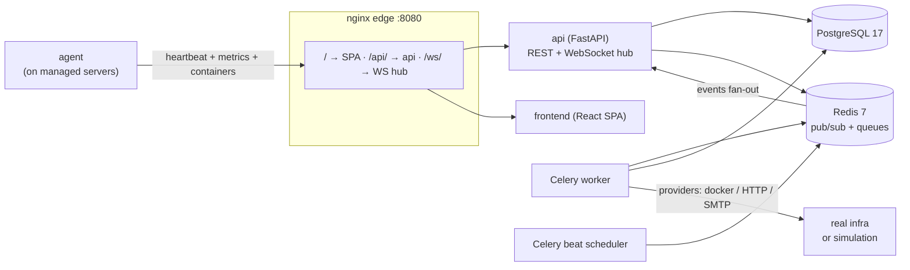

# NexusOps

NexusOps is a self-hosted infrastructure management and monitoring platform: a FastAPI
modular monolith with Celery workers, a React SPA, and a stdlib-only agent installed on
managed servers. It watches your fleet in real time — heartbeats, containers, uptime
checks — and drives the operational loop end to end: monitor failure → incident →
notification, and deploy → step logs → rollback.

## Features

- **Servers & agent heartbeats** — a dependency-free Python agent (`agent/nexusops_agent.py`)
  reports CPU, memory, disk, load and Docker container state; servers go OFFLINE after
  90 s without a heartbeat (configurable via `SERVER_OFFLINE_AFTER_SECONDS`).
- **Docker containers & live log streaming** — container lifecycle actions and log
  streaming over WebSocket (`container-logs` channel), through configured Docker
  endpoints (real Docker SDK provider or simulation).
- **Uptime monitors → incidents → notifications** — HTTP checks dispatched on a dynamic
  cadence by Celery beat; failures raise incidents that fan out email notifications
  (Mailpit in development).
- **Deployments** — multi-step deployments with per-step logs streamed live
  (`deployment-logs` channel), cancellation, and rollback
  (`backend/app/services/deployment_engine.py`).
- **Secrets store** — Fernet-encrypted at rest (`ENCRYPTION_KEY`), versioned, resolvable
  by the deployment engine but never returned in plaintext after creation.
- **RBAC + audit log** — DB-backed permission registry with custom roles
  (`require_permission(...)` dependencies) and a full audit trail of mutations.
- **Operations dashboard** — fleet counters plus a live event feed on the `global`
  WebSocket channel. Note: there is no fleet-wide metrics history endpoint yet, so the
  dashboard charts nothing; per-server timeseries live on each server's detail page.
- **Command palette** — `Ctrl/Cmd+K` anywhere in the UI to navigate and run commands
  (`frontend/src/components/CommandPalette.tsx`).

## Architecture at a glance



REST lives under `/api/v1` with OpenAPI docs at `/api/docs`. Errors use a single
envelope: `{"error": {"code", "message", "request_id"}}`. WebSocket channels:
`global`, `server-metrics`, `container-logs`, `deployment-logs`, `incidents`.
Auth uses short-lived JWT access tokens (held in SPA memory) plus opaque refresh tokens
that are SHA-256-hashed at rest, rotated on use, and carry reuse detection.

## Quickstart

Prerequisites: **Docker** (with Compose v2) and **make**. `uv` and Node are only needed
for host-run tooling (tests, lint, migrations).

```bash
cp .env.example .env   # then set POSTGRES_PASSWORD at minimum
make up                # build + start + wait for readiness + seed
```

Open **http://localhost:8080** and sign in as the seeded admin
(`admin@nexusops.example.com`). Under the default `ENVIRONMENT=development`, the
seed step generates a **random one-time password and prints it once on stderr** —
use that. The fixed pair `admin@nexusops.example.com / nexusops-admin` exists only
when `ENVIRONMENT=test` (what the pytest and Playwright suites rely on); see
[docs/development.md](docs/development.md) §2.

`make up` runs `docker compose up -d --build`, waits for `/api/v1/ready`, then seeds.
The API container applies Alembic migrations on start (`backend/docker-entrypoint.sh`),
but `docker compose up` alone does **not** seed — deliberately, so no default
credentials ever exist in a production deployment.

## Simulation mode

`SIMULATION_MODE=true` (the default in `.env.example`) makes the whole platform
laptop-runnable with zero real infrastructure: simulated agents emit heartbeats and
deterministic sine-wave metrics, Docker containers and deployments are simulated, and
monitor checks run against simulated targets. The UI shows a **SIMULATION MODE** badge
while it is active. Set it to `false` and enroll real agents to manage actual hosts.

## Development

```bash
make dev    # overlay for hot reload — currently broken at build time (see below)
```

The dev overlay (`docker-compose.dev.yml`) is meant to bind-mount source code and
expose Vite directly on http://localhost:5173. Mailpit (the dev email sink) serves its
UI on http://localhost:8025. Host-mapped ports: postgres `127.0.0.1:5433`,
redis `127.0.0.1:6390`.

**Known issue:** `make dev` currently fails at build time — the overlay targets a
`develop` stage that `frontend/Dockerfile` does not define, and mounts an
`nginx/dev.conf` that does not exist. Until those land, use `make up` and run Vite on
the host (`cd frontend && npm run dev`; it proxies `/api`, WebSockets included, to the
:8080 edge). Details in [docs/development.md](docs/development.md) §4.2.

## Testing

| Command | Runs | Needs |
| --- | --- | --- |
| `make test` | backend unit + frontend vitest | nothing external |
| `make test-backend-unit` | pytest `-m "not integration"` | nothing external |
| `make test-backend` | full backend suite (300+ tests) | stack up (postgres :5433, redis :6390) |
| `make test-frontend` | vitest suite | nothing external |
| `make e2e` | Playwright journey (`frontend/e2e/journey.spec.ts`) | a running stack (`make up` first) |

Quality gates: `make lint` (ruff + eslint), `make typecheck` (mypy + tsc).

## Repository layout

```
nexusops/
├── agent/               # stdlib-only Python agent + installer + systemd unit
│   ├── nexusops_agent.py
│   └── install.sh
├── backend/
│   ├── alembic/         # migrations
│   ├── app/             # FastAPI app: api/ core/ models/ providers/ schemas/ services/ tasks/ ws/
│   ├── docker-entrypoint.sh
│   └── tests/           # unit/ + integration/ (against dockerized postgres/redis)
├── docs/                # architecture.md, agent.md, api.md, deployment.md,
│                        # development.md, security.md, troubleshooting.md
├── frontend/
│   ├── e2e/             # Playwright journey
│   └── src/             # React SPA: pages/ components/ api/ auth/ hooks/
├── nginx/               # edge container: routes /, /api/, /ws/
├── scripts/             # generate_secrets.sh
├── docker-compose.yml
└── docker-compose.dev.yml
```

## Documentation

- [docs/architecture.md](docs/architecture.md) — system overview, key decisions,
  backend layout, data model, event flow, scheduling model, security posture.
- [docs/agent.md](docs/agent.md) — agent internals, security model, and install steps.
- [docs/api.md](docs/api.md) — every REST endpoint and the WebSocket channels.
- [docs/deployment.md](docs/deployment.md) — compose stack, environment variables,
  production hardening, backups, upgrades.
- [docs/development.md](docs/development.md) — workstation setup, migrations, tests,
  linting, debugging.
- [docs/security.md](docs/security.md) — threat model, controls, audit results.
- [docs/troubleshooting.md](docs/troubleshooting.md) — common failure modes and fixes.
- [docs/engineering-report.md](docs/engineering-report.md) — build & verification
  report: what was delivered, how it was tested, audit results, known gaps.

## Production notes

- **Change `POSTGRES_PASSWORD`** before first start — compose refuses to boot without
  it, and the seeded dev admin password is intentionally only created by `make seed`.
- **Rotate the secrets**: `JWT_SECRET` (≥ 32 chars) and `ENCRYPTION_KEY` (Fernet). Both
  are placeholders in `.env.example`; generate real ones with
  `./scripts/generate_secrets.sh`. Losing `ENCRYPTION_KEY` means losing stored secrets.
- **Run `ENVIRONMENT=production` behind TLS.** The refresh-token cookie sets its
  `Secure` flag only when the environment is `production`
  (`cookies_secure` in `backend/app/core/config.py`), and browsers reject `Secure`
  cookies over plain HTTP — so terminate TLS in front of nginx (nginx itself listens
  on plain HTTP :8080 and forwards `X-Forwarded-Proto`). Production also disables
  docs exposure and verbose error detail.
- Redis runs with persistence disabled (`appendonly no`) — it is treated as a queue and
  pub/sub bus only; all durable state lives in PostgreSQL.
- Review `ALLOW_PRIVATE_TARGETS=true` (fine for simulation; disable it in production to
  keep monitors/webhooks away from internal networks — see `backend/app/core/ssrf.py`).
