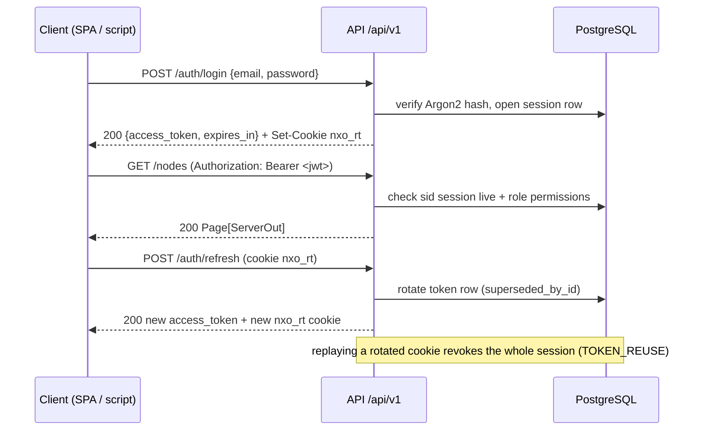
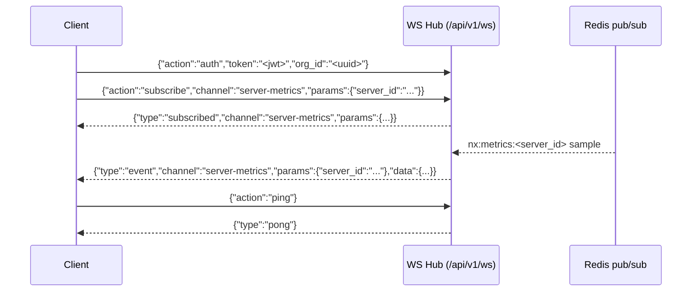

# NexusOps API Guide

How to authenticate against, call, and stream from the NexusOps REST + WebSocket API.
Every path, header, envelope and limit below is taken from the implementation
(`backend/app/`) — not from an idealized spec. Where behavior is deliberately
limited, that is stated.

## Contents

1. [Base URL and entry points](#1-base-url-and-entry-points)
2. [OpenAPI and interactive docs](#2-openapi-and-interactive-docs)
3. [Authentication](#3-authentication) — incl. organization scope (`X-Org-Id`)
4. [Conventions: errors, pagination, request ids, rate limits](#4-conventions)
5. [WebSocket API](#5-websocket-api)
6. [Endpoint inventory](#6-endpoint-inventory)
7. [Agent ingest API](#7-agent-ingest-api)
8. [A curl journey: register → login → server → monitor](#8-a-curl-journey)
9. [Known limitations](#9-known-limitations)

---

## 1. Base URL and entry points

All application traffic enters through the nginx edge on host port **8080**
(`docker-compose.yml` → `nginx` service, `nginx/default.conf.template`):

| What | URL | Notes |
|---|---|---|
| REST base URL | `http://localhost:8080/api/v1` | nginx `location /api/` → `api:8000` |
| WebSocket | `http://localhost:8080/api/v1/ws` | upgrade handled by nginx (3600 s read timeout) |
| Swagger UI | `http://localhost:8080/api/docs` | FastAPI docs page (`backend/app/main.py`) — **hidden when `ENVIRONMENT=production`** |
| OpenAPI schema | `http://localhost:8080/api/v1/openapi.json` | machine-readable schema — also hidden in production |
| SPA | `http://localhost:8080/` | built assets via the `frontend` container |
| Vite dev server (dev profile) | `http://localhost:5173` | proxies `/api` (incl. WS) to `:8080` — mirrors the edge (`frontend/vite.config.ts`) |
| Edge health probe | `http://localhost:8080/health` | answered by **nginx itself** (`edge ok`); never reaches the API |
| API liveness | `http://localhost:8080/api/v1/health` | also mounted at `/liveness`; process-level, no dependency checks |
| API readiness | `http://localhost:8080/api/v1/ready` | checks PostgreSQL **and** Redis; `503` with component detail when either is down |

The `api` container port (8000) is **not** published to the host; the edge is the only
HTTP entry point. Health probes are mounted at the root of the FastAPI app too
(`/health`, `/ready`) for orchestrators inside the compose network — the api container
healthcheck hits `http://127.0.0.1:8000/health` directly.

Start the stack with `make up` (build + auto-migrate + wait-ready + seed). A bare
`docker compose up` also auto-migrates (`backend/docker-entrypoint.sh` runs
`alembic upgrade head` when `RUN_MIGRATIONS_ON_START` is not `false`) but deliberately
does **not** seed — see section 8.

## 2. OpenAPI and interactive docs

- **Swagger UI**: `GET /api/docs` — every router is registered with tags, so the
  schema is browsable per domain.
- **OpenAPI JSON**: `GET /api/v1/openapi.json` — generate typed clients from it.

Both are **disabled when `ENVIRONMENT=production`** (`backend/app/main.py`:
`docs_enabled = not settings.is_production`; `openapi_url`/`docs_url` are set to
`None`). The reasoning is documented in the same file: anonymous schema enumeration
is recon aid on an internet-facing deployment. Develop and test against a
`development`-environment stack; if you need the schema from a production box, it is
deliberately not there.

> The root endpoint `GET /` returns a small JSON index
> (`{"name":"NexusOps","version":"1.0.0","api":"/api/v1"}`) plus a `"docs"` key only
> when the docs UI is enabled.

## 3. Authentication

Three credential types exist. All of them are accepted by the same dependency
(`backend/app/api/deps.py: resolve_auth`) and resolve into one `AuthContext`.

| Credential | Header / transport | Format | Stored as |
|---|---|---|---|
| User access token | `Authorization: Bearer <jwt>` | HS256 JWT (`sub`, `sid`, `jti`, `typ=access`, `iss=nexusops`) | not stored (stateless, but `sid` must match a live DB session) |
| API key | `X-API-Key: <key>` | `nxo_<urlsafe random>` | SHA-256 hash only (`backend/app/core/security.py: hash_token`) |
| Agent credential | `X-Agent-Token: <token>` | `nxa_<urlsafe random>` | SHA-256 hash only, one per node (`agent_credentials`) |
| Enrollment token | body of `POST /agent/enroll` (never a header) | `nxk_<urlsafe random>` | SHA-256 hash only (`enrollment_tokens`), org-scoped, single-use |

### 3.1 Login and the access token

`POST /api/v1/auth/login` verifies the password (Argon2id,
`backend/app/core/security.py`) and returns:

```json
{
  "access_token": "<jwt>",
  "token_type": "bearer",
  "expires_in": 900,
  "user": { "id": "...", "email": "...", "role_name": "Owner", "...": "..." }
}
```

- `expires_in` is seconds — `ACCESS_TOKEN_TTL_MINUTES` × 60 (default **15 min**,
  `.env.example`). The SPA keeps it in memory only; there is no localStorage token.
- The same response sets the refresh cookie (below).
- Access tokens are bound to a **session row**: the `sid` claim is validated against
  the `sessions` table on every request. Revoking the session (logout,
  `DELETE /sessions/{id}`, password change) kills every token minted from it
  immediately.

### 3.2 Refresh rotation and reuse detection

The refresh token is an opaque urlsafe string (`secrets.token_urlsafe(48)`), delivered
as a cookie:

```
Set-Cookie: nxo_rt=<token>; HttpOnly; SameSite=Strict; Path=/api/v1/auth;
            Max-Age=1209600; [Secure — only when the request arrived over https]
```

(`REFRESH_COOKIE_NAME` / `REFRESH_COOKIE_PATH`, `backend/app/services/auth_service.py`;
TTL = `REFRESH_TOKEN_TTL_DAYS`, default 14.)

`POST /api/v1/auth/refresh` rotates it: the old row is marked revoked and
`superseded_by_id` points at the new one. **If a superseded/revoked token is presented
again, the service treats it as theft**: the whole session and all its refresh tokens
are revoked and the audit trail records `auth.token_reuse_detected` — the caller gets
`401 {"error":{"code":"TOKEN_REUSE", ...}}`.

Browsers send the cookie automatically (its `Path` covers `/api/v1/auth/*`).
Non-browser clients may instead pass `{"refresh_token": "..."}` in the body; the
cookie wins when both are present.

`POST /api/v1/auth/logout` (authenticated) revokes the current session and clears the
cookie — `204 No Content`.

### 3.3 API keys (`X-API-Key`)

The header name is exactly **`X-API-Key`** (lower-case `x-api-key` on the wire works —
HTTP headers are case-insensitive; it is allow-listed in the CORS config in
`backend/app/main.py`). Keys are created per-user via the self-service endpoints in
section 6; the raw secret (`nxo_...`) is shown **exactly once** in the creation
response and only ever stored hashed.

Effective permissions are an **intersection**: a request is allowed only if *both* the
key's `scopes` list *and* the owning user's role permit the action
(`deps.AuthContext.has_permission`). The scope check runs first — even a
superadmin-owned key can never exceed its grant. If the owner is deactivated, or the
key revoked or expired, every request fails with `401`.

Scopes accept exact permission codenames, prefix wildcards (`node.*`) and the global
`*`. Unknown literal codenames are rejected at creation with
`422 UNKNOWN_SCOPE` (`backend/app/services/api_key_service.py: validate_scopes`).

Example:

```bash
curl -sS -X POST http://localhost:8080/api/v1/api-keys \
  -H "Authorization: Bearer $TOKEN" -H "Content-Type: application/json" \
  -d '{"name": "ci-read", "scopes": ["node.read", "monitor.read"], "expires_in_days": 90}'

curl -sS http://localhost:8080/api/v1/nodes -H "X-API-Key: nxo_..."
```

### 3.4 Agent credentials (`X-Agent-Token`)

A node's long-lived write credential (`nxa_…`, SHA-256-hashed at rest), used only by
the agent endpoints (section 7). Header name: **`X-Agent-Token`**. A brand-new
machine has none: it presents an organization-scoped **enrollment token**
(`nxk_…`) to `POST /agent/enroll` and receives its `nxa_` credential, stored at
`/etc/nexusops-agent/token` (0600).

Two operator actions, deliberately distinct:

* **Rotate** — `POST /nodes/{id}/agent-token` issues a new credential and opens a
  bounded **dual-token grace window**. The previous hash keeps authenticating until
  the deadline; the running agent receives the replacement in its next heartbeat
  response, persists it atomically and acknowledges with `rotation_applied`.
* **Revoke** — `POST /nodes/{id}/agent-token/revoke` stops acceptance **immediately**:
  no grace, no delivery. This is the compromise path; recovery is re-enrollment with
  a fresh enrollment token.

A rejected credential does **not** make the agent exit — it parks in a long, bounded
re-attempt cadence (`REVOKED_POLL_SECONDS`) so `Restart=always` systemd cannot turn a
revocation into a request storm (see `agent/nexusops_agent.py`).

### 3.4a Organization scope — `X-Org-Id` (required)

NexusOps is multi-tenant. **Authentication answers *who* is calling; a second,
independent step answers *which organization* the request acts for.** A JWT is
never treated as a tenant boundary.

| Credential | How the organization is chosen |
|---|---|
| User access token | The `X-Org-Id` request header, validated against the caller's **active memberships**. Required on every authenticated request except the deliberate pre-organization exemptions (login, refresh, register, `/meta`, `/organizations` itself, and the agent ingest path). |
| API key | **Ignored** (the header is not rejected — it is ignored, so a key can never be reinterpreted into another tenant). The key's own `org_id`, fixed at creation, is the boundary. |
| Agent token | The node the token identifies; the request runs inside that node's organization. |
| WebSocket | The `org_id` field of the `auth` frame, validated exactly like the HTTP header. |

```bash
# Discover where you may act, then send the header on every call.
curl -sS $BASE/organizations -H "Authorization: Bearer $TOKEN" | jq .
AUTH="Authorization: Bearer $TOKEN"
ORG=$(curl -sS $BASE/organizations -H "$AUTH" | jq -r '.[0].organization.id')
AUTH="$AUTH -H X-Org-Id:$ORG"   # every subsequent request
```

Failure modes, all deliberate:

| Situation | Response |
|---|---|
| No header | `403 ORGANIZATION_HEADER_REQUIRED` (the message names how many organizations the account belongs to; the platform never guesses) |
| Header names an organization the caller is not an **active** member of | `403 ORGANIZATION_FORBIDDEN` (a suspended membership is not authority; a suspended organization is indistinguishable from a non-existent one) |
| Account has no membership at all | `403 ORGANIZATION_REQUIRED` |
| Header is not a UUID | `400 INVALID_ORG_HEADER` |
| Id of a row belonging to another organization | The same `404` (and the same error `code`) as a random UUID — the API is not an existence oracle |

The active organization selects the caller's **role** as well: permissions come from
the membership in that organization, so the same person is an Admin in one tenant
and a Viewer in another, and `GET /auth/me` reports the permissions for the
organization the request named.

### 3.5 Permission model

Authorization is a data-driven registry, not role-name checks
(`backend/app/core/permissions.py`). Every protected endpoint declares the codename it
needs via `require_permission(...)`; denial is `403 FORBIDDEN` with
`code: "PERMISSION_DENIED"`. Superadmins and the `Owner` role hold the wildcard `*`.

| Group | Codenames |
|---|---|
| Access Control | `user.read`, `user.manage`, `role.read`, `role.manage`, `audit.read` |
| Nodes | `node.read`, `node.create`, `node.update`, `node.delete`, `node.credential.write` |
| Containers | `container.read`, `container.logs`, `container.lifecycle`, `container.remove` |
| Delivery | `project.read`, `project.manage`, `deployment.read`, `deployment.create`, `deployment.cancel`, `deployment.rollback` |
| Monitoring | `monitor.read`, `monitor.manage`, `incident.action` |
| Notifications | `channel.read`, `channel.manage` |
| Observability | `metric.read`, `log.read`, `event.read` |
| Secrets | `secret.read`, `secret.write` |

Built-in roles: `Owner` (`*`), `Admin`, `Operator`, `Developer`, `Viewer` — seeded from
`ROLE_MATRIX` in the same file (`Operator` is renamed `DevOps` in the Phase 1
seed migration — authorization.md §2). `GET /api/v1/auth/me` returns your effective
permission list; `GET /api/v1/meta` returns it without requiring a specific permission.


```mermaid
sequenceDiagram
    participant C as Client (SPA / script)
    participant A as API /api/v1
    participant DB as PostgreSQL
    C->>A: POST /auth/login {email, password}
    A->>DB: verify Argon2 hash, open session row
    A-->>C: 200 {access_token, expires_in} + Set-Cookie nxo_rt
    C->>A: GET /nodes (Authorization: Bearer <jwt>)
    A->>DB: check sid session live + role permissions
    A-->>C: 200 Page[ServerOut]
    C->>A: POST /auth/refresh (cookie nxo_rt)
    A->>DB: rotate token row (superseded_by_id)
    A-->>C: 200 new access_token + new nxo_rt cookie
    Note over A,DB: replaying a rotated cookie revokes the whole session (TOKEN_REUSE)
```

## 4. Conventions

### 4.1 Error envelope

Every client-visible failure — raised `AppError`s, validation errors, unhandled
exceptions — is shaped by the handlers in `backend/app/core/errors.py`:

```json
{
  "error": {
    "code": "PERMISSION_DENIED",
    "message": "Missing required permission: node.create",
    "request_id": "9f3c0d8a7b6e4f21"
  }
}
```

`request_id` echoes the `X-Request-ID` response header (generated per request unless
you supply one). `details` is added when there is structured detail (e.g. validation
errors). Stack traces never reach the client; the 500 body is fixed and asks the
caller to reference the request id.

| HTTP | `code` | Typical cause |
|---|---|---|
| 400 | `BAD_REQUEST` (plus domain codes such as `PASSWORD_POLICY`, `INVALID_IP`, `INVALID_CURSOR`) | malformed input the schema layer can't express |
| 401 | `UNAUTHORIZED` | missing/invalid bearer token or API key; `WWW-Authenticate: Bearer` header set |
| 403 | `FORBIDDEN` | authenticated but lacking the permission (`PERMISSION_DENIED`), missing/foreign/inactive organization (`ORGANIZATION_HEADER_REQUIRED`, `ORGANIZATION_FORBIDDEN`, `ORGANIZATION_REQUIRED`); registration without invitation (`INVITATION_REQUIRED`) |
| 404 | `NOT_FOUND` | unknown id (domain variants: `USER_NOT_FOUND`, …) — **including any id that exists in another organization** |
| 409 | `CONFLICT` | e.g. `EMAIL_TAKEN`, `LAST_MEMBER_PROTECTED` (refusing to remove an organization's last active member) |
| 422 | `VALIDATION_ERROR` | Pydantic validation failure; `details[]` carries `loc`/`msg`/`type` |
| 429 | `RATE_LIMITED` | fixed-window limiter tripped; `Retry-After` header in seconds |
| 500 | `INTERNAL_ERROR` | unhandled exception (logged with the request id) |

Auth-specific 401 codes worth handling: `INVALID_CREDENTIALS`, `TOKEN_REUSE`,
`REFRESH_MISSING`, `REFRESH_INVALID`, `REFRESH_EXPIRED`, `SESSION_INVALID`,
`SESSION_EXPIRED`, `ACCOUNT_DISABLED`, and the agent codes `AGENT_TOKEN_MISSING`,
`AGENT_TOKEN_MALFORMED`, `AGENT_TOKEN_INVALID`.

> **Account lockout is invisible by design.** After `LOGIN_MAX_ATTEMPTS` (default 5)
> failed logins an account is locked for `LOGIN_LOCKOUT_SECONDS` (default 900), but
> locked attempts get the *same* generic `INVALID_CREDENTIALS` envelope as wrong
> passwords — a distinct "locked" response would let attackers enumerate registered
> emails. The `ACCOUNT_LOCKED` detail exists only in the audit/event trail.

### 4.2 Pagination envelopes

Two envelopes exist (`backend/app/core/pagination.py`).

**Offset pages** — most list endpoints. Query: `?limit` (1–100, default 25) and
`?offset` (default 0).

```json
{
  "items": [ /* ServerOut | MonitorOut | ... */ ],
  "total": 137,
  "limit": 25,
  "offset": 0
}
```

**Cursor (keyset) pages** — high-volume, append-heavy streams: monitor checks,
container logs, deployment logs, system events, notification deliveries.
Query: `?limit` and `?cursor` (opaque url-safe base64 of `<timestamp>|<id>`).

```json
{
  "items": [ /* MonitorCheckOut | LogEntryOut | ... */ ],
  "next_cursor": "MjAyNi0wOS0xMFQxMjowMDowMCswMDowMHwxNDIxNw==",
  "has_more": true
}
```

Paginate by feeding `next_cursor` back until `has_more` is `false`. Cursors are
newest-first; a malformed cursor yields `400 INVALID_CURSOR` on the endpoints that
validate it explicitly.

### 4.3 Request ids and security headers

`RequestIDMiddleware` (`backend/app/core/middleware.py`) honors an incoming
`X-Request-ID` or generates one; every response carries `X-Request-ID`, and access
logs include it. `SecurityHeadersMiddleware` adds `Content-Security-Policy`,
`X-Content-Type-Options`, `X-Frame-Options`, `Referrer-Policy`,
`Permissions-Policy`, `Cache-Control: no-store` (plus HSTS in production) on every
API response; nginx adds its own baseline on the edge.

### 4.4 Rate limits

Implemented as a Redis-backed **fixed window per client IP**
(`backend/app/core/rate_limit.py`); the IP is the rightmost `X-Forwarded-For` entry
(set by our own nginx) or the socket peer. Tripping a limit returns
`429 RATE_LIMITED` with a `Retry-After` header.

| Limiter | Applies to | Limit |
|---|---|---|
| `register` | `POST /auth/register` | 5 per 5 min / IP |
| `auth` | `POST /auth/login` | 10 per min / IP |
| `refresh` | `POST /auth/refresh` | 30 per min / IP |
| `expensive` | `POST /applications/{id}/deployments` (trigger) | 20 per min / IP |
| `agent_enroll` | `POST /agent/enroll` | 30 per min / IP (fail closed) |
| `agent_hello` | `POST /agent/hello` | 30 per min / IP |
| `agent_heartbeat_ip` | all `POST /agent/*` (unauthenticated ceiling) | 1200 per min / IP |
| node `agent_heartbeat` | `POST /agent/heartbeat` (authenticated) | 600 per min / **node** |
| node `agent_ops_claim` | `POST /agent/operations/{id}/claim` | 600 per min / **node** |
| node `agent_ops_result` | `POST /agent/operations/{id}/result` | 600 per min / **node** |

**Failure behavior is deliberate and differs by limiter:** the auth-facing limiters
(register / login / refresh) and **enrollment** are **fail closed** — if Redis is
unreachable they degrade to an in-process fixed-window counter (approximate across
workers) so brute-force throttling never silently disappears. The general limiters
(`expensive`, hello/heartbeat) **fail open** (request allowed, warning logged) to
stay availability-friendly.

**Keying.** Authenticated agent routes key on the resolved **node** rather than the
client IP (`node_rate_limit`), so a NAT'd fleet no longer shares one bucket; a
cheap per-IP ceiling (`agent_heartbeat_ip`) still covers unauthenticated floods,
since a rejected token never reaches the node keyed limiter. The compare-and-set in
the operation service — not the limiter — is what makes concurrent claims safe.

## 5. WebSocket API

Single endpoint: **`GET (upgrade) /api/v1/ws`**, implemented in
`backend/app/ws/hub.py` + `backend/app/ws/router.py`. All frames are JSON objects.

### 5.1 Handshake

1. Connect (nginx forwards the upgrade; 3600 s proxy timeout, buffering off).
2. **Origin check**: if the browser sent an `Origin`, it must match `CORS_ORIGINS`
   **or be same-origin with the request's `Host`** (`app/ws/hub.py`
   `_is_same_origin`, compared by netloc so the default port is treated
   honestly). Only a genuinely cross-origin `Origin` closes `4403`. Browsers send
   `Origin` on every handshake, including same-origin ones, so this allowance is
   what lets a browser talk to a non-default port the allowlist does not name —
   and it depends on `Host` actually carrying that port; see the
   `proxy_set_header Host` note in `deployment.md`. Non-browser clients without
   an `Origin` are accepted.
3. Within **10 s** send exactly one auth frame:

```json
{"action": "auth", "token": "<access JWT>", "org_id": "<uuid>"}
```
or
```json
{"action": "auth_apikey", "key": "nxo_...", "org_id": "<uuid>"}
```

The same rules as HTTP apply: live session, unrevoked key, active user, **and an
organization**. A socket is bound to exactly one organization for its lifetime —
`org_id` is validated against the caller's active memberships when a bearer token
is used (a missing `org_id` closes `4401`), and ignored for an API key, whose own
organization applies. Permissions come from the membership's role **in that
organization**. Failure — bad frame, timeout, unknown credentials, no membership —
closes the socket with `4401`.

4. Then subscribe. Permissions are **re-checked on every subscribe frame**, entity-id
   params are validated to exist **inside the socket's organization** (a well-formed
   UUID belonging to another tenant yields the same error as a deleted one), and
   event frames carry their organization — the hub never forwards a frame from a
   different organization to a socket.

### 5.2 Channels

| Channel | Required params | Permission(s) | Delivers |
|---|---|---|---|
| `global` | — | `event.read` | every system event of **this organization** published on the internal bus (frames from other organizations are dropped) |
| `incidents` | — | `monitor.read` | only events whose type starts with `INCIDENT_` or `MONITOR_` |
| `server-metrics` | `server_id` | `metric.read` **and** `node.read` | per-server metric samples |
| `container-logs` | `container_id` | `container.logs` | container log lines |
| `deployment-logs` | `deployment_id` | `deployment.read` | deployment log lines |

Unknown channel → `{"type": "error", "code": "UNKNOWN_CHANNEL"}`.


```mermaid
sequenceDiagram
    participant C as Client
    participant H as WS Hub (/api/v1/ws)
    participant R as Redis pub/sub
    C->>H: {"action":"auth","token":"<jwt>","org_id":"<uuid>"}
    C->>H: {"action":"subscribe","channel":"server-metrics","params":{"server_id":"..."}}
    H-->>C: {"type":"subscribed","channel":"server-metrics","params":{...}}
    R-->>H: nx:metrics:<server_id> sample
    H-->>C: {"type":"event","channel":"server-metrics","params":{"server_id":"..."},"data":{...}}
    C->>H: {"action":"ping"}
    H-->>C: {"type":"pong"}
```

### 5.3 Frames

Client → server: `auth`, `auth_apikey`, `subscribe`, `unsubscribe`, `ping`
(anything else → `{"type":"error","code":"UNKNOWN_ACTION"}`).

Server → client:

| Frame | Meaning |
|---|---|
| `{"type":"subscribed","channel":...,"params":{...}}` | subscription accepted |
| `{"type":"unsubscribed","channel":...,"params":{...}}` | removed (or `error NOT_SUBSCRIBED`) |
| `{"type":"event","channel":...,"params":{...},"data":{...}}` | live data |
| `{"type":"pong"}` | keepalive reply |
| `{"type":"error","code":"..."}` | `BAD_REQUEST`, `UNKNOWN_CHANNEL`, `UNKNOWN_ACTION`, `FORBIDDEN`, `NOT_FOUND`, `NOT_SUBSCRIBED` |
| `{"type":"notify","code":"SLOW_CONSUMER_DROPPED"}` | your queue overflowed; oldest frames were dropped |

### 5.4 Limits, timeouts, close codes

| Constant | Value | Effect |
|---|---|---|
| Auth timeout | 10 s | close `4401` if no valid auth frame arrives |
| Max subscriptions | 50 per connection | close `4408` beyond that |
| Outbound queue | 1000 frames | overflow drops the oldest frame and emits `SLOW_CONSUMER_DROPPED` |
| Idle timeout | 120 s without **inbound** frames | close `1001`; send periodic `{"action":"ping"}` to stay alive (watchdog sweeps every 15 s) |
| Server restart | lifecycle shutdown | close `1012` ("service restarting") |

### 5.5 Reconnect semantics

There is **no session resume and no replay**. Subscriptions live per connection; the
fan-in source is Redis pub/sub (`nx:events`, `nx:logs:*`, `nx:deploy:*`,
`nx:metrics:*`), which is fire-and-forget. On any close: reconnect, re-auth,
re-subscribe, and accept that messages published while you were disconnected are
gone. Access tokens expire every 15 min — refresh **before** reconnecting a
long-lived socket, or the auth frame will fail with `4401`.

## 6. Endpoint inventory

Permissions come from the `require_permission(...)` declarations in each router
(`backend/app/api/v1/`). "auth" means any authenticated user (JWT or API key).
All paths are relative to `/api/v1`.

### Health & meta (public)

| Method | Path | Auth |
|---|---|---|
| GET | `/health`, `/liveness`, `/ready` (also at the app root without the `/api/v1` prefix) | none |
| GET | `/meta` | none (identity fields added when credentials valid) |

### Auth — `auth.py`

| Method | Path | Auth | Notes |
|---|---|---|---|
| POST | `/auth/register` | special (see below) | 201; first-ever user bootstraps anonymously as `Owner` superadmin; afterwards requires a caller with `user.manage` |
| POST | `/auth/login` | none | 200 TokenOut + refresh cookie; 10/min/IP |
| POST | `/auth/refresh` | refresh cookie or body | rotates; 30/min/IP |
| POST | `/auth/logout` | auth | 204; revokes session, clears cookie |
| GET | `/auth/me` | auth | identity + role + effective permissions |
| POST | `/auth/password` | auth | change own password; revokes all *other* sessions |

### Organizations — `organizations.py`

These are the only authenticated routes that run **without** an organization scope,
so a client can find out where it may act.

| Method | Path | Auth | Notes |
|---|---|---|---|
| GET | `/organizations` | auth | the caller's memberships (`organization` + `role_name` + `status`), across organizations by construction — this is the read `X-Org-Id` validation performs |
| POST | `/organizations` | auth (instance operator) | 201; creates the organization and the caller's Owner membership |
| PATCH | `/organizations/{org_id}` | auth in that organization | rename/describe; requires the active organization to *be* the one addressed, so it can never touch another tenant's record |

### Users & roles — `users.py`, `roles.py`

`users` is an instance-level identity table (a person can belong to several
organizations), so **every route here operates on a membership in the active
organization**. A user id outside it is a `404 USER_NOT_FOUND`, and the `role_*`
fields describe the role held *in this organization*.

| Method | Path | Permission |
|---|---|---|
| GET | `/users` | `user.read` — members of the active organization only; `?is_active` and `?role_id` filter the membership, and `membership_status` is the org-local state |
| GET | `/users/{user_id}` | `user.read` — 404 for anyone outside the organization |
| POST | `/users` | `user.manage` (invite into the active organization; generated password returned once as `initial_password`) |
| PATCH | `/users/{user_id}` | `user.manage` — `role_id` sets the role **in this organization**; `is_active:false` suspends the membership; `full_name` is account-level |
| DELETE | `/users/{user_id}` | `user.manage` — **removes the member from this organization** (membership suspended; the account and its sessions are untouched, and the same person may still work in another organization). `409 LAST_MEMBER_PROTECTED` for the last active member |
| GET | `/roles` · `/roles/permissions` | `role.read` |
| POST | `/roles` | `role.manage` |
| PATCH | `/roles/{role_id}` | `role.manage` |
| DELETE | `/roles/{role_id}` | `role.manage` |

### Sessions & API keys — `sessions.py`, `apikeys.py`

| Method | Path | Auth | Notes |
|---|---|---|---|
| GET | `/sessions` | auth | own sessions; `?all=true` (every member of the active organization) or `?user_id=` requires `user.manage`; a `user_id` outside the organization is `404` |
| DELETE | `/sessions/{session_id}` | auth | own always; another user's needs `user.manage` **and** a membership in the active organization — a foreign session is `404` (no cross-tenant revocation) |
| POST | `/api-keys` | auth | 201; raw key shown once; scopes validated |
| GET | `/api-keys` | auth | own keys, metadata only |
| DELETE | `/api-keys/{key_id}` | auth | revoke own; foreign keys 404 |

### Nodes (table `servers`) — `servers.py`

| Method | Path | Permission | Notes |
|---|---|---|---|
| GET | `/nodes` | `node.read` | filters: `status` (repeatable), `environment`, `tag`, `q`, `simulated`, `sort` (default `-created_at`) |
| POST | `/nodes` | `node.create` | 201 |
| GET | `/nodes/{server_id}` | `node.read` | detail + recent events + container counts |
| PATCH | `/nodes/{server_id}` | `node.update` | `tags` replaces the whole set |
| DELETE | `/nodes/{server_id}` | `node.delete` | 204; hard delete, cascades |
| GET | `/nodes/tags` | `node.read` | tag cloud with usage counts |
| POST | `/nodes/tags` | `node.update` | upsert by name |
| POST | `/nodes/{server_id}/agent-token` | `node.update` | **rotate**: new `nxa_…`; old hash accepted for the bounded grace window; raw shown once |
| POST | `/nodes/{server_id}/agent-token/revoke` | `node.credential` | **revoke**: immediate, no grace, no delivery |
| POST | `/nodes/enrollment-tokens` | `node.create` | 201; single-use `nxk_…` for this organization; raw `token` + `install_hint` shown **once** |
| GET | `/nodes/enrollment-tokens` | `node.read` | metadata only — the response type has no token field |
| POST | `/nodes/enrollment-tokens/{token_id}/revoke` | `node.credential` | revoke an unused token; a used token is `409 ENROLLMENT_TOKEN_ALREADY_USED` |

The pre-rename `/servers` paths remain as a schema-hidden compatibility alias for
one deprecation window (same handlers and payloads); new clients use `/nodes`.
The `{server_id}` path-parameter name is unchanged.

### Agent — `agent.py` (see section 7)

| Method | Path | Auth |
|---|---|---|
| POST | `/agent/enroll` | body `nxk_…` enrollment token (no header) |
| POST | `/agent/hello` | `X-Agent-Token` |
| POST | `/agent/heartbeat` | `X-Agent-Token` |
| POST | `/agent/operations/{id}/claim` | `X-Agent-Token` |
| POST | `/agent/operations/{id}/result` | `X-Agent-Token` |

### Observability — `metrics.py`, `events.py`, `audit.py`, `search.py`

| Method | Path | Permission | Notes |
|---|---|---|---|
| GET | `/nodes/{server_id}/metrics` | `metric.read` | `?range=` 1h/6h/24h/7d/30d (default 24h); `?metrics=` csv from cpu_percent, mem_percent, mem_used_mb, disk_percent, disk_used_gb, net_rx_kb_s, net_tx_kb_s, load1 (default `cpu_percent,mem_percent`; bucket count capped at 400) |
| GET | `/nodes/{server_id}/metrics/latest` | `metric.read` | most recent raw sample; 404 until the first heartbeat |
| GET | `/dashboard/summary` | auth | SPA dashboard roll-up |
| GET | `/events/types` | `event.read` | canonical event-type registry |
| GET | `/events` | `event.read` | cursor-paged; filters `types` (csv), `level`, `resource_type`, `resource_id`, `actor_id`, `since`, `until` |
| GET | `/audit-logs` | `audit.read` | who did what, envelope-paged |
| GET | `/search?q=` | auth | command-palette search; each result section filtered by its permission (`node.read`, `container.read`, `deployment.read`, `project.read`, `monitor.read`, `user.read`) |

### Node operations — `operations.py`, `agent.py`

The compare-and-set work queue an agent pulls from (node-agent-architecture.md
§5). Reading is a node-scoped read; **every mutating route is authorised by the
codename the operation *type* declares** — there is deliberately no generic
`node.execute` grant, so `container.start` needs `container.lifecycle` and
`logs.tail` needs `container.logs`. A type outside the whitelist is a 422.

| Method | Path | Permission | Notes |
|---|---|---|---|
| POST | `/operations` | per type (§5.2) | dispatch; node must be enrolled and not OFFLINE (400 `NODE_NOT_ENROLLED`, 409 `NODE_OFFLINE`); a type whose capability cannot be verified is refused 409 `NODE_CAPABILITY_UNVERIFIED`; invalid params → 422 `OPERATION_PARAMS_INVALID` |
| GET | `/operations` | `node.read` | filters `node_id`, `status`; newest first |
| GET | `/operations/{id}` | `node.read` | a foreign id is a 404 with the same envelope as a random uuid |
| POST | `/operations/{id}/cancel` | per type | `PENDING → CANCELLED` only; a claimed op is 409 `OPERATION_NOT_CANCELLABLE` |
| POST | `/agent/operations/{id}/claim` | agent token | compare-and-set `PENDING → CLAIMED`; second claimant → 409 `OPERATION_ALREADY_CLAIMED`, past deadline → 409 `OPERATION_EXPIRED`, foreign id → 404 |
| POST | `/agent/operations/{id}/result` | agent token | `CLAIMED\|RUNNING → SUCCEEDED\|FAILED`; a duplicate report against a terminal row is a **200 no-op**; a report for a never-claimed row is 409 `OPERATION_NOT_CLAIMABLE` |

Audit actions: `operation.create` (user), `operation.claim` and `operation.result`
(actor `agent:<node>`), `operation.cancel` (user), `operation.expire` (system
sweep, `nx.expire_operations`, every 60s).

### Secrets — `secrets.py`

| Method | Path | Permission | Notes |
|---|---|---|---|
| GET | `/secrets` | `secret.read` | metadata only; filters `q`, `project_id`, `environment_id` |
| GET | `/secrets/{secret_id}` | `secret.read` | metadata only |
| GET | `/secrets/{secret_id}/versions` | `secret.read` | append-only history: version, digest, actor, timestamp — never a value |
| POST | `/secrets` | `secret.write` | value encrypted at rest (Fernet), never echoed. Scope: `environment_id` (implies `project_id`) > `project_id` > organization |
| POST | `/secrets/{secret_id}/rotate` | `secret.write` | appends a version and makes it current |
| POST | `/secrets/{secret_id}/rollback` | `secret.write` | body `{"version": N}`; re-appends that version's value as a **new** version — nothing is rewritten or deleted |
| DELETE | `/secrets/{secret_id}` | `secret.write` | 204; cascades the version history |

No endpoint in this module returns a value. `secret.read` is metadata access; it
is **not** the capability that lets a deployment consume a secret — that is
`deployment.create` on the trigger route.

```bash
# Rotate, then roll back one version — history keeps both.
curl -X POST "$API/secrets/$SECRET_ID/rotate" -H "Authorization: Bearer $TOKEN" \
  -H "X-Org-Id: $ORG" -H 'Content-Type: application/json' \
  -d '{"value":"new-password"}'
curl -X POST "$API/secrets/$SECRET_ID/rollback" -H "Authorization: Bearer $TOKEN" \
  -H "X-Org-Id: $ORG" -H 'Content-Type: application/json' -d '{"version":1}'
```

### Docker hosts & containers — `docker_hosts.py`, `containers.py`

| Method | Path | Permission | Notes |
|---|---|---|---|
| GET | `/docker-hosts` · `/{host_id}` | `container.read` | |
| POST | `/docker-hosts` | `node.create` | |
| PATCH | `/docker-hosts/{host_id}` | `node.update` | |
| DELETE | `/docker-hosts/{host_id}` | `node.delete` | cascades |
| POST | `/docker-hosts/{host_id}/ping` | `container.read` | returns 200 even when unreachable — inspect `status`/`error` |
| GET | `/docker-hosts/{host_id}/images` · `/volumes` · `/networks` | `container.read` | |
| GET | `/containers` | `container.read` | filters + search |
| GET | `/containers/{container_id}` | `container.read` | inspect |
| POST | `/containers/{container_id}/start` · `/stop` · `/restart` · `/pause` · `/unpause` | `container.lifecycle` | |
| DELETE | `/containers/{container_id}` | `container.remove` | destructive; requires `?confirm=<exact name>` |
| GET | `/containers/{container_id}/logs` | `container.logs` | cursor-paged history; `?level=`, `?q=` |

### Delivery: projects, applications, environments, deployments — `projects.py`, `deployments.py`

**Environments are project-scoped (Phase 2).** There is no
`/applications/{id}/environments` route: an environment belongs to its project, and
an application deploys *into* one of its project's environments.

| Method | Path | Permission |
|---|---|---|
| POST | `/projects` | `project.manage` |
| GET | `/projects` · `/{project_id}` | `project.read` |
| PATCH · DELETE | `/projects/{project_id}` | `project.manage` |
| POST | `/projects/{project_id}/applications` | `project.manage` |
| GET | `/projects/{project_id}/applications` · `/{application_id}` | `project.read` |
| PATCH · DELETE | `/projects/{project_id}/applications/{application_id}` | `project.manage` |
| POST | `/projects/{project_id}/environments` | `project.manage` |
| GET | `/projects/{project_id}/environments` | `project.read` |
| GET | `/projects/{project_id}/environments/{environment_id}` | `project.read` |
| PATCH · DELETE | `/projects/{project_id}/environments/{environment_id}` | `project.manage` |
| GET | `/deployments` | `deployment.read` |
| GET | `/applications/{application_id}/deployments` | `deployment.read` |
| POST | `/applications/{application_id}/deployments` | `deployment.create` (20/min/IP) → `202 Accepted` |
| GET | `/deployments/{deployment_id}` | `deployment.read` |
| POST | `/deployments/{deployment_id}/cancel` | `deployment.cancel` |
| POST | `/deployments/{deployment_id}/rollback` | `deployment.rollback` → `202 Accepted` |
| GET | `/deployments/{deployment_id}/logs` | `deployment.read` (cursor-paged) |

#### Configuration layering

`projects.config` is the project's base configuration; each environment's `config`
holds **only its overrides**. Both are flat `string → string` maps (≤ 100 keys,
≤ 4096 chars per value) and may reference secrets as `${secret:KEY}`. The merge is
**shallow**: a key the environment defines replaces the project's value for that
key, and every other project key is inherited unchanged. The environment **detail**
route returns all three layers separately so a client can show provenance:

```jsonc
// GET /projects/{project_id}/environments/{environment_id}
{
  "id": "…", "project_id": "…", "name": "production", "slug": "production",
  "environment_type": "PROD",              // DEV | STAGING | PROD (descriptive only)
  "server_id": null, "healthcheck_path": "/healthz", "auto_deploy": true,
  "config": { "LOG_LEVEL": "debug" },                                  // overrides
  "project_config": { "LOG_LEVEL": "info", "REGION": "eu" },          // base
  "effective_config": { "LOG_LEVEL": "debug", "REGION": "eu" },       // merged
  "secret_references": ["DATABASE_URL"],    // key NAMES only — never values
  "application_count": 2, "deployment_count": 14, "secret_count": 3
}
```

`environment_type` accepts `dev`/`staging`/`prod` (and the `development`/`stage`/
`production` spellings) case-insensitively, and defaults to `DEV`. It is
**descriptive**: authorization is permission-based, never derived from the
environment kind. Environments created before this field existed were defaulted
to `DEV` and were corrected in Phase 2.1 by an explicit, case-insensitive mapping
of the exact slug/name aliases (`production`/`prod` → `PROD`, `staging`/`stage` →
`STAGING`; `dev`/`development` and anything unknown stay `DEV`); when a legacy
row's slug and name disagreed, the recognised slug alias decided the type.

Secret resolution at deploy time prefers the most specific scope —
**environment > project > organization** — and **fails closed**: an unresolvable
reference fails the deployment before any step runs rather than substituting an
empty value.

### Monitoring: monitors, incidents — `monitors.py`, `incidents.py`

| Method | Path | Permission | Notes |
|---|---|---|---|
| GET | `/monitors` | `monitor.read` | filters `status`, `project_id`, `q`; whitelisted `sort` |
| POST | `/monitors` | `monitor.manage` | URL validated by the SSRF guard (`backend/app/core/ssrf.py`, `ALLOW_PRIVATE_TARGETS`) |
| GET · PATCH · DELETE | `/monitors/{monitor_id}` | `monitor.read` / `monitor.manage` | `url` edits are re-validated |
| POST | `/monitors/{monitor_id}/pause` · `/resume` | `monitor.manage` | |
| POST | `/monitors/{monitor_id}/check-now` | `monitor.manage` | runs one check inline; 404 if paused or another runner holds it |
| GET | `/monitors/{monitor_id}/checks` | `monitor.read` | cursor-paged, newest first |
| GET | `/monitors/{monitor_id}/incidents` | `monitor.read` | |
| GET | `/monitors/{monitor_id}/uptime?hours=1..720` | `monitor.read` | `UptimeSummary` incl. avg/p95 latency |
| GET | `/incidents` | `monitor.read` | filters `status`, `severity`, `monitor_id` |
| GET | `/incidents/{incident_id}` | `monitor.read` | detail incl. notes |
| POST | `/incidents/{incident_id}/acknowledge` · `/resolve` | `incident.action` | |
| POST | `/incidents/{incident_id}/notes` | `incident.action` | returns full detail |

### Notifications: channels & alerts — `channels.py`, `alerts.py`

| Method | Path | Permission | Notes |
|---|---|---|---|
| GET | `/notification-channels` | `channel.read` | email + webhook channel types |
| POST | `/notification-channels` | `channel.manage` | `config` must match `type` |
| GET | `/notification-channels/deliveries` | `channel.read` | cursor-paged delivery log; filters `channel_id`, `status` |
| GET · PATCH · DELETE | `/notification-channels/{channel_id}` | `channel.read` / `channel.manage` | |
| POST | `/notification-channels/{channel_id}/test` | `channel.manage` | sends a test notification |
| GET | `/alerts` | auth | shared operator feed (unread first) |
| GET | `/alerts/unread-count` | auth | |
| POST | `/alerts/{alert_id}/read` · `/alerts/read-all` | auth | |

## 7. Agent ingest API

Payloads are data-only by design — nothing an agent sends is executed.
Implementation: `backend/app/api/v1/agent.py`, schemas in
`backend/app/schemas/agent.py`, client in `agent/nexusops_agent.py`. Every route but
enrollment authenticates with `X-Agent-Token`.

### `POST /agent/enroll` — redeem an enrollment token (30/min/IP, fail-closed)

```json
{
  "enrollment_token": "nxk_…", "hostname": "web-01",
  "agent_version": "1.1.0", "arch": "x86_64", "cpu_cores": 8,
  "memory_total_mb": 16384, "disk_total_gb": 512
}
```

There is **no** `org_id` field: the node's organization is the token row's. The token
is consumed atomically (single-use), and the response carries the node's own
credential plus the hello contract:

```json
{
  "node_id": "…", "name": "web-01", "agent_token": "nxa_…",
  "heartbeat_interval_seconds": 30, "offline_after_seconds": 90,
  "protocol_version": 2
}
```

A bad/expired/revoked/used token is the same `401 ENROLLMENT_TOKEN_INVALID` — the
response never reveals which guess was closest. Two concurrent redemptions of one
token cannot both succeed.

### `POST /agent/hello` — registration + negotiation (30/min/IP)

```json
{
  "agent_version": "1.1.0", "protocol_version": 2,
  "hostname": "web-01",
  "os_name": "Ubuntu", "os_version": "24.04", "arch": "x86_64",
  "cpu_cores": 8, "memory_total_mb": 16384, "disk_total_gb": 512,
  "capabilities": {"docker": {"present": true, "api_version": "1.43"},
                   "systemd": {"present": true}},
  "facts": {"kernel": "6.8.0", "network_interfaces": 2}
}
```

Response persists the static facts + capabilities and negotiates cadence and protocol:

```json
{
  "server_id": "…", "name": "web-01",
  "heartbeat_interval_seconds": 30, "offline_after_seconds": 90,
  "protocol_version": 2, "min_agent_version": "1.1.0"
}
```

A **v1 agent** omits `protocol_version` (defaults to `1`) and keeps the original
contract. `capabilities` is a bounded JSONB map; an absent key or `present: false`
means *unreported/unavailable* — never "has it".

### `POST /agent/heartbeat` — periodic sample (per-node limit)

```json
{
  "cpu_percent": 12.5, "mem_used_mb": 4096.2, "mem_percent": 25.0,
  "disk_used_gb": 128.4, "disk_percent": 25.1,
  "net_rx_kb_s": 812.4, "net_tx_kb_s": 233.1, "load1": 0.42, "uptime_seconds": 864000,
  "rotation_applied": false,
  "containers": [
    {"container_id": "ab12…", "name": "api", "status": "RUNNING",
     "health": "HEALTHY", "image_ref": "ghcr.io/nexusops/api:1.0.0",
     "cpu_percent": 1.2, "mem_used_mb": 256.5}
  ]
}
```

Response:

- **protocol-1 agent → `204`** with no body (the original contract, unchanged).
- **protocol-2 agent → `200`**: `{heartbeat_interval_seconds, pending_operations[],
  token_rotation?}`. `pending_operations` lists ids awaiting claim for *this* node;
  `token_rotation` (if present) carries the replacement credential for a rotation in
  progress and is served **only** to a request authenticated by the previous hash.

`net_rx_kb_s`/`net_tx_kb_s` are measured from `/proc/net/dev` and may be **`null`**
(not measurable) — never render `null` as `0.0`.

### `POST /agent/operations/{id}/claim` · `/result`

See the Node operations table above: claim is a per-node compare-and-set, result
closes the row (`SUCCEEDED`/`FAILED`), and a duplicate result is a 200 no-op.

Behavior around it:

- A server with no heartbeat for `SERVER_OFFLINE_AFTER_SECONDS` (default 90) is marked
  offline by the beat scheduler; the container fleet simulation in
  `SIMULATION_MODE=true` is driven by the same scheduler, not by agents.
- A **rotation** opens a bounded grace window and delivers the new credential on the
  heartbeat; a **revocation** stops acceptance immediately. A rejected token no longer
  makes the agent exit — it parks in a long re-attempt cadence.
- Repeated transient failures back off exponentially, capped at 5 minutes.

## 8. A curl journey

All calls go through the edge at `http://localhost:8080`. Bring the stack up:

```bash
make up          # build + auto-migrate + wait-ready + seed (credentials below)
```

> **Seeded admin** (`make seed` → `backend/scripts/seed.py`): the email is always
> `admin@nexusops.example.com`. The **password depends on `ENVIRONMENT`**: with
> `ENVIRONMENT=test` it is the fixed, dev/test-only `nexusops-admin` (the Playwright
> journey and CI rely on it); in any other non-production environment the seed script
> generates a **random one-time password and prints it once** to stderr — it is never
> stored in derivable form. Seeding is opt-in outside `test` (`NEXUSOPS_ALLOW_SEED=1`,
> which `make seed` sets) and refuses to run in production entirely. A bare
> `docker compose up` auto-migrates but never seeds, so a production instance created
> that way ships with **zero default credentials** — bootstrap your first owner via
> `/auth/register` before exposing the port.
>
> **Registration is bootstrap-only**: `POST /auth/register` creates an account
> anonymously only while the users table is empty (that first account becomes the
> `Owner` superadmin; the race is serialized with a Postgres advisory lock). On an
> already-populated instance it returns `403 INVITATION_REQUIRED` — invite users via
> `POST /users` (`user.manage`) instead. Password policy: ≥ 10 chars with at least
> one letter and one digit (`PASSWORD_POLICY` otherwise).

The journey below assumes a **fresh, migrated, unseeded database**, so it exercises
the real bootstrap path: register → login → create server → create monitor.

```bash
BASE=http://localhost:8080/api/v1

# 1. Bootstrap the first owner (works only while no users exist).
#    On a seeded instance skip to step 2 and log in as the seeded admin instead —
#    this call would return 403 INVITATION_REQUIRED.
curl -sS -X POST $BASE/auth/register -H 'Content-Type: application/json' \
  -d '{"email": "ops@example.com", "password": "correct-horse-battery-1",
       "full_name": "Ops Owner"}' | jq .
# → 201 {"user": {..., "role_name": "Owner", ...}}

# 2. Log in → access token + nxo_rt cookie in cookies.txt. The bootstrap account
#    owns the organization the migration (or registration) provisioned, and the
#    login response advertises it as active_organization_id.
LOGIN=$(curl -sS -c cookies.txt -X POST $BASE/auth/login \
  -H 'Content-Type: application/json' \
  -d '{"email": "ops@example.com", "password": "correct-horse-battery-1"}')
export TOKEN=$(echo "$LOGIN" | jq -r .access_token)
ORG=$(echo "$LOGIN" | jq -r .active_organization_id)
AUTH="Authorization: Bearer $TOKEN"
ORGH="X-Org-Id: $ORG"                # every org-scoped call needs BOTH headers

# 3. Where may I act, and what can I do there? (GET /organizations needs no header)
curl -sS $BASE/organizations -H "$AUTH" | jq '.[].organization.name'
curl -sS $BASE/auth/me -H "$AUTH" -H "$ORGH" | jq '{role, permissions, superadmin}'

# 4. Register a node (node.create; Owner passes via the * wildcard)
SERVER_ID=$(curl -sS -X POST $BASE/nodes -H "$AUTH" -H "$ORGH" -H 'Content-Type: application/json' \
  -d '{
        "name": "web-01",
        "hostname": "web01.internal",
        "ip_address": "10.0.0.11",
        "environment": "production",
        "tags": ["web", "prod"]
      }' | jq -r .id)
echo "server: $SERVER_ID"

# 5. Mint a single-use, org-scoped enrollment token (nxk_… shown exactly once).
#    Optional "node_id" claims an existing placeholder node instead of creating one.
curl -sS -X POST $BASE/nodes/enrollment-tokens -H "$AUTH" -H "$ORGH" \
  -H 'Content-Type: application/json' \
  -d '{"name": "web wave 1", "expires_in_seconds": 3600}' | jq .
# → {"token": "nxk_…", "install_hint": "…", "state": "ACTIVE", …}
#    (Legacy alternative: POST /nodes/$SERVER_ID/agent-token rotates that node's own
#     credential directly; POST …/agent-token/revoke kills it with no grace.)

# 6. Pretend to be the agent: redeem the enrollment token for this node's own
#    credential, then hello (protocol 2) and heartbeat.
export ENROLL_TOKEN=nxk_...   # from step 5
export AGENT_TOKEN=$(curl -sS -X POST $BASE/agent/enroll -H 'Content-Type: application/json' \
  -d "{\"enrollment_token\": \"$ENROLL_TOKEN\", \"hostname\": \"web01.internal\", \"agent_version\": \"1.1.0\"}" \
  | jq -r .agent_token)
curl -sS -X POST $BASE/agent/hello -H "X-Agent-Token: $AGENT_TOKEN" \
  -H 'Content-Type: application/json' \
  -d '{"agent_version": "1.1.0", "protocol_version": 2, "hostname": "web01.internal",
       "os_name": "Ubuntu", "os_version": "24.04", "arch": "x86_64",
       "cpu_cores": 8, "memory_total_mb": 16384, "disk_total_gb": 500,
       "capabilities": {"docker": {"present": true}}}' | jq .
curl -sS -w '\n%{http_code}\n' -X POST $BASE/agent/heartbeat \
  -H "X-Agent-Token: $AGENT_TOKEN" -H 'Content-Type: application/json' \
  -d '{"cpu_percent": 11.5, "mem_used_mb": 4096, "mem_percent": 25.0,
       "disk_used_gb": 128, "disk_percent": 25.6, "uptime_seconds": 86400}'   # protocol 2 → 200 + pending_operations

# 7. Create an uptime monitor (monitor.manage; URL passes the SSRF guard)
MONITOR_ID=$(curl -sS -X POST $BASE/monitors -H "$AUTH" -H "$ORGH" -H 'Content-Type: application/json' \
  -d '{
        "name": "web-01 landing page",
        "url": "https://example.com/",
        "method": "GET",
        "interval_seconds": 60,
        "expected_status": 200,
        "failure_threshold": 3,
        "success_threshold": 2
      }' | jq -r .id)

# 8. Run one check immediately and read the history
curl -sS -X POST $BASE/monitors/$MONITOR_ID/check-now -H "$AUTH" -H "$ORGH" | jq .
curl -sS "$BASE/monitors/$MONITOR_ID/checks?limit=10" -H "$AUTH" -H "$ORGH" | jq .
curl -sS "$BASE/monitors/$MONITOR_ID/uptime?hours=24" -H "$AUTH" -H "$ORGH" | jq .

# 9. Rotate the access token before it expires (cookie in cookies.txt does the work)
curl -sS -b cookies.txt -c cookies.txt -X POST $BASE/auth/refresh | jq -r .access_token

# 10. Log out clean: revokes the session server-side and clears the cookie
curl -sS -o /dev/null -w '%{http_code}\n' -X POST $BASE/auth/logout \
  -H "Authorization: Bearer $TOKEN"   # → 204
```

A minimal WebSocket client against the same token:

```bash
# using websocat
{ echo '{"action":"auth","token":"'"$TOKEN"'","org_id":"'"$ORG"'"}';
  echo '{"action":"subscribe","channel":"incidents"}';
  sleep 30; } | websocat ws://localhost:8080/api/v1/ws
```

## 9. Known limitations

Documented honestly, so nobody discovers them in production:

- **Rate limiting is two-tier.** Fixed windows in Redis: authenticated agent routes
  key on the resolved **node**, everything else on the rightmost `X-Forwarded-For`
  hop. Auth and enrollment limiters fail closed (in-process fallback during a Redis
  outage, approximate across workers); the general and hello/heartbeat limiters fail
  open. Human routes still have **no per-org/per-user quota** — that work is tracking
  in platform-security-model.md H6.
- **WebSocket has no replay.** Redis pub/sub is fire-and-forget; anything published
  while a socket is down is lost. Clients must re-subscribe after reconnecting and
  tolerate gaps.
- **Access tokens can't be revoked individually** — revocation works at the session
  level (`DELETE /sessions/{id}`, logout, password change). A stolen access token is
  valid until `exp` (≤ 15 min) unless its session is revoked.
- **OpenAPI/Swagger are gone in production.** With `ENVIRONMENT=production` the
  schema and `/api/docs` return 404 by design; keep an API reference for consumers
  outside the running system.
- **`GET /docker-hosts/{id}/ping` returns 200 even on failure** — reachability is in
  the body (`status`, `error`), not the status code.
- **`POST /alerts/*` mutates a shared feed**: alert read-state is organization-wide, not per-user (the alerts themselves are tenant-scoped).
- **The user directory and session listing are membership-scoped.** `GET /users`,
  `GET /users/{id}` and `GET /sessions?all=true` return only members of the active
  organization, and `PATCH`/`DELETE /users/{id}` act on the **membership** — removing
  someone from an organization does not disable their account or revoke their
  sessions, because those are instance-wide credentials shared across organizations.
  There is no cross-tenant administrative view.
- **A WebSocket keeps the permissions it connected with.** A role change or
  membership suspension is not visible to a live socket until it reconnects;
  REST requests re-resolve the membership every time. Reconnect after changing a
  member's access.
- **The tenant database roles must exist.** The API refuses to start against an
owner-role DSN when RLS is expected: the runtime connects as `nexusops_app`
  (`NOSUPERUSER NOBYPASSRLS`) while migrations use `nexusops_owner`. A deployment
  that points both at the same superuser loses the database-level tenancy net
  without failing.
- **`X-Org-Id` is required even for single-organization accounts.** The SPA reads
  `GET /organizations` once at sign-in and sends the header thereafter; a script
  that skips it gets `403 ORGANIZATION_HEADER_REQUIRED`, not a default.
- **Bootstrap asymmetry:** the very first registered user becomes an unrestricted
  superadmin (the anonymous bootstrap window is advisory-locked, so only one
  concurrent registration can win). On internet-exposed deployments, seed or create
  the first user before exposing port 8080, and never rely on open registration.
- **`GET /health` at the edge is nginx's answer**, not the API's — a green edge health
  does not prove the API is up. Use `/api/v1/ready` for the dependency-aware check.
- **Account lockout is undetectable from the API surface** (deliberately identical
  `INVALID_CREDENTIALS` responses); operators must check the audit/event trail to
  distinguish lockouts from bad passwords.
