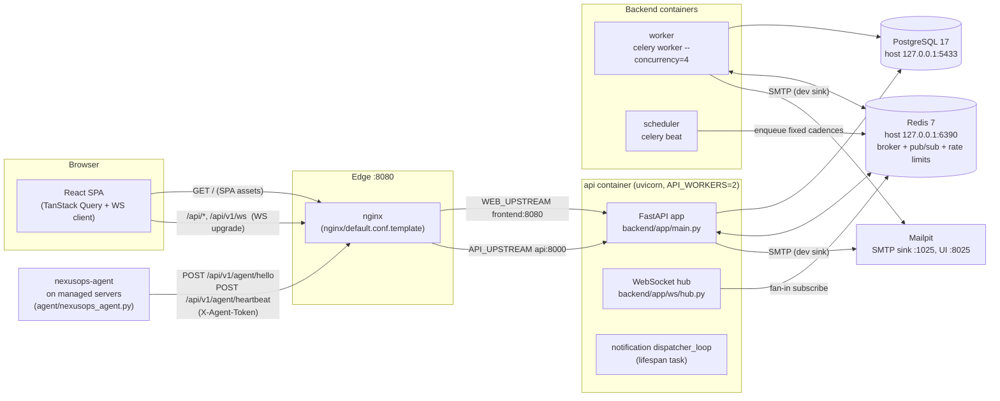
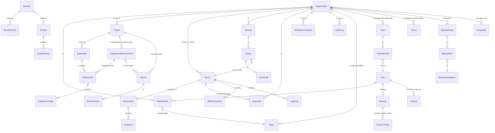
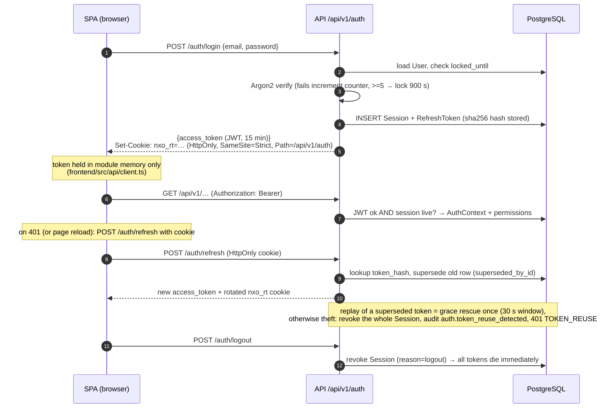

# NexusOps Architecture

NexusOps is a self-hosted infrastructure management and monitoring platform. It
ships as a small constellation of containers: a FastAPI modular monolith, a
Celery worker and beat scheduler, PostgreSQL, Redis, an nginx edge, a static
SPA frontend — plus a dependency-free Python agent installed on managed hosts.

Everything in this document is derived from the code in this repository
(current state verified against HEAD `cacdbc8`). Where the platform is honest
about a limitation, the limitation is documented here rather than papered over:
[§12](#12-simulated-capabilities-honesty-box) lists every simulated capability,
and [§1](#1-platform-evolution) summarizes the multi-tenant target this
platform is evolving toward.

## 1. Platform evolution

NexusOps is evolving from a single-tenant fleet dashboard into a **multi-tenant
control plane for self-hosted infrastructure**: connect any Linux machine with a
lightweight agent, organize machines, projects and domains under Organizations,
and make docker + nginx + ACME work possible from one coherent, permissioned,
audited platform.

**Control/data plane.** The control plane (this repo: api, worker+beat,
PostgreSQL, Redis, dashboard edge) owns orgs, projects, nodes, domains, routes,
certificates, secrets and audit. The data plane — customer nodes running the
agent, docker, agent-managed nginx and the customer's containers — is
customer-owned. The control plane never sits in the customer traffic path
(customer HTTPS terminates on the customer's own node nginx), and never trusts
a node: per-node agent tokens scoped to that node's org, every agent call
authenticated and audited.

**The agent pulls; there is no remote shell.** Remote operations are
whitelisted `Operation` rows (container lifecycle, log tail, nginx
render/apply) that the agent fetches, executes against a fixed allowlist, and
reports on — never a push tunnel, and deliberately no generic `node.execute`
codename (authorization.md §2). Today the agent only *reports*; the server
cannot execute commands through it.

**Org model.** `User ──Membership──> Organization ──> Project → Application →
Deployment`, with `Node(=Server) → DockerEndpoint → Container`,
`Domain → Route → Certificate`, `Operation`, and layered `Secret →
SecretVersion`. Every tenant-scoped row carries `org_id`, enforced mechanically
by a session-scoped query guard (`with_loader_criteria`) rather than scattered
checks; the active org is chosen per request via `X-Org-Id` — the JWT carries
identity, not tenancy.

**Naming.** The existing `Server` entity is exposed as **Node** (API paths
`/nodes`, codenames `server.*` → `node.*`); the `servers` table keeps its name
until a later cleanup phase. **Environment** is promoted from application scope
to project scope ("Ymart → Production") — the one structural delivery change.
**DockerEndpoint** (today `DockerHost`) stays a separate row — it models a
*connection* to docker, not the machine — exposed as part of the Node resource.

**Explicitly out of scope** (protects the boundary): Kubernetes, CI, a log
platform at scale, and arbitrary remote shell (platform-vision.md §2.1).

Companion specs (proposals for review — design targets, not shipped behavior;
the rest of this document describes shipped behavior unless marked *target*):

| Doc | Covers |
|---|---|
| [platform-vision.md](platform-vision.md) | direction, principles, control/data plane, wedge |
| [domain-model.md](domain-model.md) | target ER, org scoping, Environment promotion, Node=Server |
| [multi-tenancy.md](multi-tenancy.md) | X-Org-Id resolution, session guard, channels, agents, IDOR suite |
| [authorization.md](authorization.md) | registry changes, 5 roles, grants design, no `node.execute` |
| [node-agent-architecture.md](node-agent-architecture.md) | agent v2: capabilities, facts, Operation protocol |
| [domain-routing.md](domain-routing.md) | Domain/Route, DNS verification, NginxProvider apply pipeline |
| [certificate-management.md](certificate-management.md) | ACME DNS-01, renewal, encrypted delivery |
| [deployment-architecture.md](deployment-architecture.md) | real runners (image-based 6a, git 6b), env config layering |
| [secrets-architecture.md](secrets-architecture.md) | SecretVersion, layered scope, node minimization |
| [platform-security-model.md](platform-security-model.md) | threat model, tenancy invariants |
| [product-roadmap.md](product-roadmap.md) | Phase 0–9 plan that makes the simulated real |

## 2. System overview



Wiring lives in `docker-compose.yml`:

- **nginx** is the only host-exposed port (`NEXUSOPS_HTTP_PORT`, default
  **8080**, published on loopback). `/` proxies to the frontend container
  (built static assets; the dev profile `docker-compose.dev.yml` swaps in the
  Vite dev server on **:5173**). `/api/` proxies to the API with WebSocket
  upgrade headers and `proxy_buffering off` so log streams arrive live.
- **api** runs `uvicorn app.main:app` behind `backend/docker-entrypoint.sh`,
  which applies Alembic migrations before serving. The container entrypoint
  migrates but **never seeds** — there are no default credentials in a
  production-shaped stack. `make up` wraps build + up + `wait-ready` + `seed`
  for development.
- **worker** runs `celery -A app.tasks.celery_app:app worker
  --concurrency=4 --max-tasks-per-child=200`; **scheduler** runs `celery beat`.
  Both depend on the api healthcheck, which guarantees migrations are applied
  before any task runs.
- **postgres** (17) and **redis** (7) are published on loopback only
  (`127.0.0.1:5433`, `127.0.0.1:6390`) so host-run tooling (`make test-backend`,
  `make migrate`) can reach them without exposing them to the network.
- **mailpit** captures all outbound email in development (SMTP on the compose
  network, web UI on `127.0.0.1:8025`).
- **agent** (`agent/nexusops_agent.py`) is stdlib-only Python that reports
  host metrics from `/proc` plus Docker container state (status, health,
  restarts, per-container cpu/mem) over the host Docker socket. It enrolls
  once (`POST /api/v1/agent/hello`) and then heartbeats
  (`POST /api/v1/agent/heartbeat`) with a per-server `nxa_...` token. It only
  ever *reports*; the server cannot execute commands through it.

The API process itself hosts two long-lived tasks started in
`backend/app/main.py::lifespan`: the **WebSocket hub** (Redis fan-in listener)
and the **notification dispatcher loop** (`backend/app/services/notification_service.py::dispatcher_loop`,
which consumes `nx:events` and sweeps due retries). Background work that must
survive process restarts or parallelism (monitor checks, metric rollups,
deployment execution) belongs to Celery instead.

## 3. Request lifecycle

1. **nginx** terminates the connection, applies security headers
   (`X-Content-Type-Options`, `X-Frame-Options`, `Referrer-Policy` in
   `nginx/default.conf.template`) and proxies to the API with
   `X-Forwarded-For`/`X-Forwarded-Proto`.
2. **Middleware** (`backend/app/core/middleware.py`, registered in
   `main.py:100-104`). Under Starlette's `add_middleware` the last-registered
   middleware is the outermost, so the on-request order is: `CORSMiddleware`
   (strict allowlist from `CORS_ORIGINS`, credentials allowed) →
   `AccessLogMiddleware` (duration + actor + status) →
   `SecurityHeadersMiddleware` → `RequestIDMiddleware` (assigns/propagates
   `X-Request-ID`, binds it to structlog context); responses pass back through
   the stack in reverse.
3. **Rate limiting** on sensitive endpoints via
   `backend/app/core/rate_limit.py` — a Redis **fixed-window** counter per
   (limiter name, client IP), `INCR` + `EXPIRE` keyed `nx:rl:{name}:{ip}`.
   Pre-built limiters: auth 10/min, register 5/5 min, refresh 30/min,
   deployment trigger 20/min, agent hello 30/min, agent heartbeat 600/min. The
   auth-facing limiters (register / login / refresh) **fail closed**: if Redis
   is unavailable they degrade to an in-process fixed-window counter
   (approximate across workers); the general and agent limiters **fail open**
   (request allowed, warning logged).
4. **Dependencies** (`backend/app/api/deps.py`): `get_session` opens an
   `AsyncSession` (commit-on-success); `resolve_auth` resolves the caller into
   an `AuthContext` from either `Authorization: Bearer <jwt>` or
   `X-API-Key: nxo_...`. Every authenticated request re-checks that the JWT's
   `sid` session exists, is unrevoked and unexpired — so revoking a session
   kills its access tokens immediately, before their 15-minute expiry.
5. **Router** (`backend/app/api/v1/*`) parses a Pydantic v2 schema, delegates
   to a service, serializes. Authorization is enforced with
   `require_permission("codename")` (see [§9](#9-rbac-registry)).
6. **Success** returns the router's response model; **failure** is an
   `AppError` subclass (`backend/app/core/errors.py`) rendered by the single
   exception-handler registry into the uniform envelope:

   ```json
   {"error": {"code": "NOT_FOUND", "message": "Deployment not found", "request_id": "…"}}
   ```

   Stack traces never reach the client; they are logged under the request id.
   The interactive OpenAPI surface is served by FastAPI at `/api/docs`, with
   the schema JSON at `/api/v1/openapi.json` (both configured in `main.py`).

## 4. Backend module map

```
backend/app/
  main.py               app factory + lifespan (hub, dispatcher); config fails fast
  api/
    deps.py             DB session, AuthContext, require_permission
    v1/                 one router module per domain:
                        agent alerts apikeys audit auth channels containers
                        deployments docker_hosts events health incidents meta
                        metrics monitors projects roles search secrets servers
                        sessions users
  core/
    config.py           pydantic-settings; fail_on_bad_config() aborts startup
    db.py               async engine + sessionmaker (SQLAlchemy 2, psycopg3)
    redis_client.py     shared Redis client
    security.py         Argon2id hashing, JWT encode/decode, Fernet, token utils
    permissions.py      PERMISSIONS registry + ROLE_MATRIX + scope matching
    errors.py           AppError taxonomy → error envelope
    middleware.py       RequestID / SecurityHeaders / AccessLog
    rate_limit.py       Redis fixed-window limiter factory
    client_ip.py        XFF right-to-left walk vs TRUSTED_PROXY_CIDRS
    pagination.py       shared paging helpers (offset + keyset cursor)
    channels.py         canonical Redis channel names (nx:events, nx:logs:*, …)
    ssrf.py             outbound URL guard for monitors + webhooks + tcp endpoints
    logging.py          structlog JSON with central secret redaction
  models/               SQLAlchemy 2 declarative models, one file per domain
  schemas/              Pydantic v2 request/response models
  services/             business logic (auth_service, deployment_engine,
                        monitor_service, incident_service, event_bus,
                        audit_service, notification_service, secret_service, …)
  providers/            ports & adapters:
                          docker_factory → RealDockerProvider | SimulatedDockerProvider
                          monitor_transport → HTTPMonitorTransport | SimulatedTransport
                          notification_sender → smtp | webhook
                          deployment_runner → SimulatedDeploymentRunner (v1 only)
  tasks/                celery_app (beat schedule) + heartbeat, monitoring,
                        deployments, maintenance, simulation
  ws/                   router (/api/v1/ws) + hub (auth, subscriptions, fan-in)
```

Layering rules, visible in the imports: routers stay thin and never contain
business logic; services never import FastAPI request objects (they take an
`AsyncSession` first); providers never import services. Cross-domain calls
inside `backend/app/services/` (e.g. the deployment engine reaching into
`secret_service`) are late-imported inside functions with fallbacks so a
failure in one domain degrades instead of breaking the caller.

## 5. Data model overview

All models are declared in `backend/app/models/` (`identity.py`, `infra.py`,
`observability.py`, `delivery.py`, `notify.py`, `secrets.py`, `enums.py`) and
registered on one `Base.metadata` — 31 tables. Conventions: UUID v4 primary
keys exposed in APIs; high-volume tables (`monitor_checks`, `metric_snapshots`,
`log_entries`) use bigserial integer PKs; status columns are strings
constrained by `CheckConstraint`s generated from Python enums
(`models/base.py::status_check`); `timestamptz` with `TimestampMixin`; `JSONB`
for flexible payloads.

**Target ER** (org-scoped). Marks: *unmarked = existing* · **(N)** = new ·
**(P)** = promoted/re-scoped. Spec: [domain-model.md](domain-model.md).



Entity status against the target model:

| Entity | Table | Status | Target change |
|---|---|---|---|
| Organization / Membership | `organizations` / `memberships` | new | tenant root; user↔org via Membership with role + status |
| Node | `servers` (kept) | existing, renamed at surface | + `org_id`, capabilities + facts; codenames `server.*` → `node.*` |
| DockerEndpoint | `docker_hosts` (kept) | existing | exposed as part of Node; 0..1 per node |
| Environment | `deployment_environments` | **promoted** | `application_id` → `project_id`; dev/staging/prod type; node binding |
| Domain / Route / Certificate | `domains` / `routes` / `certificates` | new | DNS-verified domains; hostname+path routes; ACME certs |
| Operation | `operations` | new | whitelisted remote ops the agent pulls; permissioned + audited |
| Secret / SecretVersion | `secrets` / `secret_versions` | existing / new | org/project/environment layered scope; append-only version history |
| Delivery set | `projects`, `applications`, `deployments`, `deployment_steps` | existing | + `org_id` (project; denormalized on deployment) |
| Observability set | monitors, checks, incidents, snapshots, logs, events, audit, alerts, channels, deliveries | existing | + `org_id` on monitors/incidents/channels/audit/events |
| Role (custom, org-scoped) | `roles` (kept) | re-scoped | + nullable `org_id` (`NULL` = system template); org custom roles come later |
| Team / TeamMember | `teams` / `team_members` | design-only | org-level groups; design now, build later (domain-model.md §2.1) |
| Grant | `grants` | design-only | principal (user or team) + scope (project/environment/node) → role; effective permissions = org role ∪ grants |
| BackupPolicy / BackupRun / BackupDestination | `backup_policies`, `backup_runs`, `backup_destinations` | new (Phase 8) | org-scoped backup spec/execution; S3-compatible destinations via provider interface |
| Integration | `integrations` | design-only | org-scoped third-party credentials (DNS-01 DNS providers, S3, …) |

Current-state inventory by domain:

- **Identity** (`models/identity.py`): `User` (Argon2 hash, `is_superadmin`
  bootstrap flag, login-lockout counters), `Role`, `Permission`,
  `RolePermission`, `Session` (device context, revocation), `RefreshToken`
  (SHA-256 hash only, `superseded_by_id` rotation pointer), `ApiKey`
  (`key_hash` unique, JSONB `scopes`).
- **Infrastructure** (`models/infra.py`): `Server` (agent enrollment token
  hash, heartbeat interval, `simulated` flag), `ServerCredential` (Fernet
  ciphertext), `Tag`/`ServerTag`, `DockerHost` (0..1 per server), `Container`
  (mirrored observed state, unique per host+container_id), `ContainerImage`.
- **Delivery** (`models/delivery.py`): `Project` → `Application` →
  `DeploymentEnvironment` → `Deployment` (per-application sequential `number`,
  `is_rollback`, `rollback_of_id`) → `DeploymentStep` (ordered by `idx`, capped
  `output`). `Application.current_deployment_id` uses `use_alter` to break the
  circular FK.
- **Observability** (`models/observability.py`): `Monitor` (`failure_threshold`
  consecutive failures open an incident, `success_threshold` recovers it),
  `MonitorCheck`, `Incident` + `IncidentEvent`, `MetricSnapshot` (granularity
  raw/hourly/daily), `LogEntry` (container / deployment / server sources),
  `SystemEvent` (the event-bus table, `dedup_key` unique), `AuditLog`, `Alert`.
- **Notifications** (`models/notify.py`): `NotificationChannel` (Fernet
  encrypted provider config + pre-masked `display_target`, subscribed event
  types — empty list means all), `NotificationDelivery` (status, attempts,
  `next_retry_at`).
- **Secrets** (`models/secrets.py`): `Secret` (Fernet ciphertext, `version`,
  non-reversible `digest` for change display; project-scoped with a partial
  unique index for global keys; plaintext never returned after creation).

Retention is enforced by `backend/app/tasks/maintenance.py` and
`metrics_service`: raw metric snapshots are trimmed per
`RAW_METRIC_RETENTION_HOURS` (24 h), hourly rollups per
`HOURLY_METRIC_RETENTION_DAYS` (30 d) and daily rollups after 365 d;
`log_entries` follow per-source retention (containers 3 d, servers 7 d,
deployments 30 d) plus a 5 000-row cap per container.

## 6. Authentication and token lifecycle

Three credential families coexist:

1. **Users** — Argon2id password (`backend/app/core/security.py`,
   `PasswordHasher` defaults) + short-lived JWT access token + opaque refresh
   token.
2. **API keys** — `nxo_...` opaque keys for machine clients; only the SHA-256
   hash is stored, with JSONB scope patterns (e.g. `server.*`). *Target:* keys
   bind to one Organization (domain-model.md §2.1).
3. **Agent tokens** — `nxa_...` per-server enrollment tokens, also
   hash-at-rest, resolved by `X-Agent-Token` in `backend/app/api/v1/agent.py`.
   *Target:* org-scoped enrollment-token rows (multi-tenancy.md §6).



Design points, all traceable in code:

- **Access token** (`create_access_token`): HS256 JWT with claims `sub`, `sid`
  (session id), `email`, `jti`, `typ=access`, `iat`, `exp`, `iss=nexusops`;
  TTL from `ACCESS_TOKEN_TTL_MINUTES` (15). The SPA keeps it in memory — never
  `localStorage` — and renews it transparently: on a 401 the client calls
  `/auth/refresh` once and retries (`frontend/src/api/client.ts`), coalescing
  concurrent refreshes into one network call.
- **Refresh token**: `secrets.token_urlsafe(48)`, stored as SHA-256
  (`refresh_tokens.token_hash` unique), TTL `REFRESH_TOKEN_TTL_DAYS` (14). The
  cookie (`nxo_rt`) is `HttpOnly`, `SameSite=Strict`, scoped to
  `/api/v1/auth`, and `Secure` **whenever the request arrived over HTTPS**:
  the flag is derived from `X-Forwarded-Proto` (the edge overwrites it with its
  own scheme, so it is authoritative and not client-spoofable), falling back to
  the request scheme on direct ASGI access (`backend/app/api/v1/auth.py:27-43`).
  It is deliberately **not** derived from `ENVIRONMENT` — the removed
  `cookies_secure` setting tied `Secure` to production mode, and browsers
  refuse Secure cookies over plain HTTP, so login "succeeded" and every reload
  bounced back to `/login`.
- **Rotation with reuse detection** (`auth_service.refresh`): every use issues
  a fresh row and marks the old one `superseded_by_id` + `revoked_at`,
  serialized by `FOR UPDATE` on the consumed row. Presenting a superseded token
  first hits the **grace rescue**: a replay within `REFRESH_GRACE_SECONDS` (30)
  of a rotation, with a live unused successor and a clear one-shot `grace_used`
  flag, re-rotates once and folds the orphaned successor back into the chain —
  this saves a client whose rotation response was lost in transit. Every other
  replay is treated as theft: the entire session (all chained tokens) is
  revoked, a DENIED audit row is written, and `401 TOKEN_REUSE` is returned.
  The revocation is committed explicitly because the request dependency would
  otherwise roll it back alongside the raised exception.
- **Session revocation is instant**: `deps.resolve_auth` validates the `sid`
  claim against the live `sessions` row on every request, so logout, password
  change (which revokes *other* sessions) and admin revocation take effect
  before the access token expires.
- **Lockout**: `LOGIN_MAX_ATTEMPTS` (5) failed passwords set `locked_until`
  for `LOGIN_LOCKOUT_SECONDS` (900) and flip the user to LOCKED; every failure
  mode returns the identical generic "Invalid email or password" response, and
  failure audits commit before the raise.
- **Bootstrap**: the very first registered account (when `users` is empty)
  becomes a superadmin bound to the system `Owner` role, serialized by a
  Postgres advisory lock; afterwards registration requires `user.manage`.
  `is_superadmin` is never grantable via the API. In development, `make seed`
  (`backend/scripts/seed.py`) creates the demo admin
  **admin@nexusops.example.com** — dev convenience only, opt-in via
  `NEXUSOPS_ALLOW_SEED=1` and refused outright in production. The password is
  the deterministic `nexusops-admin` only when `ENVIRONMENT=test` (what the
  pytest and E2E suites rely on); any other non-production seed generates a
  random one-time password that is printed once on stderr.
- **API keys** intersect two grant sets: the key's `scopes` patterns AND the
  owning user's role permissions (`deps.AuthContext.has_permission`).

## 7. WebSocket hub

Endpoint `GET /api/v1/ws` (`backend/app/ws/router.py`) hands each socket to
`Hub` in `backend/app/ws/hub.py`. The hub is deliberately framework-thin: no
FastAPI request stack, just sockets, a Redis listener and its own DB
sessions, so the same code would run in a dedicated process.

**Protocol** (JSON frames): `{action: auth | auth_apikey | subscribe |
unsubscribe | ping}`, replies `subscribed/unsubscribed/event/error/pong`.

1. Client connects; the hub checks `Origin` against the CORS allowlist
   (mismatch → close `4403`).
2. Client must send within 10 s either
   `{"action":"auth","token":"<jwt>"}` or
   `{"action":"auth_apikey","key":"nxo_..."}`. Auth mirrors the HTTP path:
   JWT validity **and** a live session are required; failure closes `4401`.
   Success replies `auth_ok`.
3. Client subscribes: `{"action":"subscribe","channel":"...","params":{...}}`.
   Permissions are **re-checked on every subscribe frame** and entity
   existence is validated against the database, so a demoted user or a stale
   id cannot slip through mid-connection. *Target:* subscribe frames will also
   validate the channel's org against the connection's active org
   (multi-tenancy.md §5).

| Channel | Params | Required permission | Redis source |
|---|---|---|---|
| `global` | — | `event.read` | `nx:events` |
| `incidents` | — | `monitor.read` | `nx:events` (only `INCIDENT_*`/`MONITOR_*` types) |
| `server-metrics` | `server_id` | `metric.read` + `server.read` | `nx:metrics:<server_id>` |
| `container-logs` | `container_id` | `container.logs` | `nx:logs:<container_id>` |
| `deployment-logs` | `deployment_id` | `deployment.read` | `nx:deploy:<deployment_id>` |

**Fan-in**: producers (API services, Celery tasks) publish to the canonical
channels in `backend/app/core/channels.py`; event frames are stashed on the
session and published to `nx:events` only **after commit** — a rollback drops
them, so fan-out never announces uncommitted state. The hub subscribes to
`nx:events` plus the `nx:logs:* / nx:deploy:* / nx:metrics:*` patterns and
routes each message to matching local subscriptions — Redis pub/sub decouples
workers from sockets. Each connection has a bounded queue (1 000 frames); on
overflow the oldest frame is dropped and a `SLOW_CONSUMER_DROPPED` notice is
sent. Idle sockets are reaped after 120 s (watchdog every 15 s), subscriptions
are capped at 50 per connection (close `4408`), and a service shutdown closes
sockets with `1012 service restart`.

**Client side** (`frontend/src/hooks/useEventStream.ts`): connects to
`/api/v1/ws`, authenticates with the in-memory access token (refreshing it
first via the cookie if the token was lost on reload), resubscribes
everything after `auth_ok`, and reconnects with capped exponential backoff
(1 s → 15 s), re-authenticating and resubscribing on each reconnect.

## 8. Deployment engine

`backend/app/services/deployment_engine.py` owns the deployment lifecycle
(`QUEUED → RUNNING → SUCCESS | FAILED | CANCELLED`), and
`backend/app/providers/deployment_runner.py` defines the runner port. **The
only runner is `SimulatedDeploymentRunner`** — see
[§12](#12-simulated-capabilities-honesty-box).

**Queueing** (`queue_deployment`): validates the version string, takes
`SELECT … FOR UPDATE` on the application row so per-application deployment
numbers are race-safe, inserts the `Deployment` plus one PENDING
`DeploymentStep` per planned step, publishes `DEPLOYMENT_QUEUED`, writes the
audit row, and hands off to Celery (`nx.run_deployment`) **after commit**. If
the broker is down the enqueue failure is *tolerated*: the periodic
`nx.sweep_deployments` task re-enqueues `QUEUED` rows older than 5 minutes, so
a lost enqueue is repaired rather than fatal.

**Execution** (`execute_deployment`, own session on the worker):

1. Claim the row while still `QUEUED` under `FOR UPDATE` (re-checking status,
   so Celery redelivery is safe), mark `RUNNING`, publish `DEPLOYMENT_STARTED`,
   then **commit immediately** — no row lock is held during slow work.
2. For each step: poll `cancel_requested` (a cancel from the API is honored
   between steps, never blocked behind one), mark the step `RUNNING`, and
   stream output lines from the runner.
3. Lines are buffered 20 at a time, then flushed in one transaction:
   appended to `LogEntry` rows (via `log_service`, with a direct-insert
   fallback), appended to the step's `output` column (capped at 60 KB), and
   published to Redis `nx:deploy:<deployment_id>` so subscribed browser
   sockets get live log frames (best-effort; persistence has the fallback).
4. Terminal transitions: on success the application's
   `current_version`/`current_deployment_id` are advanced, `DEPLOYMENT_SUCCEEDED`
   is emitted and an INFO alert row is created; on failure the failed step
   records its error, remaining steps become `SKIPPED`, `DEPLOYMENT_FAILED`
   is emitted with a CRITICAL alert; on cancellation remaining steps become
   `SKIPPED` and `DEPLOYMENT_CANCELLED` is emitted. A last-resort handler
   marks crashed deployments FAILED in a fresh session so a deployment can
   never be stranded RUNNING (the 30-minute sweeper is the backstop).
5. `nx.sweep_deployments` also fails `RUNNING` rows older than 30 minutes
   whose worker died.

**Cancellation** is two-phase: a `QUEUED` deployment is cancelled
immediately; a `RUNNING` one gets `cancel_requested = true` and the
cooperative cancel in step 2 turns it into `CANCELLED` at the next step
boundary.

**Rollback is a new deployment** (`rollback_deployment`): only `SUCCESS` or
`FAILED` deployments can be rolled back; the target is the most recent
successful *non-rollback* deployment of the same application + environment;
the engine then queues a fresh deployment of that old version with
`trigger=ROLLBACK`, `is_rollback=true` and `rollback_of_id` set. History
therefore stays append-only — nothing is re-run in place, and the rollback
itself has a number, logs and steps like any other deployment. Environment
variables resolve `${secret:KEY}` references at execution time on the worker —
after the row is claimed and marked `RUNNING`, `_resolve_secrets` runs inside
`_run` (`deployment_engine.py:328`); queue time only plans and persists the
`DeploymentStep` rows (project-scoped `Secret` beats global; see §12 for the
honesty caveat).

## 9. RBAC registry

Authorization is data, not code paths. `backend/app/core/permissions.py`
defines:

- `PERMISSIONS` — a tuple of 30 `PermissionSpec(codename, group, description)`
  entries across eight groups (Access Control, Servers, Containers, Delivery,
  Monitoring, Notifications, Observability, Secrets), e.g.
  `server.update`, `container.lifecycle`, `deployment.rollback`,
  `secret.write`. The registry is seeded into the `permissions` table.
  *Target (Phase 1):* rename `server.*` → `node.*` (`credential.write` →
  `node.credential.write`) and add `member.*`, `org.manage`, `billing.manage`,
  `domain.*`, `certificate.*`, `backup.*`, `operation.read` — deliberately
  **no `node.execute`**: operations are whitelisted types mapped to existing
  codenames (authorization.md §2).
- `ROLE_MATRIX` — seed grants for the five built-in roles:

| Role | Grants |
|---|---|
| `Owner` | `*` (wildcard — implies every permission, including `role.manage`) |
| `Admin` | Operator's set plus `user.manage`, `role.read`, `project.manage`, `secret.write` |
| `Operator` | full fleet lifecycle (`server.*` writes, `credential.write`), containers, delivery (deploy/cancel/rollback), monitoring + incident action, channels, observability reads, `secret.read`; **no** `user.manage`, `role.read`/`role.manage`, `secret.write` |
| `Developer` | read-mostly, plus `deployment.create`/`cancel` and `monitor.manage`/`incident.action`; **no** `server.*` writes, `credential.write`, `container.lifecycle`/`remove`, `secret.write`, `channel.manage` |
| `Viewer` | read-only codenames (`*.read` across servers, containers, delivery, monitoring, channels, observability) plus `container.logs` |

- `scope_matches` — API-key scope patterns: exact match, `*`, or prefix
  wildcards like `server.*`.

Checks are centralized: `require_permission("codename")`
(`backend/app/api/deps.py`) is a dependency factory used by routers; it
resolves the caller's permission set (role permissions, or `*` for the
superadmin bootstrap user) and returns `403 PERMISSION_DENIED` on miss. For
API-key callers the check is an **intersection**: both the key's scopes and
the owner's role must allow the codename. `AuthContext.has_permission` also
honours trailing-`*` prefixes in a role's permission set. Custom roles are
first-class (`role.manage` creates them), and the codebase convention bans
`if user.role == "admin"`-style checks entirely — the registry docstring says
so and review enforces it. Permissions are flat and platform-global today
(any `.read` holder sees all rows); org scoping is the Phase 1 target
([§1](#1-platform-evolution), multi-tenancy.md).

## 10. Audit log append-only trigger

`backend/app/services/audit_service.py::record` appends an `AuditLog` row
inside the caller's transaction: actor (user or `"system"`), action codename
(e.g. `deployment.queue`, `auth.token_reuse_detected`), resource type/id, IP
+ user agent, `SUCCESS`/`DENIED` result, and a metadata dict passed through
`redact_mapping` so secrets never reach the trail (or logs — the same
redactor guards structlog output in `core/logging.py`).

Immutability is enforced by the database, not the app. The initial Alembic
migration (`backend/alembic/versions/20260823_2225-b5866787bde4_initial_schema.py`)
creates:

```sql
CREATE OR REPLACE FUNCTION nexusops_block_audit_mutation() RETURNS trigger AS $$
BEGIN
    RAISE EXCEPTION 'audit_logs is append-only (attempted %)', TG_OP;
END;
$$ LANGUAGE plpgsql;

CREATE TRIGGER audit_logs_no_update BEFORE UPDATE OR DELETE ON audit_logs
FOR EACH ROW EXECUTE FUNCTION nexusops_block_audit_mutation();
```

So even a compromised or buggy application role cannot rewrite or erase
history; corrections are new rows. There is intentionally no API surface for
editing audit entries — `audit.read` is read-only. *Target:* the table gains
`org_id` + `request_id` so trails partition per org (multi-tenancy.md §1).

## 11. Scheduling and simulation mode

Celery beat (`backend/app/tasks/celery_app.py`) fires only fixed cadences;
anything stateful claims its work atomically (`FOR UPDATE SKIP LOCKED` in
`monitor_service.claim_due_monitors`) so overlapping ticks or extra workers
partition work instead of duplicating it:

| Task | Cadence | Purpose |
|---|---|---|
| `nx.sweep_servers` | 15 s | mark silent servers OFFLINE / recover returning ones |
| `nx.run_due_monitors` | `MONITOR_DISPATCH_INTERVAL_SECONDS` (10 s) | claim up to 50 due monitors, one short transaction per check |
| `nx.sync_docker_hosts` | 30 s | reconcile every registered Docker host: status, container inventory; **incremental** log collection on real (unix/tcp) hosts |
| `nx.sweep_deployments` | 120 s | re-enqueue lost QUEUED, fail dead RUNNING |
| `nx.retry_notifications` | 60 s | retry due `notification_deliveries` |
| `nx.expire_sessions` | 600 s | revoke sessions past expiry, purge dead refresh tokens |
| `nx.aggregate_metrics` | `METRICS_AGGREGATION_INTERVAL_SECONDS` (60 s) | raw → hourly → daily rollups |
| `nx.trim_logs` | 15 min | per-source log retention |
| `nx.simulation_tick` | 20 s | synthetic fleet driver (self-disables unless `SIMULATION_MODE=true`) |

**Docker host sweep mechanics** (`backend/app/services/container_service.py`):
`sync_host_state` reconciles container rows from `provider.list_containers`
(add/update/delete with `CONTAINER_*` transition events) and samples stats for
the first 25 running containers. Log collection is **incremental**: lines are
kept only when `ts > max(LogEntry.ts)` for that container, so the 30 s sweep
re-reads docker's tail without duplicating stored rows (simulated hosts are
skipped — the simulator writes its own logs). Container inserts racing between
the sweep and agent heartbeats are absorbed by a `begin_nested` savepoint +
adopt-winner pattern in both upsert paths
(`container_service.py:341-374`, `server_service.py:543-575`).

`SIMULATION_MODE=true` (set in `.env.example`) makes the platform
laptop-runnable with no real infrastructure: `backend/app/tasks/simulation.py`
synthesizes heartbeats for every server flagged `simulated` — deterministic
sine-wave CPU/memory keyed by server id, a stable container set whose members
occasionally cycle EXITED to exercise diff events, and one designated
`-flaky` node that goes silent for two minutes each hour so OFFLINE → ONLINE
transitions are demonstrable. Provider selection
(`backend/app/providers/docker_factory.py`) routes `sim://` endpoints (or
anything, in simulation mode) to `SimulatedDockerProvider`, and
`backend/app/providers/monitor_transport.py` does the same for `sim://`
monitor URLs. The UI renders a badge whenever the backend reports simulation
mode. Everything else — incidents, notifications, WebSocket fan-out, audit —
runs the real code paths.

## 12. Simulated capabilities (honesty box)

Three subsystems are simulated; everything else (auth, sessions, RBAC,
secrets, HTTP monitors, incidents, notifications, agent heartbeats/container
inventory, WS fan-out, audit) is real. These stay as **explicitly-labeled demo
tooling**; the phases that make them real are in
[product-roadmap.md](product-roadmap.md).

| Capability | Code | Real parts | Simulated parts | Becomes real |
|---|---|---|---|---|
| Deployments | `providers/deployment_runner.py:107` (`SimulatedDeploymentRunner`) | queueing, race-safe numbering, streamed logs, cancel, rollback, alerting, audit | the 7 steps (`PULL_REPO → … → FINALIZE`) fabricate git/docker output with sleep pacing; no shell command, image or container ever exists | Phase 6 (6a image, 6b git) |
| Docker inventory for `sim://` hosts | `providers/docker_sim.py` (`SimulatedDockerProvider`) | full provider protocol surface | deterministic SHA-256-seeded images/volumes/networks; logs replay stored rows; selected for `sim://` endpoints or `SIMULATION_MODE=true` (`docker_factory.py:26-40`) | demo/CI tooling stays |
| Monitor checks for `sim://` URLs | `providers/monitor_transport.py:204-246` (`SimulatedTransport`) | outcome classification, incident pipeline | deterministic sha256(monitor.id + interval bucket); URL keywords: `always-down` always fails, `flaky` fails 30%, `slow` adds 1.5–2.5 s | demo tooling stays |

Two deliberate demo hooks, so real data is never mistaken for failure:

- A deployment whose version string ends **`-broken`** fails `HEALTH_CHECK`
  (503 after 3 attempts) — the E2E/demo failure hook
  (`deployment_runner.py:223-238`). A real version tag that collides with this
  suffix will behave the same way until the real runner retires the hook
  (Phase 6a).
- `sim://` monitor URLs are scheme-gated, so real http(s) monitors cannot
  collide with the keywords above.

Also placeholder, not fake-but-plausible: the agent's `net_rx_kb_s` /
`net_tx_kb_s` heartbeat fields are hardcoded `0.0`
(`agent/nexusops_agent.py:398-399`); dashboards render zeros — no network I/O
is collected yet (agent v2, Phase 3).

## 13. Known limitations

Documented rather than hidden:

- **Deployments are simulated** ([§12](#12-simulated-capabilities-honesty-box));
  no real code ships anywhere in v1.
- **Secret resolution degrades silently**: unresolved or undecryptable
  `${secret:KEY}` refs resolve to `""` with a log warning, so a deploy proceeds
  without credentials; only the simulated runner consumes resolved secrets at
  all (`secret_service.py:277-325`). Phase 0 makes this fail-closed.
- **SSRF guard DNS-rebinding window** (`backend/app/core/ssrf.py`): URLs are
  validated (scheme allowlist, no userinfo, all resolved addresses public,
  fail-closed on unresolvable hosts), but validation and the actual request
  use separate DNS lookups, so an attacker controlling authoritative DNS
  could pass validation with a public address and connect privately later.
  Pinning the validated IP at connect time is tracked as follow-up work.
- **Rate limiting degrades when Redis is unavailable**
  (`core/rate_limit.py`): the auth-facing limiters fail closed via an
  in-process fixed-window fallback (approximate across workers), while the
  general and agent limiters fail open — availability is prioritized over
  throttling there. The limiter is a **fixed window** (bursty at window edges
  by design), keyed per IP only.
- **Agent is pull-only reporting** (`agent/nexusops_agent.py`): no command
  execution from the server, which also means the platform cannot remediate
  anything on a host — it observes and alerts. Target operations stay
  whitelisted and agent-pulled ([§1](#1-platform-evolution)).
- **No TLS in-repo**: the edge listens plain-HTTP on :8080; TLS terminates
  outside the repo (host nginx / Cloudflare). The refresh cookie's `Secure`
  flag follows the transport ([§6](#6-authentication-and-token-lifecycle)), so
  exposing :8080 directly would send it over plain HTTP.
- **Single Redis** doubles as broker, result backend, pub/sub and rate-limit
  store; it is run without persistence (`--appendonly no --save ""`), which
  is fine for pub/sub semantics and acceptable because durable state (events,
  deliveries, deployments) lives in PostgreSQL, but a Redis restart loses
  in-flight task messages until the deployment/monitor sweepers repair them.
- **`task_acks_late=False`**: periodic sweeps are idempotent and cheap, so
  early-ack is chosen deliberately to avoid Redis visibility-timeout
  redelivery loops (documented in `celery_app.py`).

## 14. Key design decisions

| Decision | Choice | Rationale (one line) |
|---|---|---|
| Topology | Modular monolith (one API image, Celery worker/beat) | One codebase, two entrypoints (`backend/app/main.py` and `backend/app/tasks/celery_app.py`); microservice split would add ops cost with no benefit at this scale. |
| Async stack | FastAPI + SQLAlchemy 2 async (psycopg3) | WebSocket hub and streaming endpoints need an async core; one pooled engine per process. |
| Config | pydantic-settings validated at import (`fail_on_bad_config`) | Invalid secrets/URLs abort startup with an actionable message instead of failing on first request. |
| Job system | Celery + beat, beat fires fixed cadences only | Dynamic scheduling (monitor intervals) lives in the DB and is claimed with `FOR UPDATE SKIP LOCKED`; beat stays dumb and restartable. |
| Real-time spine | PostgreSQL `system_events` + Redis pub/sub → in-API WS hub | The DB row is the source of truth and replayable; Redis carries only best-effort live fan-out, so a Redis outage never loses history. |
| AuthN | 15-min JWT in memory + opaque rotated refresh token in a scoped HttpOnly cookie | No ambient credential on regular API calls (no CSRF on them); the cookie is scoped to `/api/v1/auth`, `SameSite=Strict`, `Secure` per transport. |
| AuthZ | DB-backed permission registry + `ROLE_MATRIX`, wildcard support | Permissions are data, so custom roles are first-class and no `role ==` string checks exist anywhere. |
| Session handling | `sid` claim validated against the live session row on every request | Logout/revocation is instant even while access tokens are still unexpired. |
| Secrets at rest | Fernet per-value encryption (`ENCRYPTION_KEY`), never returned after creation, digests for change display | Compromise of a DB dump alone is not enough; consumers resolve values server-side. |
| Audit | Append-only table + `BEFORE UPDATE OR DELETE` Postgres trigger | History cannot be rewritten even by the application's own DB role. |
| Observability writes | Batched inserts + retention tasks (`tasks/maintenance.py`) | High-volume tables (checks, metrics, logs) get integer PKs, indexes tuned per query, and hard caps instead of unbounded growth. |
| Simulation mode | First-class beat-driven synthetic fleet through the same provider interfaces | The whole product demos on a laptop with zero infrastructure and no forked code paths; sims are labeled ([§12](#12-simulated-capabilities-honesty-box)). |
| Deployment model | Rollback = new deployment referencing `rollback_of_id` | Deployment history stays append-only; rollbacks have their own numbers, logs and audit entries. |
| Agent contract | Pull-only reporting; target ops are whitelisted, agent-pulled | The agent is privileged, so it is constrained: no tunnel, no shell, no `node.execute`. |
| Error surface | Single `AppError` taxonomy → `{"error":{code,message,request_id}}` | Clients branch on stable machine codes; support can correlate via request id; stack traces stay in logs. |

## 15. Where to verify

- Stack wiring: `docker-compose.yml`, `docker-compose.dev.yml`, `docker-compose.docker-sock.yml`, `nginx/default.conf.template`
- API assembly: `backend/app/main.py`, `backend/app/api/v1/`
- Models/migrations: `backend/app/models/`, `backend/alembic/versions/`
- Auth: `backend/app/services/auth_service.py`, `backend/app/api/v1/auth.py`, `backend/app/core/security.py`, `frontend/src/api/client.ts`
- WebSocket: `backend/app/ws/hub.py`, `frontend/src/hooks/useEventStream.ts`
- Deployments: `backend/app/services/deployment_engine.py`, `backend/app/providers/deployment_runner.py`
- Providers/factory: `backend/app/providers/docker_factory.py`, `monitor_transport.py`, `docker_sim.py`
- Background cadences: `backend/app/tasks/celery_app.py`
- Agent: `agent/nexusops_agent.py`, `agent/install.sh`, `agent/nexusops-agent.service`
- Tests: `backend/tests/` (pytest unit + integration against the dockerized
  Postgres :5433 / Redis :6390), `frontend/src/**/*.test.tsx` (vitest),
  `frontend/e2e/journey.spec.ts` (Playwright; run via `make e2e`)

---

*Doc version 2 — 2026-09-21, rewritten against HEAD `cacdbc8`. Added the
Platform evolution overview (§1) and the simulated-capabilities honesty box
(§12); corrected the Secure-cookie description to the shipped
X-Forwarded-Proto behavior, confirmed the 5-role registry and the
fixed-window limiter; updated the sweep/log-collection mechanics; ER updated
to the org-scoped target model (existing/new/promoted). Sections describing
the org model, Domain/Route/Certificate, Operations and grants are design
specs — proposals for review, not shipped behavior.*
