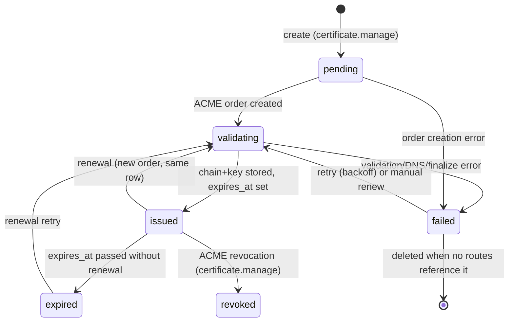

# Certificate Management — NexusOps

**Status:** Proposal for review — not yet approved for implementation.
**Date:** 2026-09-21
**Companions:** [platform-vision.md](platform-vision.md) · [domain-model.md](domain-model.md) · [multi-tenancy.md](multi-tenancy.md) · [authorization.md](authorization.md) · [node-agent-architecture.md](node-agent-architecture.md) · [domain-routing.md](domain-routing.md)

## 1. Scope and current state

Nothing in this subsystem exists today. There is **no domains/certificates/reverse-proxy
subsystem at all** — no certificate model, no ACME client, no DNS integration
(platform-vision.md §1; the only TLS today is the outer reverse proxy documented in
docs/deployment.md, which terminates the *dashboard's* own TLS, not customer traffic).
Everything below is a design spec for new work.

What exists and is reused:

| Existing capability | Ground | Reuse here |
|---|---|---|
| Fernet helpers `encrypt_str` / `decrypt_str` / `digest_of` | backend/app/core/security.py:131-158 | Encrypt cert chain + private key at rest; display fingerprint |
| Fernet-ciphertext-at-rest precedents | secrets.ciphertext (models/secrets.py:23-59), server_credentials.secret_ciphertext (models/infra.py:101-116), notification_channels.config_ciphertext (models/notify.py:27-48) | Same pattern for cert columns and Integration creds |
| Metadata-only reads for secret-like resources | secret_service.py:49-62, channel config write-only (notification_service.py:103-120) | Certificate API never returns key material |
| Log/audit redaction of sensitive keys | core/logging.py:19-60 (`private_key`, `token`, `credential`, ... substrings), applied in audit_service.py:54 | Defense-in-depth on every leak path |
| Beat cadences + atomic claims | celery_app.py:47-93, claim pattern monitor_service.py:293-313 (`FOR UPDATE SKIP LOCKED`) | Renewal sweep, stuck-state sweep |
| Incident/alert pipeline | incident_service.py:104-246, alert_service.py:17-29 | Issuance/expiry failures open incidents |
| Append-only audit | audit_service.py:20-65, DB trigger | `certificate.*` events |
| Agent auth (`X-Agent-Token`, SHA-256 lookup) | api/v1/agent.py:37-48 | Authenticated channel for delivery ops |
| Operation rows the agent PULLS | domain-model.md §2.3, node-agent-architecture.md (spec) | `certificate.install` / `certificate.remove` op types |

Honesty labels: the agent today implements hello/heartbeat only — no operations channel
exists yet; the ops framework this doc leans on is specified in
node-agent-architecture.md, not built. Likewise `Integration` is design-only
(domain-model.md §2.7). Nothing here is simulated *or* real — it is unbuilt.

## 2. Certificate entity

Per domain-model.md §2.4: the Route table carries an optional `certificate_id`, so one
certificate may serve many routes while a route binds at most one (the spine ER line
`Route |o--o| Certificate` understates this to 0..1:0..1; the Route table is
authoritative). One row per issued certificate.

| Field | Type | Notes |
|---|---|---|
| `org_id` | UUID FK, NOT NULL | Tenant root; session guard applies (multi-tenancy.md §3) |
| `primary_cn` | String | Subject CN, e.g. `api.example.com` or `*.example.com` |
| `sans` | JSONB list | Additional identifiers on the order (e.g. apex + wildcard) |
| `status` | String + CHECK | `pending` → `validating` → `issued`; `failed`, `revoked`, `expired` (§10) |
| `challenge_type` | String | `dns01` (default) or `http01` |
| `auto_renew` | Bool | Renewal scan skips rows with false |
| `dns_provider_id` | UUID FK → integrations | DNSProvider creds for DNS-01; defaults from the Domain |
| `issued_at`, `expires_at` | DateTime | From the issued cert's notBefore/notAfter |
| `chain_ciphertext` | Text | Fernet(`fullchain.pem`) via `encrypt_str` |
| `key_ciphertext` | Text | Fernet(`privkey.pem`) via `encrypt_str` |
| `fingerprint` | String | SHA-256 of the DER cert, truncated — display-only, like `digest_of` |
| `order_state` | JSONB | ACME order/challenge URLs, key authorizations (public ACME data, no keys) |
| `last_error` | Text nullable | Sanitized failure reason of the last attempt |
| `next_attempt_at` | DateTime nullable | Backoff cursor for failed attempts |
| `attempt_count` | Int | Reset to 0 on success; drives backoff + give-up |

Status machine:



Certificate is referenced by `routes.certificate_id` (domain-model.md §2.4). A
certificate row is never hard-deleted while any route references it (RESTRICT, same
policy as roles); delete is allowed only when orphaned.

## 3. API surface and permissions

Codenames per authorization.md §2: `certificate.read`, `certificate.manage` — new
registrations in `backend/app/core/permissions.py`. No `node.execute` is introduced;
delivery rides whitelisted Operation types (§6).

| Endpoint | Gate | Behavior |
|---|---|---|
| `POST /certificates` | `certificate.manage` | Create row, enqueue issuance |
| `GET /certificates` | `certificate.read` | Metadata-only list (org-scoped) |
| `GET /certificates/{id}` | `certificate.read` | Metadata + fingerprint + status + expiry; **no ciphertext, ever** |
| `POST /certificates/{id}/renew` | `certificate.manage` | Force reissue outside the window |
| `POST /certificates/{id}/revoke` | `certificate.manage` | ACME revocation; delivers removal ops |
| `DELETE /certificates/{id}` | `certificate.manage` | Only when no routes reference it |
| `GET /certificates/{id}/routes` | `certificate.read` | Routes serving this cert (= delivery targets) |

All routes run under `X-Org-Id` resolution and the session guard (multi-tenancy.md §2-3);
every mutation audits (§12).

## 4. ACME architecture

**The control plane is the ACME client.** Issuance runs in the API/Celery worker, never
on nodes. Rationale: DNS API creds never leave the control plane; rate-limit state is
tracked in one place; NAT-ed nodes cannot answer challenges themselves; key generation
and storage are centralized.

### 4.1 DNS-01 first (the default and the wedge)

DNS-01 is the only challenge type in v1 because it is the only one that works for the
platform's wedge (platform-vision.md §2.2): home servers behind NAT with no inbound
port 80, Raspberry Pis, and wildcard names. It requires no inbound connectivity to the
node at issuance time — the proof is a TXT record, not an open port.

### 4.2 DNSProvider interface

Providers over couplings (platform-vision.md §3.6). One interface, first implementation
Cloudflare:

| Method | Purpose |
|---|---|
| `create_txt(zone, name, value, ttl)` | Publish `_acme-challenge.<name>` |
| `delete_txt(zone, name, value)` | Cleanup after validation (best-effort) |
| `propagation_check(name, value, deadline)` | Query authoritative NS before telling ACME "ready" |
| `verify_creds()` | Health check on save |

- Credentials live in **Integration rows** (domain-model.md §2.7: `org_id`, kind
  `dns/cloudflare`, encrypted credentials) — Fernet-encrypted whole, write-only via the
  API, masked display target: the exact pattern proven by notification channel config
  (notification_service.py:93-120). A Cloudflare API token scoped to the zone is the
  v1 credential shape.
- The Domain row carries `dns_provider_id` (domain-model.md §2.4); a certificate may
  override it for the challenge.
- Later implementations (Route53, DigitalOcean, ...) add a class, a kind enum value,
  and nothing else.

### 4.3 ACME account and directory

- Directory URL is configuration: Let's Encrypt production plus **staging**, which is
  the default for all non-production environments and for tests — staging exempts
  development from production rate limits.
- One ACME account per Organization per directory. The account key is generated
  control-plane-side on first use and stored as a kind `acme/letsencrypt` Integration
  row (Fernet-encrypted). Per-org accounts keep rate-limit blast radius and revocation
  ownership scoped to the tenant.

### 4.4 HTTP-01 via node nginx (later fallback)

HTTP-01 requires Let's Encrypt to reach the node on port 80 — it serves only nodes with
public DNS + inbound 80, and cannot issue wildcards. It is a **later-phase fallback**
for orgs that do not want to hand out DNS API credentials: the control plane renders a
temporary challenge location into the node's nginx config via the existing nginx
render/apply operation path (ProxyProvider, domain-model.md §2.4; spec:
node-agent-architecture.md), the node answers the probe, and the flow proceeds
identically from finalization onward. DNS-01 remains the default; no UI promotes
HTTP-01 in v1.

## 5. Issuance flow

`request → order → challenge → issue → store → deliver`. One Celery task per attempt,
idempotent, driven by the row's status + `next_attempt_at`.

```mermaid
sequenceDiagram
    participant U as Operator (certificate.manage)
    participant A as API
    participant W as Celery worker
    participant AC as ACME (Let's Encrypt)
    participant DNS as DNSProvider (Cloudflare)
    participant AG as Node agent

    U->>A: POST /certificates (cn, sans, dns_provider_id, auto_renew)
    A->>A: Certificate row status=pending + audit certificate.created
    A->>W: enqueue nx.issue_certificate
    W->>AC: newOrder (identifiers)
    W->>W: load org ACME account (Integration, Fernet)
    AC-->>W: order URL + dns-01 challenges (token, key authz)
    W->>DNS: create_txt(_acme-challenge.<name>, digest)
    W->>DNS: propagation_check until authoritative NS answer
    W->>AC: challenge ready (notify)
    W->>AC: poll order status
    AC-->>W: valid
    W->>AC: finalize (CSR)
    AC-->>W: certificate chain
    W->>W: encrypt_str chain+key -> ciphertext columns; expires_at; fingerprint
    W->>W: status=issued, audit certificate.issued
    W->>W: delivery fan-out (section 6)
    Note over AG: agent PULLS ops; no push, no tunnel
    AG->>A: GET next operation (X-Agent-Token)
    A-->>AG: certificate.install payload (chain + key, over agent TLS)
    AG->>AG: write key 0600 / chain 0644, render nginx, nginx -t, atomic apply
    AG->>A: report result
    A->>A: audit certificate.deployed (per node)
```

Failure at any ACME/DNS step writes `last_error` (sanitized), sets `next_attempt_at`
with backoff, and keeps the row in `failed` on give-up (§11).

## 6. Delivery to serving nodes

**Secret minimization.** The delivery target set is derived, never configured:
`routes` where `certificate_id = cert.id` and `enabled = true` — their distinct
`node_id`s. A node receives a certificate only if it serves a route using it
(domain-model.md §3.7). Adding a route to an already-issued certificate enqueues one
delivery; removing the last route using it on a node enqueues a `certificate.remove`.

Delivery is an **Operation** (whitelisted type — the agent pulls; no remote shell):

| Op type | Params (at rest) | Effect on node |
|---|---|---|
| `certificate.install` | `{certificate_id, fingerprint}` — reference only | Pull response carries chain + key; writes `privkey.pem` 0600, `fullchain.pem` 0644 under `/etc/nexusops/tls/<certificate_id>/`; renders server block; `nginx -t`; atomic apply with rollback |
| `certificate.remove` | `{certificate_id}` | Drops the served files + config fragment; applies |

Key property: **private key material is never persisted in the Operation row.** Params
hold a reference; the pull response body is assembled at read time —
`decrypt_str(key_ciphertext)` in the request path, returned once over the agent's
authenticated TLS channel (X-Agent-Token, api/v1/agent.py:37-48), and never stored.
Op results carry success/failure only. This mirrors the rule that secrets reach a node
only in the payload of work actually assigned to it.

Failure semantics: the op retries while the node is offline (standard Operation queue
behavior, node-agent-architecture.md); a cert whose deliveries are all pending shows
`issued` but the routes page surfaces delivery state per node.

## 7. Renewal

A beat-driven sweep, built on the platform's existing cadence pattern
(celery_app.py:47-93 fixed ticks; atomic claim via `FOR UPDATE SKIP LOCKED`,
monitor_service.py:293-313):

| Beat entry | Cadence | Work |
|---|---|---|
| `sweep-certificates` | hourly | Claim rows `auto_renew AND status IN (issued, expired) AND expires_at < now() + 30 days`; reset `attempt_count=0`, enqueue reissue (same flow as §5, same row) |
| `retry-failed-certificates` | hourly | Claim `status=failed AND next_attempt_at <= now()`; re-enqueue with backoff |

Renewal reuses the row: a new ACME order replaces `chain_ciphertext` / `key_ciphertext`
/ `expires_at` / `fingerprint` in one transaction, then re-runs delivery to the
currently-derived target set. There is no separate renewal entity and no grace juggling
— the old cert stays served on nodes until the new one is delivered, since renewal
starts 30 days before expiry.

- **Failure alerts + incident.** An attempt that exhausts its budget (§11) raises
  `certificate.failed` → CRITICAL alert via the existing alert mapping
  (alert_service.py:17-29) and opens an incident through the incident pipeline
  (incident_service.py:104-246); resolution happens automatically when a later attempt
  succeeds, mirroring monitor auto-resolve (monitor_service.py:377-397).
- **Expiry breach.** If `expires_at` passes with renewal still failing, the sweep sets
  `status=expired` — a CRITICAL state surfaced by the TLS-expiry monitor (§10) rather
  than a second incident path.
- Manual `POST /certificates/{id}/renew` bypasses the 30-day window for ops drill-down;
  it is audited like any issuance.

## 8. Wildcard certificates

- **DNS-01 only.** Let's Encrypt validates wildcard identifiers exclusively via DNS-01;
  HTTP-01 cannot issue them. A wildcard request with `challenge_type=http01` is
  rejected at create time.
- **One label deep.** `*.example.com` matches `api.example.com` but not
  `a.b.example.com`. The common v1 shape is a single order for both identifiers —
  `sans = ["example.com", "*.example.com"]` — so apex and any first-level subdomain
  share one cert; both identifiers validate via their own `_acme-challenge` TXT record
  (the DNSProvider interface takes the full challenge name, so no special casing).
- **Route binding.** A route's hostname may bind a certificate whose CN/SANs cover it.
  Matching is exact-or-wildcard; this subsystem owns both the covering check and the
  reject-on-mismatch at bind time (Open question 3).
- **Renewal and delivery are identical** to non-wildcard certs — the wildcard lives in
  the identifiers, not the pipeline. Serving a wildcard from a node means every route
  on that node using the covered name shares one key; delivery minimization (§6)
  already collapses that to one install op per node.

## 9. Storage and leak paths

Ciphertext columns are Fernet via `encrypt_str` (core/security.py:131-133) under the
platform `ENCRYPTION_KEY` — the same write-once key contract as secrets today
(decrypt_str raises on key mismatch, security.py:135-142; no re-encryption path exists,
which is an accepted platform-wide constraint, not a cert-specific one).

| Path | Guarantee | Enforcement |
|---|---|---|
| REST responses | Metadata only: CN, SANs, status, dates, fingerprint | Schemas define no ciphertext field (pattern: secret metadata-only reads, secret_service.py:49-62) |
| Operation rows at rest | Reference `{certificate_id}` only, no key material | §6; worker assembles pull response at read time |
| Operation results | success/failure + error class only | Op result schema; worker never echoes payload |
| Logs | No PEM/Key contents | structlog `redact_mapping` already matches `private_key`/`token`/`credential` substrings (core/logging.py:19-60); issuance code never logs payload values |
| Audit metadata | No key material | `redact_mapping` applied at write (audit_service.py:54); audited actions carry ids + fingerprint only |
| WS / events | No cert channel publishes material | `certificate.*` event frames carry ids, status, node ids (event_bus frame shape, event_bus.py:114-125) |
| Frontend | types carry metadata fields only | Hand-mirrored types.ts gains no ciphertext field |
| DB at rest | `chain_ciphertext`, `key_ciphertext` Fernet columns | §2; read paths limited to issuance write + delivery read |

`fingerprint` (SHA-256, truncated) is the only value-derived field any API returns —
display/change-detection use, never a decryption oracle, same reasoning as
`digest_of` (core/security.py:145-158).

## 10. Status/expiry tracking and monitor tie-in

- `expires_at` is set from the issued cert's `notAfter` at store time. The
  `sweep-certificates` pass also flips `issued` → `expired` when it passes, and marks
  orphaned `failed` rows deletable.
- **TLS-expiry monitors.** domain-model.md §2.6 makes Monitor polymorphic
  (target node/container/domain/certificate/url) with auto-attach on domain routes
  (opt-out). Every certificate gets one `certificate`-target monitor on issuance:
  the check is `days_remaining = expires_at - now()` evaluated against warning/critical
  thresholds (default warn 21d, critical 7d) and rides the existing engine —
  check scheduling, incident open/acknowledge/resolve, notification fan-out are all
  unchanged monitor machinery, not new code. Dedup: the certificate-target monitor is
  the expiry-tracking owner — the TLS-expiry monitor a route's auto-attach would create
  (domain-model.md §2.6) is skipped when the route's bound certificate already has its
  issuance-time monitor, so a cert serving routes ends up with a single expiry monitor
  and a route-less cert is still covered by its own.
- Uptime monitoring of the *served* hostname is the domain/route monitor's job
  (domain-model.md §2.6); certificate expiry and route availability fail independently
  and page through the same incident pipeline.
- The certificate detail page renders the monitor's state inline; Viewer
  (`certificate.read`) sees it read-only.

## 11. Failure handling

Attempt budget: 5 attempts per issuance/renewal cycle, exponential backoff
(`2^n * 5 min`, cap 24h — same shape as the notification retry ladder,
notification_service.py:44-46). Exhaustion → `failed`, alert + incident (§7).

| Failure class | Detection | Handling |
|---|---|---|
| DNS API auth/permission error (Cloudflare 403, revoked/under-scoped token) | `create_txt` / `verify_creds` status | Attempt fails with a classified reason surfaced in `last_error` and the UI; no retry until the Integration is fixed — backoff still applies so fixing the token heals automatically |
| DNS API outage (5xx / timeout) | Provider call | Retry with backoff; propagation_check has a hard deadline so a slow API cannot hang the worker |
| Propagation never visible | Authoritative-NS poll deadline | Fail attempt, best-effort `delete_txt` cleanup, retry |
| ACME validation rejected (bad TXT, CAA, challenge mismatch) | Order status invalid | Fail attempt; retry only after cleanup — re-setting the same wrong record wastes the per-name failed-validation budget |
| Let's Encrypt rate limits (new-orders per account window, duplicate-certificate per week, failed validations per hostname/hour) | ACME error type + `Retry-After` | Honor `Retry-After` exactly; suppress retries beyond the budget; staging directory for all pre-production use keeps production budget clean |
| Order/account errors (expired order, rejected account key) | ACME status | Account errors re-run registration (new keypair Integration) once; otherwise fail |
| Stuck `validating` (worker died mid-order) | Stuck-state sweep: `validating` with no heartbeat older than order TTL (~1h) | Sweep marks `failed` with reason, best-effort TXT cleanup, normal backoff resumes |
| Stuck deliveries (node offline) | Operation queue | Ops retry while node offline; `certificate.remove` for a decommissioned node is dropped by the op sweeper (node gone, nothing to remove) |
| ENCRYPTION_KEY mismatch at decrypt | `decrypt_str` ValueError (security.py:135-142) | Delivery fails closed — the op reports failure, never ships a broken payload; same restore-the-key runbook as secrets |

No partial state: the ciphertext columns are replaced in one transaction, and node
files are written to temp paths then atomically moved only after `nginx -t` passes
(ProxyProvider apply contract, domain-model.md §2.4).

## 12. Audit and events

Audit actions (append-only, org-attributed once tenancy lands, named per the
`resource.action` convention in domain-model.md §2.6):

| Action | On | Actor |
|---|---|---|
| `certificate.created` | Create | user |
| `certificate.issued` | Chain stored | system (worker) |
| `certificate.renewed` | Renewal chain stored | system (worker) |
| `certificate.failed` | Attempt budget exhausted | system (worker) |
| `certificate.deployed` | Node reports install success | agent |
| `certificate.removed` | Node reports removal | agent |
| `certificate.revoked` | ACME revocation | user |
| `certificate.deleted` | Row deleted | user |

SystemEvent equivalents (`certificate.issued`, `certificate.renewed`,
`certificate.failed`, `certificate.deployed`) go through `event_bus.publish` with
ids/status/fingerprint only (§9), giving the events feed and a future
`org:{org_id}:certificates` WS channel everything the UI needs without a leak path.
`certificate.failed` additionally drives the alert/incident path (§7).

## 13. Non-goals

- No ACME client on the node — the node never talks to Let's Encrypt.
- No custom CA / private PKI in v1 (the ACME provider abstraction would accept a
  private ACME server directory later).
- No SNI-only multi-cert-per-route serving in v1: one certificate per route.
- No key rotation of `ENCRYPTION_KEY` — platform-wide write-once constraint (§9).

## Open questions

1. **ACME client library vs minimal implementation.** A vendored ACME client (e.g.
   acme-python via josepy) adds dependencies to the backend; a minimal in-repo client
   is small but must track ACME RFC 8555 drift. Decide at implementation time; the
   `AcmeProvider` interface is the seam either way.
2. **Per-org vs single platform ACME account.** Per-org accounts (spec'd, §4.3) give
   rate-limit isolation but multiply account keys to protect. A single control-plane
   account is simpler; revisit if org scale makes the shared budget a problem.
3. **Wildcard-vs-exact matching at route bind time** — ownership is settled: this
   subsystem (the certificates API) owns the covering check and reject-on-mismatch;
   the open question is only the error shape surfaced to the caller.
4. **Renewal window vs shorter-lived certs / ARI.** If ACME renewals move to
   much shorter-lived certs (ARI-driven renewal info), the fixed 30-day scan needs a
   second trigger; defer until the ACME landscape settles.
5. **Delivery pull-response persistence.** The spec keeps key material out of the
   Operation row; if the ops framework later logs full request/response bodies for
   debugging, `certificate.install` must be exempted (or payloads moved to a
   short-lived signed-URL flow). Needs a decision recorded in
   node-agent-architecture.md.
