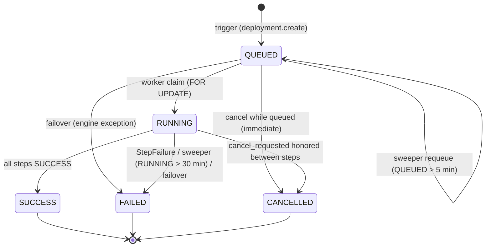

# Deployment Architecture — NexusOps (target state)

**Status:** Proposal for review — not yet approved for implementation.
**Date:** 2026-09-20
**Companions:** [platform-vision.md](platform-vision.md) · [domain-model.md](domain-model.md) §2.2 · [multi-tenancy.md](multi-tenancy.md) · [authorization.md](authorization.md) · [product-roadmap.md](product-roadmap.md) Phase 6

---

## 1. Current state — what is real and what is simulated

Deployment **orchestration** is real and battle-tested. Deployment **execution** is a
staged simulation: `SimulatedDeploymentRunner` renders docker-style logs for 7 steps
and performs no real work — its docstring states a real adapter is "deliberately NOT
implemented in v1" (`backend/app/providers/deployment_runner.py:1-13,107-261`). The
only real I/O is `asyncio.sleep` pacing and `token_hex` digests
(`deployment_runner.py:26-32,162`).

| Layer | State | Evidence |
|---|---|---|
| Queue → claim → state machine | real | `deployment_engine.py:150-260,266-364,580-713` |
| Celery run task + sweeper backstop | real | `tasks/deployments.py:21-106`; beat 120s (`tasks/celery_app.py:63-66`) |
| Log persistence + Redis frames + WS | real | `deployment_engine.py:397-498`; `ws/hub.py:347-361` |
| Lifecycle events + alerting | real | `deployment_engine.py:226-236,592-686` |
| Secrets model + resolution service | real | `secret_service.py:275-325` |
| Runner execution | **SIMULATED** | `SimulatedDeploymentRunner` (`deployment_runner.py:107`) |

### 1.1 The honest defect list

1. **The runner is 100% simulated.** A SUCCESS deployment marks
   `application.current_version` / `current_deployment_id`
   (`deployment_engine.py:590-591`) for code that was never built or shipped —
   platform data fabricates delivery reality. Health "passes" unless the version
   string ends in `-broken` (`deployment_runner.py:223-239`), an explicit E2E/demo
   hook, not a real probe.
2. **No DI — the runner is hard-instantiated at two sites.**
   `deployment_engine.py:194` (queue time) and `deployment_engine.py:345`
   (execute time) both call `SimulatedDeploymentRunner()` directly. Swapping in a
   real runner requires engine edits, not just a new adapter.
3. **`RunContext` cannot feed a real runner.** Its only fields are
   `project_name, application_name, environment_name, version, git_commit,
   server_name, secrets` (`deployment_runner.py:59-70`) — `server_name` is a display
   string, not node addressing. Missing: `repository_url`, `default_branch`,
   `build_config`, image ref, node identity. The data exists on the models but never
   reaches the runner: `Project.repository_url/default_branch`
   (`models/delivery.py:31-32`), `Application.repository_url/build_config`
   (`models/delivery.py:53-54`), `Environment.server_id/healthcheck_path/config`
   (`models/delivery.py:78-84`). The engine builds `RunContext` at
   `deployment_engine.py:187-193` and `321-329` without any of it.
4. **Secret resolution silently degrades to empty on failure.**
   `deployment_engine.py:374-387` (`_resolve_secrets`) catches every exception and
   returns `{}` with a warning; `secret_service.py:314-324` resolves missing or
   undecryptable refs to `""` with a warning. A deploy then proceeds without its
   required credentials. There is no audit event at resolution time, and only the
   simulated runner ever consumes `ctx.secrets` (`deployment_runner.py:210`).
5. **Cancel is cooperative between steps only.** `cancel_requested` is polled at the
   top of the step loop (`deployment_engine.py:346-357`); an in-flight step cannot be
   interrupted and there is no per-step timeout — the only wall-clock enforcement is
   the Celery `soft_time_limit=560s` / `time_limit=590s`
   (`tasks/deployments.py:21`).
6. **The queue→worker→sweeper path is real and kept.** After-commit Celery enqueue
   (`deployment_engine.py:129-144`), `SELECT .. FOR UPDATE` claim with status recheck
   (`278-297`), sweeper requeues QUEUED > 5 min and fails RUNNING > 30 min
   (`tasks/deployments.py:17-18,66-94`).
7. **Rollback already works the target way.** Rollback queues a *new* deployment
   re-deploying the last SUCCESS version of the same application+environment
   (`deployment_engine.py:788-850`) — full step replay, not a container swap.
   `DeploymentStatus.ROLLBACK` (`models/enums.py:65`) is a dead enum member that
   nothing ever sets.

## 2. What survives unchanged

The target is a runner swap, not a rewrite. Kept as-is:

- **The `DeploymentRunner` protocol** (`deployment_runner.py:81-96`):
  `plan_steps(ctx) -> list[str]`, `execute_step(step_name, ctx) ->
  AsyncIterator[StepLine]`, `StepFailure` for irrecoverable step errors. Both target
  runners implement exactly this.
- **Plan-at-queue, execute-at-run.** Steps are persisted as `DeploymentStep` rows at
  queue time (`deployment_engine.py:212-213`); execution iterates the persisted rows.
- **The state machine** (below), the queue/claim/sweeper protocol, cancel and
  rollback semantics, the log persistence + Redis frame plumbing, the event/alert
  integration, and the API surface (`api/v1/deployments.py:185-302`).



Statuses live on `deployments.status` (String + CHECK, `models/delivery.py:91`);
steps carry their own `PENDING → RUNNING → SUCCESS/FAILED/SKIPPED` statuses
(`models/delivery.py:142-162`). Unreached steps are marked SKIPPED on every terminal
transition (`deployment_engine.py:624-640,670-677`).

## 3. Target pipeline

Source → build → artifact → deploy → health → route → monitor. Stages map to steps;
steps dispatch to the node as whitelisted `Operation` rows the **agent pulls**
(never pushed commands — platform-vision.md §3.2).

| Stage | What happens | Where it runs | Phase |
|---|---|---|---|
| Source | git fetch at ref (6b only) | node via `git.fetch` op | 6b |
| Build | `docker build` with app build_config (6b only) | node via `container.build` op | 6b |
| Artifact | image ref: user-supplied (6a) or node-local tag (6b) | registry / node | 6a/6b |
| Deploy | pull image, stop old, run new with env/ports | node via container ops | 6a |
| Health | agent-side probe loop; failure blocks routing | node via `container.healthcheck` op | 6a |
| Route | nginx render/validate/atomic-apply for the app's routes | control plane + nginx ops | 6a (route-sync skips until Phase 4) |
| Monitor | container-health monitor auto-attached; uptime/TLS later | control plane | 6a |

The control plane never sits in the customer traffic path; routing terminates on the
node's nginx (platform-vision.md §5).

**Network model for 6a: published loopback ports only.** Deployed containers publish
`127.0.0.1:<host_port> → <container_port>` from the environment's declared publish
spec — that loopback address is what nginx routes to (domain-routing.md §8.1) and
what the healthcheck probes (§14.5). Per-project docker networks are DEFERRED.

## 4. Runner registry — the DI fix

Replace the two hard-instantiation sites (`deployment_engine.py:194,345`) with a
registry selected by a **kind stored on the deployment row at queue time**, so the
plan persisted at queue time and the runner used at execute time cannot diverge:

```python
# backend/app/providers/runner_registry.py (new)
_RUNNERS = {"agent": AgentDeploymentRunner, "simulated": SimulatedDeploymentRunner}

def resolve_runner(kind: str) -> DeploymentRunner:  # KeyError -> StepFailure
    return _RUNNERS[kind]()
```

- `deployments.source_kind` (new column, Phase 6a): `image` / `git` / `simulated`.
- `queue_deployment` resolves the kind once (trigger payload + `settings.simulation_mode`
  forcing `simulated`), calls `plan_steps`, persists steps, stamps the row.
- `execute_deployment` re-resolves by the stored kind. The engine keeps talking only
  to the protocol.
- Step vocabulary becomes **runner-owned**: each `plan_steps` returns its own step
  names (tables in §6); the current `StepName`/`STEP_ORDER` tuple
  (`deployment_runner.py:35-56`) remains the simulated runner's plan. `DeploymentStep.name`
  is `String(160)` — no schema change.

## 5. `AgentDeploymentRunner` — real execution over agent operations

Implements the **existing** `DeploymentRunner` protocol; each step becomes one or
more `Operation` rows (the remote-ops primitive, domain-model.md §2.3) that the
target node's agent pulls. No SSH, no push tunnel, no shell type.

| Protocol member | Agent runner behavior |
|---|---|
| `plan_steps(ctx)` | Phase-specific list per §6 (kind decides the plan) |
| `execute_step(step, ctx)` | Control-plane-only steps run inline; node steps insert an `Operation` (type from whitelist, params JSONB, `expires_at` = now + per-type timeout, correlation `deployment_id`+`step_idx`, actor SYSTEM), then yield `StepLine`s as the op's output arrives; op `failed`/`expired` → raise `StepFailure` (op-status vocabulary per node-agent-architecture.md §5.1) |
| `StepLine` | Re-emitted onto the **existing** Redis channel `nx:deploy:{deployment_id}` (`core/channels.py:12-13`) by the engine's existing flush path (`deployment_engine.py:422-498`) — persistence + WS behavior unchanged |

```mermaid
sequenceDiagram
    participant SPA as SPA (deploy dialog)
    participant API as API (FastAPI)
    participant ENG as Engine + AgentDeploymentRunner (Celery worker)
    participant DB as PostgreSQL
    participant AG as Agent (target node)
    participant R as Redis
    SPA->>API: POST /deployments/applications/{id}/deployments (image_ref)
    API->>DB: queue_deployment — QUEUED row + plan_steps rows + audit + DEPLOYMENT_QUEUED
    API-->>SPA: 202 DeploymentDetail
    API->>ENG: Celery enqueue after commit (deployment_engine.py:129-144)
    ENG->>DB: claim QUEUED FOR UPDATE → RUNNING + DEPLOYMENT_STARTED
    loop each step (plan order)
        ENG->>DB: insert Operation (whitelisted type, params, expires_at, deployment_id+step_idx)
        AG->>DB: GET /agent/operations — PULL, node-scoped
        AG->>AG: execute against local docker (whitelist only)
        AG->>API: POST op output lines + terminal result
        ENG->>DB: observe op terminal; tail op lines
        ENG->>R: StepLines → nx:deploy:{deployment_id}
    end
    ENG->>DB: terminal transition + DEPLOYMENT_* event + alert
    R-->>SPA: WS deployment-logs frames (gated deployment.read)
```

### 5.1 Operation whitelist additions (deployments)

| Op type | Action | Codename mapping | Phase |
|---|---|---|---|
| `container.pull` | pull `image_ref` from registry | `container.lifecycle` | 6a |
| `container.stop` | stop previous container | `container.lifecycle` | 6a |
| `container.run` | create+start container with env/ports/labels | `container.lifecycle` | 6a |
| `container.healthcheck` | local HTTP probe loop (path/port/interval/retries) | `container.lifecycle` | 6a |
| `git.fetch` | clone/fetch repo at ref into workspace | `deployment.build` (amendment — see note below) | 6b |
| `container.build` | `docker build` from workspace with build_config | `deployment.build` (amendment — see note below) | 6b |
| `nginx.apply` | render/validate/atomic-apply routes (Phase 4 provider) | `domain.manage` | 6a (step skips until Phase 4) |

There is **no `node.execute`** and no exec/shell op type — narrow types only, per
authorization.md §2. Ops are org-scoped; an agent fetches only ops for its own node
(multi-tenancy.md §6).

**Agent-containment amendment (amends node-agent-architecture.md §6.2).** That spec
fixes the agent's type→API-call map as "no `exec`, no `create`" and its Never list
as "arbitrary image pulls, host mounts, privileged creates — not in the map, not
parameterizable". Phase 6a deliberately **expands that surface for exactly two
types**, and nothing else: `container.pull` (image pull pinned to the deployment's
declared `image_ref` — never an arbitrary reference) and `container.run`
(create+start of the deployment's own app container only; host mounts, privileged
mode, and exec stay structurally absent from the per-type params schema). The word
"arbitrary" stays in the Never list; these two types are added to the map itself.
They ride the full registration bar node-agent-architecture.md §5.2/§6.4 requires of
any new op type — validated params schema, contract tests, codename mapping,
`docker` capability gate, review — and the agent re-validates params against the
same schema before executing.

**Secret minimization — and no secret in the clear on any path.** The `container.run`
op params carry only the resolved values this deployment references — a node never
sees the org's secret store (platform-vision.md §5; domain-model.md §3.7). Because
Operation rows persist `params`/`result` JSONB (node-agent-architecture.md §5.1) and
`operation.read` is granted to every role (authorization.md §3), resolved secret
values inside op params are **encrypted at rest** — the same Fernet envelope the
secrets table uses, decrypted only when the op is claimed and delivered over the
agent's TLS channel — and **redacted on every read path**: `operation.read`/list
responses, and any `operation.*` events the ops framework emits
(node-agent-architecture.md §5.3), render secret-bearing params in their
`${secret:KEY}` reference form, never resolved values. **Redaction is mechanical,
not inferred:** the runner writes op params with secret positions as `${secret:KEY}`
reference markers plus a separate encrypted resolved-values blob, so every read
path renders references by substituting markers — it never guesses which params
were secret. The agent must not echo
resolved values into op output lines or result payloads; as defense in depth the
runner redacts known resolved values line-level before op output persists as
`LogEntry` rows or streams as step lines (both gated only by `deployment.read`,
§10). This extends the secret_service contract — resolved values are "NEVER
expose[d] through any API endpoint, WS frame or log line"
(`secret_service.py:280-286`) — to the operations surface.

**`deployment.build` (6b) is an authorization.md amendment.** The mapping
`git.fetch`/`container.build` → `deployment.build` is a **new codename that does not
exist in authorization.md §2's registry-add list or §3 role sets**; the amendment
must land there with 6b — DevOps holds it via the `deployment.*` wildcard, and
Developer gains it explicitly (their enumerated `deployment.read/create/cancel` set
excludes it, and Developers must be able to run git builds). Until that amendment
ships, 6b is blocked.

**Container identity (6a).** Phase 2 makes environments project-scoped, so an
`app-env` slug is not unique on a shared node — two orgs' `web-prod` would derive
the identical container name and `STOP_OLD` could stop another org's container.
Contract:

- Deterministic namespaced name `nxa-{project}-{app}-{env}`; a collision with any
  existing container fails the deployment with 409 at RESOLVE_CONFIG — before
  STOP_OLD ever runs.
- The run op stamps platform docker labels (`nxa.org`, `nxa.project`, `nxa.app`,
  `nxa.env`, `nxa.deployment`). STOP_OLD and future route binding target by platform
  labels, never by bare name; the agent **refuses to stop or replace containers
  lacking platform labels** (unlabeled = not ours).

**Port reality (must).** The agent forwards the `Ports` array it already receives
from `/containers/json` (`agent/nexusops_agent.py:208-217`) and the heartbeat upsert
stops writing `ports=[]` (`backend/app/services/server_service.py:536-538`).
RESOLVE_CONFIG validates the deployment's declared host ports against the node's
container inventory (409 on conflict, before any node op); execution re-checks
before STOP_OLD executes — a host-port collision must surface at plan time, not
after the old container is already down.

**Volume policy (decided).** Named volumes only: declared in environment config,
platform-namespaced `nxa-{project}-{app}-{env}-{name}`, created by the run op if
absent. Bind mounts / host paths stay structurally absent from the params schema.
Redeploying a stateful image without declared volumes recreates empty storage —
the deploy flow states this plainly rather than presenting redeploy as data-safe.

### 5.2 `RunContext` extension

| Field | Source | Status |
|---|---|---|
| `node_id` | environment's node (Phase 2: env gains `node_id`) | new |
| `image` | trigger body (6a) or node-local tag (6b) | new |
| `repository_url` | application's, else project's | new (data exists: `delivery.py:31,53`) |
| `default_branch` | project | new (`delivery.py:32`) |
| `build_config` | application | new (`delivery.py:54`) |
| `resolved_config` | §7 layering merge (non-secret keys) | new |
| `healthcheck` | environment healthcheck config | new (`delivery.py:81` today) |
| `container_name` | derived deterministic `nxa-{project}-{app}-{env}` + platform labels (§5.1) | new |
| `project_name` … `secrets` | today's fields | kept (`server_name` stays display-only) |

## 6. Phased scope

### 6a — Image-based deploys (needs Phase 3 ops framework)

Trigger: `POST /deployments/applications/{id}/deployments` with `{version, image_ref}`.
`deployments` gains `image_ref` **and `image_digest`** (6a): the PULL_IMAGE op result
MUST return the resolved manifest digest (the Engine API reports `RepoDigests`), the
digest is stamped on the deployment row and shown in deployment detail, and rollback
re-deploys `image_ref@sha256:<digest>` verbatim. A mutable tag re-pushed between
deploy and rollback must never change what rolls back. `image_ref` syntax is
validated at trigger — registry/repo with an explicit tag, no implicit `:latest`;
floating tags are allowed but always paired with the recorded digest.

**Registry scope (decided): 6a supports public registries only.** A private-image
pull fails with a clear error naming the cause; private registry auth is DEFERRED
behind an integrations registry-kind design (domain-model.md §2.7 lists no registry
kind today) with encrypted creds delivered per-deployment like secrets.

**Brief downtime, labeled.** 6a is stop-then-start: STOP_OLD runs before RUN_NEW,
and ops deliver on the heartbeat cycle with one in-flight op per node
(node-agent-architecture.md §5.1; 30s default cadence), so the stop→run→healthy
window realistically spans multiple pickup cycles — minutes, not milliseconds. The
deploy dialog, API, and docs label 6a deploys as brief-downtime. Zero-downtime
(create-new-first + route switch — two containers plus the Phase 4 route layer) is
explicitly DEFERRED, not silently absent.

**Recovery contract.** A RUN_NEW failure after a successful STOP_OLD leaves the app
down; the recovery path is rollback — STOP_OLD tolerates a missing container (first
deploy) and the previous image is already cached on the node from the last pull.
This is the stated contract, not an emergent behavior.

**Serialization (decided).** A trigger returns 409 while another deployment for the
same `(application_id, environment_id)` is QUEUED/RUNNING — two deployments would
interleave STOP_OLD/RUN_NEW on one node (ops serialize per node, not per
deployment). Rejection is the simplest safe rule and consistent with the engine's
`FOR UPDATE` claim discipline (`deployment_engine.py:278-297`).

| # | Step | Op type | Failure semantics | Default timeout |
|---|---|---|---|---|
| 1 | RESOLVE_CONFIG | — (control plane) | unresolved/undecryptable secret → deploy FAILED (§8) | 60s |
| 2 | PULL_IMAGE | `container.pull` | registry error → FAILED | 240s |
| 3 | STOP_OLD | `container.stop` | missing old container → tolerated (first deploy) | 60s |
| 4 | RUN_NEW | `container.run` | create/start failure → FAILED; old container already stopped → rollback advised | 120s |
| 5 | HEALTH_CHECK | `container.healthcheck` | retries exhausted → FAILED; **routing never applied** (real gate — the `-broken` hook is retired from the real path) | 180s |
| 6 | ROUTE_SYNC | `nginx.apply` | apply failure → FAILED (previous routing config remains; §11); pre-Phase 4 (no nginx provider yet) → SKIPPED | 60s |
| 7 | FINALIZE | — (control plane) | marks SUCCESS, stamps `current_version`/`current_deployment_id` | 10s |

The "Default timeout" column is the **per-type op timeout** fixed when 6a registers
each new type in the ops registry (node-agent-architecture.md §5.2; `nginx.apply`
keeps the spine's existing 60s). Enforcement follows the ops lifecycle
(node-agent-architecture.md §5.1): control-plane-side via `expires_at` + ops
sweeper, agent local deadline secondary — an op with no result by `expires_at` is
`expired`; there is no separate TIMED_OUT status.

### 6b — Git-based build on node (needs 6a + Phase 4)

Trigger: `{version, git_commit?}`; `deployments` gains `git_url` + `git_sha` snapshot.
Build happens on the node — the control plane ships no build artifacts.

| # | Step | Op type | Failure semantics | Default timeout |
|---|---|---|---|---|
| 1 | RESOLVE_CONFIG | — | as 6a | 60s |
| 2 | FETCH_SOURCE | `git.fetch` | auth/clone failure → FAILED | 120s |
| 3 | BUILD_IMAGE | `container.build` | build error (exit ≠ 0) → FAILED; log lines stream as normal step output | 420s |
| 4–8 | STOP_OLD → RUN_NEW → HEALTH_CHECK → ROUTE_SYNC → FINALIZE | as 6a | as 6a; image tag = `{app}:{git_sha}` | as 6a |

Worst-case step budgets exceed the current 560s Celery soft limit — see
Open questions §14.1 before 6b ships.

## 7. Environments and config layering

Phase 2 promotes `deployment_environments` from application scope to **project
scope** (`application_id` → `project_id`, unique `(project_id, slug)` —
domain-model.md §2.2.1). Deployments keep the `(application_id, environment_id)`
pair: "application deployed into project environment". The environment anchors
config, secrets, grants ("Ali deploys staging"), and the node assignment.

Effective config = layered merge, **most specific wins**:

| Layer | Source | Precedence |
|---|---|---|
| Project config | `projects.config` (new JSONB, Phase 2 — present in domain-model.md §2.2's Project row and roadmap Phase 2's DB list; this amendment has landed in both) | 1 (base) |
| Environment config | `deployment_environments.config` (exists, `delivery.py:84`) | 2 (overrides project per key) |
| Deploy-time secret refs | `${secret:KEY}` values in either layer, resolved at RESOLVE_CONFIG | 3 (always wins over literals) |

1. `effective = {**project.config, **environment.config}` — env key overrides.
2. Values may be a whole-value reference `${secret:KEY}` (strict grammar kept:
   `_SECRET_REFERENCE_RE` at `schemas/environment.py:20`, enforced at `:51-52`);
   raw secret values are rejected at config-save time.
3. Each ref resolves against the layered Secret scope: **environment-scoped >
   project-scoped > org-scoped** Secret rows (domain-model.md §2.5; today's
   project-over-global fallback at `secret_service.py:296-311` generalizes).
4. The resolved non-secret effective config is snapshotted onto the deployment row
   (redacted) for reproducibility; secret values never persist on the deployment
   row — they reach the node only as encrypted op params (§5.1).

## 8. Secret-resolution hardening (fail-closed, audited)

Replaces today's degrade-to-empty behavior (§1.1.4):

| Condition | Today | Target |
|---|---|---|
| Ref key has no Secret row | resolves `""` + warning (`secret_service.py:316-318`) | deploy fails at trigger (preflight) or RESOLVE_CONFIG — **fail closed** |
| Ciphertext undecryptable | resolves `""` (`secret_service.py:320-324`) | fail closed, CRITICAL event |
| Resolver throws (DB/Redis/crypto) | engine swallows → `{}` (`deployment_engine.py:381-387`) | deploy FAILED before any node step |
| Resolution audited | no audit at resolution time | `secret.resolve` audit row per deployment: key names + deployment linkage, **never values** |
| Who may trigger resolution | anyone with `deployment.create` (unchanged) | deploy permission chain; **never `secret.read`** (roadmap Phase 0/2) |

Fail-closed lands in Phase 0 (roadmap §3, hardening item 1); layered scope +
resolution authorization complete in Phase 2. Values are delivered only to the
target node's op params (§5.1) — encrypted at rest in the operation row, redacted
in every API/WS/log path (§5.1), and never written to the deployment row (§7).
Minimization holds at every hop.

## 9. Cancellation and per-step timeouts

| Mechanism | Today | Target |
|---|---|---|
| Cancel while QUEUED | immediate CANCELLED (`deployment_engine.py:749-785`) | unchanged |
| Cancel while RUNNING | flag polled **between steps only** (`deployment_engine.py:346-357`) | kept, plus: engine cancels the in-flight Operation; the agent aborts at op granularity (best-effort `docker stop` for container ops). **Amends the ops lifecycle:** node-agent-architecture.md §5.1 defines `cancelled` only as "user cancelled while pending" — Phase 6a extends it to claimed/running *deployment* ops (engine-requested abort); non-deployment ops keep the pending-only rule |
| Per-step timeout | none — only Celery `soft_time_limit=560s` (`tasks/deployments.py:21`) | per-type timeout on the Operation (§6 defaults) enforced **control-plane-side** via `expires_at` + ops sweeper, agent local deadline secondary (node-agent-architecture.md §5.1); no result in time → op `expired` → `StepFailure` |
| Lost agent mid-step | RUNNING hangs until the 30-min sweeper (`tasks/deployments.py:77-94`) | op timeout fires first; sweeper stays as the final backstop (windows unchanged) |
| Celery budgets | 560s/590s | kept as wall-clock backstop for 6a; 6b needs the queue-budget decision (§14.1) |

Cancel requires `deployment.cancel`; the cancel path stays audit + `DEPLOYMENT_CANCELLED`
event unchanged (`deployment_engine.py:737-747,763-783`).

## 10. Events and WS during runs

Unchanged contract, org-scoped after Phase 1 (multi-tenancy.md §5):

| Signal | Channel | Gate | Notes |
|---|---|---|---|
| `DEPLOYMENT_QUEUED/STARTED/SUCCEEDED/FAILED/CANCELLED` | `nx:events` via event_bus | `event.read` | terminal events use actor SYSTEM (`deployment_engine.py:511-529`); publish after-commit, dropped on rollback |
| Step lines | `nx:deploy:{deployment_id}` → WS `deployment-logs` | `deployment.read` + entity existence, per-subscribe recheck (`ws/hub.py:347-361`) | frames `{deployment_id, step_idx, step, line, level, ts}` (`deployment_engine.py:434-445`) |
| Persistence | `LogEntry(source=DEPLOYMENT)` via log_service with direct-insert fallback (`deployment_engine.py:449-484`) | `deployment.read` on `/deployments/{id}/logs` | frames stay best-effort (`497-498`); persistence is the source of truth; 30-day retention (`tasks/maintenance.py:18`) |

No new event types: operation lifecycle is not user-facing — op output surfaces only
as step lines on the existing channel. Alerts on FAILED/ SUCCESS continue through the
existing path (`deployment_engine.py:532-577,603-663`).

## 11. Post-deploy hooks

**Route sync (HEALTH_CHECK passes → ROUTE_SYNC).** The control plane renders the
routes whose upstream is the newly started container through the `ProxyProvider`
(nginx first): render → `nginx -t` validate → atomic apply with rollback, executed as
`nginx.apply` agent ops (domain-model.md §2.4). Gated by `domain.manage` at the
route-management layer; the deployment dispatches as SYSTEM. No routes → step
no-ops; pre-Phase 4 (nginx provider not yet shipped) → step SKIPPED the same way,
which keeps 6a's dependency at Phase 3 only (roadmap §2).
Apply failure fails the deployment while the previous routing config stays live —
a bad build can never be routed (health gate) and a routing failure never orphans a
healthy container without recourse (rollback or re-trigger re-runs the step).

**Auto-monitor creation (after FINALIZE).** Monitors gain polymorphic targets
(domain-model.md §2.6). On SUCCESS the platform auto-attaches, with an opt-out flag
on the environment: a container-health monitor (6a), plus uptime and TLS-expiry
monitors per route/domain once Phases 4–5 land. Incidents/notifications flow through
the existing pipeline unchanged.

## 12. Rollback semantics (existing behavior kept)

Rollback is **not** a container swap: `rollback_deployment`
(`deployment_engine.py:788-850`) queues a *new* deployment with
`trigger=ROLLBACK`, `is_rollback=true`, `rollback_of_id` set, re-deploying the last
SUCCESS version of the same application+environment, replaying the full step plan.
Target changes are additive only:

- For 6a, "last good version" becomes concrete: the rollback target's persisted
  `image_ref@sha256:<digest>` is re-deployed verbatim (§6a — the digest is what
  makes "exact artifact" true; a mutable tag alone would not).
- Rollback permission stays `deployment.rollback` (DevOps role, authorization.md §3).
- `DeploymentStatus.ROLLBACK` (`models/enums.py:65`) remains an unused member;
  retire it in a cleanup migration rather than repurposing it.
- Rollback of a FAILED deployment is allowed today (`SUCCESS` or `FAILED` source,
  `deployment_engine.py:799`) — unchanged.

## 13. The simulated runner stays — labeled

`SimulatedDeploymentRunner` remains a registered runner selected only when
`source_kind = simulated` (SIMULATION_MODE / demo / CI), alongside the sim
`docker_sim` provider and `sim://` monitor transports (platform-vision.md §1).
Rules:

- Runs render realistic 7-step output with the existing `-broken` health hook —
  that hook is demo tooling and **never** exists in `AgentDeploymentRunner`
  (platform-vision.md §3, honesty principle).
- The sim's log lines fabricate behavior the real contract will not have —
  "Connections drained: 0 active after 200ms" and "Preserved as {target}-prev for
  rollback window" (`deployment_runner.py:186-193`): no drain and no preserved
  container exist in 6a (§6a labels real deploys brief-downtime). Annotate the sim
  output accordingly so demo output never trains expectations the real runner
  will break.
- The UI keeps the "Simulated" chip on deploy/run views while a simulated runner
  produced the deployment (roadmap Phase 0 honesty labels); simulated deployments are
  distinguishable in API payloads via the deployment's kind.
- e2e (Playwright journey, `docker_sim` CI) keeps running against the simulated
  runner until 6a adds a real-node path; real-node e2e stays manual per roadmap.

## 14. Open questions

1. **Celery budget vs real builds.** `nx.run_deployment` runs under
   `soft_time_limit=560s` (`tasks/deployments.py:21`); worst-case 6b step budgets
   exceed it. Dedicated high-budget queue vs per-step subtask decomposition — decide
   before 6b.
2. **Op line transport.** How agent-emitted op lines reach the runner: op-result
   endpoint with chunked POSTs, op log rows the runner tails, or a Redis list per op.
   Affects the Phase 3 wire protocol; must be fixed when the Operations framework
   lands.
3. **Private registry auth (6a) — DECIDED: out of 6a.** Public registries only
   (§6a); private auth is deferred behind an integrations registry-kind design
   (domain-model.md §2.7 currently has no registry kind) with encrypted creds
   delivered per-deployment like secrets. Revisit only after that design exists.
4. **Concurrent deployments per environment — DECIDED: reject 409** while another
   deployment for the same `(application_id, environment_id)` is QUEUED/RUNNING
   (§6a). Queue-serially was the alternative; rejection is simplest and protects
   the one-op-per-node invariant.
5. **Healthcheck config schema — DECIDED (6a precondition):**
   `{path, port, interval_seconds, retries, timeout_seconds}` with the probe target
   fixed as the container's published loopback port on the node (not the container
   IP, not the platform). Probe evidence (attempts, status codes, final failure)
   persists into step output so FAILED health is auditable. `healthcheck_path`
   (`delivery.py:81`) seeds the path field.
6. **Per-node op serialization vs step budgets.** Operations serialize one
   in-flight op per node (node-agent-architecture.md §5.1); a deployment op queued
   behind another deployment's in-flight op on a busy node can exhaust its
   `expires_at` before pickup. Stamp `expires_at` at claim time for deployment ops,
   or let step budgets absorb queue delay — decide in 6a.
