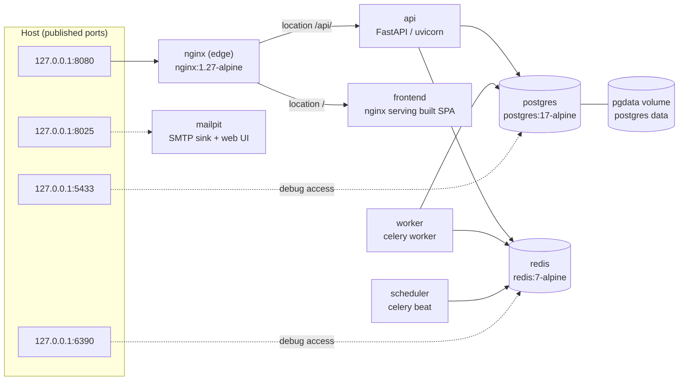
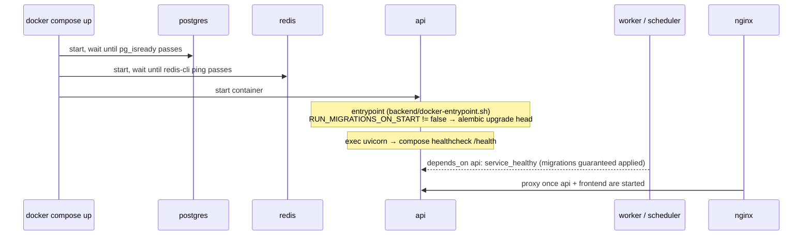
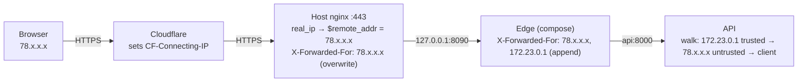

# Deployment & Operations Guide

How to run NexusOps in a production-shaped way: the compose topology, what happens
on first boot, what to set before exposing it, TLS, client-IP resolution behind
proxies, backups, upgrades, scaling and monitoring the platform itself.

This guide describes the **default compose profile** (`docker-compose.yml`). The
`docker-compose.dev.yml` overrides (hot reload, Vite on :5173) are development
tooling and are covered only briefly at the end.

---

## Topology

```
docker compose up -d          # 8 services on one compose network ("nexusops")
```



Every service is defined in `docker-compose.yml`. The essentials per service:

| Service | Image / build | Command | Healthcheck | Restart | Depends on |
|---|---|---|---|---|---|
| `postgres` | `postgres:17-alpine` | image default | `pg_isready -U $POSTGRES_USER -d $POSTGRES_DB` (5s interval, 20 retries) | `unless-stopped` | — |
| `redis` | `redis:7-alpine` | `redis-server --appendonly no --save ""` | `redis-cli ping` | `unless-stopped` | — |
| `mailpit` | `axllent/mailpit:v1.24` | image default | none | `unless-stopped` | — |
| `api` | build `./backend` | `uvicorn app.main:app --host 0.0.0.0 --port 8000 --workers ${API_WORKERS:-2} --proxy-headers` | HTTP GET `http://127.0.0.1:8000/health` (10s interval, 15s `start_period`) | `unless-stopped` | `postgres: service_healthy`, `redis: service_healthy` |
| `worker` | build `./backend` | `celery -A app.tasks.celery_app:app worker --loglevel=INFO --concurrency=4 --max-tasks-per-child=200` | `celery inspect ping -d celery@$HOSTNAME` (30s interval; `CMD-SHELL` so `$HOSTNAME` expands at check time — see the comment in `docker-compose.yml`) | `unless-stopped` | `postgres` + `redis` healthy, **`api: service_healthy`** |
| `scheduler` | build `./backend` | `celery -A app.tasks.celery_app:app beat --loglevel=INFO` | **none** (celery beat has no ping mechanism; it is a silent singleton — check `docker compose logs scheduler` if schedules stop firing) | `unless-stopped` | same as `worker` |
| `frontend` | build `./frontend`, target `runtime` | nginx serving the Vite build (`frontend/Dockerfile`, multi-stage) | built-in `HEALTHCHECK`: `wget http://127.0.0.1:8080/` | `unless-stopped` | `api` (started) |
| `nginx` | build `./nginx` | image default (envsubst-renders `nginx/default.conf.template`) | none | `unless-stopped` | `api`, `frontend` (started) |

Port publishing:

- **`127.0.0.1:8080` → `nginx`** — the edge is loopback-bound
  (`127.0.0.1:${NEXUSOPS_HTTP_PORT:-8080}:8080` in `docker-compose.yml`), so it is
  not directly reachable from other machines; put a TLS-terminating proxy in front
  of it ([TLS](#tls)). This is the single entry point: UI, REST API (`/api/v1/...`)
  and the WebSocket hub (`/api/v1/ws`, channels: `global | server-metrics |
  container-logs | deployment-logs | incidents`, defined in
  `backend/app/core/channels.py`). Change with `NEXUSOPS_HTTP_PORT`.
- **`postgres`, `redis`, `mailpit`** are bound to `127.0.0.1` only
  (`127.0.0.1:5433`, `127.0.0.1:6390`, `127.0.0.1:8025`). They are not reachable
  from other machines — keep it that way.
- `api`, `worker`, `scheduler`, `frontend` publish no host ports; they talk on the
  compose network only.

The edge config (`nginx/default.conf.template`) is a template: `API_UPSTREAM` and
`WEB_UPSTREAM` are substituted by the nginx image's envsubst entrypoint (set from
compose to `api:8000` / `frontend:8080`). On `/api/` it sets WebSocket upgrade
headers, `proxy_read_timeout 3600s` and `proxy_buffering off`, so long-lived
log/metric streams survive. It also caps request bodies at
`client_max_body_size 2m` and strips its own version (`server_tokens off`).

The backend image (`backend/Dockerfile`) runs as a non-root user (`uid 10001`),
installs dependencies with `uv sync --frozen --no-dev`, and shares one image
between `api`, `worker` and `scheduler` — only the command differs.

---

## First boot sequence



The mechanics, in order:

1. `postgres` and `redis` come up first; `api` waits on their `service_healthy`
   conditions.
2. The `api` container starts via `backend/docker-entrypoint.sh`. Unless
   `RUN_MIGRATIONS_ON_START=false`, it runs **`alembic upgrade head`** before
   `exec`-ing uvicorn. This is why `docker compose up` alone yields a working,
   migrated stack with zero manual steps.
3. `worker` and `scheduler` set `RUN_MIGRATIONS_ON_START: "false"` (they would
   otherwise each race the same migration run) and instead wait on
   `api: service_healthy` — which transitively guarantees migrations finished.
4. `nginx` waits for `api` and `frontend` to be *started* and begins proxying.
5. **Seeding does not happen.** `docker compose up` never seeds. This is
   deliberate: the seed creates a superadmin and a simulated fleet, and shipping
   default credentials in a production image would be a standing backdoor.
   Seeding is always an explicit, manual step (next section).

If configuration is invalid (e.g. a short `JWT_SECRET` or a malformed
`ENCRYPTION_KEY`), `backend/app/main.py` aborts at import time via
`fail_on_bad_config()` (`backend/app/core/config.py`) with a readable message and
exit code 2 — the container fails its healthcheck instead of serving broken
requests.

### Seeding: opt-in, dev/demo only

`make up` chains the manual steps for you:

```make
up: docker compose up -d --build → make wait-ready → make seed
```

- `wait-ready` polls `GET /api/v1/ready` through the edge (60 × 2s) until the API
  reports ready.
- `seed` runs `backend/scripts/seed.py` from the host with `SIMULATION_MODE=true`
  and `NEXUSOPS_ALLOW_SEED=1`. It is **idempotent**: it takes a Postgres advisory
  lock (`pg_advisory_lock(hashtext('nexusops-seed'))`) and exits early —
  `seed_skipped, reason="users exist"` — if any user already exists, so it is safe
  to run repeatedly.

What the seed actually creates (`backend/scripts/seed.py`):

- RBAC rows (permissions + system roles), a superadmin with email
  `admin@nexusops.example.com` and a second `Operator` user
  (`dev@nexusops.example.com`), a simulated fleet of servers/containers, monitors,
  a delivery project and history.
- **Credentials:** outside `ENVIRONMENT=test` the admin password is **generated
  randomly and printed exactly once on stderr** ("Rotate this password
  immediately — it will not be shown again"). The well-known password
  `nexusops-admin` exists **only** when `ENVIRONMENT=test` (the automated pytest
  and E2E suites depend on that determinism). It is never the behaviour of a
  plain `make seed`, and no seeded API key is created outside the test
  environment. The script also refuses outright when `ENVIRONMENT=production`.
- `SIMULATION_MODE=true` makes the fleet run end-to-end on a laptop: the
  `nx.simulation_tick` beat task (every 20s) drives synthetic heartbeats, monitor
  results and deployments. The UI shows a simulation badge. The API logs
  `simulation_mode_enabled` at startup while it is on.

> **Production first boot:** do not run `make seed`. Instead register the first
> user through the UI/API: when zero users exist, `POST /api/v1/auth/register` is
> anonymous and the first account becomes a superadmin bound to the system
> `Owner` role (`backend/app/services/auth_service.py`, serialized with a
> transaction-scoped advisory lock so exactly one registration can bootstrap).
> Afterwards registration is invite-only (`INVITATION_REQUIRED`). Keep
> `SIMULATION_MODE=false` so real agents and monitors drive the data.

---

## Environment variables & secrets

Copy `.env.example` to `.env` and edit it. Compose reads `.env` both for
`${...}` interpolation (e.g. the `postgres` service fails fast with
`${POSTGRES_PASSWORD:?set POSTGRES_PASSWORD in .env}` if it is unset) and via
`env_file: .env` on `api` / `worker` / `scheduler`. Note that compose *also*
injects container-network overrides (`DATABASE_URL`, `REDIS_URL`,
`SMTP_HOST=mailpit`) which win over `.env` values inside containers; the `.env`
values matter for host-run commands (`make migrate`, `make seed`).

Generate strong values for the two root secrets with the repo script:

```bash
./scripts/generate_secrets.sh .env   # writes JWT_SECRET + ENCRYPTION_KEY in place
```

The script refuses to overwrite existing real keys without `--force` and prints
the blast radius first: rotating `ENCRYPTION_KEY` permanently destroys every
encrypted secret value; rotating `JWT_SECRET` invalidates all outstanding access
tokens (`scripts/generate_secrets.sh`).

### Required / must-change before exposing

| Variable | Why it matters |
|---|---|
| `POSTGRES_PASSWORD` | **Required by compose** (`:?` guard). Used by the `postgres` container *and* to assemble `DATABASE_URL` when `DATABASE_URL` is unset (`backend/app/core/config.py`). The `change-me-postgres` default is a dev fallback — change it. |
| `JWT_SECRET` | **Required, no default.** JWT signing key; must be ≥ 32 chars or the process refuses to start. `openssl rand -hex 32`. |
| `ENCRYPTION_KEY` | **Required, no default.** Fernet key encrypting stored secrets at rest (`backend/app/services/secret_service.py`) and notification channel configs. Must validate as a Fernet key or startup aborts. **Rotating it makes previously stored secrets undecryptable** — treat it as write-once. |
| `ENVIRONMENT` | `development` \| `production` \| `test`. Drives the behaviour changes below. |
| `CORS_ORIGINS` | Comma-separated allowed browser origins, no trailing slash. Replace the `localhost:8080` / `localhost:5173` defaults with your real origin. |
| `ALLOW_PRIVATE_TARGETS` | Dev convenience: lets monitors/webhooks target private networks (SSRF-guard bypass). **Must be `false` in production.** |
| `SIMULATION_MODE` | Simulated fleet end-to-end, UI badge, `nx.simulation_tick` beat task. **Must be `false` in production.** |
| `SMTP_*` | Email notifications. In compose `SMTP_HOST=mailpit` (a sink, not a real mailer) — set a real relay for production. |

Other knobs (all validated in `backend/app/core/config.py`): `LOG_LEVEL`,
`ACCESS_TOKEN_TTL_MINUTES` (15), `REFRESH_TOKEN_TTL_DAYS` (14),
`LOGIN_MAX_ATTEMPTS` (5) / `LOGIN_LOCKOUT_SECONDS` (900), `DB_POOL_SIZE` (10) /
`DB_MAX_OVERFLOW` (20), `SERVER_OFFLINE_AFTER_SECONDS` (90),
`MONITOR_DISPATCH_INTERVAL_SECONDS` (10), `METRICS_AGGREGATION_INTERVAL_SECONDS`
(60), `RAW_METRIC_RETENTION_HOURS` (24), `HOURLY_METRIC_RETENTION_DAYS` (30), and
the `NEXUSOPS_*_PORT` host-port mappings.

### What `ENVIRONMENT=production` actually changes

Grounded in `backend/app/core/config.py`, `backend/app/core/middleware.py`,
`backend/app/main.py` and `backend/app/core/logging.py`:

- **Refresh-token cookie gets `Secure` on https traffic.** The refresh cookie
  (`nxo_rt`, scoped to path `/api/v1/auth`) is always
  `HttpOnly; SameSite=Strict` (`backend/app/api/v1/auth.py`,
  `backend/app/services/auth_service.py`); the `Secure` flag follows the
  actual transport — `X-Forwarded-Proto`, which the edge takes from the outer
  TLS terminator when one is present (passthrough map in
  `nginx/default.conf.template`) and falls back to its own scheme on direct
  access — not the `ENVIRONMENT` label. **Consequence:**
  plain-HTTP access (including a laptop running `ENVIRONMENT=production`)
  keeps working, and the flag flips on automatically once TLS terminates in
  front of the edge (see [TLS](#tls)).
- **HSTS header** `Strict-Transport-Security: max-age=63072000;
  includeSubDomains` is emitted by `SecurityHeadersMiddleware` in production only
  (alongside the always-on `Content-Security-Policy`, `X-Content-Type-Options`,
  `X-Frame-Options`, `Referrer-Policy`, `Permissions-Policy`).
- **OpenAPI and Swagger UI are disabled.** `create_app()` mounts
  `/api/v1/openapi.json` and `/api/docs` only when `not settings.is_production`
  (`backend/app/main.py`) — anonymous schema enumeration is recon aid on an
  internet-facing deployment. In production there is no schema to browse; use the
  development stack or read `backend/app/schemas/`.
- **JSON logs.** structlog renders single-line JSON (orjson) in production (and
  test); development gets colourised console output.

Token lifetimes: the SPA holds the short-lived JWT access token in memory
(`ACCESS_TOKEN_TTL_MINUTES`); the refresh token is opaque, SHA-256-hashed at
rest, rotated on use with reuse detection, and delivered via the cookie above.

---

## TLS

**TLS termination is not wired up in this repo's running configuration.** The
edge (`nginx/default.conf.template`) serves a single plain-HTTP `listen 8080`
block; `docker-compose.yml` publishes only `:8080` and mounts no certificates.
The template does contain a commented-out reference block (`listen 8443 ssl`,
HTTP/2, HSTS, certs at `/etc/nginx/certs/tls.crt` / `tls.key`, an HTTP→HTTPS
redirect left as an exercise), but nothing enables it: no `443`/`8443` port is
published, no volume mounts certs, and the compose healthcheck story assumes
plain HTTP. Do **not** expose `:8080` directly to the internet.

Two supported patterns:

### Option A (recommended): outer reverse proxy terminates TLS

Run an HTTPS proxy on the host (or a dedicated box) that forwards to the
published edge port:

```nginx
# /etc/nginx/sites-available/nexusops  (OUTER proxy, not the repo's nginx)
server {
    listen 443 ssl;
    http2 on;
    server_name nexusops.example.com;

    ssl_certificate     /etc/letsencrypt/live/nexusops.example.com/fullchain.pem;
    ssl_certificate_key /etc/letsencrypt/live/nexusops.example.com/privkey.pem;

    location / {
        proxy_pass http://127.0.0.1:8080;      # the repo's nginx edge
        proxy_http_version 1.1;
        proxy_set_header Host $host;
        # Stamp the client address at the trust boundary — OVERWRITE, don't
        # append ($proxy_add_x_forwarded_for would pass client-injected XFF
        # entries upstream). See "Client IP resolution" below.
        proxy_set_header X-Forwarded-For $remote_addr;
        proxy_set_header X-Forwarded-Proto https;
        # WebSocket channels (server-metrics, container-logs, deployment-logs, ...)
        proxy_set_header Upgrade $http_upgrade;
        proxy_set_header Connection "upgrade";
        proxy_read_timeout 3600s;
        proxy_buffering off;
    }
}

server {
    listen 80;
    server_name nexusops.example.com;
    return 301 https://$host$request_uri;
}
```

The API runs with `--proxy-headers`, so `X-Forwarded-Proto` from your outer proxy
is honoured. Routing through the repo's edge keeps the WebSocket handling, the
2 MB body cap and the edge security headers in one place. Set `CORS_ORIGINS` to
the `https://` origin, and `ENVIRONMENT=production` so the refresh cookie gets
`Secure`.

### Option B: enable the in-repo TLS block yourself

If you would rather terminate TLS inside the repo's nginx, uncomment the
`listen 8443 ssl` server block in `nginx/default.conf.template`, point
`ssl_certificate`/`ssl_certificate_key` at your files, and add the missing
plumbing (none of which exists in the repo today):

```yaml
# docker-compose.override.yml — sketch, not shipped
services:
  nginx:
    ports:
      - "443:8443"
    volumes:
      - ./certs:/etc/nginx/certs:ro
```

You would also need to add the port-80 → HTTPS redirect and adjust the plain
8080 listener. Until that work is done, Option A is the honest answer.

---

## Client IP resolution (sessions, audit, rate limits)

Everything the platform records about *where a request came from* — session
rows, audit entries, rate-limit buckets, access logs — passes through
`resolve_client_ip()` in `backend/app/core/client_ip.py`. Behind chained
proxies this is not trivial: `request.client.host` is always the **last hop's
address** (a docker-network IP when the edge calls the API), and
`X-Forwarded-For` is a chain of *claims* — every proxy appends what it saw,
and any client can inject fake entries into the leftmost positions.

### The trust model

The resolver walks `X-Forwarded-For` **right-to-left**, skipping entries that
fall inside `TRUSTED_PROXY_CIDRS` (default: loopback + RFC1918 private ranges,
set via `.env`; see `backend/app/core/config.py`). The first entry it does
**not** trust is the client address as stamped by the outermost proxy you
control. If every entry is trusted — or the header is absent — it falls back
to the TCP peer. The walk is bounded (`_MAX_FORWARDED_ENTRIES = 10`) so a
hostile multi-thousand-entry header cannot burn CPU.

For this to be truthful, two conditions must hold:

1. **The outermost proxy you control must OVERWRITE `X-Forwarded-For`** at the
   trust boundary — `proxy_set_header X-Forwarded-For $remote_addr;` — not
   append to it. Appending (`$proxy_add_x_forwarded_for`) lets client-injected
   entries ride the chain upstream. They would still be ignored by the
   right-to-left walk (they sit leftmost of the outer proxy's stamp), but
   overwriting removes them entirely and keeps the header bounded.
2. **Nothing outside `TRUSTED_PROXY_CIDRS` may reach the API or the edge
   directly.** A direct connection can present any `X-Forwarded-For` it likes,
   and the resolver would take it at face value. The edge's loopback binding
   (`127.0.0.1:${NEXUSOPS_HTTP_PORT:-8080}`) is what enforces this — keep it.

### Production chain: Cloudflare → host nginx → edge



Step by step, with the spoofed header case:

1. **Cloudflare** terminates public TLS and sets `CF-Connecting-IP` to the
   real visitor address. It appends the visitor to any client-supplied
   `X-Forwarded-For` — so a browser sending `X-Forwarded-For: 6.6.6.6` arrives
   at the host as `6.6.6.6, 78.x.x.x` from a Cloudflare edge IP.
2. **The host nginx vhost** remaps `$remote_addr` from `CF-Connecting-IP`, but
   only for connections *from Cloudflare's ranges* (a non-CF visitor keeps
   their socket address). It then **overwrites** the forwarded header:
   `proxy_set_header X-Forwarded-For $remote_addr;` — the spoofed `6.6.6.6`
   dies here.
3. **The edge** appends its own peer with `$proxy_add_x_forwarded_for`
   (`nginx/default.conf.template`): the API receives
   `78.x.x.x, 172.23.0.1`.
4. **The API** walks right-to-left: `172.23.0.1` is trusted, `78.x.x.x` is
   not → the client address is `78.x.x.x`. Session rows, audit entries and
   the Redis rate-limit keys (`nx:rl:{name}:{ip}`) all carry the real
   address.

The deployed host-vhost pattern (this is what makes step 2 work):

```nginx
# Cloudflare is the only legitimate direct client of this vhost:
include /etc/nginx/cloudflare-ips.conf;   # one `set_real_ip_from <cidr>;` per CF range
real_ip_header CF-Connecting-IP;
real_ip_recursive on;

location / {
    proxy_pass http://127.0.0.1:8090;     # the compose edge (NEXUSOPS_HTTP_PORT)
    proxy_set_header X-Forwarded-For $remote_addr;   # stamp, don't append
    ...
}
```

Cloudflare's IP ranges change occasionally. Regenerate the include file with:

```bash
{ curl -s https://www.cloudflare.com/ips-v4; curl -s https://www.cloudflare.com/ips-v6; } \
    | awk 'NF {print "set_real_ip_from " $1 ";"}' > /etc/nginx/cloudflare-ips.conf
nginx -t && systemctl reload nginx   # only reload on a clean test
```

If a new Cloudflare range is missing from the file, visitors from it are not
remapped — the host forwards a Cloudflare edge IP instead of the visitor
(`real_ip_recursive on` cannot fix a missing `set_real_ip_from`).

### Topologies and their fidelity

| Topology | Session/audit/rate-limit IP | Why |
|---|---|---|
| Direct browser → published edge (default compose) | **Unreliable** | Docker's published-port proxy SNATs every client to the bridge gateway (`172.x.0.1`). That address is trusted, so the resolver falls back to the TCP peer — the edge's own container IP. All clients collapse into one bucket. |
| Outer proxy → edge (TLS Option A, no Cloudflare) | Real client IP | The outer proxy stamps `X-Forwarded-For $remote_addr` at the trust boundary (sample above). |
| Cloudflare → host nginx → edge (deployed) | Real client IP | Full chain described above. |

**Honest limitation of the default topology:** per-client IPs are only
meaningful once a proxy outside the containers stamps the header. If you must
serve direct-to-edge (e.g. plain LAN use), expect every request to record the
edge's docker address, and expect all clients to share one rate-limit bucket —
another reason the edge is loopback-bound by default.

### Verifying the resolution

The rate-limit Redis keys double as an oracle — the bucket suffix is the
resolved client address:

```bash
docker compose exec redis redis-cli --scan --pattern 'nx:rl:auth:*'
# → nx:rl:auth:78.137.68.154    (a real public IP: working)
# → nx:rl:auth:172.23.0.1       (a docker address: chain not stamped — see above)
```

Regression tests pin the behaviour: `backend/tests/unit/test_client_ip.py`
(resolver walk, spoofing, malformed entries) and
`test_login_records_forwarded_client_ip_in_session` /
`test_login_ignores_spoofed_forwarded_entries` in
`backend/tests/integration/test_auth_journey.py` (end-to-end through the auth
flow). Sessions recorded before the chain was stamped keep their historical
(proxy-hop) addresses; new logins record the real one.

---

## Backups

The only durable state is the `pgdata` named volume (compose project name
`nexusops`, so the full volume name is `nexusops_pgdata`) holding Postgres data —
users, roles, sessions, refresh tokens, servers, monitors, incidents, metrics,
audit log. **There is no built-in backup feature in the repo**; schedule
`pg_dump` yourself, e.g. from a host cron entry:

```bash
# Nightly plain-SQL dump, compressed. Plain format restores with psql;
# use --format=custom instead if you prefer pg_restore.
docker compose -f /path/to/nexusops/docker-compose.yml exec -T postgres \
    pg_dump -U nexusops -d nexusops \
    | gzip > /var/backups/nexusops/nexusops-$(date +%F).sql.gz
```

(`-U` / `-d` come from `POSTGRES_USER` / `POSTGRES_DB` in your `.env`.)

Restore:

```bash
gunzip -c nexusops-2026-09-10.sql.gz \
    | docker compose exec -T postgres psql -U nexusops -d nexusops
```

Redis is **intentionally ephemeral** (`--appendonly no --save ""` in
`docker-compose.yml`): it holds the Celery broker queue, task results
(`result_expires=3600` in `backend/app/tasks/celery_app.py`), rate-limit counters
(`backend/app/core/rate_limit.py`) and the pub/sub fan-out for WebSocket streams.
No durable data, nothing to back up. Auth sessions and refresh tokens live in
Postgres, not Redis. Mailpit is a dev sink with no durable state either.

---

## Upgrades

```bash
git pull                        # or fetch the new image sources
docker compose build            # or: make build
docker compose up -d            # api entrypoint applies alembic upgrade head
curl -fsS http://localhost:8080/api/v1/ready    # → {"status":"ready",...}
```

What happens during `up -d`:

1. Containers with changed images are recreated.
2. The new `api` container runs `alembic upgrade head` before serving
   (`backend/docker-entrypoint.sh`) — migrations apply automatically.
3. `worker`/`scheduler` restart only after the new `api` passes its healthcheck,
   so the new code and the new schema arrive together.
4. `make seed` afterwards is a no-op once any user exists (advisory-locked
   early-exit), so re-running it after an upgrade is harmless.

Honest caveats:

- **No automatic rollback.** If an upgrade goes wrong, `docker compose up -d`
  with the previous image sources restores the code, but any migration that
  already ran stays applied (Alembic tracks versions in `backend/alembic/`).
  Check `docker compose exec api alembic current` vs `alembic history` if you
  need to reconcile; `alembic downgrade` exists but is not exercised by any
  automation in the repo.
- **Keep exactly one `api` container.** The entrypoint has no cross-container
  migration lock, so scaling `api` (`docker compose up --scale api=2`) could run
  migrations concurrently. Scale API capacity with `API_WORKERS` instead
  (below).
- Brief downtime is expected on recreate: the edge will return 502 for the
  seconds the API spends migrating and booting. `make wait-ready` blocks until it
  is back.
- To apply migrations without recreating containers (host needs `uv` and the
  published `127.0.0.1:5433` / `127.0.0.1:6390` ports): `make migrate`.

---

## Scaling knobs

All defaults live in `docker-compose.yml` and `backend/app/core/config.py`.

| Knob | Where | Default | Notes |
|---|---|---|---|
| `API_WORKERS` | compose `api` command (`uvicorn --workers`) | `2` | Per-process uvicorn workers — the main lever for API traffic. |
| Celery concurrency | compose `worker` command (`--concurrency=4`) | `4` | Hard-coded in the command — override it in a compose override file or edit the command. `--max-tasks-per-child=200` recycles child processes to bound leaks. |
| Extra `worker` replicas | `docker compose up --scale worker=2` | 1 | **Safe.** Tasks that process "due" rows claim them with `FOR UPDATE SKIP LOCKED` so multiple workers never double-process, and workers never run migrations. |
| `DB_POOL_SIZE` / `DB_MAX_OVERFLOW` | `.env` → `backend/app/core/config.py` | `10` / `20` | **Per process.** Every uvicorn worker holds its own engine pool, and each Celery child process opens its own connections. Budget roughly `API_WORKERS × (pool + overflow)` API connections plus celery concurrency against Postgres's default `max_connections=100` — keep pools modest when scaling workers, or raise Postgres's limit. |
| Monitor cadence | `MONITOR_DISPATCH_INTERVAL_SECONDS` | `10` | Beat schedule for `nx.run_due_monitors`; floor 5s (validated). |
| Metrics cadence | `METRICS_AGGREGATION_INTERVAL_SECONDS` | `60` | Roll-up cadence for `nx.aggregate_metrics`. |
| Retention | `RAW_METRIC_RETENTION_HOURS` (24) / `HOURLY_METRIC_RETENTION_DAYS` (30) | — | `nx.aggregate_metrics` prunes raw rows past the raw horizon and keeps hourly rollups for the hourly horizon (`backend/app/services/metrics_service.py`) — the main lever on database growth. |
| Task limits | `backend/app/tasks/celery_app.py` | soft 540s / hard 600s | `task_soft_time_limit=540`, `task_time_limit=600`, `worker_prefetch_multiplier=1`, `task_acks_late=False`, single queue `nx`, results expire after 1h. |

Periodic cadences are fixed ticks in `app.conf.beat_schedule`
(`backend/app/tasks/celery_app.py`): server-heartbeat sweep every 15s, due
monitors per `MONITOR_DISPATCH_INTERVAL_SECONDS`, docker-host sync every 30s,
deployment sweep every 120s, notification retries every 60s, session expiry every
600s, metric rollups per `METRICS_AGGREGATION_INTERVAL_SECONDS`, log trimming
every 15 min, and the simulation tick every 20s (self-disabling unless
`SIMULATION_MODE=true`). Every task that processes "due" rows claims them
atomically, so a slow sweep never stacks.

---

## Monitoring the platform itself

### Endpoints

Defined in `backend/app/api/v1/health.py`, mounted both at the container root
and under `/api/v1`:

| Endpoint | Checks | Failure behaviour |
|---|---|---|
| `GET /health` (root) and `GET /api/v1/health` | None — process-level liveness. | 200 whenever the process is serving. This is what the compose healthcheck hits. |
| `GET /liveness` / `GET /api/v1/liveness` | Alias of `/health`. | 200. |
| `GET /ready` / `GET /api/v1/ready` | `SELECT 1` on Postgres + `PING` on Redis. | **503** with `components.database` / `components.redis` naming the failing dependency. |
| `GET /health` on the **edge** | None — nginx answers itself (`nginx/default.conf.template`, `access_log off`). | Distinguishes "edge up, API down" (502 from proxying) from "everything down". |

Honest limitation: there is **no metrics-scraping endpoint for the platform
itself** — no `/metrics`/Prometheus exporter is served by the app
(`prometheus-client` is declared in `backend/pyproject.toml` but unused by the
code). Use the readiness endpoints and logs for self-monitoring.

### Log shape

structlog via `backend/app/core/logging.py`. In production
(`ENVIRONMENT=production`) every service emits **single-line JSON** to stdout; in
development it is colourised console output. All stdlib loggers (uvicorn, celery,
docker SDK) are funnelled through the same renderer, so the shape is identical no
matter which service logged it.

Access log event (`AccessLogMiddleware` in `backend/app/core/middleware.py`):

```json
{"event": "request", "method": "GET", "path": "/api/v1/servers", "status": 200,
 "duration_ms": 12, "ip": "203.0.113.7", "user_id": "…", "request_id": "…",
 "level": "info", "timestamp": "2026-09-10T12:00:00.000000Z", "logger": "…"}
```

- Every request gets an `X-Request-ID` response header (`RequestIDMiddleware`);
  a client-supplied `X-Request-ID` is honoured. The same id is embedded in every
  API error and log line for correlation.
- Error envelope (all API errors, `backend/app/core/errors.py`):
  `{"error": {"code": "…", "message": "…", "request_id": "…"}}` (+ `details` for
  validation errors). Unhandled exceptions log `unhandled_exception` with a stack
  trace and return an opaque `INTERNAL_ERROR` message.
- Values whose keys look sensitive (`password`, `token`, `api_key`, `cookie`,
  `session`, `authorization`, `credential`, …) are redacted (`[REDACTED]`) before
  reaching persistent sinks.
- Health-probe paths (`/health`, `/ready`, `/liveness`, `/metrics`) are excluded
  from access logging, and `uvicorn.access` / `celery.app.trace` are demoted to
  WARNING to keep the stream clean.

### Watchpoints

- `docker compose ps` — the only services *without* a healthcheck are
  `scheduler` and `nginx`; monitor `docker compose logs scheduler` for beat
  dispatch and the edge `GET /health` for nginx.
- The API logs `simulation_mode_enabled` at startup when `SIMULATION_MODE=true`
  — it must not appear in production logs.
- `make wait-ready` (polls `/api/v1/ready` through the edge for up to 2 minutes)
  is the scriptable "is the stack up" check after any `up`/upgrade.
- Invalid configuration is a startup crash, not a runtime error: look for
  `[nexusops] Invalid configuration:` in `docker compose logs api` with exit
  code 2.

### Giving the backend the host docker socket (self-monitoring)

The agent reports host metrics and container *state* for the machine it runs
on, but container **logs** and container **controls** (restart/stop/remove)
come from the backend talking to a docker daemon directly. On the host that
runs the stack itself, that daemon is reachable over the unix socket — mount
it with the committed override and the usual commands keep working:

```bash
# in the server's .env (compose reads COMPOSE_FILE from there):
COMPOSE_FILE=docker-compose.yml:docker-compose.docker-sock.yml
# the socket is group-writable by the host's docker group; its GID differs
# per host and is required by the override:
DOCKER_GID=$(stat -c %g /var/run/docker.sock)

docker compose up -d   # recreates api + worker with the socket mounted
```

Then point the agent-backed docker host at the socket: **Docker hosts → the
`agent-<server>` host → edit → endpoint `unix:///var/run/docker.sock`** (or
`PATCH /docker-hosts/{id}`). Editing the endpoint *adopts* the existing
agent-mirrored container rows instead of creating a second host's worth of
duplicates, and the next maintenance cycle starts collecting recent logs and
serving container controls.

Security: `/var/run/docker.sock` is root-equivalent on the host — mounting it
into `api`/`worker` means anyone with the platform's `container.manage`
permission effectively has root on that host. That is the product's intended
capability, but only enable the override on hosts you trust it with. Keep the
socket out of containers you don't (the override is opt-in for exactly that
reason).

---

## Development profile (for completeness)

`make dev` starts `docker-compose.yml` **plus** `docker-compose.dev.yml`: hot
reload for the backend (`--reload`, code bind-mounted), watchfiles-wrapped celery,
and a Vite dev server published on port
`NEXUSOPS_VITE_PORT` (default 5173; note this one is **not** loopback-bound —
it listens on all interfaces, unlike postgres/redis/mailpit). Mailpit (UI on
`127.0.0.1:8025`) receives
notification emails in every profile.

Honest limitation: two pieces of the dev override do not match the current
`frontend/Dockerfile` (which defines only `build` and `runtime` targets) and the
repo (no `nginx/dev.conf` file), so the dev-profile frontend/nginx overrides will
not build as-is. The default profile documented above is the maintained path;
treat `make dev`'s frontend portion as currently broken.

---

## Quick reference

| Task | Command |
|---|---|
| First boot (dev/demo) | `make up` (build + wait-ready + seed; one-time admin password printed on stderr) |
| First boot (production-shaped) | `cp .env.example .env` → `./scripts/generate_secrets.sh .env` → edit `.env` → `docker compose up -d --build` → register the first user (becomes superadmin) |
| Stop / stop + wipe data | `make down` / `make clean` (**destructive**) |
| Tail logs | `make logs` |
| Apply migrations from host | `make migrate` |
| Seed demo data (dev only, opt-in) | `make seed` |
| Back up database | `pg_dump` via `docker compose exec postgres` (above) |
| Verify readiness | `curl -fsS http://localhost:8080/api/v1/ready` |
| OpenAPI / Swagger UI | `http://localhost:8080/api/docs` (disabled when `ENVIRONMENT=production`) |
