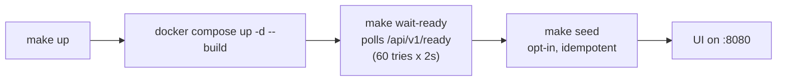
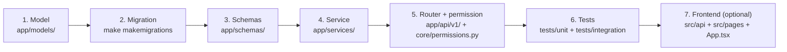

# NexusOps Developer Guide

How to set up a workstation, run the stack, work in the backend and frontend codebases,
manage database migrations, and debug. Every command below comes from the repo's
`Makefile`, `frontend/package.json`, or `docker-compose.yml` — run `make help` for the
full target list (it is the default make goal).

Companion docs: [architecture.md](architecture.md) (system design),
[api.md](api.md) (HTTP surface), [deployment.md](deployment.md) (production),
[troubleshooting.md](troubleshooting.md) (symptom → fix runbook),
[agent.md](agent.md) (host agent).

---

## 1. Prerequisites

| Tool | Needed for | Notes |
| --- | --- | --- |
| Docker + Compose v2 | running the stack | The whole platform runs in containers; host installs of Postgres/Redis are not required. |
| `make` | every workflow | All orchestration goes through the `Makefile`. |
| [`uv`](https://docs.astral.sh/uv/) | backend host tooling | Tests, lint, migrations. Pins Python via `backend/.python-version` (3.13). |
| Node.js | frontend host tooling | The frontend image builds on `node:22-alpine` (`frontend/Dockerfile`); use Node 22 locally. `npm` ships with it. |
| Playwright Chromium | `make e2e` | Installed automatically by the `e2e` target. |

`uv` and Node are only needed for host-run tooling. If you never run tests, lint, or
migrations from the host, Docker and make are enough.

---

## 2. First-time setup

```bash
git clone <your-fork> nexusops && cd nexusops

cp .env.example .env          # then edit (see section 3)

./scripts/generate_secrets.sh # writes JWT_SECRET + ENCRYPTION_KEY into .env

make install                  # backend: uv sync — frontend: npm install
make up                       # build images, start, wait for readiness, seed
```

Open **http://localhost:8080** and sign in as the seeded admin
(`admin@nexusops.example.com`). The deterministic password below is what an
`ENVIRONMENT=test` seed sets:

```
admin@nexusops.example.com / nexusops-admin
```

> **Seeded credentials are development-only.** They are created by
> `backend/scripts/seed.py`, which refuses to run against
> `ENVIRONMENT=production`, requires explicit opt-in
> (`NEXUSOPS_ALLOW_SEED=1` — the `make seed` / `make up` targets set it) outside
> `ENVIRONMENT=test`, and is idempotent: it skips when any user already exists.
> In `ENVIRONMENT=test` the deterministic pair above is what makes the pytest
> and E2E suites reproducible. Outside the test environment the seed instead
> generates a **random one-time password and prints it once on stderr** — use
> that if your seed run printed one. A bare `docker compose up` auto-migrates
> but never seeds, so production instances never contain default credentials.

`make install` runs two things and nothing else:

```makefile
cd backend && uv sync      # creates backend/.venv with runtime + dev extras
cd frontend && npm install
```

The backend dev extras (pytest, pytest-asyncio, pytest-cov, ruff, mypy, faker) are
declared in `backend/pyproject.toml` under `[project.optional-dependencies].dev`.

---

## 3. Environment configuration

All configuration flows through `.env` (repo root) into
`backend/app/core/config.py`, a pydantic-settings model. Invalid configuration
aborts process startup with a readable message (`fail_on_bad_config()`), so a typo
shows up immediately, not on the first request. Copy `.env.example` and adjust.

### Required to change

| Variable | Why |
| --- | --- |
| `POSTGRES_PASSWORD` | Compose fails fast with `set POSTGRES_PASSWORD in .env` if unset. |
| `JWT_SECRET` | Must be ≥ 32 chars (validated at startup). `openssl rand -hex 32`. |
| `ENCRYPTION_KEY` | Must be a valid Fernet key (validated at startup). Encrypts secret values at rest — **rotating it permanently destroys every stored secret value**. `./scripts/generate_secrets.sh` writes both keys and refuses to overwrite existing real values without `--force` (it prints the blast radius first). |

### Behavioral knobs

| Group | Variables | Effect |
| --- | --- | --- |
| Core | `ENVIRONMENT`, `LOG_LEVEL` | `ENVIRONMENT=production` disables OpenAPI/Swagger, forces `Secure` auth cookies, and trims error detail (see `app/main.py` `docs_enabled`, `Settings.cookies_secure`). `LOG_LEVEL`: TRACE…CRITICAL. |
| Database | `POSTGRES_*`, `DATABASE_URL`, `DB_POOL_SIZE`, `DB_MAX_OVERFLOW` | If `DATABASE_URL` is unset it is assembled from the `POSTGRES_*` parts. Must be a `postgresql+psycopg://` (psycopg3) URL. |
| Redis | `REDIS_URL` | Broker, result backend, cache, and WS pub/sub transport. |
| Auth | `ACCESS_TOKEN_TTL_MINUTES` (15), `REFRESH_TOKEN_TTL_DAYS` (14), `CORS_ORIGINS`, `LOGIN_MAX_ATTEMPTS` (5), `LOGIN_LOCKOUT_SECONDS` (900) | Short JWT access tokens held in SPA memory; opaque refresh tokens in an HttpOnly SameSite=Strict cookie. `CORS_ORIGINS` is a comma list, no trailing slash. |
| Simulation | `SIMULATION_MODE` | `true` (the `.env.example` default) makes everything laptop-runnable: simulated agents emit heartbeats and deterministic sine-wave metrics, Docker containers and deployments are simulated, monitors probe simulated targets. The UI shows a **SIMULATION MODE** badge while active. |
| Monitoring cadence | `SERVER_OFFLINE_AFTER_SECONDS` (90), `MONITOR_DISPATCH_INTERVAL_SECONDS` (10), `METRICS_AGGREGATION_INTERVAL_SECONDS` (60), `RAW_METRIC_RETENTION_HOURS` (24), `HOURLY_METRIC_RETENTION_DAYS` (30) | Read by the Celery beat schedule in `backend/app/tasks/celery_app.py`. |
| SMTP | `SMTP_HOST`, `SMTP_PORT`, `SMTP_FROM`, … | In compose `SMTP_HOST=mailpit`; mail lands in Mailpit (section 9.3). |
| Network guard | `ALLOW_PRIVATE_TARGETS` | `true` in dev so monitors/webhooks may target private networks. Tests force `false` regardless (see `backend/tests/conftest.py`). |
| HTTP server | `API_HOST`, `API_PORT`, `API_WORKERS` | Uvicorn settings; compose passes `--workers ${API_WORKERS:-2}`. |
| Frontend | `VITE_API_BASE_URL`, `VITE_WS_BASE_URL` | Build-time constants for the SPA. |
| Host ports | `NEXUSOPS_HTTP_PORT` (8080), `NEXUSOPS_VITE_PORT` (5173), `NEXUSOPS_POSTGRES_PORT` (5433), `NEXUSOPS_REDIS_PORT` (6390), `NEXUSOPS_MAILPIT_HTTP_PORT` (8025) | Change these if the defaults collide with other services on your machine. |

Two variables you will meet but not put in `.env`:

- `NEXUSOPS_ALLOW_SEED=1` — opt-in flag the Makefile sets when invoking the seed script.
- `RUN_MIGRATIONS_ON_START` — compose-internal; the API container migrates on start,
  the worker/scheduler set it to `false` and wait for the API to become healthy
  (`docker-compose.yml`, `backend/docker-entrypoint.sh`).

---

## 4. Running the stack

### 4.1 `make up` — production-shaped stack

```bash
make up
```

This is the target to use for day-to-day development. It chains three steps:



What compose starts (all defined in `docker-compose.yml`):

| Service | Image / build | Role |
| --- | --- | --- |
| `postgres` | `postgres:17-alpine` | `127.0.0.1:5433 → 5432`, healthchecked with `pg_isready`. |
| `redis` | `redis:7-alpine` | `127.0.0.1:6390 → 6379`, no persistence (`--appendonly no --save ""`). |
| `mailpit` | `axllent/mailpit:v1.24` | SMTP sink + web UI on `127.0.0.1:8025`. |
| `api` | `backend/Dockerfile` | Uvicorn, `--workers ${API_WORKERS:-2} --proxy-headers`. Entrypoint applies migrations, then healthchecks `/health`. |
| `worker` | same image | `celery … worker --concurrency=4 --max-tasks-per-child=200`. Healthchecked with a `celery inspect ping` targeted at its own node (`CMD-SHELL` so `$HOSTNAME` expands at check time). |
| `scheduler` | same image | `celery … beat` — periodic cadences only (section 9.4). |
| `frontend` | `frontend/Dockerfile` (target `runtime`) | nginx serving the built SPA bundle. |
| `nginx` | `nginx/Dockerfile` | The edge on `:8080`: `/api/` → `api:8000` (WebSocket upgrade headers, `proxy_buffering off`), everything else → the SPA container. |

Dependency ordering matters: worker and scheduler start only after the **API is
healthy**, which guarantees migrations have been applied by the API entrypoint.

Useful variants (all real targets):

```bash
make build          # build all images without starting them
make wait-ready     # block until GET /api/v1/ready passes
make logs           # tail all service logs
make down           # stop (keeps the pgdata volume)
make clean          # stop AND delete volumes — DESTRUCTIVE, all data lost
```

### 4.2 `make dev` — hot-reload profile (currently incomplete)

`make dev` overlays `docker-compose.dev.yml` on the base compose file, which is
meant to give you: `uvicorn --reload` for the API, a `watchfiles`-wrapped Celery
worker, DEBUG logging, code bind-mounts, and a Vite dev server on `:5173` instead
of the built bundle.

**Known limitation, documented honestly:** at the time of writing this profile does
not start cleanly.

- The overlay builds the frontend with `target: develop`, but
  `frontend/Dockerfile` defines only `build` and `runtime` stages — the `develop`
  target does not exist, so the build fails.
- The overlay bind-mounts `./nginx/dev.conf` over the nginx template, but `nginx/`
  contains only `default.conf.template` and a `Dockerfile`. On Linux, Docker
  materializes the missing source as an empty directory, leaving nginx without a
  usable config (also noted in `docs/troubleshooting.md` §13).

Until those two land, use `make up` and run Vite on the host instead — it is wired
for exactly that:

```bash
cd frontend && npm run dev    # vite on :5173, strictPort
```

`frontend/vite.config.ts` proxies everything under `/api` (WebSockets included) to
`http://127.0.0.1:8080` — the nginx edge of your `make up` stack — so the host dev
server and the production-shaped stack behave identically.

---

## 5. Backend workflow

All backend commands run from `backend/` with uv (`cd backend && uv run …`).
The package layout is described in [architecture.md](architecture.md); in short:
`app/api/v1/` (routers) → `app/services/` (business logic) → `app/models/`
(SQLAlchemy 2 async ORM), with cross-cutting concerns in `app/core/`.

### 5.1 Tests

```bash
make test-backend-unit    # cd backend && uv run pytest -m "not integration"
make test-backend         # full suite; needs dockerized Postgres + Redis running
make test                 # unit backend + frontend vitest — no services needed
```

- **Unit-only** (`-m "not integration"`) needs no external services. These cover
  schemas, the SSRF guard, the permission registry, security helpers, pagination,
  the simulated Docker provider, and the monitor transport (`backend/tests/unit/`).
- **The full suite** runs integration tests against real Postgres and Redis. The
  Makefile wires them to the dockerized instances:

  ```makefile
  DATABASE_URL=postgresql+psycopg://…@127.0.0.1:5433/nexusops
  REDIS_URL=redis://127.0.0.1:6390/0
  ```

  so `make up` (or at least `docker compose up -d postgres redis mailpit`) must be
  running first. `backend/tests/conftest.py` repoints the suite at a dedicated
  `nexusops_test` database and Redis index 1, forces `ENVIRONMENT=test`,
  `SIMULATION_MODE=true` and `ALLOW_PRIVATE_TARGETS=false`, and reads credentials
  from the repo `.env` — values are never printed. The integration bootstrap
  (`backend/tests/integration/conftest.py`) creates the test database, applies
  migrations once per session, truncates and re-seeds the RBAC registry between
  tests, and provides `client` (httpx against the ASGI app), `db`, and `owner`
  fixtures.
- Pytest configuration lives in `backend/pyproject.toml`:
  `asyncio_mode = "auto"`, `--strict-markers`, and the single custom marker
  `integration: requires PostgreSQL + Redis`. `DeprecationWarning` raised from
  `app.*` code is an error — fix the source, do not filter it.
- The suite collects roughly 350 test cases today (unit + integration; integration
  tests are parametrized, so a handful of functions cover many scenarios).

> **Gotcha:** the Makefile builds `DATABASE_URL` from the shell environment
> (`$POSTGRES_PASSWORD`, default `change-me-postgres`) — it does **not** read your
> `.env`. If you changed the password, export it first (`set -a; source .env; set +a`)
> or run `make test-backend` with the variable set inline. The same applies to
> `make migrate`, `make makemigrations`, and `make seed`.

### 5.2 Lint, format, typecheck

```bash
make lint             # ruff check + ruff format --check (backend), eslint (frontend)
make format           # ruff format + ruff check --fix on app/ scripts/ tests/
make typecheck        # mypy (backend) + tsc --noEmit (frontend)
```

Backend tooling configuration, all in `backend/pyproject.toml`:

- **ruff**: `line-length = 100`, `target-version = "py313"`, rule set
  `E, W, F, I, B, UP, S, ASYNC, RUF`. `B008` (FastAPI `Depends()` defaults) and
  `S101` (asserts) are intentionally ignored; tests get the `S105–S107` ignores.
- **mypy**: `python_version = 3.13`, the `pydantic.mypy` plugin,
  `strict_optional = true`, `disallow_untyped_defs = false` (gradual typing),
  migrations excluded.

---

## 6. Frontend workflow

React 18 + TypeScript + Vite, TanStack Query for server state, react-router v7.
All commands come from `frontend/package.json`:

```bash
cd frontend
npm run dev         # vite dev server on :5173 (strictPort), /api proxied to :8080
npm run build       # tsc --noEmit && vite build  — type errors fail the build
npm test            # vitest run
npm run test:watch  # vitest in watch mode
npm run lint        # eslint . --max-warnings=0  (warnings fail)
```

`make test-frontend`, `make lint-frontend`, and `make typecheck-frontend` wrap the
same scripts (the latter is `npx tsc --noEmit`).

Layout: pages live in `frontend/src/pages/` (one component + one colocated
`*.test.tsx` each), the typed HTTP client in `frontend/src/api/client.ts` (access
token in module memory only, renewed via the HttpOnly refresh cookie), shared types
in `frontend/src/api/types.ts`, routes in `frontend/src/App.tsx`.

Vitest is configured inside `vite.config.ts`: jsdom environment, globals on, setup
file `src/test/setup.ts` (jest-dom matchers + cleanup), and `e2e/**` excluded so
Playwright owns the end-to-end specs. The page-test pattern mocks the API client
and auth context, then renders the page inside `MemoryRouter` +
`QueryClientProvider` — see `frontend/src/pages/MonitorListPage.test.tsx` for the
reference example.

### End-to-end tests

```bash
make up     # stack must be running, migrated, and seeded
make e2e    # cd frontend && npx playwright install chromium; npx playwright test
```

`frontend/playwright.config.ts`: single worker, no parallelism, 120 s test timeout,
base URL `http://127.0.0.1:8080`, trace + screenshots retained on failure, HTML
report written but never auto-opened (`npx playwright show-report` to view it).
The journey (`frontend/e2e/journey.spec.ts`) drives the real UI through the edge
against a `SIMULATION_MODE=true` stack; `frontend/e2e/fixtures.ts` bootstraps an
authenticated API context before any test touches the browser: it logs in with
the fixed test pair from §2 and only falls back to first-user registration on a
completely fresh database. A database seeded under the default
`ENVIRONMENT=development` has a random admin password, so set
`ENVIRONMENT=test` in `.env` before `make up` when you intend to run E2E —
otherwise the login fails and the fallback register is rejected with
`INVITATION_REQUIRED` (users already exist).

---

## 7. Alembic migrations

Migrations live in `backend/alembic/versions/`. Two Makefile targets drive them
from the host, against the dockerized Postgres (port 5433 — the stack must be up):

```bash
make migrate                          # alembic upgrade head
make makemigrations m="add widgets"   # alembic revision --autogenerate -m "add widgets"
```

How autogenerate is wired (`backend/alembic/env.py`):

1. `target_metadata` is `Base.metadata` from `app.models` — importing that package
   registers **every** model table. This is why a new model must be exported in
   `backend/app/models/__init__.py` (section 8, step 1): if it is not imported
   there, autogenerate cannot see it.
2. The database URL is resolved at runtime from app settings via
   `sync_database_url()` (`app/core/db.py`) — credentials never live in
   `alembic.ini`. `get_settings()` is called first so invalid config fails fast.
3. `compare_type=True` and `compare_server_default=True` are on, so type and
   server-default drift are detected, not just table/column adds and drops.
4. Revision files are named `YYYYMMDD_HHMM-<rev>_<slug>.py` (`alembic.ini`
   `file_template`).

Workflow: change the model → `make makemigrations m="…"` → **read the generated
revision** (autogenerate is a first draft; data migrations and enum backfills are
always hand-written) → `make migrate`. The API container re-applies
`alembic upgrade head` on every start via `backend/docker-entrypoint.sh`, so a
fresh `docker compose up` is always at head. Check drift with
`alembic current` / `alembic heads` (see `docs/troubleshooting.md` §7 for the
container-side variant).

The single initial revision is
`backend/alembic/versions/20260823_2225-b5866787bde4_initial_schema.py`.

---

## 8. Adding a new resource: the full checklist

A "resource" is anything with an API surface — the repo's convention is a thin
router delegating to a service, with authorization as data. Walk the layers in
order; each step references the file you touch and a real exemplar to copy
(`Monitor` is used throughout).



**1. Model** — `backend/app/models/<domain>.py`. Inherit `Base` (table name is
auto-derived, constraint names follow the `NAMING_CONVENTION` in
`app/models/base.py`) plus `TimestampMixin` where appropriate; use the
`uuid_pk()` / `big_serial_pk()` column helpers. Exemplars:
`Monitor` in `app/models/observability.py`, `Server` in `app/models/infra.py`.
**Export the class from `backend/app/models/__init__.py`** — Alembic autogenerate
only sees metadata registered by that import.

**2. Migration** — `make makemigrations m="add <resource>"`, review the generated
file under `backend/alembic/versions/`, then `make migrate`.

**3. Schemas** — `backend/app/schemas/<resource>.py`. Request models
(`<Resource>Create`, `<Resource>Update`) and one `<Resource>Out` response model,
subclassing `APIModel` / `OutModel` from `app/schemas/base.py` (pydantic v2,
`from_attributes=True` for ORM validation). Exemplar: `app/schemas/monitor.py`.

**4. Service** — `backend/app/services/<resource>_service.py`. All business rules
and queries live here; keep routers thin (see how `app/api/v1/monitors.py`
delegates to `monitor_service`). Follow the house pattern: write an audit entry via
`app/services/audit_service.py` and emit a domain event via
`app/services/event_bus.py` on state changes.

**5. Router + permission** — `backend/app/api/v1/<resource>.py` with
`APIRouter(prefix="/<resource>", tags=["<resource>"])`. Gate endpoints with the
`require_permission(...)` dependency factory (`app/api/deps.py`), which returns 403
`PERMISSION_DENIED` — never role-name checks. Two registrations are required:

- Add the codenames (`<resource>.read`, `<resource>.manage`, …) to the
  `PERMISSIONS` registry in `app/core/permissions.py`, and grant them to the
  appropriate rows of `ROLE_MATRIX` (the five built-in roles; `Owner` holds the
  wildcard `*`).
- Add the module to the tuple in `_include_routers()` in `backend/app/main.py` —
  router inclusion is explicit, not automatic.

  Remember that **permissions are data**: `backend/scripts/seed.py` inserts
  `PERMISSIONS` rows into the database, and role assignment validates against the
  DB rows (`PERMISSIONS_NOT_SEEDED` conflict in `app/services/role_service.py`).
  On an existing database, re-seed (`make clean && make up` in dev) or write a data
  migration that inserts the new rows.

**6. Tests** — `backend/tests/unit/test_<resource>.py` for pure logic (schemas,
validators) and `backend/tests/integration/test_<resource>.py` for anything that
touches the database or the API (marked `integration`; use the `client`, `db`, and
`owner` fixtures). Run `make test-backend-unit` for the fast loop and
`make test-backend` for the real thing.

**7. Frontend (optional)** — add the response types to
`frontend/src/api/types.ts`, the page in `frontend/src/pages/` with a colocated
`.test.tsx`, and the route in `frontend/src/App.tsx`.

---

## 9. Debugging toolkit

### 9.1 Logs

```bash
make logs                        # tail everything
docker compose logs -f api       # just the API
docker compose logs -f worker scheduler
```

Logging is structured (structlog, configured in `app/core/logging.py`). The
`RequestIDMiddleware` is registered outermost in `app/main.py`, so every log line —
and every error envelope (`app/core/errors.py`:
`{"error": {"code", "message", "request_id"}}`) — carries a request id. To trace
one failed request: grab `request_id` from the API response and
`docker compose logs api | grep <request_id>`.

### 9.2 Health endpoints

| Endpoint | Mounted at | Meaning |
| --- | --- | --- |
| Liveness | `/health`, `/liveness`, and `/api/v1/liveness` | Process is up; no dependency checks. |
| Readiness | `/api/v1/ready` | Runs `SELECT 1` against Postgres and a Redis `PING`; returns 503 with a per-component breakdown (`database`, `redis`) when either fails. |
| Edge probe | `/health` on :8080 | nginx answers `edge ok` without touching upstreams. |

`make wait-ready` polls `/api/v1/ready` (60 tries × 2 s) and is what `make up`
blocks on. OpenAPI/Swagger: `GET /api/v1/openapi.json` and the Swagger UI at
`/api/docs` — both are **disabled when `ENVIRONMENT=production`**.

### 9.3 Mailpit (email in development)

All outbound email goes to the Mailpit container (`SMTP_HOST=mailpit` is set by
compose). Inspect messages in the web UI at **http://localhost:8025** — password
resets, notifications, anything the `notification_service` sends.

Limitation to know: Mailpit's SMTP port (1025) is **not** published to the host —
only the UI port (8025) is mapped, so host-run scripts cannot send mail into the
sink directly (`docs/troubleshooting.md` §10).

### 9.4 Background jobs

The Celery beat schedule (`backend/app/tasks/celery_app.py`) runs fixed ticks only;
tasks claim due rows with `FOR UPDATE SKIP LOCKED` so multiple workers never
double-process. What you will see in worker logs:

| Cadence | Task | Purpose |
| --- | --- | --- |
| 15 s | `nx.sweep_servers` | Mark servers OFFLINE after `SERVER_OFFLINE_AFTER_SECONDS` without a heartbeat. |
| `MONITOR_DISPATCH_INTERVAL_SECONDS` (10 s) | `nx.run_due_monitors` | Dispatch due monitor checks. |
| 30 s | `nx.sync_docker_hosts` | Reconcile Docker host/container state. |
| 120 s | `nx.sweep_deployments` | Time out / finalize stuck deployments. |
| 60 s | `nx.retry_notifications` | Retry failed notification deliveries. |
| 600 s | `nx.expire_sessions` | Expire stale user sessions. |
| `METRICS_AGGREGATION_INTERVAL_SECONDS` (60 s) | `nx.aggregate_metrics` | Roll raw metrics into hourly snapshots. |
| every 15 min (cron) | `nx.trim_logs` | Enforce metric/log retention. |
| 20 s | `nx.simulation_tick` | Drives the simulated fleet; inert unless `SIMULATION_MODE=true`. |

### 9.5 Live streams

The WebSocket hub (`app/ws/hub.py`, endpoint `/api/v1/ws`) multiplexes these
channels: `global`, `server-metrics`, `container-logs`, `deployment-logs`,
`incidents`. The SPA consumes them through `frontend/src/hooks/useEventStream.ts`.
When a live view looks stale, check the browser console for the hub reconnect and
the nginx edge log — the edge sets long `proxy_read_timeout` (3600 s) and
`proxy_buffering off` for `/api/` precisely for these streams.

---

## 10. Known limitations (read before you file a bug)

- **`make dev` does not currently start cleanly** — missing `develop` stage in
  `frontend/Dockerfile` and missing `nginx/dev.conf` (section 4.2). Use
  `make up` + host `npm run dev`.
- **Seed credentials differ by environment** — deterministic
  `admin@nexusops.example.com / nexusops-admin` only in `ENVIRONMENT=test`; other
  non-production seeds generate and print a one-time password (section 2).
- **Mailpit SMTP is container-internal** — no host-side SMTP endpoint by default.
- **No browser bootstrap after seeding** — `POST /auth/register` only creates an
  account while the users table is empty. If someone registers first, the seeded
  admin will never exist on that database; reset with `make clean && make up`
  (details in `docs/troubleshooting.md` §13).
- **The Makefile does not source `.env`** — host targets that need database
  credentials build them from shell variables (section 5.1 gotcha).

---

## 11. When things break

The symptom → cause → fix runbook lives in [troubleshooting.md](troubleshooting.md).
The sections you will hit most often as a developer:

| Symptom | Runbook section |
| --- | --- |
| API container unhealthy on first boot | §2 |
| Worker stays unhealthy (`celery inspect ping`) | §3 |
| Login returns 422 instead of "invalid credentials" | §4 |
| Port conflicts on 8080 / 5433 / 6390 / 8025 / 5173 | §5 |
| `make up` fails with "API did not become ready in time" | §6 |
| Database out of sync (migrations) | §7 |
| E2E suite fails | §8 |
| Host scripts cannot reach Postgres / Redis | §9 |
| Mailpit UI shows no email | §10 |
| Seeded admin locked out after failed logins | §11 |
| Session drops after every reload | §12 |
