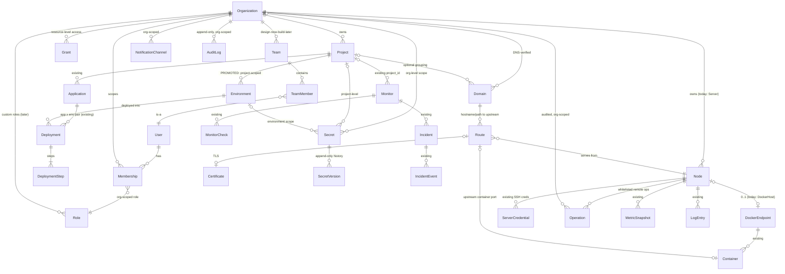

# Domain Model — NexusOps as a Multi-Tenant Platform

**Status:** Proposal for review — not yet approved for implementation.
**Date:** 2026-09-20
**Companions:** [platform-vision.md](platform-vision.md) · [multi-tenancy.md](multi-tenancy.md) · [authorization.md](authorization.md)

## 0. Design stance

This model is an **evolution of the existing schema, not a rewrite**. Concepts marked
"existing" survive as-is; the design adds an org layer, promotes one concept
(Environment), and adds new subsystems (Domains/Routing, Certificates, Operations,
Backups). Where the current schema conflicts with the target, the migration path is
named — see [product-roadmap.md](product-roadmap.md) for phasing.

## 1. The hierarchy

```
User ──Membership──> Organization ──> Project ──> Application ──> Deployment
                        │                │
                        │                ├── Environment (project-scoped)
                        │                ├── Domain → Route → Certificate
                        │                └── Grant (resource-level access)
                        ├──> Node (today: Server) ──> DockerEndpoint ──> Container
                        ├──> Operation (whitelisted remote ops)
                        └──> BackupPolicy → BackupRun → destination
```

- **Organization is the tenant root.** Users belong to orgs via **Membership**; a
  user may belong to many orgs and switch between them. All resources hang off orgs.
- **Project is the primary work unit** — "Ymart" with its environments, services,
  domains, deployments, monitoring, logs — one place. It exists today and keeps that role.
- **Node is the machine abstraction** — the *existing `Server` entity*, exposed as
  "Node" in API/UI, extended with capabilities and operations.
- **Environment is promoted from application-scope to project-scope** (the
  "Ymart → Production" model). Applications deploy *into* environments.
- **Every tenant-scoped row carries org_id.** Enforcement is mechanical — see
  [multi-tenancy.md](multi-tenancy.md) — not scattered checks.

---

*Sections: [1.1 ER diagram](#11-er-diagram) · [2 Entities](#2-entities) · [3 Cross-cutting decisions](#3-cross-cutting-decisions)*

## 1.1 ER diagram



The diagram is normalized for clarity — `Container`, `MetricSnapshot`, `LogEntry`
hang off Node/DockerEndpoint as today; `Monitor` gains a polymorphic target
(node/container/domain/certificate/url) specified in §3.5.

## 2. Entities

### 2.1 Identity & tenancy (new)

| Entity | Table | Key fields | Notes |
|---|---|---|---|
| **Organization** | `organizations` | id, name, slug (global-unique), status, `plan` (placeholder `free`), created_by_id | Tenant root. Slug is the public handle — unique platform-wide; names may collide, slugs cannot. |
| **Membership** | `memberships` | org_id, user_id, role_id, status (`invited`/`active`/`suspended`), invited_by_id, joined_at | Unique `(org_id, user_id)`. Invited-but-not-active members have zero access. |
| **Role** | `roles` | **org_id (nullable = system template)**, name, permissions JSONB | Reuses existing `roles`/`permissions` tables. System templates (Owner/Admin/Operator/Developer/Viewer) are `org_id IS NULL` rows seeded from `ROLE_MATRIX`; v1 orgs reference system roles; org custom roles (org_id rows, permissions ⊆ registry) come later. Wildcard `*` already supported by the engine. |
| **Team / TeamMember** | `teams`, `team_members` | org_id, name; (team_id, user_id) | **Design now, build later.** Org-level roles cover the 5-person example; grants make teams useful for resource-level access later. |
| **Grant** | `grants` | design-only shape: `org_id, principal (user\|team), principal_id, scope (project\|environment\|node), scope_id, role_id` | "Ali deploys staging but not production" = Developer org-role + Grant(staging-env → Operator). Effective permissions = org role ∪ grants, resolved in ONE place. Implementation phase: roadmap. |
| **ApiKey** | `api_keys` | existing + org binding | API keys bind to ONE org; `org = key.org_id` (active-org header ignored for key auth). Per-org automation identities; scopes via existing `scope_matches` wildcards. Revocation kills one automation identity only. |

### 2.1.1 ApiKey org binding detail

A user's key bound to org A cannot touch org B: the key's org *replaces* the
active-org header, and an `active` membership in that org is required. Consequences:

1. Automation keys are per-org automation identities — one key per purpose
   (deploy bot, backup bot), never a shared personal key.
2. Key revocation kills that automation identity only.

### 2.2 Delivery (existing models, extended)

| Entity | Table | Changes | Notes |
|---|---|---|---|
| **Project** | `projects` | + **org_id**; name unique→ per-org unique; + `config` JSONB (Phase 2 — the base layer of deploy config layering) | `owner_id` gets no new access meaning: under orgs, access is governed by membership role; owner_id becomes historical creator (kept for audit, not an access gate). |
| **Application** | `applications` | none (org via project) | Deployable unit; build_config stays metadata. |
| **Environment** | `deployment_environments` | **PROMOTED: application_id → project_id**, + environment_type (dev/staging/prod), node_id | The ONE structural delivery change. See §2.2.1. |
| **Deployment** | `deployments` | + org_id (denormalized for fast org listings), + node_id stamp | Keeps `(application_id, environment_id)` pair — "deployed what into where". `number` stays per-application. |
| **DeploymentStep** | `deployment_steps` | none (org via deployment) | Steps + streamed logs of a run. |

### 2.2.1 Environment promotion detail

- **Why promote:** the product model is "Project Ymart → Production" — environment is
  a property of the *project*. Per-app envs force each application to re-define
  staging/production with duplicated config; project-scoped envs give one place for
  env config + secrets, and a single anchor for environment grants ("Ali can deploy
  the staging environment of project X").
- **What moves:** `deployment_environments.application_id` becomes `project_id`
  (NOT NULL after backfill), unique `(project_id, slug)`. Where multiple apps in one
  project had same-named envs, they merge into one project env; slug collisions get
  a `production-2` suffix during migration.
- **Deployment rows keep** `(application_id, environment_id)` — the pair now means
  "application deployed into project environment".
- **Config layering:** project config ⊕ environment config ⊕ deploy-time secret
  refs (`${secret:KEY}`) — most specific wins. Full specification in
  [deployment-architecture.md](deployment-architecture.md).

### 2.3 Infrastructure — Nodes

| Entity | Table | Changes | Notes |
|---|---|---|---|
| **Node** | `servers` (kept) | + **org_id**, + capabilities JSONB, + facts columns | The existing `Server` — exposed as **Node** in API/UI (paths `/nodes`, codenames `node.*`). Table keeps its name initially to avoid FK churn; rename to `nodes` in a later cleanup phase. |
| **DockerEndpoint** | `docker_hosts` (kept) | none (org via node) | Existing 0..1 relation to a machine. Agent-backed nodes create theirs automatically; TCP-socket nodes configure theirs manually. Exposed as part of the Node resource. |
| **Container** | `containers` | none (org via node) | Inventory + stats + logs; heartbeat upsert with savepoint race handling. |
| **ServerCredential** | `server_credentials` | none (org via node) | Fernet-encrypted SSH credentials; basis for future SSH-based ops. |
| **Operation** | `operations` (new) | org_id, node_id, type (whitelist), params JSONB, status, requested_by_id, result, timestamps | The remote-ops primitive: agent PULLS ops; never a push tunnel. Types in v1: container lifecycle, log tail, nginx render/apply/reload. Every op is permission-gated and audited. Spec: [node-agent-architecture.md](node-agent-architecture.md). |

### 2.4 Routing & TLS (new subsystem)

| Entity | Table | Key fields | Notes |
|---|---|---|---|
| **Domain** | `domains` | org_id, project_id?, name (uq per org), status, verified_at, verification token, dns_provider_id? | Ownership proven via DNS TXT record before routes go live (anti-takeover). |
| **Route** | `routes` | org_id, domain_id, hostname, path, node_id, container_id?, port, scheme, certificate_id?, headers/rate-limit JSONB, enabled | hostname+path → upstream. A route's upstream may be a container (usual case) or an external upstream. |
| **Certificate** | `certificates` | org_id, primary CN, SANs, status, issued_at, expires_at, challenge type, auto_renew, encrypted key+chain (ciphertext columns) | Issued via ACME (DNS-01 first). Private keys never leave the control plane except encrypted delivery to the serving node. Spec: [certificate-management.md](certificate-management.md). |
| **ProxyProvider** | — | interface only | Nginx first: renders config, ships via agent operation, validates (`nginx -t`), applies atomically with rollback. Spec: [domain-routing.md](domain-routing.md). |

### 2.5 Secrets (existing, re-scoped)

| Entity | Table | Changes | Notes |
|---|---|---|---|
| **Secret** | `secrets` | + org_id; scope via (org_id, project_id?, environment_id?) | Today: global or project-scoped. Target: org / project / environment layered scope. |
| **SecretVersion** | `secret_versions` (new) | secret_id, version, ciphertext, created_by_id, created_at | Append-only history — rotation today overwrites in place; version rows enable audit + rollback of a rotation. |

### 2.6 Observability (existing, org-scoped via parents)

| Entity | Table | Changes | Notes |
|---|---|---|---|
| **Monitor** | `monitors` | + org_id; + target polymorphism (target_type, target_id) | Today URL-only; target becomes node/container/domain/certificate/url. Domain routes auto-create uptime+TLS-expiry monitors (opt-out). |
| **MonitorCheck / Incident / IncidentEvent** | existing | + org_id on incidents (fast listings) | Pipeline unchanged. |
| **MetricSnapshot / LogEntry** | existing | org via node/container | High-volume tables keep bigserial PKs. |
| **NotificationChannel** | `notification_channels` | + org_id | Existing encrypted config, delivery records, retries unchanged. |
| **AuditLog** | `audit_logs` | + org_id, + request_id | Append-only stays. Action naming: `resource.action`. |
| **SystemEvent** | `system_events` | + org_id | Feed of everything; org-scoped. |

### 2.7 Platform ops (new subsystems, design-only in early phases)

| Entity | Table | Key fields | Notes |
|---|---|---|---|
| **BackupPolicy / BackupRun / BackupDestination** | `backup_policies`, `backup_runs`, `backup_destinations` | org_id, scope (node/volume/database), schedule, retention; run: status, artifact, checksum, verify | Spec: roadmap Phase 8. Destinations: S3-compatible via provider interface. |
| **Integration** | `integrations` | org_id, kind (dns/cloudflare, s3, slack, github...), encrypted credentials | The home for DNS-provider creds used by DNS-01, S3 creds, source hosts. |
| **Plan / UsageCounter** | org row + `usage_counters` | plan on org; counters per dimension per period | Billing attaches to the Organization. Placeholder columns in Phase 1; enforcement in the billing phase. |

## 3. Cross-cutting decisions

1. **One registry, one gate.** Every capability is a codename in
   `backend/app/core/permissions.py`; `require_permission()` stays the only
   enforcement point. New codenames: `node.*` (rename from `server.*`), `member.*`,
   `org.manage`, `domain.*`, `certificate.*`, `backup.*`, `operation.read` —
   full matrix in [authorization.md](authorization.md).
2. **org_id + session-scoped guard.** Mechanical tenancy: all tenant tables get
   org_id; a session-scoped query guard (SQLAlchemy `with_loader_criteria`) applies
   the active org to every SELECT automatically. Direct-ID reads go through scoped
   helpers. Spec: [multi-tenancy.md](multi-tenancy.md).
3. **Node = Server, renamed at the surface.** No duplicate machine concept.
   DockerEndpoint stays a separate row (it models a *connection* to docker, not the
   machine) but is exposed as part of the Node resource.
4. **Environment is project-scoped.** One structural delivery change; everything
   else in delivery survives as-is.
5. **The agent pulls; the platform never pushes commands.** Remote operations are
   Operation rows the agent fetches, executes against a whitelist, and reports.
   No shell, no tunnel — see [node-agent-architecture.md](node-agent-architecture.md).
6. **Providers at every vendor seam.** Docker, nginx, ACME, DNS, S3, git, registries
   are interfaces with one first implementation each.
7. **Secrets minimization for nodes.** A node receives only the secrets referenced
   by routes/services actually assigned to it — never the org's secret store.
8. **Billing attaches to Organization** — plan placeholder + metering counters from
   the start; enforcement later.
9. **Everything user-visible is org-scoped** — search, events, audit, WS channels,
   notifications, metrics, logs. No global endpoints for tenant data.
