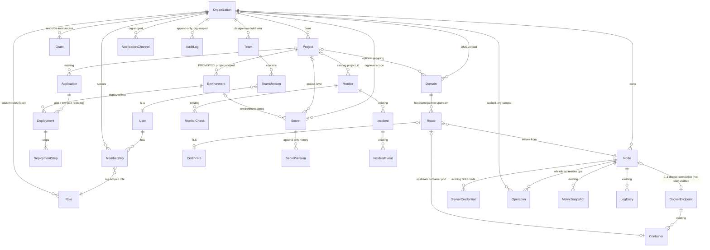

# Domain Model — NexusOps as a Multi-Tenant Platform

**Status:** Partly implemented. The tenant layer (`Organization`, `Membership`,
`org_id` ownership, RLS) shipped with Phase 1, and **Phase 2 shipped the delivery
promotion**: `Environment` is project-scoped, `Project.config` exists,
configuration layers project ⊕ environment, and `Secret`/`SecretVersion` carry
org/project/environment scope with append-only history. The later-phase entities
in this document (Domains, Certificates, Backups, Grants, Teams, Plan) remain
design.
**Date:** 2026-09-20 (tenant layer implemented 2026-09-24; delivery promotion
implemented 2026-10-08, migration `b2c3d4e5f6a7`)
**Companions:** [platform-vision.md](platform-vision.md) · [multi-tenancy.md](multi-tenancy.md) · [authorization.md](authorization.md)

## 0. Design stance

This model is an **evolution of the existing schema, not a rewrite**. Concepts marked
"existing" survive as-is; the design adds an org layer, promotes one concept
(Environment), and adds new subsystems (Domains/Routing, Certificates, Operations,
Backups). Where the current schema conflicts with the target, the migration path is
named — see [product-roadmap.md](product-roadmap.md) for phasing.

**Glossary guard — naming rules for every doc and the UI:** Node, not Server.
Application, not Service. Environment always means the project-scoped entity — never
the node's free-text tag (that field is renamed "Label", §2.2.1). An Operation is a
single whitelisted node action, never a shell; a Deployment is the numbered delivery
run that issues Operations.

> **Naming status.** The vocabulary above is the target and is used throughout this
document. The `server.*` → `node.*` **surface rename has landed** (Phase 1):
> permission codenames, API paths (`/api/v1/nodes`, with a schema-hidden
> `/api/v1/servers` alias), the SPA and docs all say Node, and migration
> `c4e2a1f7b9d3` renamed the stored permission rows and API-key scopes. The Python
> internals and the `servers` table keep their names until the cleanup phase
> (§2.3); `server_id` as a path-parameter / column name is unchanged.

## 0.1 Shipped tenant layer (Phase 1)

| Concept | Table | As built |
|---|---|---|
| **Organization** | `organizations` | The tenant root. `name`/`slug` unique, `status` (ACTIVE/SUSPENDED), `is_provisional` for the migration-provisioned tenant, `created_by_id`, `renamed_at`. A CHECK constraint forbids the reserved system uuid. RLS-exempt (it *is* the tenant) |
| **Membership** | `memberships` | `(org_id, user_id)` unique, `role_id`, `status` (ACTIVE/SUSPENDED), `created_by_id`. The role here — not `User.role_id` — is the authority inside the organization. RLS-exempt (validating `X-Org-Id` is a cross-org read) |
| **Tenant ownership** | `org_id` on every tenant table | `OrgScoped` mixin + `org_id_column()`; NOT NULL, indexed, `ON DELETE CASCADE` to `organizations`, enforced twice more (session guard, RLS `USING`/`WITH CHECK`) |
| **Instance-level identity** | `users`, `sessions`, `refresh_tokens` | Deliberately **no** `org_id`: a person belongs to many organizations and a session is a credential of the account. Their tenancy boundary is the owner's membership, applied at the API level (directory, member CRUD, session listing/revocation) |
| **Pre-org credentials** | `api_keys`, `agent_credentials` | Each row carries the `org_id` its credential is bound to, because the lookup must happen before a tenant is known; that column *is* the boundary for the request that follows |
| **Role templates** | `roles` | Instance-wide in v1: `org_id` exists but is NULL for every row (the five system roles). Custom roles are a later phase (§7) |

The backfill is deterministic and documented: existing rows are attributed to one
organization named after the instance creator, `is_provisional = true`, editable
through `PATCH /organizations/{id}` — never an arbitrary or vendor-named tenant.

## 1. The hierarchy

```
User ──Membership──> Organization ──> Project ──> Application ──> Deployment
                        │                │
                        │                ├── Environment (staging/prod)
                        │                ├── Domain → Route → Certificate
                        │                └── Grant (resource-level access)
                        ├──> Node ──> Container
                        ├──> Operation (one whitelisted node action)
                        └──> BackupPolicy → Backup → Destination
```

- **Organization is the tenant root.** Users belong to orgs via **Membership**; a
  user may belong to many orgs and switch between them. All resources hang off orgs.
- **Project is the primary work unit** — "Ymart" with its environments, applications,
  domains, deployments, monitoring, logs — one place. It exists today and keeps that role.
- **Node is the machine abstraction** — a machine with an agent, capabilities, and
  operations. Containers are what the agent observes on it.
- **Environment is promoted from application-scope to project-scope** (the
  "Ymart → Production" model). Applications deploy *into* environments.
- **Every tenant-scoped row carries org_id.** Enforcement is mechanical — see
  [multi-tenancy.md](multi-tenancy.md) — not scattered checks.

---

*Sections: [1.1 ER diagram](#11-er-diagram) · [2 Entities](#2-entities) · [3 Cross-cutting decisions](#3-cross-cutting-decisions)*

## 1.1 ER diagram


```mermaid
erDiagram
    %% Identity and tenancy
    User ||--o{ Membership : has
    Organization ||--o{ Membership : scopes
    Membership }o--|| Role : "org-scoped role"
    Organization ||--o{ Role : "custom roles (later)"
    Organization ||--o{ Team : "design-now-build-later"
    Team ||--o{ TeamMember : contains
    TeamMember }o--|| User : is-a
    Organization ||--o{ Grant : "resource-level access"

    %% Delivery
    Organization ||--o{ Project : owns
    Project ||--o{ Application : "existing"
    Project ||--o{ Environment : "PROMOTED: project-scoped"
    Application ||--o{ Deployment : "app x env pair (existing)"
    Environment ||--o{ Deployment : "deployed into"
    Deployment ||--|{ DeploymentStep : "steps"

    %% Infrastructure
    Organization ||--o{ Node : owns
    Node |o--o| DockerEndpoint : "0..1 docker connection (not user-visible)"
    DockerEndpoint ||--o{ Container : existing
    Node ||--o{ ServerCredential : "existing SSH creds"
    Node ||--o{ Operation : "whitelisted remote ops"
    Organization ||--o{ Operation : "audited, org-scoped"

    %% Routing and TLS (new subsystem)
    Organization ||--o{ Domain : "DNS-verified"
    Project |o--o{ Domain : "optional grouping"
    Domain ||--o{ Route : "hostname/path to upstream"
    Route |o--o| Certificate : TLS
    Route }o--|| Node : "serves from"
    Route |o--o| Container : "upstream container:port"

    %% Secrets
    Organization |o--o{ Secret : "org-level scope"
    Project |o--o{ Secret : "project-level"
    Environment |o--o{ Secret : "environment scope"
    Secret ||--o{ SecretVersion : "append-only history"

    %% Observability
    Project |o--o{ Monitor : "existing project_id"
    Monitor ||--o{ MonitorCheck : existing
    Monitor ||--o{ Incident : existing
    Incident ||--o{ IncidentEvent : existing
    Organization ||--o{ NotificationChannel : "org-scoped"
    Organization ||--o{ AuditLog : "append-only, org-scoped"
    Node ||--o{ MetricSnapshot : existing
    Node ||--o{ LogEntry : existing
```

The diagram is normalized for clarity — `Container`, `MetricSnapshot`, `LogEntry`
hang off Node/DockerEndpoint as today; `Monitor` gains a polymorphic target
(node/container/domain/certificate/url) specified in §3.5.

## 2. Entities

### 2.1 Identity & tenancy (new)

| Entity | Table | Key fields | Notes |
|---|---|---|---|
| **Organization** | `organizations` | id, name, slug (global-unique), status, `plan` (placeholder `free`), created_by_id | Tenant root. Slug is the public handle — unique platform-wide; names may collide, slugs cannot. |
| **Membership** | `memberships` | org_id, user_id, role_id, status (`invited`/`active`/`suspended`), invited_by_id, joined_at | Unique `(org_id, user_id)`. Invited-but-not-active members have zero access. |
| **Role** | `roles` | **org_id (nullable = system template)**, name, permissions JSONB | Reuses existing `roles`/`permissions` tables. System templates (Owner/Admin/DevOps/Developer/Viewer) are `org_id IS NULL` rows seeded from `ROLE_MATRIX`; v1 orgs reference system roles; org custom roles (org_id rows, permissions ⊆ registry) come later. Wildcard `*` already supported by the engine. |
| **Team / TeamMember** | `teams`, `team_members` | org_id, name; (team_id, user_id) | **Design now, build later.** Org-level roles cover the 5-person example; grants make teams useful for resource-level access later. |
| **Grant** | `grants` | design-only shape: `org_id, principal (user\|team), principal_id, scope (project\|environment\|node), scope_id, role_id` | "Ali deploys staging but not production" = Developer org-role + Grant(staging-env → DevOps). Effective permissions = org role ∪ grants, resolved in ONE place. Implementation phase: roadmap. |
| **ApiKey** | `api_keys` | existing + org binding | API keys bind to ONE org; `org = key.org_id` (active-org header ignored for key auth). Per-org automation identities; scopes via existing `scope_matches` wildcards. Revocation kills one automation identity only. |

### 2.1.1 ApiKey org binding detail

A user's key bound to org A cannot touch org B: the key's org *replaces* the
active-org header, and an `active` membership in that org is required. Consequences:

1. Automation keys are per-org automation identities — one key per purpose
   (deploy bot, backup bot), never a shared personal key.
2. Key revocation kills that automation identity only.

### 2.2 Delivery (existing models, extended)

| Entity | Table | Changes | Notes |
|---|---|---|---|
| **Project** | `projects` | + **org_id**; name unique→ per-org unique; + `config` JSONB (**shipped**, Phase 2 — the base layer of deploy config layering) | `owner_id` gets no new access meaning: under orgs, access is governed by membership role; owner_id becomes historical creator (kept for audit, not an access gate). |
| **Application** | `applications` | none (org via project) | The deployable unit of a project — what other tools call a *service*. There is deliberately no Service entity (the word collides with the Kubernetes mental model). Build_config stays metadata. |
| **Environment** | `deployment_environments` | **PROMOTED: application_id → project_id (shipped)**, + `environment_type` (DEV/STAGING/PROD), server_id | The ONE structural delivery change. See §2.2.1. |
| **Deployment** | `deployments` | + org_id (denormalized for fast org listings), + node_id stamp | Keeps `(application_id, environment_id)` pair — "deployed what into where". `number` stays per-application. |
| **DeploymentStep** | `deployment_steps` | none (org via deployment) | Steps + streamed logs of a run. |

### 2.2.1 Environment promotion detail — **shipped in Phase 2**

- **Why promote:** the product model is "Project Ymart → Production" — environment is
  a property of the *project*. Per-app envs force each application to re-define
  staging/production with duplicated config; project-scoped envs give one place for
  env config + secrets, and a single anchor for environment grants ("Ali can deploy
  the staging environment of project X").
- **What moved:** migration `b2c3d4e5f6a7` promoted
  `deployment_environments.application_id` to `project_id` — derived through
  `environment → application → project` — dropped the old column, and added the
  unique constraint `(project_id, slug)` plus indexes on `project_id` and
  `(project_id, environment_type)`.
- **Duplicate environment handling is deterministic** (same-named envs of two apps
  in one project): grouping is `(org_id, project_id, slug)` with more than one row,
  and the survivor is the earliest `created_at`, tie-broken by `id` — re-running
  the migration on the same data always picks the same row. The others are
  **merged into it**, never dropped:
  - every duplicate's deployments are re-pointed at the survivor *before* the
    duplicate row is deleted, so the `ON DELETE CASCADE` on
    `deployments.environment_id` never fires and **every deployment keeps
    resolving to a live environment**;
  - no scalar field is lost: `server_id` and `healthcheck_path` are filled from a
    duplicate when the survivor's value is empty, `auto_deploy` is OR-ed across
    the group, and `config` is unioned via JSONB `||` with the survivor winning a
    key clash;
  - the survivor keeps its own slug, so a merge never manufactures a
    nondeterministic `production-2`-style name. Slugs are produced by the same
    `_slugify` rule as every other project-scoped name, and the `(project_id,
    slug)` unique constraint (`uq_envs_project_slug`) rejects a genuine clash.
- **Uniqueness** is `(project_id, slug)`; slugs come from the existing project
  naming convention (`_slugify`), so `Production`, `production` and `PRODUCTION`
  in the same project collapse onto one slug and the second such request is
  rejected as a duplicate.
- **Environment kind (`environment_type`) was never recorded before Phase 2**, so
  the Phase 2 migration defaulted every legacy row to `DEV`. The Phase 2.1
  corrective migration (`d4e5f6a7b8c9`) reclassifies the unambiguous cases with a
  small, explicit, case-normalised mapping — `production`/`prod` → `PROD`,
  `staging`/`stage` → `STAGING`, `dev`/`development` and anything unknown → `DEV`
  — matching exact slug/name aliases (trimmed, case-insensitive; the slug wins
  when slug and name disagree). Migration `e5f6a7b8c9d0` makes the implementation
  match that precedence: `d4e5f6a7b8c9` used a flat `slug OR name` test and so
  typed a `staging` slug with a `production` name as `PROD`; the follow-up
  rewrites only that stale `PROD` output (leaving a value the operator has since
  set to anything else), so slug-first now holds end to end. Only rows still
  carrying the Phase 2 `DEV` default are candidates for the initial pass, so an
  operator's explicit post-Phase-2 classification is never overwritten. The
  corrections update one descriptive column in place:
  environment ids, deployments, uniqueness, organization ownership and RLS are
  untouched. `environment_type` remains descriptive only — never an authorization
  dimension.
- **Deployment rows keep** `(application_id, environment_id)` — the pair now means
  "application deployed into project environment". `application_id` is *not*
  removed: an application is the thing that deploys, the environment is where.
  The migration asserts both sides still resolve (no orphan FK).
- **API surface:** environments are created, listed, read, updated and deleted at
  `/api/v1/projects/{project_id}/environments`, gated by `project.read` /
  `project.manage`. The old application-scoped route is gone — an environment is
  never reachable through an application.
- **Name collision fixed:** `servers.environment` is a free-text tag (default
  'production', `backend/app/models/infra.py:57`) shown as an "Environment" field in
  the node form (`frontend/src/components/ServerForm.tsx:171-174`). After promotion,
  "Environment" means the project-scoped entity — the node field is renamed **Label**
  in the Phase 1 rename sweep, and the glossary guard (§0) pins the rule.
- **Config layering (shipped):** `projects.config` is the base; an environment's
  `config` holds only its **overrides**. The merge is **shallow** — a key the
  environment defines replaces the project's value, every other project key is
  inherited untouched (nested objects are replaced, never merged recursively).
  Values may reference secrets as `${secret:KEY}`, resolved at deploy time at the
  most specific scope (environment > project > organization). The three layers are
  returned separately by the environment detail endpoint so the UI can show where
  a value came from. Full specification in
  [secrets-architecture.md](secrets-architecture.md) §2/§8.

### 2.3 Infrastructure — Nodes

| Entity | Table | Changes | Notes |
|---|---|---|---|
| **Node** | `servers` (kept) | **Shipped (Phase 3):** `org_id`, `capabilities` JSONB (`{}` = unreported), `protocol_version` (`NULL` = pre-v2), `credential_revoked_at`, `agent_version`; open-ended agent telemetry lives in the existing `extra` JSONB, exposed as `facts` | The existing `Server` — exposed as **Node** in API/UI (paths `/nodes`, codenames `node.*`). Table keeps its name to avoid FK churn; rename to `nodes` in a later cleanup phase. Name is unique per organization (`uq_servers_org_name`). |
| **EnrollmentToken** | `enrollment_tokens` (shipped Phase 3, migration `a1b2c3d4e5f6`) | org_id, name, `token_hash` (SHA-256 only), `single_use`, `expires_at`, `revoked_at`/`revoked_by_id`, `used_at`/`used_by_node_id`, optional claim `node_id`, `created_by_id`, note | Organization-scoped, single-use, expiring, revocable. Raw `nxk_` token shown once at creation and never re-readable. RLS-covered + app-role grant. Consumption is a compare-and-set; the token's org determines node ownership. |
| **DockerEndpoint** | `docker_hosts` (kept) | none (org via node) | **Not user-visible** — a node's docker *connection*, never surfaced as its own object (the "Docker hosts" nav page folds into Node detail; roadmap Phase 1/3). Agent-backed nodes create theirs automatically; TCP-socket nodes configure theirs manually. The Phase 1/2 migration backfills or deletes orphan rows and makes `server_id` NOT NULL (`backend/app/models/infra.py:126-128` — it is nullable with `ondelete SET NULL` today), so "org via node" is structurally true. |
| **Container** | `containers` | none (org via node) | Inventory + stats + logs; heartbeat upsert with savepoint race handling. |
| **ServerCredential** | `server_credentials` | none (org via node) | Fernet-encrypted SSH credentials; basis for future SSH-based ops. |
| **Operation** | `operations` (shipped 2026-10-04; deadline columns added Phase 3, migration `a1b2c3d4e5f6`) | org_id, node_id, type (whitelist), params JSONB, status, requested_by_id, result, attempts, claimed_at, `available_until`, `execution_deadline`, `expires_at`, timestamps | The remote-ops primitive: agent PULLS ops from the v2 heartbeat response; never a push tunnel. RLS-covered like every tenant table. **Whitelisted and shipped:** `container.start/stop/restart/remove`, `logs.tail` — each reusing an existing codename; the reference agent now executes them through a closed registry. **Not shipped:** nginx render/apply/reload and the reserved secret/cert types. Every op is permission- and capability-gated and audited. Spec: [node-agent-architecture.md](node-agent-architecture.md). |

An **Operation is a single whitelisted action on one node**; a **Deployment is the
multi-step delivery run** that issues Operations (Phase 6a). One word each, no
overlap — Operation is not renamed to Task (collides with Celery tasks) or Action
(collides with audit `resource.action` strings).

### 2.4 Routing & TLS (new subsystem)

| Entity | Table | Key fields | Notes |
|---|---|---|---|
| **Domain** | `domains` | org_id, project_id?, name (uq per org), status, verified_at, verification token, dns_provider_id? | Ownership proven via DNS TXT record before routes go live (anti-takeover). |
| **Route** | `routes` | org_id, domain_id, hostname, path, node_id, container_id?, port, scheme, certificate_id?, headers/rate-limit JSONB, enabled | hostname+path → upstream. A route's upstream may be a container (usual case) or an external upstream. |
| **Certificate** | `certificates` | org_id, primary CN, SANs, status, issued_at, expires_at, challenge type, auto_renew, encrypted key+chain (ciphertext columns) | Issued via ACME (DNS-01 first). Private keys never leave the control plane except encrypted delivery to the serving node. Spec: [certificate-management.md](certificate-management.md). |
| **ProxyProvider** | — | interface only | Nginx first: renders config, ships via agent operation, validates (`nginx -t`), applies atomically with rollback. Spec: [domain-routing.md](domain-routing.md). |

### 2.5 Secrets (re-scoped — **shipped in Phase 2**)

| Entity | Table | Changes | Notes |
|---|---|---|---|
| **Secret** | `secrets` | + org_id; scope via (org_id, project_id?, environment_id?) | Org / project / environment layered scope, most specific wins. Resolution is fail-closed. |
| **SecretVersion** | `secret_versions` | secret_id, version, ciphertext, digest, created_by_id, created_at; uq `(secret_id, version)` | Append-only history, **enforced in the database** since Phase 2.1 (`c3d4e5f6a7b8`): the runtime role holds `SELECT`/`INSERT` only, and a guard trigger refuses `UPDATE` and any `DELETE` that is not the FK cascade from deleting the parent Secret. Rotation appends a version and moves the parent's pointer; rollback re-appends an earlier value as a **new** version. Deleting the Secret purges its versions (hard delete, no tombstone). |

Authorization stays split: `secret.read` is *metadata* only, `secret.write`
manages values, and neither is the permission that lets a deployment **consume** a
referenced secret — that is the deploy chain (`deployment.create`). No endpoint
returns a value. See [secrets-architecture.md](secrets-architecture.md) §4.

### 2.6 Observability (existing, org-scoped via parents)

| Entity | Table | Changes | Notes |
|---|---|---|---|
| **Monitor** | `monitors` | + org_id; + target polymorphism (target_type, target_id) | Today URL-only; target becomes node/container/domain/certificate/url. Domain routes auto-create uptime+TLS-expiry monitors (opt-out). |
| **MonitorCheck / Incident / IncidentEvent** | existing | + org_id on incidents (fast listings) | Pipeline unchanged. |
| **MetricSnapshot / LogEntry** | existing | org via node/container | High-volume tables keep bigserial PKs. |
| **NotificationChannel** | `notification_channels` | + org_id | Existing encrypted config, delivery records, retries unchanged. |
| **AuditLog** | `audit_logs` | + org_id, + request_id | Append-only stays. Action naming: `resource.action`. |
| **SystemEvent** | `system_events` | + org_id | Feed of everything; org-scoped. |

### 2.7 Backups, connections, billing (new subsystems, design-only in early phases)

| Entity | Table | Key fields | Notes |
|---|---|---|---|
| **BackupPolicy / BackupRun / BackupDestination** | `backup_policies`, `backup_runs`, `backup_destinations` | org_id, scope (node/volume/database), schedule, retention; run: status, artifact, checksum, verify | Spec: roadmap Phase 8. Destinations: S3-compatible via provider interface. Surfaced to users as **Policy / Backup / Destination** — a user says "a backup", not "a backup run"; `backup_runs` stays the table name. |
| **Connection** | `integrations` | org_id, kind (dns/cloudflare, s3, slack, github, …), encrypted credentials | The home for external credentials — DNS-provider creds used by DNS-01, S3 creds, source hosts. "Connection," not "Integration" (plainer word, no enterprise-speak). A `registry` kind arrives only with the private-registry design (deployment-architecture.md §6a defers it). |
| **Plan / UsageCounter** | org row + `usage_counters` | plan on org; counters per dimension per period | Billing attaches to the Organization. Placeholder columns in Phase 1; enforcement in the billing phase. |

## 3. Cross-cutting decisions

1. **One registry, one gate.** Every capability is a codename in
   `backend/app/core/permissions.py`; `require_permission()` stays the only
   enforcement point. New codenames: `node.*` (rename from `server.*`), `member.*`,
   `org.manage`, `domain.*`, `certificate.*`, `backup.*`, `operation.read` —
   full matrix in [authorization.md](authorization.md).
2. **org_id + session-scoped guard.** Mechanical tenancy: all tenant tables get
   org_id; a session-scoped query guard (SQLAlchemy `with_loader_criteria`) applies
   the active org to every SELECT automatically. Direct-ID reads go through scoped
   helpers. Spec: [multi-tenancy.md](multi-tenancy.md).
3. **Node = Server, renamed at the surface.** No duplicate machine concept.
   DockerEndpoint stays a separate row (it models a *connection* to docker, not the
   machine) but is exposed as part of the Node resource.
4. **Environment is project-scoped.** One structural delivery change; everything
   else in delivery survives as-is.
5. **The agent pulls; the platform never pushes commands.** Remote operations are
   Operation rows the agent fetches, executes against a whitelist, and reports.
   No shell, no tunnel — see [node-agent-architecture.md](node-agent-architecture.md).
6. **Providers at every vendor seam.** Docker, nginx, ACME, DNS, S3, git, registries
   are interfaces with one first implementation each.
7. **Secrets minimization for nodes.** A node receives only the secrets referenced
   by routes/applications actually assigned to it — never the org's secret store.
8. **Billing attaches to Organization** — plan placeholder + metering counters from
   the start; enforcement later.
9. **Everything user-visible is org-scoped** — search, events, audit, WS channels,
   notifications, metrics, logs. No global endpoints for tenant data.
