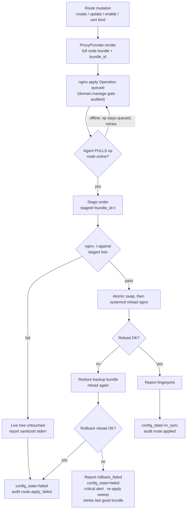

# Domain Routing — NexusOps

**Status:** Proposal for review — not yet approved for implementation.
**Date:** 2026-09-21
**Companions:** [platform-vision.md](platform-vision.md) · [domain-model.md](domain-model.md) · [multi-tenancy.md](multi-tenancy.md) · [authorization.md](authorization.md) · [node-agent-architecture.md](node-agent-architecture.md) · [certificate-management.md](certificate-management.md)

## 1. Scope and current state

Nothing in this subsystem exists today — no Domain or Route model, no DNS
verification, no nginx rendering or apply code anywhere in the backend
(platform-vision.md §1: "no domains/certificates/reverse-proxy subsystem at all";
nothing to simulate; it must be built). Everything below is a design spec for new
work (roadmap Phase 4).

**The repo's `nginx/` directory is the DASHBOARD edge, not a customer proxy.** It
proxies `/api/` → the API container and `/` → the SPA container over a single
plain-HTTP `:8080` listener (`nginx/default.conf.template:28-75`), published
loopback-only `127.0.0.1:${NEXUSOPS_HTTP_PORT:-8080}` (`docker-compose.yml:120-135`).
Its TLS block exists but is commented out and no certs are mounted
(`nginx/default.conf.template:79-108`); the production chain (Cloudflare → host
nginx → edge, `docs/deployment.md:371-425`) terminates the dashboard's own TLS
outside the repo. This edge never carries customer traffic (§2).

**The agent has no operations channel yet** — hello/heartbeat telemetry only
(`agent/nexusops_agent.py:302-494`; `backend/app/api/v1/agent.py:31-81`). The
Operation framework this spec leans on — pull-based op rows, whitelisted types, no
shell — is specified in node-agent-architecture.md (roadmap Phase 3), a hard
prerequisite for Phase 4. Nothing here is simulated *or* real: it is unbuilt.

What exists and is reused:

| Existing capability | Ground | Reuse here |
|---|---|---|
| Beat cadences + atomic claims | celery_app.py:47-93; `FOR UPDATE SKIP LOCKED` claim (monitor_service.py:293-313) | Verification + re-verification sweeps, apply fan-out |
| Append-only audit | audit_service.py:20-65 + DB trigger | `domain.*` / `route.*` actions (§12) |
| Event bus + WS frames | event_bus.py:114-125; hub.py | `org:{org_id}:domains` channel (§12) |
| Agent auth (`X-Agent-Token`, SHA-256 lookup) | api/v1/agent.py:37-48 | Authenticated channel for `nginx.*` ops (§7) |
| Container status diff events | server_service.py:586-601 | Re-render triggers (§8) |

## 2. Where nginx runs

- nginx runs **on the customer Node** (the existing `servers` table — Node = Server,
  domain-model.md §2.3), managed by that node's agent; one nginx per node serves
  every route assigned to that node.
- **The control plane is never in the customer traffic path** (platform-vision.md
  §5): browsers resolve the customer's hostname to the customer's node; the control
  plane renders config and ships it via Operation rows — it never terminates,
  proxies, or observes customer HTTP(S) traffic.
- **The dashboard edge only serves the dashboard** (§1); customer TLS terminates on
  the node. Access logs stay on the node too — the not-a-log-platform boundary
  (platform-vision.md §2.1).

```
control plane:    render (pure fn) ──> nginx.apply Operation row ──> agent PULLS ──> results
                  (config ships as data; no traffic, no shell, no tunnel)
customer traffic: browser ──HTTPS──> node nginx (agent-managed) ──> upstream container
                                       ▲ stage · nginx -t · atomic swap · reload
```

## 3. Entities (per domain-model.md §2.4)

Three rows, one relationship spine: **Organization → Domain → Route**, Route
optionally carrying a **Certificate** (`Route |o--o| Certificate` — full spec:
certificate-management.md §2; this doc owns Domain and Route). A route's upstream
may be a container on the route's node (usual case) or, later, an external one.

### 3.1 Domain

| Field | Type | Notes |
|---|---|---|
| `org_id` | UUID FK, NOT NULL | Tenant root; session guard applies (multi-tenancy.md §3) |
| `project_id` | UUID FK, nullable | Optional grouping only — no access semantics |
| `name` | String | Lowercase FQDN or `*.example.com` (punycode only); uq `(org_id, name)` |
| `status` | String + CHECK | `pending` / `verifying` / `verified` / `stale` / `unverified` / `failed` (§4) |
| `verification_token` | String | Per-domain random `nxs-verify=<32 urlsafe>`; minted at create |
| `verified_at` | DateTime, nullable | Set on success; kept after `unverified` flips for history |
| `ns_snapshot` | JSONB | Apex NS set observed at verification; change ⇒ re-verify (§4.3) |
| `dns_provider_id` | UUID FK → integrations, nullable | Optional auto-publish later (same DNSProvider interface as cert doc §4.2); `attempt_count`/`next_check_at` backoff cursors |

`verified` names are unique **platform-wide**: partial unique index
`(lower(name)) WHERE status = 'verified'` (§4.3). An org may *track* a name another
org has verified — it stays `pending` until it can prove ownership itself.

### 3.2 Route

| Field | Type | Notes |
|---|---|---|
| `org_id` | UUID FK, NOT NULL | Denormalized for fast org listings (pattern: deployments) |
| `domain_id` | UUID FK, NOT NULL | The verified name this route answers for |
| `hostname` | String | The Domain's name, a one-label subdomain of it, or `*.` wildcard (§10) |
| `path` | String | `/` or a prefix; strict charset (§6) |
| `node_id` | UUID FK → servers | The serving Node; upstream must live on it (§8) |
| `container_id` | UUID FK, nullable | Upstream container; external upstream is a later phase |
| `port` | Int | 1–65535 |
| `scheme` | String | `http` or `https` (listener); `https` requires `certificate_id` |
| `certificate_id` | UUID FK, nullable | Bound cert; RESTRICT delete while referenced (cert doc §2) |
| `headers` / `rate_limit` / `redirect` | JSONB, nullable | Structured, allowlisted (§6, §9) |
| `enabled` | Bool | Live gate: requires domain `verified` AND upstream present |
| `config_state` | String + CHECK | `pending` / `in_sync` / `stale` / `failed` — last apply outcome on its node |
| `monitor_optout` | Bool, default false | Auto-attached uptime monitor (§13) |

Uniqueness: `(node_id, hostname, path)` unique among `enabled = true` routes — one
nginx, one answer per name+prefix. The same hostname may be served from two nodes
(DNS chooses); cross-org conflicts are impossible because hostnames must be covered
by a verified Domain, which is platform-unique (§4.3).

## 4. DNS ownership verification

### 4.1 The token

Creating a Domain mints a per-domain token and stores the row as `pending`; the user
publishes one TXT record — v1 is manual, the UI shows the exact record:
`_nexusops.example.com.  TXT  "nxs-verify=<token>"`. Auto-publish via the
DNSProvider integration (the interface certificate-management.md §4.2 specifies for
DNS-01) comes later.

### 4.2 The check (control-plane side)

A Celery task resolves, at the domain's **authoritative nameservers** (not a caching
resolver), the TXT record and the apex NS set, then decides:

1. TXT value matches the stored token, **and**
2. apex NS set matches `ns_snapshot` (first success stores it).

Platform-wide verified-name uniqueness is not a third precondition — §4.3
enforces it by cross-org flip: if another org already holds the name
`verified`, this verification still succeeds and flips the earlier row to
`unverified` (audited, event to both orgs). Success ⇒ `verified`,
`verified_at` set, audit `domain.verified`, event on `org:{org_id}:domains`.
Failure ⇒ sanitized `last_error`, backoff, `failed` after budget. DNS library
choice: Open question 1.

### 4.3 Anti-takeover rules

| Rule | Enforcement |
|---|---|
| **No verification, no route** — verify before any route goes live | API rejects `enabled=true` on routes of non-`verified` domains; the renderer excludes them unconditionally |
| **Re-verify on apex change** | Any sweep observing an apex NS set ≠ `ns_snapshot` flips the domain to `unverified` immediately; routes pulled from the next render |
| **Continuing control** | Hourly `sweep-domains` re-checks the TXT of every `verified` domain; a miss starts a 72h `stale` grace, then `unverified` |
| **One verified owner platform-wide** | Partial unique index on verified names; a later org's successful verification flips the earlier row to `unverified` (audited, event to both orgs) |

The token becomes public once in DNS, so possession is not the long-term proof; the
proof is **continued ability to control the zone's DNS** — exactly what
re-verification and NS-change detection test. A domain that changes hands (expires,
re-registered, re-delegated) cannot be re-verified by the old org unless it still
controls the TXT record.

Lifecycle: `pending → verifying → verified`; `verified → stale` (72h TXT grace)
`→ unverified`; apex NS change or cross-org flip ⇒ `unverified` immediately;
`unverified → verifying` on re-verify. While `stale` or `unverified`, the domain's
routes are excluded from every render — they stop being served at the node's next
apply. A route that was live does not keep serving on stale proof.

### 4.4 Sequence: add-domain → verified

```mermaid
sequenceDiagram
    participant U as User (domain.manage)
    participant A as API
    participant W as Celery worker
    participant DNS as Authoritative DNS

    U->>A: POST /domains {name, project_id?}
    A->>A: domains row status=pending, token minted, audit domain.created
    A-->>U: 201 + TXT instructions (_nexusops.<name> = nxs-verify token)
    U->>DNS: publishes TXT record
    U->>A: POST /domains/{id}/verify
    A->>W: enqueue nx.verify_domain (idempotent, backoff cursors)
    W->>DNS: query TXT + apex NS at authoritative nameservers
    DNS-->>W: answers
    W->>W: token match? · NS snapshot · verified-name uniqueness (§4.3 flip)
    W->>A: status=verified, verified_at, ns_snapshot stored
    A->>A: audit domain.verified · event org:{org_id}:domains
    Note over U,A: routes on this domain may now go live
```



## 5. ProxyProvider interface

Providers at the vendor seam (platform-vision.md §3.6). One interface, three
methods; **NginxProvider is the first and only v1 implementation**:

| Method | Runs on | Purpose |
|---|---|---|
| `render(node, routes) → Bundle` | Control plane | Pure function: desired routes + in-repo templates → file tree + `bundle_id` (sha256 of the tree) |
| `apply(node, bundle) → Operation` | Control plane → agent | Ships the bundle as a whitelisted `nginx.apply` Operation; agent stages, validates, swaps, reloads (§7) |
| `status(node) → Report` | Agent | Current fingerprint, nginx version, last config-test result — drift detection |

- **NginxProvider** renders native nginx config (§6).
- **Future:** TraefikProvider and CaddyProvider — same three methods; the apply
  contract generalizes "validate" to the provider's checker (`nginx -t`,
  `caddy validate`, config parse). No route-level code knows the provider.
- **Selection is per node:** `servers.capabilities` (domain-model.md §2.3) reports
  `nginx` (+ version) via the hello negotiation channel (schemas/agent.py:37-43
  extension point — capabilities reporting is Phase 3 work; hello sends none today).
  Nodes without the capability never appear in the upstream picker and never
  receive `nginx.*` ops.

**Routing pre-flight (Phase 3, reported through the same hello channel).** The
capability flag alone says "this node once had nginx" — not "routing will work
here." Route creation additionally requires a **pre-flight** the agent runs and
reports, stored in `servers.capabilities`:

- **nginx installed** — binary present on PATH;
- **nginx running** — master process visible / unit active;
- **ports 80/443 free** — a stdlib socket bind probe from the agent (bind success
  = free; `EADDRINUSE` = taken; the result names the blocked port and, where
  readable, the occupant).

`POST /routes` and `POST /routes/{id}/enable` refuse nodes that fail the
pre-flight with a named error: *"NexusOps routing needs exclusive use of 80/443
on this node — port 443 is held by <occupant>."* This is **refusal, not
coexistence**: NexusOps never shares 80/443 with another proxy (two writers to
the same port family conflict constantly), and it never touches the pre-existing
service — the pre-flight just names what blocks the bind. The check re-runs at
enable time, not only creation: a node can gain a conflicting service after the
route was created.

## 6. Config rendering — strict allowlists

### 6.1 What is rendered

Per serving node, a full bundle (never a partial tree), so desired state is always
reproducible from the DB:

```
/etc/nginx/nginx.conf                      # system file; bootstrap adds ONE include line (§7)
/etc/nexusops/nginx/nexusops.conf          # http-level: rate-limit zones, defaults, resolver
/etc/nexusops/nginx/routes.d/<route>.conf  # one fragment per route (its server block)
/etc/nexusops/nginx/staged/                # staging area for atomic apply (§7)
```

The default_server catch-all (§10) and HTTP→HTTPS redirect blocks (§9) are always
part of the bundle.

### 6.2 The allowlist (the injection defense)

**No user-supplied raw nginx directives exist in v1.** Templates are versioned
in-repo; every user input is a structured field validated at API write time AND at
render time. `extra=forbid` on the config schemas (pattern: schemas/base.py:14)
makes unknown JSONB keys 422. `nginx -t` (§7) is a syntax safety net, not a defense
— it cannot tell a typo from an injection.

| Input | Rule | Rendered into |
|---|---|---|
| `hostname` | `^[a-z0-9]([a-z0-9-]{0,61}[a-z0-9])?(\.[a-z0-9]([a-z0-9-]{0,61}[a-z0-9])?)+$` (optional `*.` prefix, §10); must be covered by the route's verified Domain | `server_name` |
| `path` | Starts `/`; charset `^[A-Za-z0-9._\-/]*$` — no `~` `=` (match-type markers), no whitespace, quotes, `;`, `{}`, `$` | `location` prefix match |
| header name / value | name `^[A-Za-z0-9-]{1,64}$` (denylist: Host, Connection, Content-Length, Transfer-Encoding, Upgrade, Expect); value printable ASCII 0x20–0x7E, ≤512, no `$` | `add_header` / `proxy_set_header` |
| `port` | Int 1–65535 | `proxy_pass` |
| `rate_limit` | `{requests 1..10000, window ∈ (1s, 10s, 1m), burst ≤ requests}` | `limit_req_zone` / `limit_req` |
| `redirect` | `{code ∈ (301,302,307,308), to_scheme https, to_host?}` — `to_host` must be a verified name in the org | fixed `return` block |
| `certificate_id` | `status = issued` and covering the hostname (selection rule §8.2; covering check: cert doc §8) | `ssl_certificate` paths |

Why this hard line: co-hosted domains on one node share one nginx config — a config
injection is traffic interception across *every* route on that node
(platform-security-model.md, "Nginx config injection" threat row). Structured
fields + strict charsets keep the rendered file a projection of DB state, never of
free text.

## 7. Apply pipeline via agent operation

Rendering happens control-plane side; nothing touches the node except whitelisted
Operation types. Per authorization.md §2, applying config is gated by
**`domain.manage`** — no `node.execute` exists and none is introduced.

| Op type | Params (at rest) | Effect |
|---|---|---|
| `nginx.bootstrap` | `{}` | Idempotent: ensure `/etc/nexusops/nginx/{routes.d,staged}` exist; ensure the single include lines sit in the system nginx.conf's http context; run `nginx -t`. Run once per node when the nginx capability first appears |
| `nginx.apply` | `{bundle_id, files: [{path, content}], reload: true}` | Stage → validate → atomic swap → reload → rollback on failure (below) |
| `nginx.status` | `{}` | Agent reports live fingerprint + nginx version (drift detection, §8.4) |

**Bundles carry no secrets.** TLS private keys arrive only via `certificate.install`
(reference-only params, pull-time decryption — certificate-management.md §6). Config
fragments reference cert files by path; they never embed key material.

Agent-side steps for `nginx.apply`:

| Step | Action | On failure |
|---|---|---|
| Stage | Write the tree under `/etc/nexusops/nginx/staged/<bundle_id>/` (temp + fsync) | Report failure; live tree untouched |
| Validate | `nginx -t` against a test wrapper that includes the staged tree | Keep live tree; report sanitized stderr (redaction: core/logging.py:19-60) |
| Swap | Atomically rename staged files over `nexusops.conf` + `routes.d/`; keep the previous bundle as backup | — |
| Reload | `systemctl reload nginx` (SIGHUP fallback) | **Rollback:** restore the backup bundle, reload again, report `rolled_back`; if that restore + reload also fails, report `rollback_failed` — defined terminal state below |
| Report | `{status: applied|failed|rolled_back|rollback_failed, bundle_id, fingerprint, error?}` | — |

The live tree changes only after validation passes, and a reload failure self-heals
to the previous known-good bundle. The one way an apply can still leave a node down
is a double failure — the rollback's own restore + reload also failing (an
out-of-band broken system nginx.conf, a dead reload path) — and that corner is a
defined terminal state, not silence: the agent reports `rollback_failed`, routes go
`config_state=failed` with the detail in `last_error`, a critical alert pages
through the incident pipeline (the route's uptime monitors, §13, also fire once
traffic stops answering), and the re-apply sweep (§8.4) keeps re-applying the last
known-good bundle until the node answers again. Results surface as
`route.config_state` (+ sanitized `last_error`) and audit rows (§12).

### 7.1 Flow: config apply with rollback



## 8. Upstream binding and re-render triggers

### 8.1 Binding rules

A route binds **(node_id, container_id, port)**. The upstream container must live on
the route's node — enforced at write time (`container.server_id == route.node_id`);
cross-node upstreams are rejected in v1. The rendered upstream address is computed
at render time from container inventory: the container's published loopback port
(`proxy_pass http://127.0.0.1:<host_port>`) preferred, container-network IP as
fallback.

Honest grounding: the agent today reports containers with **empty port arrays**
(`server_service.py:536-539` upserts `ports=[]`); the upstream picker and
loopback-port rendering need the agent to start reporting ports — a wire extension
pinned by the contract tests (`backend/tests/test_agent_contract.py`). Phase 4 work,
not hand-waved. The deployment side completes the handoff: the 6a `container.run` op
publishes `127.0.0.1:<port>` per the environment's declared publish spec
(deployment-architecture.md §5.1), so an agent-deployed container always has the
loopback address the renderer prefers — and the upstream picker lists only containers
with reported published ports, so a deploy-then-route can never silently produce an
unreachable upstream.

### 8.2 Certificate selection rule (this doc owns it)

A route's HTTPS certificate must cover the hostname: exact CN/SAN preferred,
otherwise a wildcard SAN one label deep (`*.example.com` covers `api.example.com`,
not `a.b.example.com`). The covering check at bind time is certificate-management.md
§8's job; no covering issued cert ⇒ bind rejected. One certificate per route.

### 8.3 Re-render triggers

Full-node bundles rendered from DB state; triggers come mostly from machinery that
already exists:

| Trigger | Source | Effect |
|---|---|---|
| Container RESTARTED/STARTED | status diff events, server_service.py:586-601 | Re-render routes bound to that container (upstream address may have changed) |
| Container REMOVED | heartbeat reconciliation (same path) | Routes → `config_state=stale`, excluded from render as `upstream_missing`; UI surfaces; no wrong-upstream traffic |
| Deployment succeeded + health passed | deployment engine event (Phase 6) | Post-deploy route sync (§8.5) |
| Route / domain / cert mutation | API | Re-render the affected node's bundle |
| Certificate issued / renewed | delivery fan-out (cert doc §6) | Re-render routes on the cert's serving nodes (fragments reference the new files) |
| Domain `verified` / `unverified` flip | sweeps (§4) | Include / exclude the domain's routes at next render |
| nginx capability first reported | hello | Queue `nginx.bootstrap` |

### 8.4 Drift

`nginx.status` fingerprints differing from the last applied `bundle_id` mark the
node's routes `stale` and enqueue a re-apply — out-of-band node edits are corrected
on the next sweep; the DB is the only source of truth for desired state.

### 8.5 How deployments hook routing (post-deploy route sync)

Routes bind container rows, and a redeploy creates a *new* container row. After a
deployment reaches success with its health check passed (platform-vision.md §4 step
5 — health gates routing), a sync task: finds enabled routes on that node whose
upstream container belonged to the deployed application + environment; re-points
`container_id` to the successor container (port kept unless its binding changed);
enqueues render + apply.

If no healthy successor exists, routes stay `stale`/`upstream_missing` and nginx 502s
them until re-pointed — visible in the UI and via the uptime monitor (§13), never
silently mis-routed. A plain restart (same container id) needs no re-point; §8.3's
RESTARTED trigger covers its IP change.

## 9. Headers, rate limits, redirects (semantics)

Validation rules live in §6.2; this is what they mean per route:

| Feature | Route field shape | Rendered behavior |
|---|---|---|
| Response headers | `headers: [{name, action: set\|add, value}]` | `add_header` (response) slots from the template |
| Custom proxy headers | `headers` with `action: set` | `proxy_set_header` to the upstream |
| Standard proxy headers | Not user-configurable | Always rendered: `Host`, `X-Forwarded-For`, `X-Forwarded-Proto`, `X-Forwarded-Host` |
| Rate limit | `rate_limit: {requests, window, burst}` | One `limit_req_zone` per route (key `$binary_remote_addr`) declared in `nexusops.conf`; `limit_req` in the route location |
| Force HTTPS | `redirect: {to_scheme: https, code}` | Fixed 301 server block on `:80` for the route's names |
| Host redirect | `redirect: {to_host, code}` | Fixed `return` block; `to_host` must be a verified org name |

The node-level `nexusops.conf` is regenerated wholesale on every render, so
rate-limit zones never leak stale entries after route deletion.

## 10. Wildcards and catch-all

- **Wildcard domains.** A Domain row may be `*.example.com`; TXT verification at the
  apex (`_nexusops.example.com`), same re-verification rules. Wildcard HTTPS needs a
  wildcard certificate — DNS-01 only (certificate-management.md §8).
- **Coverage.** A route's `hostname` must be the Domain's name, a **one-label**
  subdomain of it, or `*.<name>` of a wildcard Domain. Deeper names
  (`a.b.example.com`) are rejected — the same depth rule as the cert doc's wildcard
  SANs, so hostname and cert coverage cannot diverge.
- **Rendered precedence.** Exact routes each get a server block; a wildcard route
  renders `server_name *.example.com`; nginx's native matching (exact > longest
  leading-wildcard) gives precedence for free.
- **Wildcard route = app-level catch-all.** One route answering every first-level
  subdomain is the multi-tenant-app pattern; exact routes alongside win over it.
- **No proxying catch-all.** The always-rendered per-node `default_server` block
  answers unmatched Host headers with **444** — no route ever answers for a name its
  org doesn't own. (Sending an owned `Host` header to the node's IP is inherent to
  IP-shared hosting; TLS/SNI + verified ownership is the v1 boundary.)

## 11. User journey

1. **Add domain** — `POST /domains` (`domain.manage`): row `pending`, token minted,
   UI shows the TXT record to publish.
2. **Verify** — publish `_nexusops.<name>` TXT at the DNS provider; click Verify (or
   let the sweep retry). `verified` + NS snapshot stored; routes may go live.
3. **Point traffic** — publish an **A/AAAA record** for the hostname at the node's
   public IP. NexusOps cannot do this for the user (the agent cannot edit DNS — by
   design), and verification alone proves nothing about reachability: after
   verification, a best-effort check resolves the hostname and **warns** when it does
   not match the serving node's public IP (a warning, not a gate). A user can pass
   every status as green with zero traffic arriving if they skip this step — the
   warning exists so silence never looks like success.
4. **Create route** — pick node (nginx capability + routing pre-flight passed),
   container:port, path `/`, optional headers/rate-limit; enable → render + apply
   (§7); uptime monitor auto-attaches (opt-out, §13). Route creation is **refused**
   on a node that fails the routing pre-flight (§5.1) with a message naming the
   conflict.
5. **HTTPS** — request a certificate (`certificate.manage`), DNS-01 via the domain's
   `dns_provider_id`; on `issued` + delivered, bind `scheme=https` + `certificate_id`
   → re-render serves TLS. Full spec: **certificate-management.md** (§5–§7).
6. **Operate** — sweeps keep re-proving control; NS change or lost TXT pulls routes
   until re-verified; expiry monitors page through the incident pipeline.
7. **Decommission** — disable route → apply removes its fragment; domain delete
   blocked while enabled routes reference it.

## 12. API surface, permissions, audit

All endpoints run under `X-Org-Id` resolution and the session guard
(multi-tenancy.md §2–3); every new listing/detail route joins the IDOR suite
(multi-tenancy.md §7). Codenames per authorization.md §2: `domain.read`,
`domain.manage` (also gates `nginx.apply` op requests); `operation.read` views ops.
**No `node.execute` is introduced.**

| Endpoint | Gate | Behavior |
|---|---|---|
| `POST /domains` | `domain.manage` | Create `pending` row + token |
| `GET /domains`, `GET /domains/{id}`, `GET /domains/{id}/routes` | `domain.read` | Token shown only to `domain.manage` holders |
| `POST /domains/{id}/verify` · `/re-verify` | `domain.manage` | Enqueue verification (§4) |
| `DELETE /domains/{id}` · `DELETE /routes/{id}` | `domain.manage` | Domain blocked while enabled routes reference it; route delete removes the fragment at next apply |
| `POST /routes` · `PATCH /routes/{id}` | `domain.manage` | Validations: domain verified, upstream on the route's node, port range, allowlists (§6) |
| `POST /routes/{id}/enable` · `/disable` | `domain.manage` | The live gate; enqueues apply |
| `GET /nodes/{id}/proxy/status` | `domain.read` | Last fingerprint, provider, drift state |

Audit actions (append-only; `resource.action` naming, domain-model.md §2.6):
`domain.created` · `domain.verified` · `domain.reverified` · `domain.unverified`
(NS change, cross-org flip, or grace expiry — sweep/worker) · `domain.deleted` ·
`route.created`/`updated`/`deleted` (user) · `route.applied`/`apply_failed`/
`rolled_back` (agent). Events: `domain.verified`, `domain.unverified`,
`route.applied`, `route.apply_failed` publish id/status-only frames on
`org:{org_id}:domains` (event_bus.py:114-125 frame shape) — no tokens, no config text.

## 13. Monitoring tie-in

Monitors become polymorphic in this phase (domain-model.md §2.6). Creating a route
auto-attaches (opt-out via `monitor_optout`): an **uptime** monitor on the route's
`url` (`https://<hostname><path>`, existing URL-monitor machinery) and, per bound
certificate, a **TLS-expiry** monitor (certificate-management.md §10) — both on the
existing engine, page through the same incident pipeline, fail independently.

**Vantage point, disclosed.** Uptime monitors probe **from the control plane** —
the UI says so ("checked from the NexusOps control plane"), not just this doc. A
node whose ports 80/443 are not publicly reachable (NAT without the port
forward, node powered off, firewall) fails the uptime check even when the
application itself is healthy. Therefore, for a target the control plane cannot
reach, surface **"unreachable from NexusOps"** as a distinct monitor state —
not DOWN (no evidence the app is unhealthy) and not UP (no evidence either
way). The agent-side container-health checks landing in the same phase provide
the inside vantage; together the two states give the honest picture.

## Open questions

1. **Control-plane DNS resolver dependency** — dnspython (new backend dep) vs a
   `dig` subprocess (stdlib-only, brittle to parse). Decide at implementation.
2. **Auto-publishing the verification TXT** via the DNSProvider integration in v1 vs
   manual-only first; interface shared with certificate-management.md §4.2.
3. **Cross-org flip grace** — when org B verifies a name org A holds `verified`, A's
   row flips immediately and its routes stop serving; secure but jarring. Bounded
   grace with prominent notification? The flip must stay auditable and fast either way.
4. **Delegated subdomains** — a route hostname NS-delegated elsewhere can change
   hands without the apex NS changing; apex checks don't catch it. Per-hostname NS
   pinning is heavy — defer or build before DNS-heavy tenants exist.
5. **Installing nginx — DECIDED: user-side, surfaced by the pre-flight.** No
   `nginx.install` op: a package-manager operation is the widest entry the
   whitelist could have (root-equivalent arbitrary-package execution) and the
   routing pre-flight (§5) makes it unnecessary — an nginx-less node fails the
   pre-flight with a named error and an install runbook link, instead of
   silently failing at first render. node-agent-architecture.md owns the
   whitelist and keeps it closed.
6. **HTTP-01 challenge fragment** — certificate-management.md §4.4 renders a
   temporary challenge location via the ProxyProvider path; template owner needs
   recording when HTTP-01 lands.
