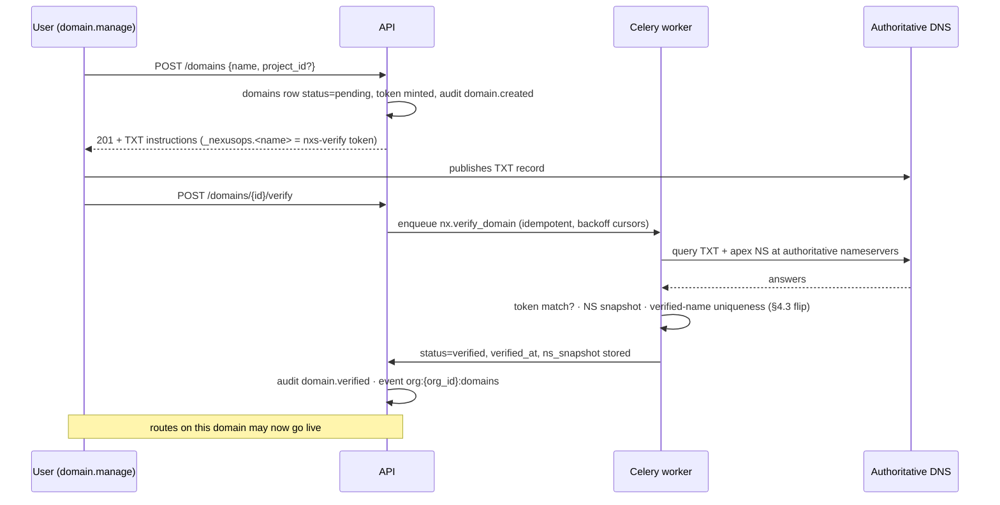
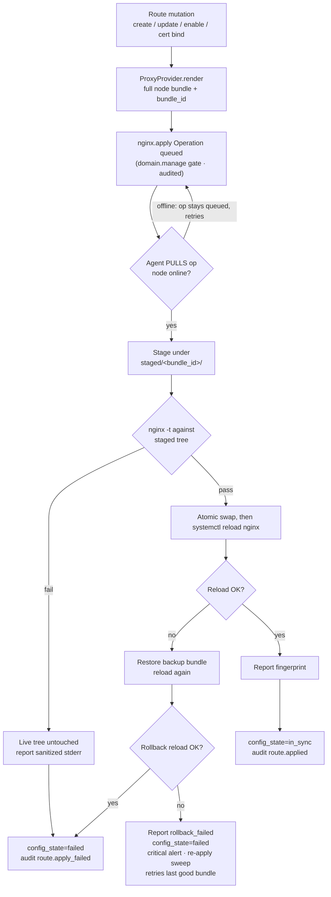

# Domain Routing — NexusOps

**Status:** Implemented for HTTP routing (Phase 4, 2026-10-10; revocation and
reconciliation hardened 2026-10-10). **No certificate issuance, no TLS listener and
no HTTPS redirect exist yet** — every certificate-related shape in this document is
**Phase 5 target design**, labelled as such below, and post-deploy route sync remains
Phase 6 target design.
**Date:** 2026-09-21 (status updated 2026-10-10)
**Companions:** [platform-vision.md](platform-vision.md) · [domain-model.md](domain-model.md) · [multi-tenancy.md](multi-tenancy.md) · [authorization.md](authorization.md) · [node-agent-architecture.md](node-agent-architecture.md) · [certificate-management.md](certificate-management.md)

## 1. Scope and current state

Phase 4 shipped the **HTTP half** of this design: the `domains` and `routes`
tables (tenant RLS plus the anti-takeover partial unique index on the verified
name), TXT verification with the STALE → UNVERIFIED grace lifecycle and its
sweeps, the nginx renderer, the three `nginx.*` operations, the agent-side nginx
provider with atomic apply and rollback, and the Domains/Routes UI. Ownership
revocation completes here too: releasing a competing claim discovers the nodes the
previous owner was serving the name from and has each of them drop it, and a
bounded reconciler repairs a node whose live configuration has diverged from the
desired one (§8.4).
Certificates, TLS and HTTPS redirects are **not** part of it: the schema has no
`certificate_id` column and the redirect shape has no `to_scheme` field,
deliberately, so no route can be configured into an HTTPS redirect before Phase 5
owns it. Sections describing Phase 5–6 behavior are marked as such.

**The repo's `nginx/` directory is the DASHBOARD edge, not a customer proxy.** It
proxies `/api/` → the API container and `/` → the SPA container over a single
plain-HTTP `:8080` listener (`nginx/default.conf.template:28-75`), published
loopback-only `127.0.0.1:${NEXUSOPS_HTTP_PORT:-8080}` (`docker-compose.yml:120-135`).
Its TLS block exists but is commented out and no certs are mounted
(`nginx/default.conf.template:79-108`); the production chain (Cloudflare → host
nginx → edge, `docs/deployment.md:371-425`) terminates the dashboard's own TLS
outside the repo. This edge never carries customer traffic (§2).

**The agent's operations channel shipped in Phase 3** — pull-based op rows, a
closed type whitelist, no shell (node-agent-architecture.md) — and Phase 4 added
exactly the three `nginx.*` types to that whitelist. Everything the routing
subsystem does reaches a node through those ops; there is still no shell, no
tunnel and no push channel.

What exists and is reused:

| Existing capability | Ground | Reuse here |
|---|---|---|
| Beat cadences + atomic claims | celery_app.py:47-93; `FOR UPDATE SKIP LOCKED` claim (monitor_service.py:293-313) | Verification + re-verification sweeps, apply fan-out |
| Append-only audit | audit_service.py:20-65 + DB trigger | `domain.*` / `route.*` actions (§12) |
| Event bus + WS frames | event_bus.py:114-125; hub.py | `org:{org_id}:domains` channel (§12) |
| Agent auth (`X-Agent-Token`, SHA-256 lookup) | api/v1/agent.py:37-48 | Authenticated channel for `nginx.*` ops (§7) |
| Container status diff events | server_service.py:586-601 | Re-render triggers (§8) |

## 2. Where nginx runs

- nginx runs **on the customer Node** (the existing `servers` table — Node = Server,
  domain-model.md §2.3), managed by that node's agent; one nginx per node serves
  every route assigned to that node.
- **The control plane is never in the customer traffic path** (platform-vision.md
  §5): browsers resolve the customer's hostname to the customer's node; the control
  plane renders config and ships it via Operation rows — it never terminates,
  proxies, or observes customer HTTP(S) traffic.
- **The dashboard edge only serves the dashboard** (§1); customer TLS terminates on
  the node. Access logs stay on the node too — the not-a-log-platform boundary
  (platform-vision.md §2.1).

```
control plane:    render (pure fn) ──> nginx.apply Operation row ──> agent PULLS ──> results
                  (config ships as data; no traffic, no shell, no tunnel)
customer traffic: browser ──HTTPS──> node nginx (agent-managed) ──> upstream container
                                       ▲ stage · nginx -t · atomic swap · reload
```

## 3. Entities (per domain-model.md §2.4)

Three rows, one relationship spine: **Organization → Domain → Route**. The tables
below describe what Phase 4 shipped; rows marked *(Phase 5 target)* are **not in the
schema yet**.

> **Phase 5 target design (not shipped):** Route optionally carrying a
> **Certificate** (`Route |o--o| Certificate` — full spec:
> certificate-management.md §2). No `certificates` table exists; `routes.scheme`
> is a closed CHECK of `'http'` and there is no `certificate_id` column, so a TLS
> listener and an HTTPS redirect are not merely unwired — they are
> unrepresentable. Phase 5 adds them by migration.

A route's upstream may be a container on the route's node (usual case) or, later,
an external one.

### 3.1 Domain

| Field | Type | Notes |
|---|---|---|
| `org_id` | UUID FK, NOT NULL | Tenant root; session guard applies (multi-tenancy.md §3) |
| `project_id` | UUID FK, nullable | Optional grouping only — no access semantics |
| `name` | String(253) + CHECK | Canonical lowercase FQDN or `*.example.com` (punycode only); uq `(org_id, name)` |
| `status` | String(16) + CHECK | `PENDING` / `VERIFYING` / `VERIFIED` / `STALE` / `UNVERIFIED` / `FAILED` (§4) |
| `verification_token` | String(96) | Per-domain random `nxs-verify=<32 urlsafe>`; minted at create |
| `verified_at` | DateTime, nullable | Set on success; kept after an `UNVERIFIED` flip for history |
| `ns_snapshot` | JSONB | Apex NS set observed at verification; change ⇒ re-verify (§4.3) |
| `proof_lost_at` / `stale_expires_at` | DateTime, nullable | The grace window's boundaries: when proof disappeared, and when it expires |
| `last_checked_at` / `next_check_at` / `attempt_count` | DateTime / Int | Sweep cursors and the bounded attempt backoff |
| `last_error` | String(500) | Sanitized, bounded reason for the last non-serving status |
| `dns_reachability` | JSONB | Last observed A/AAAA answer for the §11 reachability warning (never gates anything) |
| `dns_provider_id` *(Phase 5–6 target)* | UUID FK → integrations, nullable | **Not in the schema.** Auto-publishing the TXT record (same DNSProvider interface as cert doc §4.2) is later work |

`VERIFIED` names are unique **platform-wide**: partial unique index
`(lower(name)) WHERE status = 'VERIFIED'` (§4.3). An org may *track* a name another
org has verified — it stays `PENDING` until it can prove ownership itself.

### 3.2 Route

| Field | Type | Notes |
|---|---|---|
| `org_id` | UUID FK, NOT NULL | Denormalized for fast org listings (pattern: deployments) |
| `domain_id` | UUID FK, NOT NULL | The verified name this route answers for |
| `hostname` | String | The Domain's name, a one-label subdomain of it, or `*.` wildcard (§10) |
| `path` | String | `/` or a prefix; strict charset (§6) |
| `node_id` | UUID FK → servers | The serving Node; upstream must live on it (§8) |
| `container_id` | UUID FK, nullable | Upstream container; external upstream is a later phase |
| `port` | Int + CHECK | 1–65535; the **host-published** port, never the container-internal one |
| `scheme` | String(8) + CHECK | **`http` only** — `CHECK (scheme = 'http')` in Phase 4. `https` and its `certificate_id` are Phase 5 target design (§3.2 note) |
| `headers` / `rate_limit` / `redirect` | JSONB, nullable | Structured, allowlisted (§6, §9). `redirect` is host-only — there is no `to_scheme`, so no HTTPS redirect is expressible |
| `enabled` | Bool | Live gate: requires domain `VERIFIED` AND upstream present |
| `config_state` | String(16) + CHECK | `PENDING` / `IN_SYNC` / `STALE` / `FAILED` — last apply outcome on its node. `STALE` is "not confirmed live at the desired configuration", which covers both "pulled" and "awaiting the node's removal" |
| `last_applied_at` / `last_bundle_id` / `last_apply_error` | DateTime / String(64) / String(500) | Which bundle the node confirmed for this route, and the sanitized reason when it did not |
| `monitor_optout` | Bool, default false | Auto-attached uptime monitor (§13) |

Uniqueness: `(node_id, hostname, path)` unique among `enabled = true` routes — one
nginx, one answer per name+prefix. The same hostname may be served from two nodes
(DNS chooses); cross-org conflicts are impossible because hostnames must be covered
by a verified Domain, which is platform-unique (§4.3).

## 4. DNS ownership verification

### 4.1 The token

Creating a Domain mints a per-domain token and stores the row as `pending`; the user
publishes one TXT record — v1 is manual, the UI shows the exact record:
`_nexusops.example.com.  TXT  "nxs-verify=<token>"`. Auto-publish via the
DNSProvider integration (the interface certificate-management.md §4.2 specifies for
DNS-01) comes later.

### 4.2 The check (control-plane side)

A Celery task resolves, at the domain's **authoritative nameservers** (not a caching
resolver), the TXT record and the apex NS set, then decides:

1. TXT value matches the stored token, **and**
2. apex NS set matches `ns_snapshot` (first success stores it).

Platform-wide verified-name uniqueness is not a third precondition — §4.3
enforces it by cross-org flip: if another org already holds the name
`VERIFIED`, this verification still succeeds and flips the earlier row to
`UNVERIFIED` (audited, event to the losing org). **The release is also where the
losing organization's nodes are discovered**: the worker has no way to find them
later — they belong to another tenant — so the same system-scoped step records every
enabled route on that name, marks it unresolved, and returns the node ids; each node
is then re-rendered and applied *inside its own organization*, so the cross-tenant
discovery never becomes a cross-tenant write (§8.4). A release that found nodes
queues one apply per node, and the route reads as unresolved from that moment — the
control plane never claims a removal that has not been applied. Success ⇒ `verified`,
`verified_at` set, audit `domain.verified`, event on `org:{org_id}:domains`.
Failure ⇒ sanitized `last_error`, backoff, `failed` after budget. DNS library
choice: Open question 1.

### 4.3 Anti-takeover rules

| Rule | Enforcement |
|---|---|
| **No verification, no route** — verify before any route goes live | API rejects `enabled=true` on routes of non-`verified` domains; the renderer excludes them unconditionally |
| **Re-verify on apex change** | Any sweep observing an apex NS set ≠ `ns_snapshot` flips the domain to `unverified` immediately; routes pulled from the next render |
| **Continuing control** | Hourly `sweep-domains` re-checks the TXT of every `verified` domain; a miss starts a 72h `stale` grace, then `unverified` |
| **One verified owner platform-wide** | Partial unique index on verified names; a later org's successful verification flips the earlier row to `UNVERIFIED` (audited, event to the losing org). Its routes are marked unresolved immediately and every node serving them is told to drop the name (§4.2); a node that cannot take the apply retries through the reconciler (§8.4), and the route is never reported as stopped until the node confirms |

The token becomes public once in DNS, so possession is not the long-term proof; the
proof is **continued ability to control the zone's DNS** — exactly what
re-verification and NS-change detection test. A domain that changes hands (expires,
re-registered, re-delegated) cannot be re-verified by the old org unless it still
controls the TXT record.

Lifecycle: `PENDING → VERIFYING → VERIFIED`; `VERIFIED → STALE` (72h TXT grace)
`→ UNVERIFIED`; apex NS change or cross-org flip ⇒ `UNVERIFIED` immediately;
`UNVERIFIED → VERIFYING` on re-verify. While `STALE` or `UNVERIFIED`, the domain's
routes are excluded from every render — and because the desired configuration no
longer contains them, the node's own next apply removes their fragments. A route
that was live does not keep serving on stale proof: the exclusion is a fact of the
render, and the apply that carries it is queued (and, if a node is unreachable,
retried) rather than assumed (§8.4).

### 4.4 Sequence: add-domain → verified


```mermaid
sequenceDiagram
    participant U as User (domain.manage)
    participant A as API
    participant W as Celery worker
    participant DNS as Authoritative DNS

    U->>A: POST /domains {name, project_id?}
    A->>A: domains row status=pending, token minted, audit domain.created
    A-->>U: 201 + TXT instructions (_nexusops.<name> = nxs-verify token)
    U->>DNS: publishes TXT record
    U->>A: POST /domains/{id}/verify
    A->>W: enqueue nx.verify_domain (idempotent, backoff cursors)
    W->>DNS: query TXT + apex NS at authoritative nameservers
    DNS-->>W: answers
    W->>W: token match? · NS snapshot · verified-name uniqueness (§4.3 flip)
    W->>A: status=verified, verified_at, ns_snapshot stored
    A->>A: audit domain.verified · event org:{org_id}:domains
    Note over U,A: routes on this domain may now go live
```

## 5. ProxyProvider interface

Providers at the vendor seam (platform-vision.md §3.6). One interface, three
methods; **NginxProvider is the first and only v1 implementation**:

| Method | Runs on | Purpose |
|---|---|---|
| `render(node, routes) → Bundle` | Control plane | Pure function: desired routes + in-repo templates → file tree + `bundle_id` (sha256 of the tree) |
| `apply(node, bundle) → Operation` | Control plane → agent | Ships the bundle as a whitelisted `nginx.apply` Operation; agent stages, validates, swaps, reloads (§7) |
| `status(node) → Report` | Agent | Current fingerprint, nginx version, last config-test result — drift detection |

- **NginxProvider** renders native nginx config (§6).
- **Future:** TraefikProvider and CaddyProvider — same three methods; the apply
  contract generalizes "validate" to the provider's checker (`nginx -t`,
  `caddy validate`, config parse). No route-level code knows the provider.
- **Selection is per node:** `servers.capabilities` (domain-model.md §2.3) reports
  a capability map via the hello exchange. Phase 3 shipped capability reporting and
the `docker`/`systemd` keys; the `nginx` key arrives with the nginx provider
  (§4), and until a node reports it, dispatch refuses `nginx.*` ops (Phase 4).
  Nodes without the capability never appear in the upstream picker and never
  receive `nginx.*` ops.

**Routing pre-flight (Phase 4, reported through the same hello channel).** The
capability flag alone says "this node once had nginx" — not "routing will work
here." The agent's `nginx` capability therefore carries a whole pre-flight
verdict, stored in `servers.capabilities`:

- **installed / running / config-test** — `present`, `running`, `config_test_ok`;
- **listener ownership** — `listener_80` / `listener_443` are each
  `MANAGED` (the intended nginx master holds it), `FREE` (nobody holds it),
  `OTHER` (some other process holds it) or `UNKNOWN` (could not be determined
  safely — never treated as free);
- **`routing_eligible` + `reason`** — the agent's own summary of the above, with
  a precise, user-facing reason when it is `false`.

**The two listener ports have different rules, and they are the rule that matters:**

| Port | Accepted states | Why |
|---|---|---|
| 80 | `MANAGED` only | Routing serves HTTP on 80. `OTHER` is a process to displace; `FREE` means the running nginx does **not** own a listener there, so NexusOps cannot confirm it manages this node's HTTP listener — adopting a port nobody can be shown to hold is how two writers end up on one port; `UNKNOWN` is unreadable, not free |
| 443 | `MANAGED` or `FREE` | Reserved for Phase 5 certificates. `FREE` is fine today (nothing listens yet); `OTHER` is a conflict resolved **now**, not after certificates ship. Phase 4 never writes a listener — or any directive — on 443 |

The control plane **trusts that verdict first**: a node reporting
`routing_eligible: false` is refused `409 NGINX_PREFLIGHT_FAILED` with the node's
own reason ("port 80 is held by a process that is not the intended nginx
instance"), so the refusal says what the *node* found rather than guessing from one
flag. Only then do the control plane's own fallbacks apply, each with its own
code: `NGINX_NOT_INSTALLED`, `NGINX_NOT_RUNNING`,
`NGINX_CONFIG_TEST_UNAVAILABLE`, `NGINX_LISTENER_CONFLICT` (80 not `MANAGED`, or
443 neither `MANAGED` nor `FREE`), `NODE_OFFLINE`, `NODE_CAPABILITY_STALE`.

`POST /routes` and `POST /routes/{id}/enable` **both** run the gate — a node's
state moves, and a route created while healthy must be re-checked when it is
made live — and `POST /nodes/{id}/proxy/apply` re-checks it before queueing an
apply. This is **refusal, not coexistence**: NexusOps never shares 80/443 with
another proxy (two writers to the same port family conflict constantly), and it
never touches the pre-existing service. Port 443 must be either already held by
the managed nginx or free, because Phase 5 reserves it for certificates; another
process there is a conflict resolved now, not after certificates ship.

## 6. Config rendering — strict allowlists

### 6.1 What is rendered

Per serving node, a full bundle (never a partial tree), so desired state is always
reproducible from the DB:

```
/etc/nginx/nginx.conf                      # system file; bootstrap adds ONE include line (§7)
/etc/nexusops/nginx/nexusops.conf          # http-level: rate-limit zones, defaults, resolver
/etc/nexusops/nginx/routes.d/<route>.conf  # one fragment per route (its server block)
/etc/nexusops/nginx/staged/                # staging area for atomic apply (§7)
```

The default_server catch-all (§10) is always part of the bundle. There is no
HTTP→HTTPS redirect block in Phase 4: nothing in the renderer can emit one.

### 6.2 The allowlist (the injection defense)

**No user-supplied raw nginx directives exist in v1.** Templates are versioned
in-repo; every user input is a structured field validated at API write time AND at
render time. `extra=forbid` on the config schemas (pattern: schemas/base.py:14)
makes unknown JSONB keys 422. `nginx -t` (§7) is a syntax safety net, not a defense
— it cannot tell a typo from an injection.

| Input | Rule | Rendered into |
|---|---|---|
| `hostname` | `^[a-z0-9]([a-z0-9-]{0,61}[a-z0-9])?(\.[a-z0-9]([a-z0-9-]{0,61}[a-z0-9])?)+$` (optional `*.` prefix, §10); must be covered by the route's verified Domain | `server_name` |
| `path` | Starts `/`; charset `^[A-Za-z0-9._\-/]*$` — no `~` `=` (match-type markers), no whitespace, quotes, `;`, `{}`, `$` | `location` prefix match |
| header name / value | name `^[A-Za-z0-9-]{1,64}$` (denylist: Host, Connection, Content-Length, Transfer-Encoding, Upgrade, Expect); value printable ASCII 0x20–0x7E, ≤512, no `$` | `add_header` / `proxy_set_header` |
| `port` | Int 1–65535 | `proxy_pass` |
| `rate_limit` | `{requests 1..10000, window ∈ (1s, 1m), burst ≤ requests}` — nginx can express only per-second and per-minute windows, so "10s" is deliberately not offered | `limit_req_zone` / `limit_req` |
| `redirect` | `{to_host, code ∈ (301,302,307,308)}` — **host only**: there is no `to_scheme` field in Phase 4, so no route can be made to emit an HTTPS redirect. `to_host` must be a verified name in the org | fixed `return` block |
| `certificate_id` | *not in Phase 4* — Phase 5 adds the column and its validation by migration | `ssl_certificate` paths (Phase 5) |

Why this hard line: co-hosted domains on one node share one nginx config — a config
injection is traffic interception across *every* route on that node
(platform-security-model.md, "Nginx config injection" threat row). Structured
fields + strict charsets keep the rendered file a projection of DB state, never of
free text.

## 7. Apply pipeline via agent operation

Rendering happens control-plane side; nothing touches the node except whitelisted
Operation types. Per authorization.md §2, applying config is gated by
**`domain.manage`** — no `node.execute` exists and none is introduced.

| Op type | Params (at rest) | Effect |
|---|---|---|
| `nginx.bootstrap` | `{}` | Idempotent: ensure `/etc/nexusops/nginx/{routes.d,staged}` exist; ensure the single include lines sit in the system nginx.conf's http context; run `nginx -t`. Run once per node when the nginx capability first appears |
| `nginx.apply` | `{bundle: {bundle_id, provider, template_version, manifest, files}, reload: true}` | Stage → validate → atomic swap → reload → rollback on failure (below) |
| `nginx.status` | `{}` | Agent reports live fingerprint + nginx version (drift detection, §8.4) |

**Bundles carry no secrets — and, in Phase 4, no certificates.** There is no
field for a certificate or a key and no managed path for one; a bundle is a
fingerprint, a provider name, a template version, a manifest of route ids and an
allowlisted set of config files. TLS private keys arrive only via
`certificate.install` (reference-only params, pull-time decryption —
certificate-management.md §6, Phase 5).

Agent-side steps for `nginx.apply`:

| Step | Action | On failure |
|---|---|---|
| Stage | Write the tree under `/etc/nexusops/nginx/staged/<bundle_id>/` (temp + fsync), creating `routes.d` **unconditionally** | Report failure; live tree untouched |
| Validate | `nginx -t` against a test wrapper that includes the staged tree | Keep live tree; report sanitized stderr (redaction: core/logging.py:19-60) |
| Swap | Atomically rename staged files over `nexusops.conf` + `routes.d/`; keep the previous bundle as backup | — |
| Reload | `systemctl reload nginx` (SIGHUP fallback) | **Rollback:** restore the backup bundle, reload again, report `rolled_back`; if that restore + reload also fails, report `rollback_failed` — defined terminal state below |
| Report | `{status: applied|failed|rolled_back|rollback_failed, bundle_id, fingerprint, error?}` | — |

**A desired tree with no route fragments is valid, and the removal of the last route
is the case that must never fail.** When a name is pulled — revocation, apex change,
the last route on a node being disabled or deleted — the rendered bundle carries the
managed http-level file and nothing else, so the stage directory must contain an
empty `routes.d` rather than none at all. That distinction was a real defect, found
by the ownership-transfer E2E (`frontend/e2e/phase4.spec.ts`): staging created the
directory only as a side effect of writing a fragment, `nginx -t` on the staged tree
failed with `FileNotFoundError`, the apply reported `STAGE_FAILED` and rolled back,
and the route the control plane had asked the node to remove **stayed live on that
node** — the old Host kept reaching the old upstream while the route read `STALE`. The
stage writer now creates the directory, the validation reader treats a missing one as
an empty tree, and both are pinned by contract tests
(`backend/tests/test_agent_nginx_contract.py`), which also check that the node's live
fingerprint after the removal equals the bundle id the control plane computed.

The live tree changes only after validation passes, and a reload failure self-heals
to the previous known-good bundle. The one way an apply can still leave a node down
is a double failure — the rollback's own restore + reload also failing (an
out-of-band broken system nginx.conf, a dead reload path) — and that corner is a
defined terminal state, not silence: the agent reports `rollback_failed`, routes go
`config_state=failed` with the detail in `last_error`, a critical alert pages
through the incident pipeline (the route's uptime monitors, §13, also fire once
traffic stops answering), and the re-apply sweep (§8.4) keeps re-applying the last
known-good bundle until the node answers again. Results surface as
`route.config_state` (+ sanitized `last_error`) and audit rows (§12).

### 7.1 Flow: config apply with rollback


```mermaid
flowchart TD
    A["Route mutation<br/>create / update / enable / cert bind"] --> B["ProxyProvider.render<br/>full node bundle + bundle_id"]
    B --> C["nginx.apply Operation queued<br/>(domain.manage gate · audited)"]
    C --> D{"Agent PULLS op<br/>node online?"}
    D -->|offline: op stays queued, retries| C
    D -->|yes| E["Stage under<br/>staged/&lt;bundle_id&gt;/"]
    E --> F{"nginx -t against<br/>staged tree"}
    F -->|fail| G["Live tree untouched<br/>report sanitized stderr"]
    G --> H["config_state=failed<br/>audit route.apply_failed"]
    F -->|pass| I["Atomic swap, then systemctl reload nginx"]
    I --> K{"Reload OK?"}
    K -->|no| L["Restore backup bundle<br/>reload again"]
    L --> J{"Rollback reload OK?"}
    J -->|yes| H
    J -->|no| P["Report rollback_failed<br/>config_state=failed<br/>critical alert · re-apply sweep<br/>retries last good bundle"]
    K -->|yes| M["Report fingerprint"]
    M --> N["config_state=in_sync<br/>audit route.applied"]
```

## 8. Upstream binding and re-render triggers

### 8.1 Binding rules

A route binds **(node_id, container_id, port)**. The upstream container must live on
the route's node — enforced at write time (`container.server_id == route.node_id`);
cross-node upstreams are rejected in v1. The rendered upstream address is computed
at render time from container inventory: the container's published loopback port
(`proxy_pass http://127.0.0.1:<host_port>`) preferred, container-network IP as
fallback.

Grounding: the wire extension this paragraph used to flag as pending **shipped in
Phase 4** — protocol-2 agents report each container's published ports and the
upstream picker renders only those with a genuinely usable one (loopback bind, or a
wildcard bind mapped to `127.0.0.1`). The shape is pinned by the agent contract
tests (`backend/tests/test_agent_contract.py`) and exercised end to end by
`frontend/e2e/phase4.spec.ts`, which routes to a real loopback-published container
and checks the rendered `proxy_pass`. The deployment side completes the handoff: the 6a `container.run` op
publishes `127.0.0.1:<port>` per the environment's declared publish spec
(deployment-architecture.md §5.1), so an agent-deployed container always has the
loopback address the renderer prefers — and the upstream picker lists only containers
with reported published ports, so a deploy-then-route can never silently produce an
unreachable upstream.

### 8.2 Certificate selection rule (this doc owns it) — **Phase 5 target design**

> Nothing below is implemented: there are no certificate rows, no coverage check at
> bind time and no `scheme=https` to bind to. It is recorded here because this doc
owns the rule, and certificate-management.md §8 implements it.

A route's HTTPS certificate must cover the hostname: exact CN/SAN preferred,
otherwise a wildcard SAN one label deep (`*.example.com` covers `api.example.com`,
not `a.b.example.com`). The covering check at bind time is certificate-management.md
§8's job; no covering issued cert ⇒ bind rejected. One certificate per route.

### 8.3 Re-render triggers

Full-node bundles rendered from DB state; triggers come mostly from machinery that
already exists:

| Trigger | Source | Effect |
|---|---|---|
| Container RESTARTED/STARTED | status diff events, server_service.py:586-601 | Re-render routes bound to that container (upstream address may have changed) |
| Container REMOVED | heartbeat reconciliation (same path) | Routes → `config_state=stale`, excluded from render as `upstream_missing`; UI surfaces; no wrong-upstream traffic |
| Deployment succeeded + health passed | deployment engine event (Phase 6) | Post-deploy route sync (§8.5) |
| Route / domain / cert mutation | API | Re-render the affected node's bundle |
| Certificate issued / renewed *(Phase 5)* | delivery fan-out (cert doc §6) | Re-render routes on the cert's serving nodes (fragments reference the new files) |
| Domain `VERIFIED` / `UNVERIFIED` flip | sweeps (§4) | Exclude the domain's routes at the next render, and apply that render to **every** node that was serving them — including a previous owner's (§4.2) |
| nginx capability first reported | hello | Queue `nginx.bootstrap` |

### 8.4 Drift and reconciliation

`nginx.status` is a *detector*; the repair is separate, and the split is what makes
the loop converge. Asking a node for its fingerprint while its live configuration is
known not to match the desired one answers the same way forever — the node is not
misreporting, it is running the wrong tree — so:

1. **Detect and mark.** A reported `live_bundle_id` that differs from the desired
   bundle marks the node's enabled routes `STALE` with the drift reason, records
   `drift`/`drift_since` on the node, and publishes `NGINX_DRIFT_DETECTED`. The
   status path queues nothing.
2. **Reconcile (one step per tick, per node).** `sweep-routes` calls
   `proxy_service.reconcile_node`, which renders the desired tree (marking every
   route it must exclude `STALE` *with the reason it was excluded* — "the domain is
   unverified", "the upstream container is not running", …) and then:
   - the live bundle already **is** the desired one ⇒ nothing to repair. The node is
     asked for a fresh fingerprint only when the last report is older than
     `STATUS_REFRESH_AFTER` (10 min), so a healthy fleet is not a poll loop;
   - it **differs** ⇒ exactly one `nginx.apply` is queued. One: a live apply
     short-circuits the branch and the queue itself refuses a duplicate. A node that
     cannot take it (offline, stale capability, listener conflict, unrenderable
     desired state) is *deferred* — nothing is queued, the routes stay visibly
     unresolved, and the next tick retries. A node that keeps failing backs off
     through a bounded exponential window (1 min → 30 min), so a broken nginx is not
     re-applied on every tick.
3. **Report the repair only from the outcome.** `NGINX_DRIFT_RECOVERED` and
   `route.config_state = IN_SYNC` come from the agent's own `applied` result — never
   from a queued or attempted apply. A failed apply leaves the previous known-good
   configuration live (rollback, §7) and the route `FAILED`/`STALE` with the reason.

The database is the only source of truth for desired state; out-of-band node edits
are corrected by step 2 rather than tolerated.

### 8.5 How deployments hook routing (post-deploy route sync)

Routes bind container rows, and a redeploy creates a *new* container row. After a
deployment reaches success with its health check passed (platform-vision.md §4 step
5 — health gates routing), a sync task: finds enabled routes on that node whose
upstream container belonged to the deployed application + environment; re-points
`container_id` to the successor container (port kept unless its binding changed);
enqueues render + apply.

If no healthy successor exists, routes stay `stale`/`upstream_missing` and nginx 502s
them until re-pointed — visible in the UI and via the uptime monitor (§13), never
silently mis-routed. A plain restart (same container id) needs no re-point; §8.3's
RESTARTED trigger covers its IP change.

## 9. Headers, rate limits, redirects (semantics)

Validation rules live in §6.2; this is what they mean per route:

| Feature | Route field shape | Rendered behavior |
|---|---|---|
| Response headers | `headers: [{name, action: set\|add, value}]` | `add_header` (response) slots from the template |
| Custom proxy headers | `headers` with `action: set` | `proxy_set_header` to the upstream |
| Standard proxy headers | Not user-configurable | Always rendered: `Host`, `X-Forwarded-For`, `X-Forwarded-Proto`, `X-Forwarded-Host` |
| Rate limit | `rate_limit: {requests, window, burst}` | One `limit_req_zone` per route (key `$binary_remote_addr`) declared in `nexusops.conf`; `limit_req` in the route location |
| Force HTTPS | — not available in Phase 4 | Requires certificates; lands with Phase 5 |
| Host redirect | `redirect: {to_host, code}` | Fixed `return` block; `to_host` must be a verified org name |

The node-level `nexusops.conf` is regenerated wholesale on every render, so
rate-limit zones never leak stale entries after route deletion.

## 10. Wildcards and catch-all

- **Wildcard domains.** A Domain row may be `*.example.com`; TXT verification at the
  apex (`_nexusops.example.com`), same re-verification rules. Wildcard HTTPS needs a
  wildcard certificate — DNS-01 only (Phase 5, certificate-management.md §8).
- **Coverage.** A route's `hostname` must be the Domain's name, a **one-label**
  subdomain of it, or `*.<name>` of a wildcard Domain. Deeper names
  (`a.b.example.com`) are rejected — the same depth rule as the cert doc's wildcard
  SANs, so hostname and cert coverage cannot diverge.
- **Rendered precedence.** Exact routes each get a server block; a wildcard route
  renders `server_name *.example.com`; nginx's native matching (exact > longest
  leading-wildcard) gives precedence for free.
- **Wildcard route = app-level catch-all.** One route answering every first-level
  subdomain is the multi-tenant-app pattern; exact routes alongside win over it.
- **No proxying catch-all.** The always-rendered per-node `default_server` block
  answers unmatched Host headers with **444** — no route ever answers for a name its
  org doesn't own. (Sending an owned `Host` header to the node's IP is inherent to
  IP-shared hosting; TLS/SNI + verified ownership is the v1 boundary.)

## 11. User journey

1. **Add domain** — `POST /domains` (`domain.manage`): row `pending`, token minted,
   UI shows the TXT record to publish.
2. **Verify** — publish `_nexusops.<name>` TXT at the DNS provider; click Verify (or
   let the sweep retry). `verified` + NS snapshot stored; routes may go live.
3. **Point traffic** — publish an **A/AAAA record** for the hostname at the node's
   public IP. NexusOps cannot do this for the user (the agent cannot edit DNS — by
   design), and verification alone proves nothing about reachability: after
   verification, a best-effort check resolves the hostname and **warns** when it does
   not match the serving node's public IP (a warning, not a gate). A user can pass
   every status as green with zero traffic arriving if they skip this step — the
   warning exists so silence never looks like success.
4. **Create route** — pick node (nginx capability + routing pre-flight passed),
   container:port, path `/`, optional headers/rate-limit; enable → render + apply
   (§7); uptime monitor auto-attaches (opt-out, §13). Route creation is **refused**
   on a node that fails the routing pre-flight (§5.1) with a message naming the
   conflict.
5. **HTTPS — not shipped (Phase 5).** Request a certificate (`certificate.manage`),
   DNS-01 via the domain's `dns_provider_id`; on `issued` + delivered, bind
   `scheme=https` + `certificate_id` → re-render serves TLS. Full spec:
   **certificate-management.md** (§5–§7).
6. **Operate** — sweeps keep re-proving control; NS change or lost TXT pulls routes
   until re-verified; expiry monitors page through the incident pipeline.
7. **Decommission** — disable route → apply removes its fragment; domain delete
   blocked while enabled routes reference it.

**Proven end to end (`make e2e`).** `frontend/e2e/phase4.spec.ts` walks steps 1–4
against a throwaway stack with nothing simulated on the routing path: a node
container that really runs nginx (`e2e/nginxnode`) with the real agent enrolled
inside it, an authoritative mock nameserver (`e2e/dnsmock`, wired into the api and
worker through `docker-compose.e2e.yml`) holding the token the API minted, and a
real upstream container on a loopback-published port. It asserts the unverified →
`VERIFIED` transition, the token's one-time retrieval rule, the fragment that lands
on the node (`server_name`, `proxy_pass` to the published port, no `ssl_*`), an HTTP
request through the node's port 80 that reaches the container's marker, the managed
catch-all answering 444 for a Host nobody mapped, `drift: false` with matching
bundle ids — and the dashboard showing the same state.

**Ownership transfer is proven the same way.** A second scenario gives the name to a
second organization (its own node, its own container, the same mock DNS fixture) and
asserts, on the wire rather than in status rows: the first organization's domain goes
`UNVERIFIED` and its audit/event trail says why; the old route is excluded from the
desired configuration; the old node — kept unreachable for part of the run — applies
the bundle that removes the fragment, and an HTTP request with the old Host no longer
reaches the old upstream (the managed catch-all answers 444); no success is reported
while the node cannot apply; the new owner serves the name from its own node; and
neither organization can read or modify the other's rows.

## 12. API surface, permissions, audit

All endpoints run under `X-Org-Id` resolution and the session guard
(multi-tenancy.md §2–3); every new listing/detail route joins the IDOR suite
(multi-tenancy.md §7). Codenames per authorization.md §2: `domain.read`,
`domain.manage` (also gates `nginx.apply` op requests); `operation.read` views ops.
**No `node.execute` is introduced.**

| Endpoint | Gate | Behavior |
|---|---|---|
| `POST /domains` | `domain.manage` | Create `pending` row + token |
| `GET /domains`, `GET /domains/{id}`, `GET /domains/{id}/routes` | `domain.read` | Token shown only to `domain.manage` holders |
| `POST /domains/{id}/verify` · `/re-verify` | `domain.manage` | Enqueue verification (§4) |
| `DELETE /domains/{id}` · `DELETE /routes/{id}` | `domain.manage` | Domain blocked while enabled routes reference it; route delete removes the fragment at next apply |
| `POST /routes` · `PATCH /routes/{id}` | `domain.manage` | Validations: domain verified, upstream on the route's node, port range, allowlists (§6) |
| `POST /routes/{id}/enable` · `/disable` | `domain.manage` | The live gate; enqueues apply |
| `GET /nodes/{id}/proxy/status` | `domain.read` | Last fingerprint, provider, drift state |

Audit actions (append-only; `resource.action` naming, domain-model.md §2.6):
`domain.created` · `domain.verified` · `domain.reverified` · `domain.unverified`
(NS change, cross-org flip, or grace expiry — sweep/worker) · `domain.claim_released`
(the cross-org flip itself, recorded in the organization that lost the name, with
`routes_pulled`/`nodes_affected` counts and nothing about the winner) ·
`domain.deleted` · `route.created`/`updated`/`deleted` (user) · `route.enabled`/
`disabled` · `route.apply_requested` (control plane, with the bundle summary) ·
`route.applied`/`apply_failed`/`rolled_back`/`rollback_failed` (agent) ·
`nginx.bootstrap_completed`/`failed` · `nginx.drift_detected` ·
`nginx.drift_recovered` (only from an applied outcome). Events: `DOMAIN_VERIFIED`,
`DOMAIN_UNVERIFIED`, `ROUTE_CREATED`, `ROUTE_ENABLED`, `ROUTE_APPLIED`,
`ROUTE_APPLY_FAILED`, `NGINX_DRIFT_DETECTED` and `NGINX_DRIFT_RECOVERED` publish
id/status-only frames on `org:{org_id}:domains` (event_bus.py frame shape) — no
tokens, no config text, and every frame carries the organization it belongs to, so
the organization that lost a name is told why without learning who took it. The verification token is
never written into an audit row, an event or a log: it is returned once to a
`domain.manage` holder while it is still actionable, and never again.

## 13. Monitoring tie-in

Monitors became polymorphic in this phase (domain-model.md §2.6). Creating a route
auto-attaches (opt-out via `monitor_optout`) an **uptime** monitor on the route's
`url` — `http://<hostname><path>` in Phase 4, since that is what the node serves —
using the existing URL-monitor machinery. Disabling a route parks the monitor
rather than deleting it; the monitor is org-scoped like every other row. Once
certificates exist (Phase 5), a per-certificate **TLS-expiry** monitor
(certificate-management.md §10) joins it on the same engine, the same incident
pipeline, and fails independently of the uptime probe.

**Vantage point, disclosed.** Uptime monitors probe **from the control plane** —
the UI says so ("checked from the NexusOps control plane"), not just this doc. A
node whose ports 80/443 are not publicly reachable (NAT without the port
forward, node powered off, firewall) fails the uptime check even when the
application itself is healthy. Therefore, for a target the control plane cannot
reach, surface **"unreachable from NexusOps"** as a distinct monitor state —
not DOWN (no evidence the app is unhealthy) and not UP (no evidence either
way). The agent-side container-health checks landing in the same phase provide
the inside vantage; together the two states give the honest picture.

## Open questions

1. **Control-plane DNS resolver dependency** — dnspython (new backend dep) vs a
   `dig` subprocess (stdlib-only, brittle to parse). Decide at implementation.
2. **Auto-publishing the verification TXT** via the DNSProvider integration in v1 vs
   manual-only first; interface shared with certificate-management.md §4.2.
3. **Cross-org flip grace — DECIDED (implemented): immediate flip, no grace.** B's
   successful verification flips A's row to `UNVERIFIED` at once, marks A's routes
   unresolved, and queues an apply on every node A was serving the name from; A gets
   an audit row and an org-scoped event that names the reason but not the winner.
   A bounded grace would mean knowingly answering for a name its owner no longer
   controls, which is the failure this rule exists to prevent.
4. **Delegated subdomains** — a route hostname NS-delegated elsewhere can change
   hands without the apex NS changing; apex checks don't catch it. Per-hostname NS
   pinning is heavy — defer or build before DNS-heavy tenants exist.
5. **Installing nginx — DECIDED: user-side, surfaced by the pre-flight.** No
   `nginx.install` op: a package-manager operation is the widest entry the
   whitelist could have (root-equivalent arbitrary-package execution) and the
   routing pre-flight (§5) makes it unnecessary — an nginx-less node fails the
   pre-flight with a named error and an install runbook link, instead of
   silently failing at first render. node-agent-architecture.md owns the
   whitelist and keeps it closed.
6. **HTTP-01 challenge fragment** — certificate-management.md §4.4 renders a
   temporary challenge location via the ProxyProvider path; template owner needs
   recording when HTTP-01 lands.
