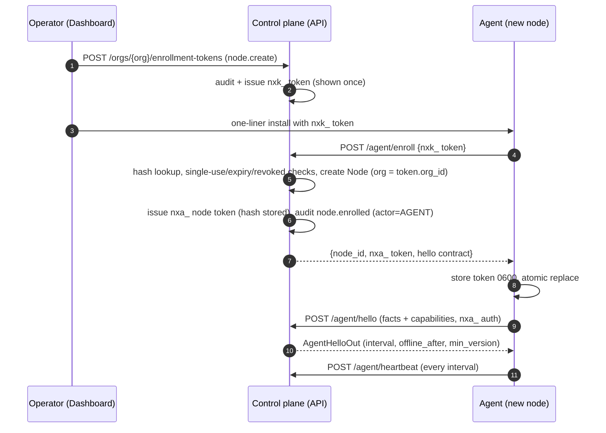
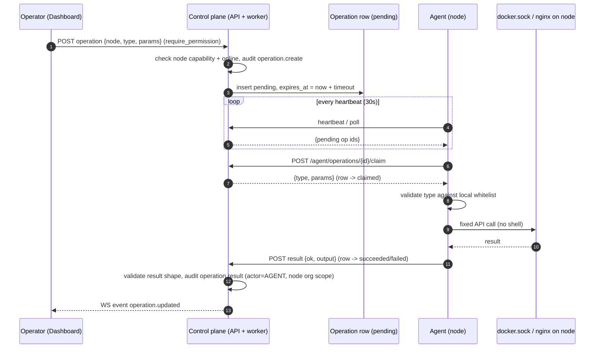

# Node & Agent Architecture

**Status:** Proposal for review — not yet approved for implementation.
**Date:** 2026-09-20
**Companions:** [platform-vision.md](platform-vision.md) · [domain-model.md](domain-model.md) · [multi-tenancy.md](multi-tenancy.md) · [authorization.md](authorization.md)

---

## 1. Scope and stance

The agent is the data plane: a stdlib-Python process on each customer machine that
reports facts and executes a **fixed whitelist** of remote operations. The control
plane never pushes commands and never sits in customer traffic. Three rules anchor
the design:

| # | Rule | Where it bites |
|---|---|---|
| 1 | **The agent pulls.** Work reaches the agent as Operation rows the agent fetches — no push tunnel, no long-lived command channel. | §5 |
| 2 | **Whitelist, not shell.** Operation types are a closed set; each maps to a permission codename and a capability gate. There is no `node.execute`. | §5.2, §6.4 |
| 3 | **One token = one node.** Agent credentials authenticate exactly one Node; the agent's org is derived from that Node row, never from payload. | §3, §6.1 |

**What is real vs simulated today** (carried from platform-vision.md §1):

| Capability | State |
|---|---|
| Agent hello/heartbeat, host metrics, docker observation, container inventory, token rotation | **Real** (`agent/nexusops_agent.py:302-494`, `server_service.py:267-626`) |
| Deployment runner | **Simulated** — `SimulatedDeploymentRunner` renders fake docker-style step logs, no real work (`backend/app/providers/deployment_runner.py:107`) |
| `sim://` monitor transports, `docker_sim` provider | **Simulated** demo/CI tooling (`backend/app/providers/docker_sim.py:39-100`) |
| Operations framework (§5) / nginx capability | **Designed, not built** — no nginx subsystem exists today |

## 2. The Node concept

**Node = the existing `Server` entity**, renamed at the API/UI layer only. Table
`servers` is kept to avoid FK churn (domain-model.md §2.3); codenames and paths
rename `server.*` → `node.*` in one migration (authorization.md §2).

### 2.1 Current shape (real)

| Field group | Columns (table `servers`, `backend/app/models/infra.py:42-87`) |
|---|---|
| Identity | id, name (**unique platform-wide today** — becomes per-org under tenancy), hostname, ip_address, environment, location, description |
| Facts | os_name, os_version, arch, cpu_cores, memory_total_mb, disk_total_gb |
| Agent identity | agent_version, agent_token_hash, agent_enrolled_at, last_heartbeat_at, heartbeat_interval_seconds (default 30, CHECK ≥5 at `infra.py:46`), offline_after_seconds |
| Status | status (`UNKNOWN/ONLINE/OFFLINE`), uptime_seconds, simulated flag |
| Extra facts | `extra` JSONB (`infra.py:82`) — exists, unused by the agent today; **missing vs target:** org_id, capabilities |

### 2.2 Changes for the target model

| Change | Detail |
|---|---|
| `+ org_id` | Tenancy root binding (multi-tenancy.md §9). |
| `+ capabilities JSONB` | Self-reported at hello, stored server-side; **dispatch gating input** — ops are dispatched only to nodes reporting the required capability (platform-vision.md principle 6). |
| Name uniqueness | `servers.name` unique → **per-org unique** (findings agent-4 tenancy gaps: platform-wide unique collides across tenants). |
| `simulated` flag fix | `_apply_agent_entry` sets `row.simulated=True` on real agent data (`server_service.py:498`); flag becomes false for real agents and true only for sim-source rows. |

### 2.3 Capabilities (target)

Self-reported in hello v2 (§4.2), stored in `servers.capabilities` JSONB:

| Capability | Meaning | Gates ops (§5.2) |
|---|---|---|
| `docker` | docker.sock reachable and API-negotiated | container.* ops |
| `nginx` | agent manages host nginx | nginx.* ops |
| `systemd` | systemd present (future) | service ops (future) |

Capabilities are advisory-reported, **server-enforced at dispatch**: the control
plane checks `capabilities` before creating/dispatching an op, and the agent
re-checks locally before executing — a stale capability claim fails the op, not
the host.

### 2.4 DockerEndpoint — the 0..1 relation

The docker *connection* is a separate row: `DockerHost` (`infra.py:122-137`), 0..1
per node, exposed as part of the Node resource. Two origins:

| Origin | Creation | Endpoint |
|---|---|---|
| Agent-backed (this doc) | `ensure_docker_host` auto-creates one `agent://` host per server on first container telemetry (`server_service.py:459-474`) | `agent://<server-name>` |
| Manual TCP | user-configured, SSRF-guarded (`backend/app/core/ssrf.py:141-177`) | `tcp://...` |

Known gap from findings: ensure_docker_host's select-then-insert lacks a
`UNIQUE(DockerHost.server_id)`; v2 adds the DB constraint.

## 3. Agent lifecycle

### 3.1 Current state (real)

| Stage | Today | Evidence |
|---|---|---|
| Enroll | User creates `Server` row (POST /servers), then `POST /servers/{id}/agent-token` issues a per-server `nxa_` token (`token_urlsafe(30)`, only the SHA-256 hash stored, raw shown once) handed to `install.sh` by hand | `backend/app/api/v1/servers.py:170-192`, `backend/app/core/security.py:103-110` |
| Install | `install.sh --server URL --token nxa_...` copies agent to `/usr/local/lib/nexusops-agent`, writes `/etc/default/nexusops-agent` at 0600 **before** the token is written | `agent/install.sh:12-41` |
| First contact | `POST /agent/hello` once at startup; server sets `agent_enrolled_at`, overwrites static facts, returns `AgentHelloOut{name, heartbeat_interval_seconds, offline_after_seconds}` | `agent/nexusops_agent.py:446-461`, `server_service.py:267-294`, `backend/app/schemas/agent.py:24-43` |
| Steady state | Heartbeat every negotiated interval (default 30s); exponential backoff `interval * 2^min(failures,4)` capped 300s on failures | `agent/nexusops_agent.py:462-490` |
| Rotation | Rotate = new token, old dead instantly, `agent_enrolled_at` reset | `server_service.py:255-264` |
| Revocation | None — revoke = rotate; running agent 401s and `exit(1)`s | `agent/nexusops_agent.py:480-482` |

### 3.2 Enrollment v2

Today there is **no org dimension at all** — `require_server` resolves the token
hash to a platform-global Server row (`backend/app/api/v1/agent.py:33-49`), and the
"enrollment token" is the per-server token handed over manually. The target:
dedicated org-scoped enrollment-token rows (multi-tenancy.md §6).

> **Reconciliation note:** multi-tenancy.md §6 says "the current global
> enrollment token (env var)" is deprecated in the tenancy phase; no such global
> env-var credential exists — today's enrollment credential is the per-server
> `nxa_` token hashed in `servers.agent_token_hash` (§3.1) and handed to
> install.sh manually. That sentence is stale in the spine doc; the
> `enrollment_tokens` table below supersedes the per-server `nxa_` token, not an
> env var.

**The `enrollment_tokens` table (new):**

| Column | Purpose |
|---|---|
| id, org_id, created_by_id | Org-scoped, audited creation |
| token_hash | SHA-256 only; raw shown once at creation |
| single_use (bool) | Always true in v1 — multi-use is cut (decision in open question 4); fleet bootstrap = automation loops minting one single-use token per node per wave |
| expires_at | Short TTL (default 1h, max 7d) |
| revoked_at | Kill switch, independent of expiry |
| node_id? | Optional: claim a pre-created placeholder Node |
| used_at, used_by_node_id | Consumed at successful enroll; format `nxk_` (distinct from node tokens `nxa_`) |

**Rules:** the agent's org comes from the token row — never from payload, header,
or untrusted lookup (multi-tenancy.md §2). Enrollment creates or claims the Node
row (name from hostname, per-org dedup, `ONLINE` on first hello); single-use
enforcement shares the transaction that marks the node enrolled. Enrollment and
every agent call are audited with `ActorType.AGENT` + node attribution (fixes the
gap where agent writes carry no tenant attribution, `server_service.py:334,596`).

**Sequence — enrollment v2:**



### 3.3 Token storage & rotation with dual-token grace

| Side / aspect | Today | Target |
|---|---|---|
| Control plane | SHA-256 hex hash only; raw shown once (`security.py:103-110`) | unchanged + `agent_token_hash_previous` + `token_rotated_at` columns for the grace window |
| Agent file | `/etc/default/nexusops-agent` written 0600 **before** the token lands (`agent/install.sh:29-41`) | `/etc/nexusops-agent/token` 0600 root:root; atomic `os.replace` (temp + rename + fsync); old token kept as fallback file during grace |
| Agent env | `NEXUSOPS_SERVER` / `NEXUSOPS_TOKEN` / `NEXUSOPS_INTERVAL` env file (`agent/nexusops_agent.py:420-424`) | same env names kept; install.sh flow unchanged for compat |
| Rotation | kills the old token instantly (`server_service.py:255-264`) — running agents 401 at next beat and need manual reinstall | dual-token grace, default 24h (settings; per-rotation override incl. `grace=0` for compromise); pending new token delivered in the **heartbeat response** while the old token still authenticates (hello happens only at process start — §3.5 — so the heartbeat is the only channel a running agent polls); old token accepted for heartbeats + rotation delivery until the deadline |
| Revoke | not an action (revoke = rotate) | **separate action**: kill now, no grace, no delivery |

**Why delivery-via-heartbeat:** hello re-negotiation happens only on process
restart (§3.5) and the agent hellos exactly once at startup, so the heartbeat is
the only beat a running agent keeps. The running agent already authenticates with
the old token; it learns of the pending rotation on its next heartbeat, receives
the new raw token in the heartbeat response over HTTPS, persists it atomically,
and switches — the same piggyback pattern as ops delivery (Open question 2). A
node that never checks in (no accepted heartbeat) within grace shows "token
stale" — operator re-enrolls (§3.4). A stolen old token could also fetch the new
one during grace; the short default (24h) plus the rule that compromise response
is **revoke** (zero grace), not rotate, bounds that.

**Delivery contract:** the pending new raw token is served ONLY to requests
authenticated with the OLD hash — never to a request bearing the new token — and
until the agent's next heartbeat carries a `rotation_applied` flag (or the grace
deadline passes), the server re-sends it on every accepted heartbeat; the flag
ends re-delivery and may shorten grace. A crash between receive and persist
therefore self-heals on the following beat.

### 3.4 Revocation semantics — fixing the 401 hot-loop

Today a revoked/rotated-over agent 401s and `exit(1)`s
(`agent/nexusops_agent.py:480-482`); systemd `Restart=always` + `RestartSec=10`
(`agent/nexusops-agent.service:11-12`) restarts it every 10s **forever** — a hot
loop of rejected requests contradicting docs/agent.md:75. Fix, both sides:

| Side | Change |
|---|---|
| Agent | On 401 from heartbeat **do not exit**: enter `revoked` state — sleep at a long fixed cadence (15 min) and re-attempt hello with the same token. Log once per state entry, rate-limited after. |
| Server | 401 error codes distinguish `AGENT_TOKEN_UNKNOWN` (no such token) from `AGENT_TOKEN_REVOKED` (explicitly revoked) so the agent log is definitive. |
| Unit | `Restart=always` stays (crash resilience); the agent itself no longer exits on auth rejection, so no restart storm. |
| Operator UX | Node row shows `REVOKED`/`TOKEN_STALE`; re-enroll = fresh enrollment token, not a reinstall. |

Revocation itself is immediate: token-hash lookup is per-node, so killing one
node's token never affects the org's other nodes (multi-tenancy.md §6).
Immediacy is the invariant: token acceptance is never cached across a
rotate/revoke — the per-request DB hash lookup is what makes "immediate" true.
Any future accept-cache or per-node limiter keyed on the token must be
invalidated synchronously on rotate/revoke.

Identity honesty: node identity is bearer-token possession. A cloned agent (the
token copied to a second host) is indistinguishable and interleaves its writes
into one node row — hello silently overwrites the hostname and the other static
facts (`server_service.py:271-286`). Containment is per-node scoping + fast
revoke, not detection; the cheap tripwire is an event/alert when hello changes
the hostname or IP on an existing node.

### 3.5 Reconnect / offline states

| State | Entered when | Mechanism |
|---|---|---|
| `ONLINE` | heartbeat accepted | status set per beat (`server_service.py:300-358`) |
| `OFFLINE` | no heartbeat within `offline_after_seconds` (per-node override, else `settings.server_offline_after_seconds` = 90s, `backend/app/core/config.py:76`) | status-guarded bulk sweeper vs DB `func.now()` + one CRITICAL alert per transition (`server_service.py:379-453`) |
| Reconnect | next accepted beat | back to `ONLINE` + once-per-day deduped event (`server_service.py:334`) |
| `TOKEN_STALE` / `REVOKED` (target) | grace deadline passed with no accepted heartbeat (rotation never delivered) / explicit revoke | ops-side flag on the node row; agent idles in `revoked` polling (§3.4) |

Agent-side reconnect is unchanged: backoff caps at 300s
(`agent/nexusops_agent.py:490`); hello re-negotiation happens only on process
restart — deliberate simplicity v2 keeps, and is safe because rotation delivery
rides the heartbeat response (§3.3), not hello.

## 4. Heartbeat contract v2

### 4.1 Wire contract today (real, pinned by tests)

`backend/tests/test_agent_contract.py:48-191` imports the real agent module and
validates its payloads against the real schemas — wire drift fails CI.

| Call | Payload (schema) | Response | Auth + limits |
|---|---|---|---|
| `POST /agent/hello` | `AgentHelloIn`: agent_version, os_name, os_version, arch, cpu_cores, memory_total_mb, disk_total_gb, hostname (`schemas/agent.py:24-43`) | `AgentHelloOut{server_id, name, heartbeat_interval_seconds, offline_after_seconds}` | nxa_ token; 30/min per IP (`api/v1/agent.py:31-32`) |
| `POST /agent/heartbeat` | `AgentHeartbeatIn`: cpu/mem/disk/load/uptime + net_rx_kb_s/net_tx_kb_s + containers[] (`schemas/agent.py:71-85`) | 204 | nxa_ token; 600/min per IP |

Wire facts that matter:

| Fact | Detail | Evidence |
|---|---|---|
| `extra=forbid` | any unknown key 422s the **whole** beat (`schemas/base.py:14`) | contract evolution must be additive + versioned |
| Container statuses | wire subset `{RUNNING,EXITED,PAUSED,CREATED,RESTARTING,DEAD}`; REMOVED never travels — absence reconciles | `schemas/agent.py:13-21` |
| Caps | agent list 50, inspect 10, stats 12, schema max 200; absence trusted as removal **only** when payload < 50 | `AGENT_CONTAINER_CAP` `schemas/agent.py:21`, `agent/nexusops_agent.py:147,185,197`, `server_service.py:607` |
| health must be null | `""` 422s the beat | `test_agent_contract.py:6-9` |
| No client timestamps | `observed_at`/`last_heartbeat_at` are server receive times — no clock-skew surface | `server_service.py:312-315,521` |
| `net_rx_kb_s`/`net_tx_kb_s` | **hardcoded 0.0** in every beat; rendered as real by dashboards | `agent/nexusops_agent.py:398-399` — placeholder, must be implemented or removed in v2 |
| Dead code | heartbeat schema accepts optional os_name/arch/cpu_cores, agent never sends them | `server_service.py:318-325` |

### 4.2 v2 additions

| Change | Direction | Notes |
|---|---|---|
| `capabilities` block in hello | agent → server | `{docker: {present, api_version}, nginx: {present, version}, ...}`; persisted to `servers.capabilities` (§2.3) |
| `agent_version` actually persisted | agent → server | hello already sends it (`agent/nexusops_agent.py:449`); server drops it today (§7) |
| User-Agent telemetry | agent → server | `nexusops-agent/{version}` sent on every call (`agent:366`), ignored server-side — record it on every ingest as a cheap cross-check |
| `net_rx_kb_s`/`net_tx_kb_s` honest | agent → server | implement via `/proc/net/dev` deltas (stdlib) or drop the fields — never render zeros as data |
| `AgentHelloOut` negotiation | server → agent | the existing negotiation channel (`schemas/agent.py:37-43`) gains: `min_agent_version`, future feature flags; `token_rotation` (§3.3) rides the **heartbeat response** instead — hello happens only at process start (§3.5), so a running agent would never see it |
| Facts merge policy | server | hello continues to overwrite static facts (`server_service.py:271-286`) but writes additionally into `extra` (disks, GPU, systemd units) instead of inventing columns per fact — domain-model.md §2.3's "+ facts columns" is realized as fact keys on the existing `extra` JSONB (one flexible column populated, not new physical columns) |
| Rate-limit fairness | server | moves from per-client-IP (`backend/app/core/rate_limit.py:69` — NAT'd fleets share one 600/min bucket) to **per-node after auth** |

**Protocol floor, pinned now:** today's wire protocol has no version field —
`AgentHelloOut` carries only the intervals (`schemas/agent.py:37-43`). When a
`protocol_version` is introduced, the AGENT refuses any negotiated protocol
below its shipped maximum; the server may only raise the floor. The existing
strength this builds on: the agent's op whitelist is compile-time (§5.2, §6.4),
so a malicious server cannot make an old agent accept new op types —
negotiation governs cadence and fields, never capability.

## 5. The Operations framework

### 5.1 Model and lifecycle

One new table, `operations` (domain-model.md §2.3): org_id, node_id, type
(whitelist), params JSONB, status, requested_by_id, result JSONB, timestamps,
expires_at.

| Status | Meaning |
|---|---|
| `pending` | created, awaiting agent pickup |
| `claimed` | agent fetched it (single in-flight op per node) |
| `running` | agent reported execution started |
| `succeeded` / `failed` | terminal, result stored |
| `expired` | no result before `expires_at` |
| `cancelled` | user cancelled while pending |

Lifecycle rules:

- **Pull only.** The agent discovers work by polling; the control plane never
  opens a connection to the node. Delivery rides the heartbeat cycle (pending op
  ids in the heartbeat response — see Open question 2 for the alternative).
- **Serialize.** One in-flight op per node, executed strictly sequentially.
- **Claim is a single compare-and-set.** `pending → claimed` happens in one
  conditional update recording `claimed_at` and an `attempts` counter; a second
  claimant loses the CAS and sees the current state.
- **`expires_at` gates every transition.** Claim AND result refuse any op whose
  `expires_at` is past, regardless of stored status (`expires_at` = creation +
  per-type timeout, e.g. 60s). This bounds replay of a backup-restored `pending`
  Operation row to the timeout window with zero new infrastructure.
- **Results only from claimed/running; terminal states immutable.** A result
  against a `pending`, `expired`, or `cancelled` row is refused; once
  `succeeded`/`failed`/`expired`/`cancelled`, the row never transitions again. A
  late duplicate result after expiry is a 200 no-op; the row stays terminal.
- **The expiry sweep covers pending AND claimed alike.** A claimed op whose agent
  dies before reporting is expired by the same sweep — never stuck. **Decision:
  no automatic re-queue on agent crash.** Re-delivering a possibly-executed op to
  a possibly-alive agent risks double execution of a non-idempotent op; the row
  is left to expire (`expired` + audit `operation.expire`) and the operator
  re-issues a fresh op. The `attempts` counter stays in the schema to bound any
  future re-queue and to make claim-retry storms visible.
- **Timeouts** per-type (§5.2), enforced control-plane-side via `expires_at`
  checked by the ops sweeper; the agent also enforces a local deadline and
  reports a timeout failure rather than hanging.

**Sequence — operation dispatch end-to-end:**



### 5.2 Whitelisted operation types

**This table is the entire exec surface. Nothing outside it ships; adding a type is
a schema-registry change + contract tests + review, never a params pass-through.
No companion doc may invent an op type outside this registry table** — the
secret/cert delivery types the companions cite (`secret.env.apply` from
secrets-architecture.md §7, `certificate.install`/`certificate.remove` from
certificate-management.md §6) appear here as *reserved* rows and ship only with
secret/cert delivery, behind their own review.

| Type | Params (validated schema) | Result | Permission codename | Capability | Timeout |
|---|---|---|---|---|---|
| `container.start` | container_id | new status | `container.lifecycle` | docker | 60s |
| `container.stop` | container_id | new status | `container.lifecycle` | docker | 60s |
| `container.restart` | container_id | new status | `container.lifecycle` | docker | 60s |
| `container.remove` | container_id, force? | removed | `container.remove` | docker | 60s |
| `logs.tail` | container_id, tail ≤ 500, since? | bounded line batch | `container.logs` | docker | 30s |
| `nginx.render` | route set snapshot | rendered config hash + `nginx -t` output | `domain.manage` | nginx | 30s |
| `nginx.apply` | rendered config + expected hash | applied + validate result | `domain.manage` | nginx | 60s |
| `nginx.reload` | — | reload result | `domain.manage` | nginx | 30s |
| `secret.env.apply` | *reserved* — defined by secrets-architecture.md §7 | delivery ack, never values | assigned with its own review | — | per §7 |
| `certificate.install` / `certificate.remove` | *reserved* — defined by certificate-management.md §6 | file-write result, never key material | assigned with its own review | — | per cert doc |

Notes:

- Codenames per authorization.md §2 — **`node.execute` is deliberately not added**;
  container ops reuse the existing `container.lifecycle`/`container.remove`/
  `container.logs` codenames, nginx ops sit under `domain.manage`. Dispatch fails
  fast when the node's `capabilities` lack the required capability (§2.3).
- nginx ops presuppose the routing subsystem (domain-routing.md, future); the
  agent validates configs with `nginx -t` before apply and keeps the previous
  config for rollback (ProxyProvider contract, domain-model.md §2.4). `nginx -t`
  validates syntax only — an injected `location`/`proxy_pass` block passes it —
  so it is availability/anti-bricking (with rollback), not a security control;
  the injection defense is domain-routing.md §6.2's allowlists: hostnames
  anchored to verified Domains, structured fields under `extra=forbid` schemas,
  rendered config as a projection of DB state.
- Today's control-plane container actions (`container_service.trigger_action`,
  `backend/app/services/container_service.py:141-207`) work only for
  provider-backed hosts — under the ops framework they become Operation rows for
  agent-backed nodes: same permission, same audit, one path.

### 5.3 Result reporting and audit

- Result shape is per-type validated server-side, bounded in size; failures carry
  a stable error code + sanitized message (provider-style `sanitize_error`,
  `backend/app/providers/base.py:26-49` — no raw daemon bodies).
- Op results are agent-asserted, never verified: the platform's guarantee is
  attribution and bounded blast radius, not execution proof. Downstream consumers
  (re-render, dashboards) must treat success as a report, not a fact.
- Every transition emits `operation.*` events to the org-scoped event feed; the
  dashboard watches via WS (org-prefixed channels, multi-tenancy.md §5).
- Audit rows: `operation.create` (user actor), `operation.claim`,
  `operation.result` (agent actor), `operation.cancel`, `operation.expire`
  (system) — append-only, org-scoped (domain-model.md §2.6); agent ingestion of
  results runs under the **node's org scope** (multi-tenancy.md §4, §6), so a
  machine-triggered write stays tenant-correct.

## 6. Agent security

### 6.1 Token scope

| Property | Today | Target |
|---|---|---|
| Scope | one token = one server's telemetry writes; no GET endpoints on the agent router, no cross-server reach, no command channel (`docs/agent.md:23-29`) | unchanged in kind, widened surface: + ops claim/result, still node-scoped only |
| Blast radius | stolen `nxa_` token = **permanent, non-expiring write credential to one server**: overwrite host facts unvalidated, forge metrics, upsert fake containers, force ONLINE (`api/v1/agent.py:52-81`, `server_service.py:267-358`) | same one-node bound, but: rotation grace deadlines, immediate revocation, audit with agent + node attribution |
| Org derivation | none exists | org always from the authenticated node row — never payload/header (`multi-tenancy.md` §2, §6) |
| Rate-limit fairness | per client IP — NAT'd fleets share buckets (`core/rate_limit.py:69`) | per-node after auth (§4.2) |

### 6.2 docker.sock is root-equivalent

The systemd unit grants `SupplementaryGroups=docker`
(`agent/nexusops-agent.service:19`) — anything the daemon can do, the agent's
context can do, i.e. root on the host. The agent issues only GETs today
(`agent/nexusops_agent.py:133-296`), but the Operations executor (§5) extends this
to lifecycle calls. Containment is therefore **protocol-level, not OS-level**:

| Layer | Control |
|---|---|
| Control plane | whitelist (§5.2) + capability gate + permission codename + audit before an op ever reaches a node |
| Agent | fixed type→API-call map (docker HTTP over the socket, no `exec`, no `create`, no `/sbin` shelling); params re-validated against the same per-type schema; local per-op deadline |
| Never | `/containers/{id}/exec`, arbitrary image pulls, host mounts, privileged creates — not in the map, not parameterizable |

### 6.3 Transport: HTTPS-only

Today the agent warns and continues over plain HTTP unless
`--allow-insecure-transport` is passed; loopback/link-local targets are exempt
(`agent/nexusops_agent.py:328-353`). Target: **HTTPS required for any non-local
server URL** — the warning becomes a hard error without an explicit env override
(demo/lab only), and install.sh only enrolls against `https://`. The token
authenticates every call, and the enrollment token (§3.2) is more sensitive still:
it mints node identities.

The `--insecure` flag is the TLS-side twin of that hole: it swaps in
`ssl._create_unverified_context()` (`agent/nexusops_agent.py:319-324`) and
disables server-cert verification entirely, so an on-path attacker can
impersonate the control plane over `https://` and harvest the node/enrollment
token. Rule: disabled TLS verification is treated exactly like plain HTTP —
hard-fail for any non-loopback server URL under the same demo/lab override
discipline as the HTTP rule above, and never allowed during enrollment (§3.2)
or rotation delivery (§3.3).

### 6.4 No arbitrary exec

- No `node.execute` codename exists or will be added (authorization.md §2) — a
  generic execute permission is the anti-pattern this design exists to prevent.
- Payloads are data, never executed (`schemas/agent.py:1`; `extra=forbid` via
  `APIModel`, `schemas/base.py:14`).
- The whitelist is closed (§5.2); a new operation type needs schema + contract
  test + codename mapping + capability gate + review — the same bar as a
  permission-registry change. General exec, if ever justified, gets its own
  codename **plus stricter approval**, never a params pass-through.

## 7. Versioning & upgrades

### 7.1 Version visibility (fix the stub)

`servers.agent_version` exists (`models/infra.py:69`) but is never persisted —
`register_agent_hello` drops the field (`server_service.py:267-294`) and the
heartbeat route omits the kwarg `process_heartbeat` accepts (`api/v1/agent.py:80`
vs `server_service.py:305`). Fix:

| Step | Change |
|---|---|
| Persist | hello persists `agent_version`; every ingest updates it from User-Agent (`nexusops-agent/{version}`, `agent:366`) as a fallback |
| Surface | Node detail shows agent version + enrolled-at; node list gains a version column |
| Fleet view | version distribution on the nodes page — drift is visible at a glance |
| Negotiate | `AgentHelloOut.min_agent_version` (§4.2): the agent learns the floor at hello and reports `update_available` in its heartbeat |

### 7.2 Out-of-date handling

| Level | Behavior |
|---|---|
| Warn | node UI banner when `agent_version` < `min_agent_version` (setting) |
| Degrade | ops dispatch refused to nodes below the protocol floor with a clear reason (old agents lack new op types; `extra=forbid` means old agents 422 on new heartbeat fields — hence additive versions, negotiated at hello) |
| Block (rare) | security-floor version: ingestion rejected with `AGENT_UPGRADE_REQUIRED` (403-class), agent surfaces it in `revoked`-style polling state |

### 7.3 Future: self-update

**Not in the v1 whitelist.** Sketch for a later phase: the control plane stamps a
target version into the hello response; the agent fetches a signed release over
HTTPS, verifies it, replaces its own file atomically, and restarts under systemd
(`Restart=always` makes that safe). Until then, upgrades are a re-run of install.sh.
Self-update is never an Operation type — an op queue that can replace the agent is
a self-modifying exec surface.

## 8. Install UX

### 8.1 Today (real)

`agent/install.sh` (`agent/install.sh:12-41`): `sudo ./install.sh --server URL
--token nxa_... [--interval 30]` — flags only, re-run updates in place. Copies
`nexusops_agent.py` to `/usr/local/lib/nexusops-agent`, writes the env file 0600
**before** the token is written (no 0644 secret window), installs the hardened
systemd unit with `enable --now`; non-systemd systems print the manual command.
**Broken hint:** the API's `install_hint` tells users to set `NEXUSOPS_URL`
(`backend/app/api/v1/servers.py:188-192`) — neither the agent (`NEXUSOPS_SERVER`,
`agent:420-423`) nor install.sh reads `NEXUSOPS_URL`, so following the hint
enrolls nothing. Fixed in v2 alongside the new flow.

### 8.2 Target one-liner

```
curl -fsSL https://<control-plane>/install.sh | sudo bash -s --
```

| Property | Design |
|---|---|
| Server URL | derived from the download host (override `--server` for proxies) |
| Token | org-scoped single-use enrollment token (§3.2) minted in the dashboard "Add node" dialog, TTL 1h default; delivered via `NEXUSOPS_ENROLL_TOKEN` or a hidden interactive prompt — never a CLI argument (argv leaks into shell history and the target's process list) |
| Flow | script installs agent → `POST /agent/enroll` exchanges `nxk_` for the node `nxa_` token → hello v2 reports facts + capabilities → node appears live |
| Post-install | printed node name + dashboard deep link; re-run = repair/upgrade in place (token preserved) |

Two bootstrap details pinned here: **token delivery** — the enrollment token
never appears as a command-line argument; the script reads
`NEXUSOPS_ENROLL_TOKEN` from the environment or falls back to a hidden
`read -rs` prompt, keeping the pasted command clean in shell history and `ps`.
**TLS bootstrap** — under HTTPS-only (§6.3) the curl step trusts only public
CAs; a self-hosted control plane with a private CA requires the operator to
install that CA into the system trust store before first install (the agent's
demo/lab insecure-transport override does not apply to the curl step), and
install.sh detects the untrusted-cert failure and prints the exact CA-install
instruction.

This one-liner plus heartbeat v2 **is** the wedge demo (platform-vision.md §2.2):
"install agent on your box → node appears with live stats."

## Open questions

1. **Grace-window default:** is 24h the right rotation grace for rarely-heartbeating
   fleets (long offline stretches miss the delivery)? Longer grace widens the
   stolen-token fetch window (§3.3).
2. **Ops delivery channel:** piggyback pending-op ids on the heartbeat response
   (fewer endpoints, latency ≤ interval) vs a dedicated `GET /agent/operations`
   poll (independent latency, extra auth surface). Lean heartbeat-piggyback.
3. **`logs.tail` vs sweep collection:** the 30s whole-host sweep already ships
   container logs (`maintenance.py:152-188`); are `logs.tail` ops for *live follow*
   only, or does op-based collection replace sweep collection for agent-backed nodes?
4. **Multi-use enrollment tokens — decided, cut from v1.** One single-use token
   per node, minted per fleet wave (automation loops). A multi-use token is a
   standing org-enrollment credential whose leak lets an attacker enroll
   attacker-controlled nodes within TTL; cutting is the cheaper and safer answer.
5. **nginx capability proof:** self-reported hello claims — does v1 require a
   lightweight probe (`nginx -v` at hello) before `nginx.*` ops dispatch, or is
   claim + op-failure feedback enough?
