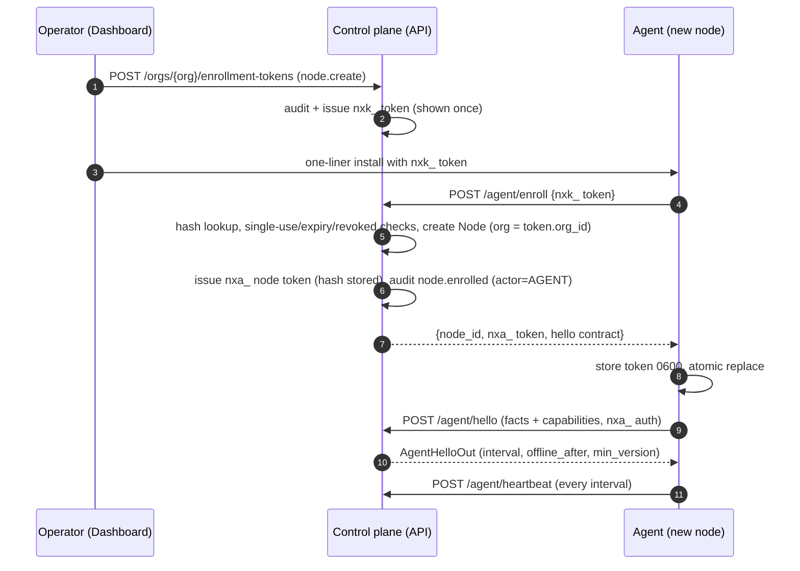
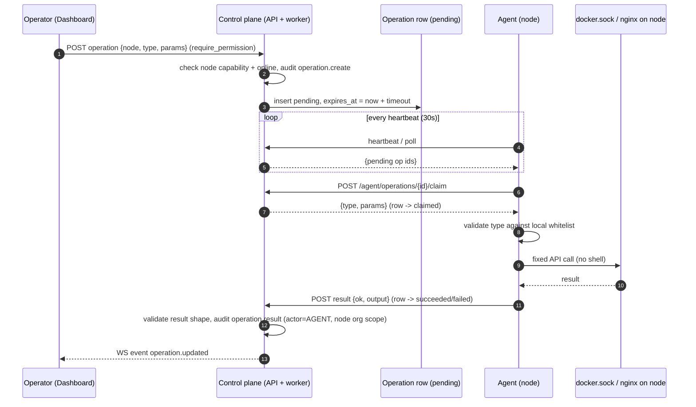

# Node & Agent Architecture

**Status:** Phases 1, 3 and 4 shipped — the node control plane below is real, bar §7.3.
**Date:** 2026-09-20 (status updated 2026-10-10)
**Companions:** [platform-vision.md](platform-vision.md) · [domain-model.md](domain-model.md) · [multi-tenancy.md](multi-tenancy.md) · [authorization.md](authorization.md)

The **operations control plane** (§5 — creation, claim, result, cancel, expiry) shipped
in Phase 1. Phase 3 shipped the rest of this document: organization-scoped enrollment
tokens (§3.2), the heartbeat v2 additions and per-node capability advertisement (§2.3,
§4.2), pull-based delivery of operations to the agent (§5.1, §5.4), credential rotation
and revocation (§3.3–§3.4), HTTPS-only transport (§6.3) and the install UX (§8.2).
Phase 4 added the `nginx` capability and the three `nginx.*` operation types to the
closed whitelist (§2.3, §5.2) — the only whitelist change since Phase 3, and still
no `node.execute`. The one section that remains a **target design** is §7.3 (agent
self-update) — upgrades are still a re-run of `install.sh`. Where a subsection below
still reads as a proposal, the *Implemented* note in it states what actually ships.

---

## 1. Scope and stance

The agent is the data plane: a stdlib-Python process on each customer machine that
reports facts and executes a **fixed whitelist** of remote operations. The control
plane never pushes commands and never sits in customer traffic. Three rules anchor
the design:

| # | Rule | Where it bites |
|---|---|---|
| 1 | **The agent pulls.** Work reaches the agent as Operation rows the agent fetches — no push tunnel, no long-lived command channel. | §5 |
| 2 | **Whitelist, not shell.** Operation types are a closed set; each maps to a permission codename and a capability gate. There is no `node.execute`. | §5.2, §6.4 |
| 3 | **One token = one node.** Agent credentials authenticate exactly one Node; the agent's org is derived from that Node row, never from payload. | §3, §6.1 |

**What is real vs simulated today** (carried from platform-vision.md §1):

| Capability | State |
|---|---|
| Agent hello/heartbeat, host metrics, docker observation, container inventory, token rotation | **Real** (`agent/nexusops_agent.py`, `server_service.py`) |
| Enrollment v2 (`nxk_` tokens), capabilities, operation delivery + execution, rotation/revocation, HTTPS-only | **Real** (Phase 3) — see §3.2, §4.2, §5, §6.3 |
| Deployment runner | **Simulated** — `SimulatedDeploymentRunner` renders fake docker-style step logs, no real work (`backend/app/providers/deployment_runner.py:107`) |
| `sim://` monitor transports, `docker_sim` provider | **Simulated** demo/CI tooling (`backend/app/providers/docker_sim.py:39-100`) |
| nginx capability + `nginx.*` ops (`bootstrap`, `apply`, `status`) | **Real** (Phase 4) — the agent reports a full routing pre-flight and renders/atomically applies control-plane bundles; `nginx/` still serves only the dashboard, which is a different nginx (domain-routing.md §1) |

## 2. The Node concept

**Node = the existing `Server` entity**, renamed at the API/UI layer only. Table
`servers` is kept to avoid FK churn (domain-model.md §2.3); codenames and paths
were renamed `server.*` → `node.*` in one migration (authorization.md §2), so the
API surface is `/nodes` (with a temporary `/servers` alias).

### 2.1 Current shape (real)

| Field group | Columns (table `servers`, `backend/app/models/infra.py:42-87`) |
|---|---|
| Identity | id, org_id, name (**unique per organization** — `uq_servers_org_name`), hostname, ip_address, environment, location, description |
| Facts | os_name, os_version, arch, cpu_cores, memory_total_mb, disk_total_gb |
| Agent identity | agent_version (persisted), protocol_version (`NULL` = pre-v2), credential_revoked_at, agent_enrolled_at, last_heartbeat_at, heartbeat_interval_seconds (default 30, CHECK ≥5), offline_after_seconds. The token hash itself lives in `agent_credentials` (one row per node) because auth must resolve the node before an organization is known. |
| Status | status (`UNKNOWN/ONLINE/OFFLINE`), uptime_seconds, simulated flag (`false` for every agent-enrolled node) |
| Extra facts | `extra` JSONB, exposed over the API as `facts` (open-ended agent telemetry: disks, interfaces, kernel); `capabilities` JSONB — self-reported at hello, `{}` = unreported |

### 2.2 Changes for the target model

| Change | Detail |
|---|---|
| `+ org_id` | Tenancy root binding (multi-tenancy.md §9). **Implemented.** |
| `+ capabilities JSONB` | Self-reported at hello, stored server-side; **dispatch gating input** — ops are dispatched only to nodes reporting the required capability (platform-vision.md principle 6). **Implemented.** |
| Name uniqueness | `servers.name` unique → **per-org unique** (`uq_servers_org_name`). **Implemented.** |
| `simulated` flag fix | Real agent telemetry cleared the `simulated` flag (`_apply_agent_entry` set `row.simulated=True`); an enrolled node is now `simulated=false` from enrollment onward. **Implemented.** |

### 2.3 Capabilities (implemented, Phase 3)

Self-reported in hello v2 (§4.2), stored in `servers.capabilities` JSONB:

| Capability | Meaning | Gates ops (§5.2) |
|---|---|---|
| `docker` | docker.sock **connects and `/version` answers** — a binary on PATH is not enough | container.* ops, `logs.tail` |
| `systemd` | `/run/systemd/system` exists (init is systemd) | service ops (future) |
| `nginx` | nginx is installed, its master is running, `nginx -t` passes, listeners 80/443 are owned-or-free — reported as one `routing_eligible` verdict plus a `reason` (domain-routing.md §5). Phase 4 | `nginx.bootstrap` / `nginx.apply` / `nginx.status` |

The map is a JSONB blob with a bounded key count (`CAPABILITY_MAP_MAX_KEYS`) and
per-entry `{present, version?, api_version?}`; a new capability is a key, not a
column. An absent key or `present: false` is **unreported/unavailable**, never
"has it" — server-side dispatch and the agent's local re-check both refuse.

Capabilities are advisory-reported, **server-enforced at dispatch**: the control
plane checks `capabilities` before creating/dispatching an op, and the agent
re-checks locally before executing — a stale capability claim fails the op, not
the host.

### 2.4 DockerEndpoint — the 0..1 relation

The docker *connection* is a separate row: `DockerHost` (`infra.py:122-137`), 0..1
per node, exposed as part of the Node resource. Two origins:

| Origin | Creation | Endpoint |
|---|---|---|
| Agent-backed (this doc) | `ensure_docker_host` auto-creates one `agent://` host per server on first container telemetry (`server_service.py:459-474`) | `agent://<server-name>` |
| Manual TCP | user-configured, SSRF-guarded (`backend/app/core/ssrf.py:141-177`) | `tcp://...` |

`UNIQUE(docker_hosts.server_id)` closed the select-then-insert race in
`ensure_docker_host`: at most one Docker connection per node, enforced by the
database (`uq_docker_hosts_server_id`, Phase 3 migration).

## 3. Agent lifecycle

### 3.1 Current state (real)

| Stage | Behavior | Evidence |
|---|---|---|
| Enroll | User creates `Server` row (POST /nodes), then `POST /nodes/{id}/agent-token` issues a per-server `nxa_` token (`token_urlsafe(30)`, only the SHA-256 hash stored, raw shown once) handed to `install.sh` by hand | `backend/app/api/v1/servers.py:170-192`, `backend/app/core/security.py:103-110` |
| Install | `install.sh --server URL --token nxa_...` copies agent to `/usr/local/lib/nexusops-agent`, writes `/etc/default/nexusops-agent` at 0600 **before** the token is written | `agent/install.sh:12-41` |
| First contact | `POST /agent/hello` once at startup; server sets `agent_enrolled_at`, overwrites static facts, returns `AgentHelloOut{name, heartbeat_interval_seconds, offline_after_seconds}` | `agent/nexusops_agent.py:446-461`, `server_service.py:267-294`, `backend/app/schemas/agent.py:24-43` |
| Steady state | Heartbeat every negotiated interval (default 30s); exponential backoff `interval * 2^min(failures,4)` capped 300s on failures | `agent/nexusops_agent.py:462-490` |
| Rotation | `POST /nodes/{id}/agent-token` issues a new `nxa_` token and opens a bounded dual-token grace; the running agent collects it on its next heartbeat and persists it atomically | `server_service.rotate_agent_token`, §3.3 |
| Revocation | `POST /nodes/{id}/agent-token/revoke` — immediate, no grace, no delivery; the parked agent reports the state and stops burning requests | `server_service.revoke_agent_token`, §3.4 |

**Enrollment v2 (Phase 3, implemented).** A node is now enrolled with an
organization-scoped single-use `nxk_` token instead of a hand-carried `nxa_`:
`POST /nodes/enrollment-tokens` mints it, `POST /agent/enroll` redeems it inside
the token's organization (never the payload's), and the response's raw `nxa_`
credential is written to `/etc/nexusops-agent/token` at 0600. The legacy
`POST /nodes/{id}/agent-token` per-node token still exists for the backward-
compatibility path (§5 of the Phase 3 report); new installs use enrollment tokens.

### 3.2 Enrollment v2

**Implemented (Phase 3).** Enrollment is now an organization-scoped,
single-use, expiring, revocable `nxk_` token stored only as a SHA-256 hash
(`enrollment_tokens`, RLS-enforced). The consume is a single compare-and-set
(`used_at IS NULL AND revoked_at IS NULL AND expires_at > now()`), so two
concurrent redemptions cannot both win, and the node's organization is taken from
the token row — the payload has no org field to lie about. Endpoints:
`POST/GET /nodes/enrollment-tokens`, `POST /nodes/enrollment-tokens/{id}/revoke`,
`POST /agent/enroll`. The organization-scoped lookup runs in an audited system
scope (the same documented carve-out `api_keys`/`agent_credentials` use) because
the hash must resolve *before* an organization is known.

> **Reconciliation note:** multi-tenancy.md §6 says "the current global
> enrollment token (env var)" is deprecated in the tenancy phase; no such global
> env-var credential exists — today's enrollment credential is the per-server
> `nxa_` token hashed in `servers.agent_token_hash` (§3.1) and handed to
> install.sh manually. That sentence is stale in the spine doc; the
> `enrollment_tokens` table below supersedes the per-server `nxa_` token, not an
> env var.

**The `enrollment_tokens` table (new):**

| Column | Purpose |
|---|---|
| id, org_id, created_by_id | Org-scoped, audited creation |
| token_hash | SHA-256 only; raw shown once at creation |
| single_use (bool) | Always true in v1 — multi-use is cut (decision in open question 4); fleet bootstrap = automation loops minting one single-use token per node per wave |
| expires_at | Short TTL (default 1h, max 7d) |
| revoked_at | Kill switch, independent of expiry |
| node_id? | Optional: claim a pre-created placeholder Node |
| used_at, used_by_node_id | Consumed at successful enroll; format `nxk_` (distinct from node tokens `nxa_`) |

**Rules (all implemented):** the agent's org comes from the token row — never
from payload, header, or untrusted lookup (multi-tenancy.md §2). Enrollment
creates or claims the Node row (name from hostname, per-org dedup, `ONLINE` on
first hello) in the same transaction that consumes the token. Enrollment is
audited (`enrollment_token.create` / `.revoke`, `node.enroll`); node credential
use is attributed to the node.

**Sequence — enrollment v2:**


```mermaid
sequenceDiagram
    autonumber
    participant U as Operator (Dashboard)
    participant CP as Control plane (API)
    participant A as Agent (new node)

    U->>CP: POST /orgs/{org}/enrollment-tokens (node.create)
    CP->>CP: audit + issue nxk_ token (shown once)
    U->>A: one-liner install with nxk_ token
    A->>CP: POST /agent/enroll {nxk_ token}
    CP->>CP: hash lookup, single-use/expiry/revoked checks, create Node (org = token.org_id)
    CP->>CP: issue nxa_ node token (hash stored), audit node.enrolled (actor=AGENT)
    CP-->>A: {node_id, nxa_ token, hello contract}
    A->>A: store token 0600, atomic replace
    A->>CP: POST /agent/hello (facts + capabilities, nxa_ auth)
    CP-->>A: AgentHelloOut (interval, offline_after, min_version)
    A->>CP: POST /agent/heartbeat (every interval)
```

### 3.3 Token storage & rotation with dual-token grace

| Side / aspect | Before | Phase 3 (implemented) |
|---|---|---|
| Control plane | SHA-256 hex hash only; raw shown once (`security.py:103-110`) | unchanged + `agent_credentials.previous_token_hash`, `previous_expires_at`, `pending_token_ciphertext` (encrypted) and `rotation_applied_at` for the grace window |
| Agent file | `/etc/default/nexusops-agent` written 0600 **before** the token lands (`agent/install.sh`) | `/etc/nexusops-agent/token` 0600 root:root; atomic `os.replace` (temp + rename + fsync) |
| Agent env | `NEXUSOPS_SERVER` / `NEXUSOPS_TOKEN` / `NEXUSOPS_INTERVAL` env file | same names kept (`NEXUSOPS_TOKEN_FILE`, `NEXUSOPS_CA_BUNDLE` added); install.sh flow unchanged for compat |
| Rotation | kills the old token instantly (`server_service.py:255-264`) — running agents 401 at next beat and need manual reinstall | dual-token grace, default 24h (settings; per-rotation override incl. `grace=0` for compromise); pending new token delivered in the **heartbeat response** while the old token still authenticates (hello happens only at process start — §3.5 — so the heartbeat is the only channel a running agent polls); old token accepted for heartbeats + rotation delivery until the deadline |
| Revoke | not an action (revoke = rotate) | **separate action** (`POST /nodes/{id}/agent-token/revoke`): kill now, no grace, no delivery |

**Why delivery-via-heartbeat:** hello re-negotiation happens only on process
restart (§3.5) and the agent hellos exactly once at startup, so the heartbeat is
the only beat a running agent keeps. The running agent already authenticates with
the old token; it learns of the pending rotation on its next heartbeat, receives
the new raw token in the heartbeat response over HTTPS, persists it atomically,
and switches — the same piggyback pattern as ops delivery (Open question 2). A
node that never checks in (no accepted heartbeat) within grace shows "token
stale" — operator re-enrolls (§3.4). A stolen old token could also fetch the new
one during grace; the short default (24h) plus the rule that compromise response
is **revoke** (zero grace), not rotate, bounds that.

**Delivery contract:** the pending new raw token is served ONLY to requests
authenticated with the OLD hash — never to a request bearing the new token — and
until the agent's next heartbeat carries a `rotation_applied` flag (or the grace
deadline passes), the server re-sends it on every accepted heartbeat; the flag
ends re-delivery and may shorten grace. A crash between receive and persist
therefore self-heals on the following beat.

### 3.4 Revocation semantics — fixing the 401 hot-loop

**Implemented (Phase 3).** A revoked/rotated-over agent once 401'd and
`exit(1)`'d; systemd `Restart=always` + `RestartSec=10`
(`agent/nexusops-agent.service`) then restarted it every 10s **forever** — a hot
loop of rejected requests. Both sides were fixed:

| Side | Change |
|---|---|
| Agent | On 401 from heartbeat **do not exit**: enter `revoked` state — sleep at a long fixed cadence (15 min) and re-attempt hello with the same token. Log once per state entry, rate-limited after. |
| Server | 401 error codes distinguish `AGENT_TOKEN_UNKNOWN` (no such token) from `AGENT_TOKEN_REVOKED` (explicitly revoked) so the agent log is definitive. |
| Unit | `Restart=always` stays (crash resilience); the agent itself no longer exits on auth rejection, so no restart storm. |
| Operator UX | Node row shows `REVOKED`/`TOKEN_STALE`; re-enroll = fresh enrollment token, not a reinstall. |

Revocation itself is immediate: token-hash lookup is per-node, so killing one
node's token never affects the org's other nodes (multi-tenancy.md §6).
Immediacy is the invariant: token acceptance is never cached across a
rotate/revoke — the per-request DB hash lookup is what makes "immediate" true.
Any future accept-cache or per-node limiter keyed on the token must be
invalidated synchronously on rotate/revoke.

Identity honesty: node identity is bearer-token possession. A cloned agent (the
token copied to a second host) is indistinguishable and interleaves its writes
into one node row — hello silently overwrites the hostname and the other static
facts (`server_service.py:271-286`). Containment is per-node scoping + fast
revoke, not detection; the cheap tripwire is an event/alert when hello changes
the hostname or IP on an existing node.

### 3.5 Reconnect / offline states

| State | Entered when | Mechanism |
|---|---|---|
| `ONLINE` | heartbeat accepted | status set per beat (`server_service.py:300-358`) |
| `OFFLINE` | no heartbeat within `offline_after_seconds` (per-node override, else `settings.server_offline_after_seconds` = 90s, `backend/app/core/config.py:76`) | status-guarded bulk sweeper vs DB `func.now()` + one CRITICAL alert per transition (`server_service.py:379-453`) |
| Reconnect | next accepted beat | back to `ONLINE` + once-per-day deduped event (`server_service.py:334`) |
| `TOKEN_STALE` / `REVOKED` | grace deadline passed with no accepted heartbeat (rotation never delivered) / explicit revoke (`credential_revoked_at`) | `credential_revoked_at` on the node row surfaced to the UI; the agent idles in `revoked` polling — `REVOKED_POLL_SECONDS` = 900 (§3.4) |

Agent-side reconnect is unchanged: backoff caps at 300s
(`agent/nexusops_agent.py:490`); hello re-negotiation happens only on process
restart — deliberate simplicity v2 keeps, and is safe because rotation delivery
rides the heartbeat response (§3.3), not hello.

## 4. Heartbeat contract v2

### 4.1 Wire contract today (real, pinned by tests)

`backend/tests/test_agent_contract.py:48-191` imports the real agent module and
validates its payloads against the real schemas — wire drift fails CI.

| Call | Payload (schema) | Response | Auth + limits |
|---|---|---|---|
| `POST /agent/hello` | `AgentHelloIn`: agent_version, **protocol_version**, os_name, os_version, arch, cpu_cores, memory_total_mb, disk_total_gb, hostname, **capabilities**, **facts** | `AgentHelloOut{server_id, name, heartbeat_interval_seconds, offline_after_seconds, protocol_version, min_agent_version}` | nxa_ token; 30/min per IP |
| `POST /agent/heartbeat` | `AgentHeartbeatIn`: cpu/mem/disk/load/uptime + net_rx_kb_s/net_tx_kb_s (nullable) + rotation_applied + containers[] | **204 for a protocol-1 agent**; **200 + `pending_operations` + `token_rotation` for a protocol-2 agent** | nxa_ token; per-node limit (§4.2) |

Wire facts that matter:

| Fact | Detail | Evidence |
|---|---|---|
| `extra=forbid` | any unknown key 422s the **whole** beat (`schemas/base.py:14`) | contract evolution must be additive + versioned |
| Container statuses | wire subset `{RUNNING,EXITED,PAUSED,CREATED,RESTARTING,DEAD}`; REMOVED never travels — absence reconciles | `schemas/agent.py:13-21` |
| Caps | agent list 50, inspect 10, stats 12, schema max 200; absence trusted as removal **only** when payload < 50 | `AGENT_CONTAINER_CAP` `schemas/agent.py:21`, `agent/nexusops_agent.py:147,185,197`, `server_service.py:607` |
| health must be null | `""` 422s the beat | `test_agent_contract.py:6-9` |
| No client timestamps | `observed_at`/`last_heartbeat_at` are server receive times — no clock-skew surface | `server_service.py:312-315,521` |
| `net_rx_kb_s`/`net_tx_kb_s` | **measured** from `/proc/net/dev` deltas over non-loopback interfaces; **`null`** when not measurable (first sample, no interface, counter reset/negative delta) — never a fabricated `0.0` | `agent/nexusops_agent.py` `network_rates()` |
| `rotation_applied` | v2 only: the agent's ack that it persisted a rotated credential; ends re-delivery and closes the grace window. Ignored (absent) for v1. | `schemas/agent.py` `AgentHeartbeatIn` |

### 4.2 v2 additions (implemented, Phase 3)

| Change | Direction | Notes |
|---|---|---|
| `capabilities` block in hello | agent → server | `{docker: {present, api_version}, nginx: {present, version}, ...}`; persisted to `servers.capabilities` (§2.3) |
| `agent_version` actually persisted | agent → server | hello sends it and the control plane now stores it on `servers.agent_version` (§7.1) |
| User-Agent telemetry | agent → server | `nexusops-agent/{version}` sent on every call (`agent:366`), ignored server-side — record it on every ingest as a cheap cross-check |
| `net_rx_kb_s`/`net_tx_kb_s` honest | agent → server | implement via `/proc/net/dev` deltas (stdlib) or drop the fields — never render zeros as data |
| `AgentHelloOut` negotiation | server → agent | the existing negotiation channel (`schemas/agent.py:37-43`) gains: `min_agent_version`, future feature flags; `token_rotation` (§3.3) rides the **heartbeat response** instead — hello happens only at process start (§3.5), so a running agent would never see it |
| Facts merge policy | server | hello continues to overwrite static facts (`server_service.py:271-286`) but writes additionally into `extra` (disks, GPU, systemd units) instead of inventing columns per fact — domain-model.md §2.3's "+ facts columns" is realized as fact keys on the existing `extra` JSONB (one flexible column populated, not new physical columns) |
| Rate-limit fairness | server | moves from per-client-IP (`backend/app/core/rate_limit.py:69` — NAT'd fleets share one 600/min bucket) to **per-node after auth** |

**Protocol negotiation (implemented).** The wire now carries
`protocol_version`: `AGENT_PROTOCOL_VERSION = 2` is what the control plane speaks,
`MIN_SUPPORTED_AGENT_PROTOCOL = 1` is the oldest agent still accepted (the pre-v2
contract), and `MIN_AGENT_VERSION` is the security-floor agent build. A v1 agent
omits `protocol_version` (the field defaults to `1`, never to "supports the new
one") and keeps receiving `204` from `/agent/heartbeat`; a v2 agent sends `2` and
receives the `200` body with `pending_operations` and `token_rotation`. Because
`extra="forbid"` 422s unknown fields, the transition is negotiated at hello
rather than discovered — the server lowers itself to the agent's version for
cadence and fields. The strength this preserves: the agent's op whitelist is
compile-time (§5.2, §6.4), so a malicious server cannot make an old agent accept
new op types — negotiation governs cadence and fields, **never capability**.

## 5. The Operations framework

> **Status (2026-10-09): shipped end to end.** The `operations` table, the CAS
> state machine (claim / result / cancel / expiry), the whitelist registry, the
> per-type permissions and the audit rows are Phase 1 work. Phase 3 added the two
> pieces this section previously marked unimplemented: **per-node capability
> advertisement** (`servers.capabilities`, reported at hello, gating dispatch —
> §2.3) and **heartbeat delivery** of pending op ids (the v2 heartbeat response
> carries `pending_operations`; a v1 agent keeps the 204 contract unchanged). The
> reference agent now claims, executes and reports the whitelisted types through a
> closed local registry (`agent/nexusops_agent.py`), so the framework is exercised
> `Dashboard → pending → claim → Docker call → result` by
> `tests/integration/test_phase3_nodes.py` and the agent's own unit tests. The
> approved codenames are reused exactly as specified; no `node.execute` grant was
> added.

### 5.1 Model and lifecycle

One new table, `operations` (domain-model.md §2.3): org_id, node_id, type
(whitelist), params JSONB, status, requested_by_id, result JSONB, timestamps,
`available_until` (queue deadline), `execution_deadline` (post-claim), and
`expires_at` (hard deadline — see the deadline rules below).

| Status | Meaning |
|---|---|
| `pending` | created, awaiting agent pickup |
| `claimed` | agent fetched it (single in-flight op per node) |
| `running` | agent reported execution started |
| `succeeded` / `failed` | terminal, result stored |
| `expired` | no result before `expires_at` |
| `cancelled` | user cancelled while pending |

Lifecycle rules:

- **Pull only.** The agent discovers work by polling; the control plane never
  opens a connection to the node. Delivery rides the heartbeat cycle (pending op
  ids in the heartbeat response — see Open question 2 for the alternative).
- **Serialize.** One in-flight op per node, executed strictly sequentially.
- **Claim is a single compare-and-set.** `pending → claimed` happens in one
  conditional update recording `claimed_at` and an `attempts` counter; a second
  claimant loses the CAS and sees the current state.
- **Four separate deadlines, not one** (Phase 3 fixed a queue-vs-execution
  conflict: a 30s type timeout and a 30s heartbeat meant an op created just after
  a beat could expire before it was ever collected).
  - **Queue deadline** — `available_until` = `max(type timeout, 3 × heartbeat
    interval, agent_delivery_min_seconds)`, set at creation. Claim is gated on
    `available_until > now`, so a delayed heartbeat still collects a queued op.
  - **Execution deadline** — set when the claim wins: `execution_deadline = now +
    type timeout`, the bound the agent enforces locally.
  - **Result-reporting grace** — on claim, `expires_at` moves out to
    `execution_deadline + agent_result_grace_seconds`, so a slow node can report a
    result for one extra heartbeat after its own deadline; the sweep still expires
    at `expires_at`.
  - **While pending**, `expires_at` equals `available_until` (the hard queue
    bound). Claim and result both refuse a row past `expires_at` regardless of
    stored status; the sweep expires at `expires_at`. This bounds replay of a
    backup-restored `pending` row and guarantees an operation is never executable
    indefinitely. Deterministic tests cover just-after-heartbeat creation, a
    delayed heartbeat, a late claim, a slow execution and a late result.
- **Results only from claimed/running; terminal states immutable.** A result
  against a `pending`, `expired`, or `cancelled` row is refused; once
  `succeeded`/`failed`/`expired`/`cancelled`, the row never transitions again. A
  late duplicate result after expiry is a 200 no-op; the row stays terminal.
- **The expiry sweep covers pending AND claimed alike.** A claimed op whose agent
  dies before reporting is expired by the same sweep — never stuck. **Decision:
  no automatic re-queue on agent crash.** Re-delivering a possibly-executed op to
  a possibly-alive agent risks double execution of a non-idempotent op; the row
  is left to expire (`expired` + audit `operation.expire`) and the operator
  re-issues a fresh op. The `attempts` counter stays in the schema to bound any
  future re-queue and to make claim-retry storms visible.
- **Timeouts** per-type (§5.2), enforced control-plane-side via the deadlines
  above and the ops sweeper; the agent also enforces a local deadline
  (`min(type timeout, remaining)`) and reports a timeout failure rather than
  hanging.

**Sequence — operation dispatch end-to-end:**


```mermaid
sequenceDiagram
    autonumber
    participant U as Operator (Dashboard)
    participant CP as Control plane (API + worker)
    participant DB as Operation row (pending)
    participant A as Agent (node)
    participant D as docker.sock / nginx on node

    U->>CP: POST operation {node, type, params} (require_permission)
    CP->>CP: check node capability + online, audit operation.create
    CP->>DB: insert pending, expires_at = now + timeout
    loop every heartbeat (30s)
        A->>CP: heartbeat / poll
        CP-->>A: {pending op ids}
    end
    A->>CP: POST /agent/operations/{id}/claim
    CP-->>A: {type, params} (row -> claimed)
    A->>A: validate type against local whitelist
    A->>D: fixed API call (no shell)
    D-->>A: result
    A->>CP: POST result {ok, output} (row -> succeeded/failed)
    CP->>CP: validate result shape, audit operation.result (actor=AGENT, node org scope)
    CP-->>U: WS event operation.updated
```

### 5.2 Whitelisted operation types

**This table is the entire exec surface. Nothing outside it ships; adding a type is
a schema-registry change + contract tests + review, never a params pass-through.
No companion doc may invent an op type outside this registry table** — the
secret/cert delivery types the companions cite (`secret.env.apply` from
secrets-architecture.md §7, `certificate.install`/`certificate.remove` from
certificate-management.md §6) appear here as *reserved* rows and ship only with
secret/cert delivery, behind their own review.

| Type | Params (validated schema) | Result | Permission codename | Capability | Timeout |
|---|---|---|---|---|---|
| `container.start` | container_id | new status | `container.lifecycle` | docker | 60s |
| `container.stop` | container_id | new status | `container.lifecycle` | docker | 60s |
| `container.restart` | container_id | new status | `container.lifecycle` | docker | 60s |
| `container.remove` | container_id, force? | removed | `container.remove` | docker | 60s |
| `logs.tail` | container_id, tail ≤ 500, since? | bounded line batch | `container.logs` | docker | 30s |
| `nginx.bootstrap` | `{}` | one-time: create the managed dirs and an empty managed config, add the two include lines (`nexusops.conf`, `routes.d/*.conf`) to the system `nginx.conf`, `nginx -t`, reload — rolling the system file back on any failure | `domain.manage` | nginx | 60s |
| `nginx.apply` | `bundle` (fingerprint + manifest + allowlisted files), `reload` | staged → `nginx -t` → atomic swap → reload, with rollback; reports `applied`/`failed`/`rolled_back`/`rollback_failed` | `domain.manage` | nginx | 60s |
| `nginx.status` | `{}` | live fingerprint, nginx version, `nginx -t` result — bounded, read-only | `domain.manage` | nginx | 30s |
| `secret.env.apply` | *reserved* — defined by secrets-architecture.md §7 | delivery ack, never values | assigned with its own review | — | per §7 |
| `certificate.install` / `certificate.remove` | *reserved* — defined by certificate-management.md §6 | file-write result, never key material | assigned with its own review | — | per cert doc |

Notes:

- Codenames per authorization.md §2 — **`node.execute` is deliberately not added**;
  container ops reuse the existing `container.lifecycle`/`container.remove`/
  `container.logs` codenames, nginx ops sit under `domain.manage`. Dispatch
  refuses any type whose capability the node has not reported (§5.4, §2.3).
- nginx ops presuppose the routing subsystem (domain-routing.md, future); the
  agent validates configs with `nginx -t` before apply and keeps the previous
  config for rollback (ProxyProvider contract, domain-model.md §2.4). `nginx -t`
  validates syntax only — an injected `location`/`proxy_pass` block passes it —
  so it is availability/anti-bricking (with rollback), not a security control;
  the injection defense is domain-routing.md §6.2's allowlists: hostnames
  anchored to verified Domains, structured fields under `extra=forbid` schemas,
  rendered config as a projection of DB state.
- The control-plane container actions for provider-backed hosts
  (`container_service.trigger_action`) remain separate; for agent-backed nodes the
  path is now Operation rows through this framework: same permission, same audit,
  one delivery mechanism.

### 5.3 Result reporting and audit

- Result shape is per-type validated server-side, bounded in size; failures carry
  a stable error code + sanitized message (provider-style `sanitize_error`,
  `backend/app/providers/base.py:26-49` — no raw daemon bodies).
- Op results are agent-asserted, never verified: the platform's guarantee is
  attribution and bounded blast radius, not execution proof. Downstream consumers
  (re-render, dashboards) must treat success as a report, not a fact.
- Every transition emits `operation.*` events to the org-scoped event feed; the
  dashboard watches via WS (org-prefixed channels, multi-tenancy.md §5).
- Audit rows: `operation.create` (user actor), `operation.claim`,
  `operation.result` (agent actor), `operation.cancel`, `operation.expire`
  (system) — append-only, org-scoped (domain-model.md §2.6); agent ingestion of
  results runs under the **node's org scope** (multi-tenancy.md §4, §6), so a
  machine-triggered write stays tenant-correct.

### 5.4 The boundary, as built (creation / claim+result / delivery)

Three parties touch an operation, and each has exactly one authority. Keeping
them separate is what stops the framework from becoming a privilege-escalation
path: none of them can substitute for another, and the agent is never given a
generic execution grant.

| Stage | Who | Authority | Enforced by |
|---|---|---|---|
| **Creation** | a human operator | a **per-type permission** in the active organization (`container.lifecycle` / `container.remove` / `container.logs` — *not* a generic `node.execute`), on a node that exists in that org, is enrolled and is not OFFLINE | `api/v1/operations.py` (`_require_type_permission`), `operation_service.create_operation` |
| **Claim / result** | a node agent | its `X-Agent-Token` only. The token resolves to exactly one `(node, org)`; claim and result carry **both** `node_id` and `org_id` in their CAS, so a token can never touch another node's work — even inside its own tenant | `api/v1/agent.py` (`require_server`), `operation_service.claim_operation` / `record_result` |
| **Delivery** | the node's own agent | it pulls: the v2 heartbeat response carries `pending_operations` ids for **that** node, the agent claims each (a per-node CAS), executes locally and reports. The control plane never opens an inbound connection; the agent router exposes no GET | `api/v1/agent.py` heartbeat (`pending_operations`), `operation_service.available_for_node` / `claim_operation` |

**Why it cannot escalate.**

- **No new grant, no widening.** The op surface reuses existing codenames; the
  registry contract test (`tests/unit/test_operation_registry.py`) fails if a
  type names an unknown codename, invents an `*.execute` grant, or ships without
  a spec. Adding a type is a reviewed registry + migration change.
- **Creation is org- and permission-scoped.** A user with `container.logs`
  cannot create a lifecycle op, because the check is on the *type's* permission.
  A `node_id` from another tenant is a 404 (guard + RLS), so dispatch is not an
  existence oracle either.
- **Params are closed per type** (`extra="forbid"`): a lifecycle op cannot carry
  a log-tail or an arbitrary command, and there is no free-form field. The agent
  is asked to do one of a fixed set of things, never to run a string.
- **The agent cannot reach sideways.** Claim/result resolve the node from the
  token and act inside that node's org scope; a foreign operation id is absent,
  not forbidden. A token for node X cannot claim node Y's op in the same org,
  nor an op in another org.
- **Results are data, not authority.** A result is bounded and redacted before
  storage, is never treated as proof of execution, and terminal states never
  transition — a replayed claim or duplicate result is a no-op.
- **RLS backs all of it.** `operations` carries `org_id` and the same two
  policies as every tenant table, so the database refuses a cross-tenant read or
  write even if the ORM guard were bypassed.

**The capability boundary (Phase 3, implemented).** Dispatch now asks "does
*this* node have capability C?" and refuses otherwise, fail-closed on two
axes with distinct codes: **unreported** (`capabilities` empty — a v1 agent or a
node that never completed a v2 hello) is `409 NODE_CAPABILITY_UNVERIFIED`, and
**reported absent/malformed** (`docker: {present: false}`) is `409
NODE_CAPABILITY_MISSING`. Absence of data is never read as "has the capability".
The registry-level companion check rejects a type whose capability is not in
`KNOWN_CAPABILITIES`. A stale or falsely-reported server-side claim is not a
safety hole: the agent re-checks its own closed registry and local capability
before executing, so a lie fails the operation rather than running something
unsafe.

**Reserved types are not shipped.** `nginx.*`, `certificate.*` and
`secret.env.apply` remain in §5.2 as reserved rows only; they are absent from the
enum and the registry, so a dispatch of one is a 422 and a raw insert is rejected
by the `ck_operations_type_valid` CHECK
(`test_no_reserved_phase2_type_is_dispatchable`,
`test_the_database_whitelist_rejects_an_unregistered_type`).

## 6. Agent security

### 6.1 Token scope

| Property | Before | Phase 3 (implemented) |
|---|---|---|
| Scope | one token = one server's telemetry writes; no GET endpoints on the agent router, no cross-server reach, no command channel (`docs/agent.md:23-29`) | unchanged in kind, widened surface: + op claim/result + credential delivery, still node-scoped only |
| Blast radius | stolen `nxa_` token = **permanent, non-expiring write credential to one server**: overwrite host facts unvalidated, forge metrics, upsert fake containers, force ONLINE | same one-node bound, but: rotation grace deadline, immediate revocation (no grace), node-attributed audit |
| Org derivation | none exists | org always from the token's node row — never payload/header (`multi-tenancy.md` §2, §6) |
| Rate-limit fairness | per client IP — NAT'd fleets shared buckets (`core/rate_limit.py:69`) | **per-node after auth** for authenticated agent routes; a cheap per-IP ceiling still covers pre-auth floods (§4.2) |

### 6.2 docker.sock is root-equivalent

The systemd unit grants `SupplementaryGroups=docker`
(`agent/nexusops-agent.service`) — anything the daemon can do, the agent's
context can do, i.e. root on the host. The agent now issues lifecycle
(start/stop/restart/remove) and log calls through the closed registry (§5.2,
§6.4). Containment is therefore **protocol-level, not OS-level**:

| Layer | Control |
|---|---|
| Control plane | whitelist (§5.2) + capability gate + permission codename + audit before an op ever reaches a node |
| Agent | fixed type→API-call map (`OPERATION_REGISTRY`, docker HTTP over the socket, no `exec`, no `create`, no `/sbin` shelling); params re-validated against the same per-type shape plus a local capability re-check; local per-op deadline |
| Never | `/containers/{id}/exec`, arbitrary image pulls, host mounts, privileged creates — not in the map, not parameterizable |

### 6.3 Transport: HTTPS-only

**Implemented (Phase 3).** The agent refuses to send *any* credential over plain
HTTP to a non-local server, **before** a request is constructed — there is no
override flag. `--allow-insecure-transport` and the `--insecure`
`ssl._create_unverified_context()` path were removed in accordance with the
roadmap: certificate verification is never disabled, and a private/self-hosted CA
is trusted through `NEXUSOPS_CA_BUNDLE` (or the system trust store). Only
**genuine loopback** targets are exempt from the HTTPS requirement — the exact
name `localhost`, `127.0.0.0/8`, `::1` and IPv4-mapped loopback, where the
credential cannot leave the host. Everything else requires `https://` with
verification enabled, including link-local (`169.254.0.0/16`, `fe80::/10`), the
private LAN, public addresses and every DNS name (a look-alike such as
`localhost.evil.example` is treated as remote). The token authenticates every
call, and the enrollment
token (§3.2) is more sensitive still — it mints node identities — so the same rule
applies to enrollment (§3.2) and rotation delivery (§3.3). install.sh only enrolls
against `https://`, and it reports an untrusted-cert failure with the exact
CA-install instruction rather than downgrading.

### 6.4 No arbitrary exec

- No `node.execute` codename exists or will be added (authorization.md §2) — a
  generic execute permission is the anti-pattern this design exists to prevent.
- Payloads are data, never executed (`schemas/agent.py:1`; `extra=forbid` via
  `APIModel`, `schemas/base.py:14`).
- The whitelist is closed (§5.2); a new operation type needs schema + contract
  test + codename mapping + capability gate + review — the same bar as a
  permission-registry change. General exec, if ever justified, gets its own
  codename **plus stricter approval**, never a params pass-through.

## 7. Versioning & upgrades

### 7.1 Version visibility (implemented)

`servers.agent_version` is now persisted from hello (and refreshed from the
`User-Agent` on ingest as a cheap cross-check); `protocol_version` records what
was negotiated. The node resource exposes both, and `AgentHelloOut` carries
`min_agent_version` so the agent learns the security floor at hello.

| Step | Change |
|---|---|
| Persist | hello persists `agent_version`; every ingest updates it from User-Agent (`nexusops-agent/{version}`) as a fallback. **Implemented.** |
| Surface | Node detail shows agent version, protocol version and enrolled-at. **Implemented.** |
| Negotiate | `AgentHelloOut.min_agent_version` (§4.2): the agent learns the floor at hello. **Implemented.** |
| Fleet view | *Not built* — version distribution across the nodes page is deferred; version drift is visible per node today. |

### 7.2 Out-of-date handling

| Level | Behavior |
|---|---|
| Warn | node UI banner when `agent_version` < `min_agent_version` (setting) |
| Degrade | ops dispatch refused to nodes below the protocol floor with a clear reason (old agents lack new op types; `extra=forbid` means old agents 422 on new heartbeat fields — hence additive versions, negotiated at hello) |
| Block (rare) | security-floor version: ingestion rejected with `AGENT_UPGRADE_REQUIRED` (403-class), agent surfaces it in `revoked`-style polling state |

### 7.3 Future: self-update

**Not in the v1 whitelist.** Sketch for a later phase: the control plane stamps a
target version into the hello response; the agent fetches a signed release over
HTTPS, verifies it, replaces its own file atomically, and restarts under systemd
(`Restart=always` makes that safe). Until then, upgrades are a re-run of install.sh.
Self-update is never an Operation type — an op queue that can replace the agent is
a self-modifying exec surface.

## 8. Install UX

### 8.1 Today (real)

`agent/install.sh` (`agent/install.sh:12-41`): `sudo ./install.sh --server URL
--token nxa_... [--interval 30]` — flags only, re-run updates in place. Copies
`nexusops_agent.py` to `/usr/local/lib/nexusops-agent`, writes the env file 0600
**before** the token is written (no 0644 secret window), installs the hardened
systemd unit with `enable --now`; non-systemd systems print the manual command.
**~~Broken hint~~ — FIXED (Phase 0):** the API's `install_hint` used to tell
users to set `NEXUSOPS_URL` (`backend/app/api/v1/servers.py`), which neither the
agent (`NEXUSOPS_SERVER`, `agent/nexusops_agent.py`) nor install.sh reads, so
following the hint enrolled nothing. It now prints the real install.sh
invocation and names the env vars it writes. install.sh now also accepts
`NEXUSOPS_ENROLL_TOKEN` (an org-scoped single-use `nxk_` token) and reads the
credential from the environment rather than argv (§8.2).

### 8.2 One-liner and token delivery (implemented bar the curl step)

```
sudo NEXUSOPS_ENROLL_TOKEN=nxk_... NEXUSOPS_SERVER=https://<control-plane> \
     bash agent/install.sh
```

The control plane does not yet serve `install.sh` over HTTPS (so the
`curl … | sudo bash` self-serve fetch is still a target); the operator ships the
script to the node and runs it with the environment above.

| Property | Status |
|---|---|
| Server URL | passed as `NEXUSOPS_SERVER` (or `--server`); deriving it from a download host lands with the curl step |
| Token | org-scoped single-use enrollment token (§3.2) minted in the dashboard "Add node" dialog, TTL 1h default; delivered via `NEXUSOPS_ENROLL_TOKEN` or a hidden `read -rs` prompt — never a CLI argument (argv leaks into shell history and the target's process list). **Implemented.** |
| Flow | script installs agent → `POST /agent/enroll` exchanges `nxk_` for the node `nxa_` token → hello v2 reports facts + capabilities → node appears live. **Implemented.** |
| Post-install | re-run = repair/upgrade in place; an already-stored node credential wins over a re-presented `nxk_` token, so a restart never burns the enrollment token twice. A printed dashboard deep link is not built yet. |

Two bootstrap details pinned here: **token delivery** — the enrollment token
never appears as a command-line argument; the script reads
`NEXUSOPS_ENROLL_TOKEN` from the environment or falls back to a hidden
`read -rs` prompt, keeping the pasted command clean in shell history and `ps`.
**TLS bootstrap** — under HTTPS-only (§6.3) there is no insecure-transport
override; a self-hosted control plane with a private CA is trusted by installing
that CA into the system trust store or by pointing `NEXUSOPS_CA_BUNDLE` at it.

This one-liner plus heartbeat v2 **is** the wedge demo (platform-vision.md §2.2):
"install agent on your box → node appears with live stats."

## Open questions

1. **Grace-window default:** is 24h the right rotation grace for rarely-heartbeating
   fleets (long offline stretches miss the delivery)? Longer grace widens the
   stolen-token fetch window (§3.3).
2. **Ops delivery channel:** piggyback pending-op ids on the heartbeat response
   (fewer endpoints, latency ≤ interval) vs a dedicated `GET /agent/operations`
   poll (independent latency, extra auth surface). Lean heartbeat-piggyback.
3. **`logs.tail` vs sweep collection:** the 30s whole-host sweep already ships
   container logs (`maintenance.py:152-188`); are `logs.tail` ops for *live follow*
   only, or does op-based collection replace sweep collection for agent-backed nodes?
4. **Multi-use enrollment tokens — decided, cut from v1.** One single-use token
   per node, minted per fleet wave (automation loops). A multi-use token is a
   standing org-enrollment credential whose leak lets an attacker enroll
   attacker-controlled nodes within TTL; cutting is the cheaper and safer answer.
5. **nginx capability proof:** self-reported hello claims — does v1 require a
   lightweight probe (`nginx -v` at hello) before `nginx.*` ops dispatch, or is
   claim + op-failure feedback enough?
