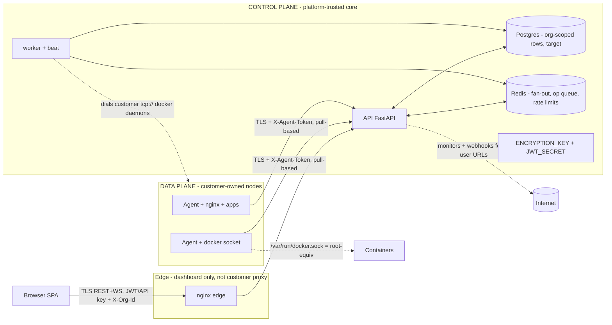

# Platform Security Model — NexusOps

**Status:** Proposal for review — not yet approved for implementation.
**Date:** 2026-09-21
**Companions:** [platform-vision.md](platform-vision.md) · [domain-model.md](domain-model.md) · [multi-tenancy.md](multi-tenancy.md) · [authorization.md](authorization.md)
**Supersedes:** [security.md](security.md) (single-tenant audit doc; its controls remain accurate and are re-listed in §7)

## 1. Scope, stance, and simulation honesty

NexusOps is becoming a multi-tenant control plane for customer-owned machines. The security
model therefore has two halves:

- **What is enforced today** — grounded in code, path:line cited. Today's deployment is
  single-tenant: every flat permission (e.g. `server.read`) sees every row; there is no
  Organization, no org_id anywhere in the 31-table schema (findings, data-model report).
- **What is specified (target)** — design commitments for the multi-tenant platform, marked
  *(target)*. Where a mitigation is only designed, the threat-model table says so.

**Consistency vocabulary:** Organization / Membership / Node (=Server) / Project /
Environment (project-scoped) / Domain / Route / Certificate / Operation / Secret /
SecretVersion. Permission codenames below use **target** naming (`node.*`); current code
uses `server.*` pending the Phase 1 rename (authorization.md §2). There is deliberately
**no `node.execute`** — see the RCE row in §5.

### 1.1 Real vs simulated today (do not mistake one for the other)

| Capability | Status | Evidence |
|---|---|---|
| Auth, sessions, RBAC registry, API keys, audit, agents, heartbeats, container inventory, logs, metrics, monitors, incidents, secrets store | **Real**, deployed | findings reports 3–7 |
| Deployments | **Simulated.** `SimulatedDeploymentRunner` renders 7 docker-style steps, performs no real work | backend/app/providers/deployment_runner.py:107 |
| Docker provider for demo/CI | **Simulated.** `docker_sim` provider + global `SIMULATION_MODE` flip every host's provider fleet-wide; sim tick writes into the same tables as real heartbeats | backend/app/providers/docker_sim.py:39-100; backend/app/providers/docker_factory.py:31-32 |
| Monitor transports | **Simulated for `sim://` URLs** (deterministic sha256 outcomes; `always-down`, `flaky`, …). Real httpx probes are real | backend/app/providers/monitor_transport.py:204-242 |
| Domains / certificates / nginx reverse proxy | **Does not exist.** Nothing to simulate; §5 rows for these are threat *designs* | platform-vision.md §1 |

## 2. Assets

| Asset | Where it lives | Why it matters |
|---|---|---|
| Organization identity, Memberships, roles, grants | `organizations`, `memberships`, `roles` *(target)*; today flat `users.role_id` | The tenancy boundary itself |
| Secret values + SecretVersion history | `secrets.ciphertext`, `secret_versions` (Fernet at rest) | Customer credentials for apps; full account takeover material |
| Node control (Operations) | `operations` *(target)* | Whitelisted remote ops = the only remote-execution surface |
| Agent enrollment tokens | `servers.agent_token_hash` (SHA-256) | Permanent write credential to one node's data-plane record |
| API keys | `api_keys.key_hash`, scopes JSONB | Automation identity; scope∩role bounded |
| Certificates + private keys | `certificates` *(target)* | Private keys = TLS identity of customer domains |
| SSH credentials | `server_credentials.secret_ciphertext` (Fernet) | Future SSH-based ops; root-equivalent to nodes |
| Audit + event history | `audit_logs` (append-only, DB trigger), `system_events` | Forensics; must survive attacker with API access |
| Control-plane keys | `JWT_SECRET`, `ENCRYPTION_KEY` (env, no defaults) | Mint access tokens; decrypt every Fernet ciphertext |

## 3. Trust boundaries



| # | Boundary | Crossing | Trust direction |
|---|---|---|---|
| B1 | Internet → edge → API | Browser SPA + agents over TLS; JWT/API key; *(target)* X-Org-Id validated per request | Untrusted → trusted |
| B2 | Control plane → nodes | Agents pull; platform never pushes commands *(target: Operation rows)* | Platform must not trust node reports |
| B3 | Control plane → customer docker daemons | Worker dials `tcp://` endpoints directly (SSRF-guarded) — inbound-direction coupling (findings, compose report) | Platform process reaches INTO customer network |
| B4 | Control plane → outbound fetches | Monitors + webhook channels fetch user-supplied URLs | Classic SSRF surface (§5) |
| B5 | Node-internal: agent ↔ docker socket | SupplementaryGroups=docker | Agent context is **root-equivalent** on the node |
| B6 | Control-plane host: docker-sock override | `docker-compose.docker-sock.yml:19-27` mounts host socket into api+worker | Opt-in, NOT enabled in current .env; `container.manage` = host root when on |
| B7 | Control-plane ↔ Redis | All orgs' log/metric/deploy/event frames flow through one shared pub/sub to every backend instance (`backend/app/ws/hub.py:67`, `backend/app/services/event_bus.py:140`); anything with Redis access sees cross-tenant payloads | Control-plane-internal; controls: channel org-prefixing + hub-side org filtering *(target)*, optional Redis ACLs later |

## 4. Tenant isolation model (summary)

Full spec: [multi-tenancy.md](multi-tenancy.md). The invariants the security model relies on:

| # | Channel | Enforcement (target) |
|---|---|---|
| 1 | REST reads/writes | `org_id` on every tenant table + session guard (`with_loader_criteria`) + scoped helpers |
| 2 | Direct object IDs (IDOR) | Scoped helpers → 404; **IDOR suite as CI gate** (§8) |
| 3 | WebSockets | Org-prefixed channels `org:{org_id}:…` + subscribe-time org == active-org check |
| 4 | Background jobs | Task payloads carry org_id; base task opens `org_scope(org_id)`; system tasks use `system_scope()` + explicit org iteration |
| 5 | Agent connections | Org derived from authenticated Node row — never from payload/header |
| 6 | Secrets | Scope layering org/project/environment; per-node delivery minimization (domain-model.md §3.7) |
| 7 | Everything user-visible | Org-scoped: search, events, audit, WS, notifications, metrics, logs — no global tenant-data endpoints |

**Key identities of the model:** JWT carries identity only (`sub`), never tenancy; active
Organization resolved from `X-Org-Id` per request against active Memberships. API keys bind
to ONE org (`key.org_id` replaces the header). Agent calls take org from the node row.
Today none of this exists; §6 lists the current-code gaps as hardening items landing across
Phases 0–3 (roadmap §3).

---

## 5. Threat model

**Adversaries:** (1) internet attacker probing the edge; (2) a curious or malicious *member*
of one Organization (the insider); (3) attacker with a leaked credential (JWT, API key, agent
token); (4) a compromised *customer node* or agent host; (5) an attacker on the network path
between agent and control plane; (6) attacker who fully compromises the control plane.
Out of scope: physical access; kernel-level hypervisor escape.

**Assumptions:** (a) Postgres/Redis are reachable only from the compose network; (b) the edge
TLS chain (out-of-repo host nginx + Cloudflare) is configured correctly — in-repo there is no
TLS (findings, compose report); (c) node owners are not hostile to their own nodes; (d) the
simulated runner/transports never touch real infrastructure.

### 5.1 Threat model table

Columns: threat / who could invoke / authorization required / audited / failure behavior /
cross-tenant impact. "Target" = designed mitigation, not yet built.

| Threat | Who could invoke | Authorization required | Audited | Failure behavior | Cross-tenant impact |
|---|---|---|---|---|---|
| **Cross-tenant IDOR** — direct-ID read/write of another Organization's objects via REST, search, or scoped-helper bypass | Org member; attacker with leaked JWT/API key | Today: flat codename only (e.g. `server.read`) — no org dimension anywhere. Target: active Membership + validated `X-Org-Id`; scoped helpers return 404 | Mutations audited; reads only access-logged (backend/app/core/middleware.py:56-100) | Today: none — flat permissions see ALL rows (findings, auth report). Target: 404, no existence leak; violation = CI-block (§8) | Full cross-org read today; target: none |
| **WS cross-tenant subscription** — subscribing to channels/events of another org | Any connected user | Today: WS auth frame + per-subscribe permission re-check only (backend/app/ws/hub.py:347-361) — no org check | WS subscriptions not audited; close codes 4401/4403 | Today: `global`/`incidents` channels fan EVERY event to any `event.read`/`monitor.read` holder (backend/app/ws/hub.py:462-475); entity channels check permission+existence only | Live cross-org event/log/metric streaming today. Target: org-prefixed channels; publish helpers stamp org (multi-tenancy.md §5) |
| **Background-job tenancy** — Celery task or sweep reading/writing across orgs | Queued work from any tenant's permissioned action; maintenance sweeps | None at task level (permission-less by design, authorization.md §6.4); the *enqueuing* API action was permissioned | Enqueue audited; task execution not | Today: sweeps iterate global tables — trim_logs deletes across the whole table (backend/app/tasks/maintenance.py:54-59). Target: `org_scope(org_id)` per task; `system_scope()` iterates orgs explicitly | One tenant's data subject to global sweeps/caps today. Target: org-partitioned |
| **Agent token theft** — `nxa_` token captured (network path, node file read) | On-path observer (plain HTTP); anyone reading `/etc/default/nexusops-agent` (0600) | Token IS the authorization: permanent, non-expiring write credential to ONE server's data-plane record | Agent calls rate-limited (hello 30/min, heartbeat 600/min) but not audited; agent events use ActorType.AGENT (backend/app/services/server_service.py:334,596) | Overwrite host facts unvalidated at hello (backend/app/services/server_service.py:271-286); forge metrics/containers; force ONLINE defeating offline alerting; **no revoke-only path** — rotate = running agent 401-exits (backend/app/services/server_service.py:255-264) | Confined to the token's node (global hash lookup → that server only, backend/app/api/v1/agent.py:35-49). Target: org-scoped tokens + dual-token grace (§6 H4) |
| **Node compromise** — attacker with root on a customer node | Node root — no platform credential needed | None (root already) | Platform cannot audit on-node actions | Agent context is root-equivalent via docker group (agent/nexusops-agent.service:19); attacker can also forge facts (row above) | Confined to that node + secrets delivered to it. Target: per-node secret minimization — node receives only secrets its assigned routes/services reference, never the org store (domain-model.md §3.7) |
| **Agent→control-plane attacks** — forged heartbeats/facts/containers | Token thief; compromised node | Valid `nxa_` token | No (ingestion is write-only; events ActorType.AGENT) | Schemas bound + `extra=forbid` (backend/app/schemas/base.py:16) 422 unknown keys; BUT static facts overwritten unvalidated; fake stats land as real MetricSnapshot rows; container rows upserted verbatim beyond enum/length validation (findings, agent report) | Poisoned inventory/metrics/alerts for that node's org; detection (offline alerting) can be silenced |
| **Control-plane compromise blast radius** | Edge RCE, supply chain, insider with DB | — (compromise) | Attacker controls the audit API; DB-trigger append-only survives API-level attackers, not DB-level ones | JWT_SECRET alone is bounded: forged JWTs still need a live session row (`sid` check, backend/app/api/deps.py:120-127); ENCRYPTION_KEY exposes every Fernet ciphertext (secrets, channel configs, SSH creds); docker-sock override (B6) = control-plane host root | Everything (single shared PG/Redis). Mitigations: fail-fast config, non-root containers, no TLS-in-repo gap closed; per-org data keys *(target, open question)* |
| **SSRF** — monitors, webhook channels, docker `tcp://` endpoints as probing oracle | Any `monitor.manage` / `channel.manage` / `server.create` holder | Those codenames (flat today) | Create/update audited; the probe/fetch itself not | Guard: http/https only, no userinfo, every resolved address must be global, fail-closed on unresolvable (backend/app/core/ssrf.py); monitors re-validate at execution time (backend/app/services/monitor_service.py:348-356); webhooks validate at create/update ONLY (backend/app/services/notification_service.py:133); `tcp://` guard `assert_safe_tcp_endpoint` (backend/app/core/ssrf.py:141-177), `unix://`/`agent://` exempt | **Guard is OFF in production today:** `allow_private_targets` defaults True (backend/app/core/config.py:91) and is true in the deployed prod .env:68. DNS-rebinding TOCTOU documented (backend/app/core/ssrf.py:12-17) |
| **RCE via remote operations** — arbitrary command execution on nodes | Org member; attacker with `operation`-issuing permission *(target)* | Target: whitelisted op types, each mapping to an existing or new codename (`container.lifecycle`, `domain.manage` — the latter is new, added by authorization.md §2 with Phase 4 domains); **no `node.execute`, ever** (authorization.md §2) | Every Operation is a permission-gated, audited row (domain-model.md §2.3) | Target: agent PULLS ops; no push tunnel, no shell. Today: no remote exec exists at all — agent only sends telemetry and issues GETs on the docker socket (agent/nexusops_agent.py:161-182) | Whitelist keeps node blast radius to named op types with params JSONB; capability-based dispatch (docker ops only to nodes reporting docker capability) |
| **Docker socket root-equivalence** | RCE in agent context; `container.lifecycle` holder on a docker-sock deployment | `container.lifecycle` (= host root when the control plane holds the socket) | Lifecycle ops audited; daemon-level effects are beyond platform audit | Agent runs with docker group (agent/nexusops-agent.service:19) — any agent-context RCE owns the host; socket mount into api+worker is opt-in and NOT enabled in current .env (docker-compose.docker-sock.yml:19-27) | Node root / control-plane host root. Documented warning; keep override off in multi-tenant production *(target)* |
| **Nginx config injection** *(target — subsystem does not exist yet)* | Future `domain.manage` holder | `domain.manage`; render/apply are whitelisted Operations | Every render/apply = audited Operation (domain-model.md §2.3) | Design mitigations: the injection defense is domain-routing.md §6.2's strict allowlists — hostnames anchored to verified Domains, structured fields under `extra=forbid` schemas, rendered config a projection of DB state; `nginx -t` before apply is availability-only (anti-bricking + rollback — it validates syntax; an injected `location`/`proxy_pass` block passes it) (domain-model.md §2.4) | Co-hosted domains on the same node share the nginx config — injection = traffic interception/redirect across that node's routes |
| **Certificate abuse** — issuing certs for domains you do not own *(target)* | Future `certificate.manage` holder | `certificate.manage` + DNS-verified Domain | Verification + issuance events audited | **DNS-01 as the gate:** ownership proven via DNS TXT before routes go live (domain-model.md §2.4); routes bind only to verified domains | Without the gate: cert for someone else's domain = phishing/interception. With it: attacker limited to DNS they control. CAA records as further hardening |
| **Domain takeover** *(target)* | Attacker adding a victim's domain; dangling-DNS hijack | `domain.manage` + control of the domain's DNS TXT | Verification events audited | Verification token TXT at enrollment; re-verify on DNS change; routes live only against verified Domains | Victim-domain traffic interception. Same gate as certificate abuse |
| **Secret access paths** — who can reach secret values, and through what | Members; compromised deploy path; nodes | Today: `secret.read`/`secret.write` flat instance-wide (backend/app/api/v1/secrets.py:27-52); engine path resolves without per-user check (H8, §6). Target: scope layering + per-node minimization | Create/rotate audited; resolution not | API reads are metadata-only — values never returned after create (backend/app/services/secret_service.py:49-62); value egress = deploy-time resolution + *(target)* encrypted delivery to serving node | Today metadata readable cross-org; global secrets (project_id NULL) resolve into every project (backend/app/services/secret_service.py:296-311). Target: org/project/environment layering, SecretVersion history (domain-model.md §2.5) |
| **Privilege escalation** — grants, custom roles, API keys | Members; `role.manage`/`user.manage` holders; any authenticated user for API-key creation — self-service with no codename gate today (backend/app/api/v1/apikeys.py:28); `apikey.write` is not in the registry (30 codenames, no `apikey.*`) or authorization.md §2's add-list, only a hedged design note (authorization.md §5) | Each escalation needs its own codename | Role, membership, key mutations audited | Custom roles validated ⊆ registry (backend/app/services/role_service.py:51-82); API-key scope checked BEFORE the superadmin shortcut so keys never exceed grant (backend/app/api/deps.py:49-64); keys self-service owned by caller (backend/app/api/v1/apikeys.py:28) | Today: roles are platform-global — custom roles visible to everyone (backend/app/services/role_service.py:38-40). Target: org-scoped roles, effective = org role ∪ grants resolved in ONE function (authorization.md §4); API keys bind to one org (domain-model.md §2.1.1) |
| **Enrollment token brute force** | Internet attacker probing agent ingest | None — it IS the auth | 401s access-logged, not audited | Token = `nxa_` + token_urlsafe(30) ≈ 240 bits — infeasible; unknown/rotated token → 401 (backend/app/api/v1/agent.py:35-49); hello 30/min, heartbeat 600/min per IP (backend/app/api/v1/agent.py:31-32) | A guessed token writes to ONE server's record only. NAT fleets share the per-IP bucket (§6 H6); per-node limiter dimension *(target)* |
| **Deployment spam / cost abuse** | Any `deployment.create` holder | `deployment.create` | Deployments audited | No quotas today; single Celery queue `nx` concurrency 4 (docker-compose.yml:75) — bulk deploys can starve other work | Target: org usage counters (domain-model.md §2.7), per-org concurrency caps, `deployment.create` rate limit, environment grants narrow who deploys where (authorization.md §4) |

### 5.2 Design notes on selected rows

- **RCE (whitelist as the mitigation).** The Operation flow is the only sanctioned remote-execution
  surface, and it is pull-based with no shell:

```mermaid
sequenceDiagram
    participant U as User (container.lifecycle / domain.manage)
    participant API as API (require_permission + org check + audit)
    participant DB as Operation row (org_id, node_id, whitelisted type, params)
    participant AG as Agent (pulls; no shell)
    U->>API: create Operation
    API->>DB: insert status=pending (audited)
    AG->>API: poll with X-Agent-Token (node-scoped)
    API->>AG: pending ops for THIS node only, whitelisted types, capability-gated
    AG->>AG: execute fixed handler (no shell, timeout)
    AG->>API: report status/result
    API->>DB: persist result (audited)
```

  If a legitimate need for general exec ever appears, it gets its own codename + stricter
  approval — never a generic execute permission (authorization.md §2).

- **Node compromise vs agent token theft.** Node root makes the token moot (attacker owns the
  agent anyway); the platform's duty is containment: per-node token scoping, org-scoped
  enrollment, secret delivery minimization, and the ability to revoke the node's identity
  without touching the org's other nodes (multi-tenancy.md §6).

- **Certificate abuse / domain takeover share one gate.** DNS verification is the single choke
  point; both rows fail closed on an unverified Domain. The platform never issues for an
  unverified domain and never activates a Route on one.

### 5.3 Trust concentrations (labeled, deliberately not mitigated in v1)

Named so the truth is read here, not discovered in an incident. Two concentrations are
accepted for v1:

- **The control plane is the ACME client and holds every customer TLS private key**
  (certificate-management.md §4): it generates and stores each key, and a compromised or
  malicious control plane can silently intercept traffic for any customer domain. Node-side
  keygen/CSR is a later-phase option, deliberately not built now. Compounding this,
  `ENCRYPTION_KEY` is write-once (S5) — its loss strands every stored secret and cert key.
- **Node identity is bearer-token possession.** A cloned agent (token copied to a second
  host) is undetectable and interleaves its writes into one node row
  (node-agent-architecture.md §3.4); containment is per-node scoping + fast revoke, not
  detection.

---

## 6. Current-code hardening list

Every item below is a defect in today's code, evidenced at path:line. The roadmap's Phase 0
hardening table (roadmap §3) mirrors these items **except H2**, which it omits — H2's fix can
only land with Phase 6 real deployments, past the tenancy migration. The roadmap's "Lands in"
column schedules the items across phases: Phase 0 kicks off (H1 fail-closed, H4 backoff, H8
fail-closed), H3/H6/H7/H9 land with the Phase 1 tenancy migration, H4's full revocation
semantics and H5/H10 with Phase 3 agent v2, and H8's deploy-chain authorization with Phase 2.
Keep the two lists synchronized when either changes.

### 6.1 Core items

| # | Hardening item | Evidence (current code) | Fix direction |
|---|---|---|---|
| H1 | **Silent secret-resolution degradation** — missing or undecryptable `${secret:KEY}` refs resolve to `""` with only a log warning; deploys proceed without credentials | backend/app/services/secret_service.py:314-324; engine wrapper swallows all exceptions → `{}` (backend/app/services/deployment_engine.py:377-388) | Fail the deployment on unresolved refs (explicit allow-missing opt-in later); re-raise in the engine wrapper |
| H2 | **Real deployments never receive secrets** — `docker_real.py` has zero `ctx.secrets` references; only the simulated runner consumes them | backend/app/providers/deployment_runner.py:70,210 (sim runner) vs backend/app/providers/docker_real.py (no reference) | Wire resolved secrets into the real runner's container creation; contract test pinning the behavior |
| H3 | **WS global channel exposure** — `global` and `incidents` channels fan EVERY event instance-wide to any `event.read`/`monitor.read` holder | backend/app/ws/hub.py:462-475 | Org-prefix channels + publish helpers stamping org (multi-tenancy.md §5); ship with the tenancy phase, not after |
| H4 | **Agent token non-revocation + 401 hot-loop** — revoke = rotate = running agent 401-exits; systemd restarts it every 10s forever; no dual-token grace | backend/app/services/server_service.py:255-264 (rotation only); agent/nexusops_agent.py:481-482 (401→exit 1); agent/nexusops-agent.service (Restart=always, RestartSec=10) | Revoke-only path + bounded dual-token grace window; agent backs off terminally on 401 instead of restart-looping (docstring at docs/agent.md:75 already claims this — make it true) |
| H5 | **Agent plain-HTTP transport option** — token sniffable on the path; only a stderr warning | agent/nexusops_agent.py:328-353 | Default-deny plain HTTP to non-loopback targets; keep explicit opt-in flag with audible warning; TLS termination guidance in install flow |
| H6 | **Rate limits keyed by IP only** — NAT'd agent fleets share one 600/min heartbeat bucket; no per-user/org dimension on user routes | backend/app/core/rate_limit.py:69; agent limits backend/app/api/v1/agent.py:31-32 | Two-dimension keys: per-node for agent routes, per-org/per-user for authenticated routes (§9) |
| H7 | **Global unique names** — `Server.name` (and `projects.name`, tags) unique platform-wide; one tenant blocks another's names; enables name-squatting | backend/app/models/infra.py:51; backend/app/models/delivery.py:29; backend/app/models/infra.py:38 | Composite `(org_id, name)` uniques with the tenancy migration (findings, data-model report) |
| H8 | **Secrets resolution lacks per-user authorization on the engine path** — deployment engine resolves every referenced secret with no per-user secret permission; anyone with `deployment.create` pulls all referenced values into a run | backend/app/services/deployment_engine.py:374-388; flat `secret.read`/`secret.write` (backend/app/api/v1/secrets.py:27-52) | Resolution checks the caller's secret permission for the scope, or values egress only through a service identity with audit; scope layering (org/project/environment) per domain-model.md §2.5 |
| H9 | **Audit rows lack org + request-id** — no tenant attribution, no request correlation on the row | backend/app/models/observability.py:249-278; request_id exists only in error envelope/log lines (backend/app/core/middleware.py:23-26) | Add `org_id` + `request_id` columns with the tenancy migration (domain-model.md §2.6); stamp from middleware contextvar |
| H10 | **Agent `--insecure` disables TLS verification** — one-flag bypass of the HTTPS-only posture (mirrors H5): an on-path attacker can impersonate the control plane over `https://` and harvest the node/enrollment token | agent/nexusops_agent.py:319-324 | Hard-fail for non-loopback server URLs behind the same demo/lab override discipline as H5; never allowed during enrollment or rotation delivery (node-agent-architecture.md §6.3) |

### 6.2 Further findings-sourced items (tracked in this doc only — not in the roadmap's hardening table)

| # | Item | Evidence |
|---|---|---|
| S1 | SSRF guard disabled in production: `allow_private_targets` defaults True and is true in deployed prod .env | backend/app/core/config.py:91; deployed .env:68 |
| S2 | DNS-rebinding TOCTOU in the SSRF guard (validate-then-fetch with a second resolver round-trip) | backend/app/core/ssrf.py:12-17 |
| S3 | Webhook URLs SSRF-validated at create/update only, never re-checked at send — asymmetric with monitors' execution-time re-check | backend/app/services/notification_service.py:133 vs backend/app/services/monitor_service.py:348-356 |
| S4 | Monitor probe headers (Authorization/API keys) stored PLAINTEXT; masking is output-only — a masked round-trip PATCH would send the literal `******` | backend/app/models/observability.py:70; backend/app/schemas/monitor.py:40-45 |
| S5 | ENCRYPTION_KEY effectively write-once; no rotation/re-encryption path; loss makes all ciphertexts permanently undecryptable | backend/app/core/security.py:135-142 |
| S6 | Audit rows ride the caller's transaction — a rollback erases the audit of the attempted action together with its effect | backend/app/services/audit_service.py:31-57 |
| S7 | Audit append-only trigger blocks UPDATE/DELETE per-row but **not TRUNCATE** — SQL-level attacker (or bug) can truncate the trail | backend/alembic/versions/20260823_2225-b5866787bde4_initial_schema.py:622-623 |
| S8 | Redaction recurses dicts only — sensitive values nested inside lists pass through to audit metadata/logs | backend/app/core/logging.py:46-60 |
| S9 | Placeholder `CHANGE_ME` secrets pass validation (JWT placeholder ≥32 chars) — careless deploys run on known secrets | .env.example:30,42; backend/app/core/config.py:127-134 |
| S10 | Docker `tcp://` dials skip TLS verification for self-managed daemons | backend/app/providers/docker_real.py:87-89 |
| S11 | Alerts are a single global feed; `POST /alerts/read-all` mutates every user's feed — becomes cross-tenant mutation under orgs | backend/app/api/v1/alerts.py:52-56 |
| S12 | Agent-reported containers force-marked `simulated=True` — provenance flag wrong for real data (lineage/audit confusion) | backend/app/services/server_service.py:498 |
| S13 | Global secrets (project_id NULL) resolve into every project's deployments — fallback by preference, not isolation | backend/app/services/secret_service.py:296-311 |

---

## 7. Platform controls that carry over

These are real today, tested, and survive the multi-tenant migration unchanged (or with the
noted addition). The security model *builds on* them rather than re-designing them.

| Control | Where | Note under multi-tenancy |
|---|---|---|
| Argon2id password hashing | backend/app/core/security.py:20 | Unchanged |
| Refresh rotation + reuse detection (family revocation, TOKEN_REUSE 401, one-shot 30s grace) | backend/app/services/auth_service.py:392-498 | Unchanged |
| Live session-row check on every access token | backend/app/api/deps.py:120-127 | Unchanged; bounds JWT_SECRET compromise (§5.1) |
| Fixed-window Redis limiters, fail-closed w/ in-process degradation | backend/app/core/rate_limit.py:41-56,59-97 | Keying gains org/node dimensions (§9) |
| Client-IP chain resolution (right-to-left XFF walk, TRUSTED_PROXY_CIDRS) | backend/app/core/client_ip.py:59-67 | Audit IP + limiter keying depend on it; keep TRUSTED_PROXY_CIDRS reviewed per deployment |
| Append-only audit via DB trigger | backend/alembic/versions/20260823_2225-b5866787bde4_initial_schema.py:622-623 | Survives API-level attackers; TRUNCATE gap = S7 |
| Fail-fast config validation (exit 2 on bad/missing secrets) | backend/app/core/config.py | Extend to reject S9 placeholders in production |
| Error envelope + `hide_parameters` engine | backend/app/core/errors.py:151-166 | Unchanged |
| Redaction of sensitive keys before persistence/log sinks | backend/app/core/logging.py:19-60 | Extend vocabulary + list recursion (S8) |
| Secret values never returned — metadata-only reads | backend/app/services/secret_service.py:49-62 | Unchanged; shown-once semantics for agent/API-key tokens likewise |
| WS auth (first frame) + per-subscribe permission re-check | backend/app/ws/hub.py:127-150,347-361 | Gains org check (multi-tenancy.md §5) |
| SSRF guard + monitor execution-time re-validation | backend/app/core/ssrf.py; backend/app/services/monitor_service.py:348-356 | Gains webhook send-time re-check (S3); prod default flip (S1) |
| Agent payload `extra=forbid` + field bounds | backend/app/schemas/base.py:16 | Unchanged |
| Agent systemd hardening (NoNewPrivileges, ProtectSystem=strict, ReadOnlyPaths, PrivateTmp) | agent/nexusops-agent.service | Unchanged |
| Seed refusal in production + advisory-lock bootstrap | backend/scripts/seed.py:533-543 | Bootstrap becomes org-owner bootstrap (multi-tenancy.md §9) |
| OpenAPI/docs hidden in production, HSTS gating | backend/tests/unit/test_app_gating.py:1-12 | Unchanged |

---

## 8. Regression guard: the IDOR suite as a CI gate

Today there is **zero cross-tenant authorization coverage** (findings, tests report) — the RBAC
suite asserts only role-boxing 403s (backend/tests/integration/test_rbac.py:48,65,95) — and
**no CI exists at all** (no .github/; suites are manual `make` invocations). Both must change
before the tenancy phase can ship safely.

Spec (multi-tenancy.md §7): a parametrized suite at
`backend/tests/integration/test_tenancy_isolation.py` that, for **every** org-scoped listing
and detail endpoint, asserts org B's principal gets 404/403 on org A's objects. Coverage must
include:

| Surface | Assertion |
|---|---|
| REST detail + list routes | Org B principal → 404 on org A object; org A rows absent from org B listings |
| Search | Org A hits invisible to org B principal |
| WS subscriptions | Subscribe to org A's org-prefixed channel from an org B connection → rejected (4403) |
| Operation results *(target)* | Org B principal cannot read org A's Operation rows/results |
| Agent ingestion | Node of org A cannot move/read org B data; org comes from node row |

Rules:

1. **CI gate, not a convenience.** The suite runs on every PR; red = merge blocked. It is the
   **Phase 1 exit criterion** — no phase ships without it green (multi-tenancy.md §7). This
   requires standing up CI itself first (it does not exist today).
2. **Two-org fixtures** extend the existing helpers/conftest pattern (pure helpers +
   `_seed_rbac_registry`); no new framework.
3. **404 over 403** for cross-org object reads: no existence leak.
4. New endpoints ship with their IDOR cases in the same PR — the parametrization registry makes
   an unregistered endpoint visible in review.

## 9. Abuse prevention *(target, except where cited)*

| Vector | Control | Basis |
|---|---|---|
| Credential stuffing / login brute force | Existing per-IP fixed-window limiters + lockout (10/min auth, 5 failures → 15 min lock) | backend/app/core/rate_limit.py:59-97; auth_service.py:249-297 — carry over |
| Per-tenant fairness on authenticated routes | Add **org dimension** to limiter keys where auth is resolved (org-aware dependency), keeping IP as second dimension; per-user on pre-auth routes | Extends `nx:rl:{name}:{ip}` (backend/app/core/rate_limit.py:69) |
| Agent fleet behind one NAT | Add **per-node dimension** to agent route limiters (hello/heartbeat keyed by resolved server, not IP) | Fixes H6 |
| Enrollment token brute force / abuse | Enrollment tokens become org-scoped rows: single-use flag, `expires_at`, `revoked_at`, `created_by_id`; install command embeds short-TTL token; failed agent-auth 401s get a per-IP counter with alerting on bursts | multi-tenancy.md §6; current limits backend/app/api/v1/agent.py:31-32 |
| Deployment spam / cost abuse | Org usage counters per dimension per period (billing-ready, enforcement later); per-org concurrency cap on the Celery queue; `deployment.create` rate limit | domain-model.md §2.7; single shared queue today (docker-compose.yml:75) |
| Enumeration | Generic `INVALID_CREDENTIALS` envelope, 404 (not 403) for cross-org reads, no existence leak in invites | auth_service.py:249-297; §8 rule 3 |
| Notification/monitor flooding | Probe cadence floors (interval ≥10s) and bounded retries already exist; per-org check throughput budget with the tenancy work | backend/app/models/observability.py (interval CHECK); findings, monitors report |

## 10. Incident response

### 10.1 Node revocation playbook (compromised node / leaked agent token)

1. **REVOKE the node's agent token — zero grace, no delivery** (node-agent-architecture.md
   §3.3, §3.4). Compromise response is revoke, never rotate: during rotation grace a stolen
   token still authenticates and can fetch the pending replacement from the heartbeat
   response. Rotate is the legacy fallback only until the revoke-only path (H4) ships —
   today rotate is audited and kills the old token instantly
   (backend/app/services/server_service.py:255-264) but the running agent 401-exits
   (agent/nexusops_agent.py:481-482) and hot-loops until H4 lands; note this in the incident
   log. Under the target semantics the 401 codes distinguish `AGENT_TOKEN_REVOKED` from
   `AGENT_TOKEN_UNKNOWN` (node-agent-architecture.md §3.4) — trust that log line.
2. If the **node itself** is compromised: stop the agent systemd unit on the node; rotation in
   step 1 already blocks ingest. The staleness sweeper marks the Node OFFLINE after
   `offline_after_seconds` and fires the CRITICAL alert.
3. **Assess forged data:** query audit/events for the exposure window (ActorType.AGENT events —
   SERVER_ONLINE, CONTAINER_* transitions) and review MetricSnapshot/Container rows written in
   that window; heartbeats land one RAW snapshot per beat (backend/app/services/server_service.py:340-355).
4. **Re-enroll** the node from a clean state with a fresh token; re-verify facts at first hello.
5. The org's other nodes are unaffected — token hash lookup is per-node (multi-tenancy.md §6).
   Target: revoke-only path + dual-token grace (H4) removes the forced-reinstall step.

### 10.2 Key compromise playbook

| Key | Blast radius | Response |
|---|---|---|
| `JWT_SECRET` | Attacker can mint HS256 access tokens — **but** forged tokens still fail without a live `sid` resolving to an unrevoked session (backend/app/api/deps.py:120-127). Treat that session check as security-critical; do not weaken it. | Rotate; all sessions invalidate; users re-login |
| `ENCRYPTION_KEY` | Decrypts every Fernet ciphertext: Secrets, notification-channel configs, SSH credentials (findings, secrets report) | Rotate + **re-enter all secrets/channels/credentials manually** — old ciphertexts become permanently undecryptable (backend/app/core/security.py:135-142). Early-phase candidate: key versioning / re-encryption path (S5; tracked in §6.2, not scheduled in the roadmap) |
| Agent token (one node) | Write access to that node's data-plane record only | §10.1 playbook |
| API key | Bounded by scope∩owner's-role, checked before the superadmin shortcut (backend/app/api/deps.py:49-64) | Revoke (self-service); rotate per key-per-purpose policy; target: one-org binding (domain-model.md §2.1.1) |
| Enrollment token *(target)* | Enables node enrollment into one org | Revoke row (`revoked_at`); rotate; audit enrollment attempts |
| Refresh token (single) | Session family only — replay triggers family revocation + TOKEN_REUSE 401 | Automatic; verify via audit `auth.token_*` rows |

For all: capture the audit trail first (append-only, §7); any platform-level incident gets an
audit row actor=system documenting the response actions taken.

## Open questions

1. **Audit TRUNCATE (S7):** extend the trigger to `BEFORE UPDATE OR DELETE OR TRUNCATE`
   (statement-level) or additionally revoke table privileges from the app role? Decide before
   H9's schema change touches the same migration window.
2. **Agent token lifecycle (H4):** dual-token grace window vs accept rotate-requires-reinstall as
   documented behavior? Determines the agent protocol version needed.
3. **Plain-HTTP agent transport (H5):** hard-fail by default in the target agent, or keep the
   opt-in flag indefinitely (home/lab users on loopback-adjacent setups)?
4. **ENCRYPTION_KEY rotation (S5):** envelope encryption with per-org data keys vs a
   versioned-key re-encryption job? Bears on control-plane compromise blast radius (§5.1).
5. **`allow_private_targets` in production (S1):** config-validation error when
   `ENVIRONMENT=production` unless explicitly overridden, or leave as operator choice with a
   startup warning?
6. **Cost-abuse accounting:** which dimensions count against org quotas (deploy minutes, builds,
   log volume) and when does enforcement land relative to billing (domain-model.md §2.7)?
