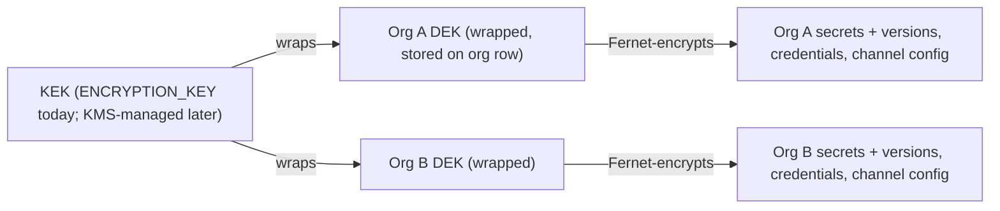

# Secrets Architecture

**Status:** Proposal for review — not yet approved for implementation.
**Date:** 2026-09-20
**Reads best after:** [domain-model.md](domain-model.md) §2.5 · [multi-tenancy.md](multi-tenancy.md) §3, §4 · [authorization.md](authorization.md) §3

---

## 1. Current state

A small, real, tested subsystem: Fernet-encrypted values, metadata-only reads,
deploy-time reference resolution. All cites verified against the working tree.

### 1.1 Storage and crypto

| Aspect | Today | Evidence |
|---|---|---|
| Encryption at rest | Fernet (AES-128-CBC + HMAC) via `encrypt_str` | `backend/app/core/security.py:131-142` |
| Key | Single platform-wide `ENCRYPTION_KEY` — required, Fernet-validity checked, fail-fast at import (exit 2) | `backend/app/core/config.py:61,136-143` |
| Digest column | `digest` = first 12 hex of HMAC-SHA256 keyed with sha256(`ENCRYPTION_KEY`) — server-verifiable change detection, not an offline oracle | `backend/app/core/security.py:145-158` |
| Key rotation | None; `ENCRYPTION_KEY` is effectively write-once. Decrypt failure raises "restore the original key" | `backend/app/core/security.py:133-142`; `scripts/generate_secrets.sh:7-10` refuses overwriting without `--force` |
| Other Fernet users | `server_credentials.secret_ciphertext`, `notification_channels.config_ciphertext` — same single key | `backend/app/models/infra.py`, `backend/app/models/notify.py:41-42` |

### 1.2 Data model

`Secret` (`backend/app/models/secrets.py:23-59`):

| Column | Purpose |
|---|---|
| `project_id` (nullable FK, CASCADE) | Only scope dimension today: NULL = global, set = project-scoped |
| `key` | Grammar `^[A-Z][A-Z0-9_.-]{0,158}[A-Z0-9]$` (`schemas/secret.py:19`) |
| `ciphertext` | Fernet token; overwritten in place on rotation |
| `secrets.version` | Integer counter starting 1, `+= 1` per rotate (`secret_service.py:181-224`) |
| `digest`, `description` | Change-detection + human note |
| `rotated_at`, `rotated_by_id`, `created_by_id` | Lineage of the *current* value only |

Uniqueness: `uq_secrets_project_key` on `(project_id, key)` plus partial unique
`ux_secrets_global_key` on `key WHERE project_id IS NULL`
(`backend/app/models/secrets.py:34-40`). Consequence: **global secrets form one
platform-wide key namespace** — two orgs cannot both define a global `STRIPE_KEY`,
and global secrets resolve into every project's deploys.

### 1.3 API surface (metadata-only reads)

| Route | Gate | Returns |
|---|---|---|
| `GET /secrets` | `secret.read` | Page of metadata: keys, versions, digests — never values |
| `GET /secrets/{secret_id}` | `secret.read` | One secret's metadata |
| `POST /secrets` | `secret.write` | Created metadata (201) |
| `POST /secrets/{secret_id}/rotate` | `secret.write` | Updated metadata |
| `DELETE /secrets/{secret_id}` | `secret.write` | 204 |

Gates are `require_permission` on `backend/app/api/v1/secrets.py:29,48,59,80,91`.
`SecretOut` "deliberately excludes any value-bearing field"
(`backend/app/schemas/secret.py:56-66`); `_detail()` carries no value field
(`backend/app/services/secret_service.py:49-62`). Tests enforce the contract:
metadata-only reads (`backend/tests/integration/test_secrets.py:28-51`) and
version-bump + digest change on rotate (`test_secrets.py:52-66`).

### 1.4 Deploy-time resolution today

References: environment config values may contain `${secret:KEY}`; the resolver
scans `environment.config` recursively for the pattern
(`secret_service.py:265-274`) using `SECRET_REF_PATTERN`
(`backend/app/schemas/secret.py:25`). The create-path validator rejects any
value that contains `${secret:` unless it is exactly one full-value ref
(`backend/app/schemas/environment.py:41-53`), caps config at 50 keys / 512
chars/value (`environment.py:18-19`). It does **not** reject plaintext: a value
with no `${secret:` marker is undetectable to that check and passes as is. Only
the create path is validated — `EnvironmentUpdate` does not inherit
`EnvironmentBase` and carries no config validator (`schemas/environment.py:60-67`),
the PATCH route binds it (`api/v1/projects.py:263`), and `update_environment`
copies config unvalidated (`project_service.py:515-516`). Raw values are accepted
on both paths today; §8 states the target control.

**Grammar drift (current-state bug):** the save-time regex accepts
`[A-Za-z0-9_]+` keys (`environment.py:20`) while the resolver regex demands
uppercase-start `SECRET_KEY_PATTERN` keys (`secret.py:25`): a lowercase ref like
`${secret:db_url}` passes save-time validation but never resolves; keys with
`.`/`-` pass the resolver grammar but are rejected at config save. One grammar
should win (§5).

### 1.5 SILENT DEGRADE BUG (must-fix)

Resolution failures today degrade silently; deploys proceed without credentials:

| Layer | Failure | Behavior today | Cite |
|---|---|---|---|
| Resolver | Ref names no secret | Resolves to `""` + warning log | `secret_service.py:316-319` |
| Resolver | Decrypt fails (`InvalidToken`) | Resolves to `""` + error log | `secret_service.py:320-324` |
| Engine | Any exception in the resolution call | Caught, logged, **returns `{}`** — deploy continues with no secrets at all | `deployment_engine.py:374-387` |

The consequence compounds: the
only runner is `SimulatedDeploymentRunner` (explicitly labeled simulation,
`backend/app/providers/deployment_runner.py:107`); the real provider
`docker_real.py` has zero references to `ctx.secrets` (grep: no matches), so real
deployments would receive no secrets even when resolution succeeded. Resolved
values live in `RunContext.secrets` (`deployment_runner.py:69-70`) in worker
memory only and the runner logs only a count ("Injected N secret reference(s) as
env vars", `deployment_runner.py:210`) — no leak, but also no real consumption.

### 1.6 Current-state gap list

| Gap | Addressed in |
|---|---|
| Silent degrade: unresolved → `""`, engine catch-all → `{}` | §5 |
| No value history; rotation is destructive | §3 |
| Global secrets = one platform-wide namespace, resolve into every project | §2 |
| Resolution has no org filter; no per-secret authorization beyond the deploy gate | §2.1, §4 |
| No audit row at resolution time | §4.1 |
| Only the simulated runner consumes resolved values | §7 (real delivery), §5 (fail-closed) |
| Two divergent ref grammars (save-time vs resolver) | §5 |
| Env config validation covers create only; raw values pass both paths | §8 |
| `ENCRYPTION_KEY` write-once, no rotation path | §6 |
| Digest key derived from the global key | §6 |

---

## 2. Target scope model (org / project / environment layering)

Per [domain-model.md](domain-model.md) §2.5: `Secret` gains `org_id`, scope via
`(org_id, project_id?, environment_id?)`. No rewrite — the project-scoped row is
today's row plus the new levels.

| Scope level | Row shape | Resolves for |
|---|---|---|
| Organization | org set, project NULL, env NULL | Every Project/Environment in the org (fallback) |
| Project | org set, project set, env NULL | Every Environment of that Project |
| Environment | org set, project set, env set | Only that Environment |

**Precedence: most specific wins — environment > project > organization.** This
mirrors config layering in domain-model.md §2.2.1. Today's project-over-global
preference loop (`secret_service.py:304-311`) generalizes from two levels to
three.

Uniqueness (extends the existing partial-index pattern of `secrets.py:34-40`):

- `uq (org_id, project_id, environment_id, key)` + partial unique indexes for each
  NULL combination — the platform-wide global namespace becomes per-org.
- Constraints inherit org scoping; parent rows are org-scoped first
  (findings: multi-tenancy Phase 1 backfill).

### 2.1 Resolution runs inside org scope

Resolution executes in the Celery worker, which has no request context. Per
[multi-tenancy.md](multi-tenancy.md) §4 the task base opens `org_scope(org_id)`;
the session guard makes only that org's Secret rows visible and today's
`or_(project_id == …, project_id IS NULL)` filter
(`secret_service.py:296-311`) generalizes to the three-level precedence. Today
resolution has **no org filter at all**; under the guard it becomes
tenant-correct mechanically.

### 2.2 Migration mapping

| Today | Target |
|:---|:---|
| Global secret (NULL project) | org-level Secret under the auto-provisioned org (multi-tenancy.md §9) |
| Project secret | Project secret + org_id |
| Platform-wide `ux_secrets_global_key` | Per-org partial unique indexes (three scope levels) |
| Application-scoped `deployment_environments` | Project-scoped Environment (domain-model.md §2.2.1); the env scope level activates with promotion |

---

## 3. SecretVersion — append-only history

Today rotation **overwrites in place** (`secret_service.py:181-224`): the previous
value is unrecoverable except by re-entering it by hand.

**Target (domain-model.md §2.5):** `secret_versions` table, append-only:

| Column | Purpose |
|---|---|
| `secret_id` (FK CASCADE) | Parent secret |
| `version` | uq `(secret_id, version)` |
| `ciphertext` | That version's Fernet token (current org DEK) |
| `digest` | Per-version change-detection digest |
| `created_by_id`, `created_at` | Who rotated, when |

Mechanics:

1. **Create** = `secrets` row + version-1 row.
2. **Rotate** = INSERT a new version row; update the parent's pointer fields
   (`version`, `digest`, `rotated_by_id`, `rotated_at`). Parent `ciphertext`
   column: dropped (pointer-only) or kept as denormalized current — open question.
3. **Rollback** = decrypt the target prior version server-side, INSERT it as a
   **new** version (re-encrypted under the current DEK if one rotated in between).
   Audited as `secret.rollback`; history is never rewritten.
4. **Prune** = keep last N versions (default 10) and/or younger than 30 days;
   maintenance task, never user-facing delete.

Append-only enforced application-side (no UPDATE/DELETE paths in the service
layer), not by DB trigger — contrast `audit_logs` trigger
`nexusops_block_audit_mutation` (initial schema migration). A trigger on
`secret_versions` is optional hardening; app-level is the contract.

### 3.1 What this fixes

| Today | Target |
|---|---|
| Rotation destroys the old value | Old value preserved as a prior version |
| Bad rotation unrecoverable | `secret.rollback` to any kept version |
| Only the current rotator is recorded | Every version carries its own actor |
| Rotation racing a resolve → resolve picks one version | Unchanged: resolution reads the parent pointer atomically; a concurrent rotate affects only later deploys |

---

## 4. Resolution authorization

**Principle: resolution authorization is the deploy permission chain, not
`secret.read`.**

- There is no value-read endpoint anywhere; "resolving" is not a read of the
  secret API. The permission authorizing resolution is whatever authorized the
  deploy that carries the refs: `deployment.create` gates the trigger route
  (`backend/app/api/v1/deployments.py:48-51,191`), narrowed by environment grants
  ("Ali deploys staging", authorization.md §4) to specific Environments.
- A Developer with Grant(staging → Operator) can deploy staging and thereby *use*
  org/project secrets referenced by staging's config — without holding
  `secret.write`. Using a credential via deploy ≠ reading the store; values are
  unreadable by any principal through any API path.
- Who may *manage* secrets: `secret.read` (metadata) / `secret.write` (manage).
  Today Admin holds `secret.write` explicitly and Owner holds it via the wildcard
  (`permissions.py:81`; `scope_matches`, :174-181); Operator and Developer hold
  `secret.read` only (`backend/app/core/permissions.py:110-111,138,155`) —
  already matching the target matrix (authorization.md §3), which keeps DevOps
  (Operator) and Developer at metadata-only.
- Worker-side resolution is permission-less by design (authorization.md §6.4):
  the *action* that queued the deploy was permissioned; the worker resolves on the
  deployment's behalf.

### 4.1 Audit event at resolution time

Today there is **no audit row at resolution time** — secret usage in deploys is
invisible to the audit trail (no `audit_service.record` call in
`secret_service.py:277-325`).

**Target:** the worker writes one audit row per resolved secret, inside the
deployment's transaction, before any step executes:

| Field | Value |
|---|---|
| action | `secret.resolve` |
| resource | `secret` / the Secret's id |
| actor | Deployment trigger actor (USER / API_KEY; SYSTEM for future auto-deploy) |
| org_id | The deployment's org (when audit gains org_id) |
| metadata | `deployment_id`, `environment_id`, `key` (secret key name), `version` |

No values, ever. The fixed metadata field names match none of the sensitive
substrings in `_SENSITIVE_KEY_PARTS` (`core/logging.py:19-31`), so `redact_mapping`
(`core/logging.py:46-60`, applied at `audit_service.py:54`) leaves them intact;
values never enter metadata. Consistent with `SECRET_UPDATED` event payloads,
which already carry only key names + versions (`secret_service.py:167-176,213-222`).

---

## 5. Fail-closed resolution policy

| Failure | Today | Target |
|---|---|---|
| Ref names no secret at any scope level | `""` + warning | Deployment **FAILED** before any node work; failure_reason names the missing key(s) |
| Decrypt fails | `""` + error log | Deployment **FAILED**; reason: "secret KEY undecryptable" |
| Resolver exception (DB, bug) | Caught → `{}` → deploy proceeds | Deployment **FAILED** (worker retry policy per existing worker conventions); never proceed |

Design:

- Resolution becomes an explicit engine-owned step **`RESOLVE_CONFIG`**, persisted
  in the step plan at queue time (the plan is persisted at queue time today,
  engine.py), inserted before `PULL_REPO`. The engine executes it (no runner
  involvement); failure marks the step FAILED and the deployment FAILED through
  the existing `_finalize_failed` path — sweeper, cancel, and finalize semantics
  unchanged. `failure_reason` names keys, never values.
- The runner's `RunContext.secrets` then contains only fully-resolved values; the
  runner may assume presence.
- No `allow_missing_secrets` escape hatch. If a real need appears it gets its own
  explicit, audited flag — never a silent default.
- **Grammar unification:** one regex (`schemas/secret.py:25`) for both save-time
  validation and the resolver scan; the environment schema stops accepting
  lowercase refs. Save-time lint *warns* when a ref names no existing secret at
  any scope level (the secret may be created later — hard-reject would create a
  chicken-and-egg loop between secret creation and config authoring).

---

## 6. Key hierarchy

Today one `ENCRYPTION_KEY` protects everything (`config.py:61`; users: secrets,
server credentials, notification-channel config — §1.1). Loss is unrecoverable
and rotation is impossible (§1.1). Target: **per-org DEK envelope, KMS-ready**.



| Layer | What | Notes |
|---|---|---|
| KEK (root) | Master key | Wraps DEKs only; today `ENCRYPTION_KEY`, later a KMS-managed key |
| DEK | One Fernet key per Organization | Generated at org creation; stored **wrapped** (`organizations.dek_ciphertext`); plaintext DEK exists in process memory only |
| Data | secrets, secret_versions, credentials, channel config | Fernet under the org's DEK |

Mechanics:

- Org creation: generate DEK → wrap with KEK → store wrapped. Unwrap on use,
  per-worker LRU keyed by org_id (replaces the module-global Fernet cache,
  `security.py:121-129`).
- New secrets write under the org's DEK; legacy rows migrate via a background
  re-encryption job, per-org batches, resumable (the production contabo instance
  upgrades in place).
- **Org DEK rotation:** new DEK → re-wrap → background re-encrypt of versions
  (possible because of append-only history, §3). **KEK rotation** = re-wrap all
  DEKs only — fast, touches no data. This is what makes key rotation possible at
  all (today it destroys every ciphertext, `generate_secrets.sh:7-10`).
- **KMS-ready:** swap the unwrap call for a KMS call; wrapped DEKs never leave
  the DB; plaintext DEKs live only in memory.
- `digest_of` becomes per-org: derive the HMAC key from the org's DEK instead of
  `ENCRYPTION_KEY` (`security.py:145-158`) — keeps the not-an-offline-oracle
  property and prevents cross-org digest equality comparisons.
- Custody: wrapped DEKs live in DB backups; the KEK must be in break-glass
  storage before the contabo migration. Loss of KEK = all orgs; loss of one org's
  wrapped DEK = that org only.

Blast radius:

| Compromised | Sees |
|---|---|
| Control-plane DB without the KEK | Nothing readable — ciphertext only |
| Control-plane DB + KEK | All orgs (single-key today shrinks to per-org DEKs) |
| One org's DEK | That org's secrets only |
| Worker memory during one resolve | That deployment's refs only |

---

## 7. Node delivery minimization

Today **nothing is delivered to any node** — the simulated runner consumes
resolved values in worker memory (`deployment_runner.py:70,210`); real delivery
arrives with the real runner + agent operations.

Principles (platform-vision.md §3.7, §5):

- A node receives **only** secrets referenced by the services/routes actually
  assigned to it — never the org's secret store, never metadata listings.
- **The agent pulls; no remote shell.** Delivery rides the whitelisted Operation
  model (agent fetches ops, executes whitelisted types, reports; audited on the
  control plane). No push tunnel, no generic exec (authorization.md §2).
- Resolution stays control-plane-side; the node never sees candidate secrets,
  only the resolved minimal set.

Flow (when the real runner + agent ops exist):

1. Deploy targets Node(=Server) N for Environment E.
2. Control plane resolves only the refs in E's config, plus the refs of
   routes/services bound to E on N.
3. The minimal set is packaged as a whitelisted Operation. Params carrying
   resolved values are Fernet-encrypted at rest under the org's DEK (§6) before
   insert — the `operations.params` column never stores secret plaintext; the
   worker unwraps in memory only when serving the op to the agent.
4. Agent pulls the op (TLS + per-node agent token, multi-tenancy.md §6), applies,
   acks terminal status. Plaintext exists only in TLS transit and node memory —
   never unencrypted at rest in the control-plane DB.
5. **Scrub deadline independent of ack:** values are scrubbed (replaced with a
   non-value marker) or the row deleted as soon as the op reaches a terminal
   state; the ops sweeper additionally scrubs any value-bearing op at
   `expires_at` even when no terminal ack ever arrives (dead node, hung agent) —
   bounded by the per-type timeout (node-agent-architecture.md §5.1), not by ack.
   Results never echo values (whitelisted result fields only).

Blast radius:

| Compromised | Sees |
|---|---|
| One node | Only secrets referenced by its assigned services/routes, for the delivery lifetime |
| One agent token | Same as its node; revocation kills acceptance immediately (multi-tenancy.md §6) |
| Op pipeline | Params ciphertext at rest (org DEK, §6); plaintext only in TLS transit and node memory; scrubbed at terminal state or expires_at, whichever first; no value-bearing result fields |

---

## 8. Environment config vs secrets boundary

`Environment.config` (JSONB, `backend/app/models/delivery.py:83-84`) holds
non-secret settings and `${secret:KEY}` *refs* only — as policy. Enforcement is
partial today: the create-path validator (`schemas/environment.py:41-53`) rejects
values containing `${secret:` that are not a single full-value ref, but a
plaintext value without the marker is undetectable and accepted, and the update
path skips validation entirely (`EnvironmentUpdate` does not inherit
`EnvironmentBase`, `schemas/environment.py:60-67`; PATCH route binds it,
`api/v1/projects.py:263`; `update_environment` copies config unvalidated,
`project_service.py:515-516`).

| Value kind | Home | Why |
|---|---|---|
| Credentials, tokens, API keys, passwords, connection strings with creds | Secret (org/project/env scope) | Encrypted at rest, versioned, audited, minimally delivered |
| Non-secret deploy settings (feature flags, timeouts, limits, image tag) | Environment.config | Plaintext is fine, reviewable, visible to roles without `secret.read` |
| Secret key *names* (which refs exist) | Environment.config refs | Names are not secrets — a ref reveals only that the env uses `STRIPE_KEY` |
| Per-deploy overrides (version, git_commit) | Deployment row fields | Not config |
| Node-level infra config (agent, nginx) | Node/Operation config | Not environment config |

Rules:

- Names aren't secrets; values are.
- `${secret:KEY}` refs are the **only** sanctioned path a secret value takes into
  a deploy. That boundary is enforced on the create path only today (§1.4); the
  target control is one shared validator on both create and update paths, with
  the raw-value limit stated plainly: a plaintext value with no `${secret:`
  marker is undetectable by pattern, which is why secret material must live only
  in Secret rows, never in config.
- Rotation requires no config change — refs are stable, versions resolve at
  deploy time.

---

## 9. Leak-path table

| Path | Today | Guard today | Guard target |
|---|---|---|---|
| REST API responses | Safe | `SecretOut` excludes value fields (`schemas/secret.py:56-66`); `_detail()` no value field; tests enforce (`test_secrets.py:28-51`) | Unchanged + IDOR suite covers `/secrets` cross-org (multi-tenancy.md §7) |
| Logs | Mostly guarded | `redact_mapping` substring redaction (`core/logging.py:19-60`); runner logs counts only (`deployment_runner.py:210`) | Fix hole: redaction recurses dicts only — sensitive values inside lists pass through; recurse lists too. Resolution audit never logs values |
| WS frames | Safe by omission | No secret-bearing channel; deployment-logs carry runner output (counts only) | Org-prefixed channels (multi-tenancy.md §5); delivery-op frames never include values |
| Audit metadata | Guarded | `redact_mapping` applied at `audit_service.py:54`; resolution audit carries names+versions only | Unchanged |
| Frontend state | Minimal | Value lives only in create/rotate modal component state, never persisted or cached; no reveal controls (`SecretsPage.tsx:51,142-190`) | Clear value on modal unmount; never persist to localStorage |
| Error messages | Guarded | `decrypt_str` error names the key problem, no value (`security.py:133-142`); 500 handler logs exception class only (`core/errors.py:151-166`); engine `hide_parameters=True` (`core/db.py:26-39`) | Fail-closed failure_reason names keys, never values |
| DB at rest | Encrypted | Fernet under single `ENCRYPTION_KEY` | Per-org DEK envelope (§6) |
| Op params at rest (agent delivery, §7 — future) | N/A — nothing delivered to nodes today | — | Params ciphertext under the org DEK before insert; scrubbed at terminal state or expires_at |
| Digests | Not a value leak | HMAC keyed with key-derived material, not a plain hash (`security.py:145-158`) | Per-org digest key |

---

## 10. Resolution flow at deploy time

```mermaid
sequenceDiagram
    autonumber
    participant U as Trigger (User/API key)
    participant API as API
    participant DB as PostgreSQL
    participant W as Celery worker
    participant R as Resolver (secret_service)
    participant A as Runner/Agent

    U->>API: POST /deployments (gated deployment.create)
    API->>DB: INSERT deployment QUEUED + steps (incl RESOLVE_CONFIG)
    API-->>U: 202
    Note over API: after-commit Celery enqueue
    W->>DB: claim QUEUED (FOR UPDATE)
    W->>DB: load environment.config
    W->>R: resolve inside org_scope(org)
    R->>DB: collect ${secret:KEY} refs
    R->>DB: lookup env > project > org
    alt any ref missing or undecryptable, or resolver error
        R-->>W: failure (fail-closed)
        W->>DB: step + deployment FAILED, reason names keys (no values)
        W->>DB: audit secret.resolve-failed (names/versions only)
    else all refs resolved
        R-->>W: resolved dict (memory only)
        W->>DB: audit secret.resolve (key+version per secret, no values)
        W->>A: run steps (simulated runner today; agent op delivery when real)
        W->>DB: terminal status
    end
```

---

## Open questions

- `secrets.ciphertext` column: drop (pointer-only) or keep denormalized current alongside SecretVersion history (§3).
- SecretVersion prune defaults (last N = 10? 30-day floor?); org-configurable window? (§3)
- Secret deletion: hard delete cascading versions vs tombstone with grace period for accidental deletes (§3).
- Save-time config validation: hard-reject refs with no resolvable secret, or stay warn-only? (§5)
- Delivery-op params: scrub-and-keep-row-for-audit vs delete the row — deadline
  is decided (terminal state or expires_at, whichever first, §7); open choice is
  keep vs delete. (§7)
- KEK custody before the KMS phase (env var vs file vs break-glass runbook); multi-person approval for org DEK recovery? (§6)
- Future auto-deploy/webhook triggers: resolution-audit actor attribution (SYSTEM vs configured actor) (§4.1).
