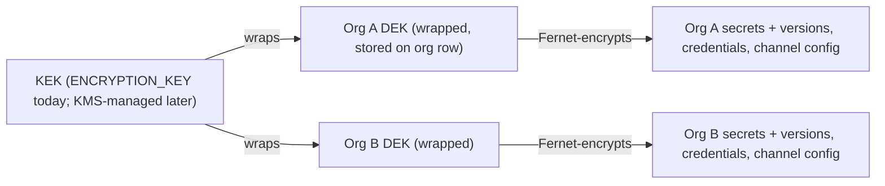

# Secrets Architecture

**Status:** §1 shipped (Fernet store, metadata-only reads, deploy-time resolution).
**Phase 2 shipped §2 (org/project/environment scope), §3 (SecretVersion history,
transactional rotation, non-destructive rollback) and the fail-closed policy of
§5. Phase 2.1 hardened §3: the append-only guarantee is now enforced by
PostgreSQL (revoked grants + a row-level guard trigger), not only by the service
layer.** Still proposal, not built: per-node delivery (§7), the per-org DEK
envelope (§6), and the §3 prune job.
**Date:** 2026-09-20 (status updated 2026-10-09)
**Reads best after:** [domain-model.md](domain-model.md) §2.5 · [multi-tenancy.md](multi-tenancy.md) §3, §4 · [authorization.md](authorization.md) §3

---

## 1. Current state

A small, real, tested subsystem: Fernet-encrypted values, metadata-only reads,
deploy-time reference resolution. All cites verified against the working tree.

### 1.1 Storage and crypto

| Aspect | Today | Evidence |
|---|---|---|
| Encryption at rest | Fernet (AES-128-CBC + HMAC) via `encrypt_str` | `backend/app/core/security.py:131-142` |
| Key | Single platform-wide `ENCRYPTION_KEY` — required, Fernet-validity checked, fail-fast at import (exit 2) | `backend/app/core/config.py:61,136-143` |
| Digest column | `digest` = first 12 hex of HMAC-SHA256 keyed with sha256(`ENCRYPTION_KEY`) — server-verifiable change detection, not an offline oracle | `backend/app/core/security.py:145-158` |
| Key rotation | None; `ENCRYPTION_KEY` is effectively write-once. Decrypt failure raises "restore the original key" | `backend/app/core/security.py:133-142`; `scripts/generate_secrets.sh:7-10` refuses overwriting without `--force` |
| Other Fernet users | `server_credentials.secret_ciphertext`, `notification_channels.config_ciphertext` — same single key | `backend/app/models/infra.py`, `backend/app/models/notify.py:41-42` |

### 1.2 Data model

`Secret` (`backend/app/models/secrets.py:23-59`):

| Column | Purpose |
|---|---|
| `org_id` | Tenant owner (Phase 1) |
| `project_id` (nullable FK, CASCADE) | Scope level 2 — NULL = not project-scoped |
| `environment_id` (nullable FK, CASCADE) | Scope level 3 — set implies `project_id` (CHECK `ck_secrets_environment_requires_project`) |
| `key` | Grammar `^[A-Z][A-Z0-9_.-]{0,158}[A-Z0-9]$` (`schemas/secret.py`) |
| `ciphertext`, `digest` | The **current** value (denormalized pointer to a `secret_versions` row) |
| `version` | The current version number; `>= 1` |
| `rotated_at`, `rotated_by_id`, `created_by_id` | Lineage of the *current* value |

Uniqueness — one partial unique index per scope level, because NULLs are distinct
in a plain UNIQUE:

| Index | Columns | Predicate |
|---|---|---|
| `ux_secrets_org_scope_key` | `(org_id, key)` | `project_id IS NULL` |
| `ux_secrets_project_scope_key` | `(org_id, project_id, key)` | `project_id IS NOT NULL AND environment_id IS NULL` |
| `ux_secrets_environment_scope_key` | `(org_id, environment_id, key)` | `environment_id IS NOT NULL` |

Consequence: the key namespace is **per organization** — the pre-Phase-2
platform-wide global namespace is gone, and Org A's `STRIPE_KEY` never collides
with, nor resolves for, Org B.

`secret_versions` (append-only — created by migration `b2c3d4e5f6a7`, DB-enforced
by `c3d4e5f6a7b8`):

| Column | Purpose |
|---|---|
| `org_id` | Tenant owner — RLS-covered like every other tenant table |
| `secret_id` (FK CASCADE) | Parent secret |
| `version` | uq `(secret_id, version)` |
| `ciphertext` | That version's Fernet token — never rewritten |
| `digest` | Per-version change-detection digest |
| `created_by_id`, `created_at` | Who created the version, when |

The migration **backfills one version row per pre-existing secret** from its
current value, so history starts complete rather than empty (values that were
already overwritten cannot be invented).

### 1.3 API surface (metadata-only reads)

| Route | Gate | Returns |
|---|---|---|
| `GET /secrets` | `secret.read` | Page of metadata: keys, versions, digests, scope — never values. Filters: `q`, `project_id`, `environment_id` |
| `GET /secrets/{secret_id}` | `secret.read` | One secret's metadata |
| `GET /secrets/{secret_id}/versions` | `secret.read` | Append-only version history, newest first: version, digest, actor, timestamp |
| `POST /secrets` | `secret.write` | Created metadata (201). Scope from the payload: `environment_id` > `project_id` > organization |
| `POST /secrets/{secret_id}/rotate` | `secret.write` | Updated metadata — appends a version |
| `POST /secrets/{secret_id}/rollback` | `secret.write` | Updated metadata — appends the target version's value as a **new** version |
| `DELETE /secrets/{secret_id}` | `secret.write` | 204 |

Gates are `require_permission` on `backend/app/api/v1/secrets.py:29,48,59,80,91`.
`SecretOut` "deliberately excludes any value-bearing field"
(`backend/app/schemas/secret.py:56-66`); `_detail()` carries no value field
(`backend/app/services/secret_service.py:49-62`). Tests enforce the contract:
metadata-only reads (`backend/tests/integration/test_secrets.py:28-51`) and
version-bump + digest change on rotate (`test_secrets.py:52-66`).

### 1.4 Deploy-time resolution (shipped)

References: config values may contain `${secret:KEY}`. The resolver collects refs
from the **effective** configuration — the project's `config` merged with the
environment's overrides (`config_service.effective_config`) — and looks each key
up at the most specific scope that defines it:

```
environment scope  >  project scope  >  organization scope
```

`resolve_secrets_for_environment` (`secret_service.py`) runs inside the
deployment's organization scope, so only the tenant's rows are visible. Every
reference must resolve; otherwise `SecretResolutionError` aborts the deployment
(§5).

**Validation (shipped):** `config_service.validate_config` is applied on **both**
the create and update paths (`EnvironmentCreate`/`EnvironmentUpdate`,
`ProjectCreate`/`ProjectUpdate`). It enforces a flat `string → string` map, bounds
it (≤ 100 keys, ≤ 4096 chars per value), and rejects any value containing
`${secret:` that is not exactly one full-value reference. It cannot detect a
plaintext value with no marker — §8 states that limit plainly.

**Grammar (fixed):** one regex, `SECRET_REF_PATTERN` (`schemas/secret.py`), built
from `SECRET_KEY_PATTERN`, is used by both save-time validation and the resolver.
The pre-Phase-2 divergence (save-time `[A-Za-z0-9_]+` vs resolver uppercase) is gone:
a ref that validates always resolves, and no valid resolver key is rejected at save
time.

### 1.5 SILENT DEGRADE BUG — **FIXED (Phase 0)**

> **Status:** the fail-closed policy in §5 shipped on 2026-09-22.
> `resolve_secrets_for_environment` now raises `SecretResolutionError`, and
> `deployment_engine._resolve_secrets_or_fail` fails the deployment before its
> first step (all steps `SKIPPED`) with an audited `secret.resolve_failed` row;
> a successful resolution writes one `secret.resolve` audit row per reference
> (key + version only). The table below is the pre-Phase-0 behavior, kept for
> context. **Layered scope (§2) and SecretVersion history (§3) shipped in
> Phase 2; node delivery (§7) and the per-org DEK envelope (§6) remain open.**

Resolution used to degrade silently; deploys proceeded without credentials:

| Layer | Failure | Behavior today | Cite |
|---|---|---|---|
| Resolver | Ref names no secret | Resolves to `""` + warning log | `secret_service.py:316-319` |
| Resolver | Decrypt fails (`InvalidToken`) | Resolves to `""` + error log | `secret_service.py:320-324` |
| Engine | Any exception in the resolution call | Caught, logged, **returns `{}`** — deploy continues with no secrets at all | `deployment_engine.py:374-387` |

The consequence compounds: the
only runner is `SimulatedDeploymentRunner` (explicitly labeled simulation,
`backend/app/providers/deployment_runner.py:107`); the real provider
`docker_real.py` has zero references to `ctx.secrets` (grep: no matches), so real
deployments would receive no secrets even when resolution succeeded. Resolved
values live in `RunContext.secrets` (`deployment_runner.py:69-70`) in worker
memory only and the runner logs only a count ("Injected N secret reference(s) as
env vars", `deployment_runner.py:210`) — no leak, but also no real consumption.

### 1.6 Gap list (Phase 2 status)

| Gap | Status |
|---|---|
| Silent degrade: unresolved → `""`, engine catch-all → `{}` | **Fixed** (Phase 0) — §5 |
| No value history; rotation is destructive | **Fixed** (Phase 2) — §3 |
| Global secrets = one platform-wide namespace, resolve into every project | **Fixed** (Phase 2) — per-org scope indexes, §2 |
| Resolution has no org filter; no per-secret authorization beyond the deploy gate | **Fixed** for the tenant filter (resolution runs in org scope); resource-level grants remain a later phase — §2.1, §4 |
| No audit row at resolution time | Shipped in Phase 0 — §4.1 |
| Only the simulated runner consumes resolved values | **Open** — real delivery is later-phase (§7) |
| Two divergent ref grammars (save-time vs resolver) | **Fixed** (Phase 2) — §1.4 |
| Env config validation covers create only; raw values pass both paths | **Fixed** (Phase 2) — one validator on both paths, §1.4/§8 |
| `ENCRYPTION_KEY` write-once, no rotation path | **Open** — per-org DEK envelope is §6 |
| Digest key derived from the global key | **Open** — §6 |

---

## 2. Scope model (org / project / environment layering) — **shipped**

Per [domain-model.md](domain-model.md) §2.5: `Secret` carries `org_id` and scope via
`(org_id, project_id?, environment_id?)`. The project-scoped row is the Phase 1 row
plus the new levels — no rewrite.

| Scope level | Row shape | Resolves for |
|---|---|---|
| Organization | org set, project NULL, env NULL | Every Project/Environment in the org (fallback) |
| Project | org set, project set, env NULL | Every Environment of that Project |
| Environment | org set, project set, env set | Only that Environment |

**Precedence: most specific wins — environment > project > organization.** This
mirrors config layering in domain-model.md §2.2.1. Resolution performs one query
for all referenced keys across the three levels and then ranks the rows, so a key
defined at more than one level resolves to the most specific one and a key missing
everywhere fails the deployment (§5).

Uniqueness is one partial unique index per level (§1.2): `(org_id, key)` for org
scope, `(org_id, project_id, key)` for project scope, `(org_id, environment_id,
key)` for environment scope. The platform-wide global namespace is gone; each
organization owns its keys.

Scoping rules enforced at write time:

- an `environment_id` must name an environment **of the given project**, in the
  same organization — cross-project or cross-tenant scope is a 422/404, not a
  silent bind;
- the CHECK `ck_secrets_environment_requires_project` makes
  "environment-scoped but not project-scoped" unrepresentable.

### 2.1 Resolution runs inside org scope

Resolution executes in the Celery worker, which has no request context. Per
[multi-tenancy.md](multi-tenancy.md) §4 the task base opens `org_scope(org_id)`;
the session guard makes only that org's Secret rows visible and today's
`or_(project_id == …, project_id IS NULL)` filter
(`secret_service.py:296-311`) generalizes to the three-level precedence. Today
resolution has **no org filter at all**; under the guard it becomes
tenant-correct mechanically.

### 2.2 Migration mapping (applied by `b2c3d4e5f6a7`)

| Before | After |
|:---|:---|
| Global secret (NULL project) | org-level Secret (Phase 1 already gave it `org_id`) |
| Project secret | Project secret + `org_id` |
| Platform-wide `ux_secrets_org_global_key` | Per-org partial unique indexes (three scope levels) |
| Application-scoped `deployment_environments` | Project-scoped Environment (domain-model.md §2.2.1), so the environment scope level is usable |
| Secret with no history | A version-1 row per secret, seeded from its current ciphertext |

---

## 3. SecretVersion — append-only history (**shipped in Phase 2**)

Before Phase 2 rotation **overwrote in place**: the previous value was unrecoverable
except by re-entering it by hand. Now `secret_versions` (columns in §1.2) records
every value a secret has ever held.

**Current-version representation — decided:** the parent row keeps the current
`ciphertext`, `digest` and `version` (**denormalized pointer**), and every version
including the current one also exists as an immutable `secret_versions` row. Reads
therefore never join to resolve a deploy, and history stays complete. The columns
cannot drift: every write path inserts the version row and updates the parent inside
one transaction.

Mechanics — one transaction per operation:

1. **Create** = `secrets` row + version-1 row (`version = 1`).
2. **Rotate** = lock the parent (`SELECT … FOR UPDATE`), INSERT version
   `parent.version + 1`, then move the parent's pointer (`version`, `digest`,
   `ciphertext`, `rotated_by_id`, `rotated_at`). Two concurrent rotations therefore
   serialize on the parent row: no duplicate version number, no lost update, and
   exactly one version is current afterwards (§Concurrency).
3. **Rollback to version N** = decrypt version N's ciphertext server-side and
   INSERT it as a **new** version (`parent.version + 1`) — the rolled-back-to value
   is re-appended, never copied over history. No version row is updated or deleted,
   so "current = v4 after rolling back to v2" still lists v2 and v3, and the
   pre-rollback value remains recoverable by rolling forward to it.
4. **Prune** = keep last N versions (default 10) and/or younger than 30 days;
   maintenance task, never user-facing delete. **Not implemented** — with the
   current volumes, unbounded history is cheaper than the risk of a wrong prune
   policy; no user-facing delete of versions exists.

Append-only was, in Phase 2, enforced only **application-side** (the service layer
had no UPDATE or DELETE path against `secret_versions`) plus the uq
`(secret_id, version)` constraint — but the migration *granted* the runtime role
`UPDATE` and `DELETE`, so nothing stopped a bug or a rogue worker from rewriting
history. **Phase 2.1 (migration `c3d4e5f6a7b8`) makes the guarantee real in the
database:**

- the runtime app role holds **`SELECT` + `INSERT` only** on `secret_versions` —
  `UPDATE` and `DELETE` are revoked;
- a row-level `BEFORE UPDATE OR DELETE` trigger
  (`nexusops_block_secret_version_mutation`) refuses `UPDATE` outright and refuses
  `DELETE` unless the parent `secrets` row is already gone. PostgreSQL runs
  referential actions *after* the parent row is deleted, so that condition is
  exactly the FK's `ON DELETE CASCADE`: a direct `DELETE FROM secret_versions` is
  refused even for the owner (the trigger fires for every role), while deleting
  the Secret still purges its versions;
- the uq `(secret_id, version)` constraint remains the backstop against a rewound
  write.

**Protection boundary — what this covers and what it does not.** The guarantee is
a PostgreSQL constraint on *row-level DML*: it holds for every role that writes
rows — the runtime role, the owner role, any future application credential — and
cannot be defeated through ordinary SQL (`UPDATE`, `DELETE`, an ORM bug, a rogue
worker). It is **not** a defense against a privileged database administrator.
A role that owns `secret_versions` (or is a superuser) can still run DDL —
`ALTER TABLE secret_versions DISABLE TRIGGER secret_versions_no_mutation`, drop or
replace the trigger/function, or `TRUNCATE` the table (row triggers do not fire on
`TRUNCATE`) — and can read the ciphertext columns directly and, holding
`ENCRYPTION_KEY`, decrypt them. This is the same boundary as the audit trail's
trigger (platform-security-model.md S7): it protects against application bugs,
compromised application credentials and ordinary SQL, not against control of the
database server. Two concrete edges are closed for the runtime specifically: the
app role holds no `TRUNCATE` privilege on the table, and it cannot disable the
trigger (that is DDL, owned by the migration role).

**Deletion policy (explicit).** Deleting a Secret is a hard delete that cascades
its entire version history — history is retained for the lifetime of the Secret,
**not** in perpetuity, and the docs no longer imply otherwise. The purge itself
is recorded in the append-only `audit_logs` (`secret.delete`); no ciphertext
survives. Project/environment deletion cascades the same way
(`projects → deployment_environments → secrets → secret_versions`), and there is
today no organization-delete endpoint. A tombstone with a grace period remains an
explicit *open question* below — it is not shipped behavior.

Audit: `secret.created`, `secret.rotated` and `secret.rolled_back` rows carry the
key name and version numbers only — never a value.

### 3.1 What this fixed

| Before | After |
|---|---|
| Rotation destroyed the old value | Old value preserved as a prior version |
| Bad rotation unrecoverable | `POST /secrets/{id}/rollback` re-appends any kept version |
| Only the current rotator was recorded | Every version carries its own actor and timestamp |
| Rotation racing a resolve → resolve picks one version | Unchanged: resolution reads the parent pointer atomically; a concurrent rotate affects only later deploys |

---

## 4. Resolution authorization

**Principle: resolution authorization is the deploy permission chain, not
`secret.read`.**

- There is no value-read endpoint anywhere; "resolving" is not a read of the
  secret API. The permission authorizing resolution is whatever authorized the
  deploy that carries the refs: `deployment.create` gates the trigger route
  (`backend/app/api/v1/deployments.py:48-51,191`), narrowed by environment grants
  ("Ali deploys staging", authorization.md §4) to specific Environments.
- A Developer with Grant(staging → DevOps) can deploy staging and thereby *use*
  org/project secrets referenced by staging's config — without holding
  `secret.write`. Using a credential via deploy ≠ reading the store; values are
  unreadable by any principal through any API path.
- Who may *manage* secrets: `secret.read` (metadata) / `secret.write` (manage).
  Today Admin holds `secret.write` explicitly and Owner holds it via the wildcard
  (`permissions.py:81`; `scope_matches`, :174-181); Operator and Developer hold
  `secret.read` only (`backend/app/core/permissions.py:110-111,138,155`) —
  already matching the target matrix (authorization.md §3), which keeps DevOps
  (Operator) and Developer at metadata-only.
- Worker-side resolution is permission-less by design (authorization.md §6.4):
  the *action* that queued the deploy was permissioned; the worker resolves on the
  deployment's behalf.

### 4.1 Audit event at resolution time

Today there is **no audit row at resolution time** — secret usage in deploys is
invisible to the audit trail (no `audit_service.record` call in
`secret_service.py:277-325`).

**Target:** the worker writes one audit row per resolved secret, inside the
deployment's transaction, before any step executes:

| Field | Value |
|---|---|
| action | `secret.resolve` |
| resource | `secret` / the Secret's id |
| actor | Deployment trigger actor (USER / API_KEY; SYSTEM for future auto-deploy) |
| org_id | The deployment's org (when audit gains org_id) |
| metadata | `deployment_id`, `environment_id`, `key` (secret key name), `version` |

No values, ever. The fixed metadata field names match none of the sensitive
substrings in `_SENSITIVE_KEY_PARTS` (`core/logging.py:19-31`), so `redact_mapping`
(`core/logging.py:46-60`, applied at `audit_service.py:54`) leaves them intact;
values never enter metadata. Consistent with `SECRET_UPDATED` event payloads,
which already carry only key names + versions (`secret_service.py:167-176,213-222`).

---

## 5. Fail-closed resolution policy

**Shipped in Phase 0**, including the explicit persisted step: `RESOLVE_CONFIG`
is planned first at queue time (in the engine, ahead of the runner's
`plan_steps`) and executed by the engine itself — a runner refuses it, so it can
never silently "pass" unresolved. Failure marks the step FAILED and routes
through the existing `_finalize_failed` path; success writes an output line and
the resolution audit. The "Before" column is the pre-Phase-0 behavior. One
deviation remains: the grant-narrowed deploy-chain authorization in §4 is **not
built** (resource-level grants are a later phase), so today the trigger's
`deployment.create` is the only gate — a member whose role holds it may deploy any
environment of the organization.

| Failure | Before (pre-Phase 0) | Now shipped |
|---|---|---|
| Ref names no secret at any scope level | `""` + warning | Deployment **FAILED** before any node work; failure_reason names the missing key(s) |
| Decrypt fails | `""` + error log | Deployment **FAILED**; reason: "secret KEY undecryptable" |
| Resolver exception (DB, bug) | Caught → `{}` → deploy proceeds | Deployment **FAILED** (worker retry policy per existing worker conventions); never proceed |

Design:- **`RESOLVE_CONFIG` is an explicit engine-owned step**
  (`StepName.RESOLVE_CONFIG` / `ENGINE_STEPS` in
  `backend/app/providers/deployment_runner.py`), persisted in the step plan at
  queue time and inserted before `PULL_REPO`; the engine executes it with no
  runner involvement. Failure marks the step FAILED and the deployment FAILED
  through the existing `_finalize_failed` path — sweeper, cancel and finalize
  semantics unchanged. `failure_reason` reads
  `Step RESOLVE_CONFIG failed: unresolved secret reference(s) (missing: KEY)` —
  keys only, never values.
- The runner's `RunContext.secrets` then contains only fully-resolved values; the
  runner may assume presence.
- No `allow_missing_secrets` escape hatch. If a real need appears it gets its own
  explicit, audited flag — never a silent default.
- **Grammar unification (shipped):** one regex (`SECRET_REF_PATTERN` in
  `schemas/secret.py`) is used for both save-time validation and the resolver scan;
  config no longer accepts refs the resolver could not match.
- **Save-time unresolved-ref lint: NOT implemented.** A config may reference a
  key that does not exist yet at any scope — the deployment then fails closed and
  the reason names the missing key. Hard-rejecting at save time would create a
  chicken-and-egg loop between secret creation and config authoring; warning-only
  would add a response channel this API does not have. The behaviour that *is*
  guaranteed is the fail-closed one below.

---

## 6. Key hierarchy

Today one `ENCRYPTION_KEY` protects everything (`config.py:61`; users: secrets,
server credentials, notification-channel config — §1.1). Loss is unrecoverable
and rotation is impossible (§1.1). Target: **per-org DEK envelope, KMS-ready**.


```mermaid
flowchart LR
    KEK["KEK (ENCRYPTION_KEY today; KMS-managed later)"] -->|"wraps"| D1["Org A DEK (wrapped, stored on org row)"]
    KEK -->|"wraps"| D2["Org B DEK (wrapped)"]
    D1 -->|"Fernet-encrypts"| S1["Org A secrets + versions, credentials, channel config"]
    D2 -->|"Fernet-encrypts"| S2["Org B secrets + versions, credentials, channel config"]
```

| Layer | What | Notes |
|---|---|---|
| KEK (root) | Master key | Wraps DEKs only; today `ENCRYPTION_KEY`, later a KMS-managed key |
| DEK | One Fernet key per Organization | Generated at org creation; stored **wrapped** (`organizations.dek_ciphertext`); plaintext DEK exists in process memory only |
| Data | secrets, secret_versions, credentials, channel config | Fernet under the org's DEK |

Mechanics:

- Org creation: generate DEK → wrap with KEK → store wrapped. Unwrap on use,
  per-worker LRU keyed by org_id (replaces the module-global Fernet cache,
  `security.py:121-129`).
- New secrets write under the org's DEK; legacy rows migrate via a background
  re-encryption job, per-org batches, resumable (the production contabo instance
  upgrades in place).
- **Org DEK rotation:** new DEK → re-wrap → background re-encrypt of versions
  (possible because of append-only history, §3). **KEK rotation** = re-wrap all
  DEKs only — fast, touches no data. This is what makes key rotation possible at
  all (today it destroys every ciphertext, `generate_secrets.sh:7-10`).
- **KMS-ready:** swap the unwrap call for a KMS call; wrapped DEKs never leave
  the DB; plaintext DEKs live only in memory.
- `digest_of` becomes per-org: derive the HMAC key from the org's DEK instead of
  `ENCRYPTION_KEY` (`security.py:145-158`) — keeps the not-an-offline-oracle
  property and prevents cross-org digest equality comparisons.
- Custody: wrapped DEKs live in DB backups; the KEK must be in break-glass
  storage before the contabo migration. Loss of KEK = all orgs; loss of one org's
  wrapped DEK = that org only.

Blast radius:

| Compromised | Sees |
|---|---|
| Control-plane DB without the KEK | Nothing readable — ciphertext only |
| Control-plane DB + KEK | All orgs (single-key today shrinks to per-org DEKs) |
| One org's DEK | That org's secrets only |
| Worker memory during one resolve | That deployment's refs only |

---

## 7. Node delivery minimization

Today **nothing is delivered to any node** — the simulated runner consumes
resolved values in worker memory (`deployment_runner.py:70,210`); real delivery
arrives with the real runner + agent operations.

Principles (platform-vision.md §3.7, §5):

- A node receives **only** secrets referenced by the services/routes actually
  assigned to it — never the org's secret store, never metadata listings.
- **The agent pulls; no remote shell.** Delivery rides the whitelisted Operation
  model (agent fetches ops, executes whitelisted types, reports; audited on the
  control plane). No push tunnel, no generic exec (authorization.md §2).
- Resolution stays control-plane-side; the node never sees candidate secrets,
  only the resolved minimal set.

Flow (when the real runner + agent ops exist):

1. Deploy targets Node(=Server) N for Environment E.
2. Control plane resolves only the refs in E's config, plus the refs of
   routes/services bound to E on N.
3. The minimal set is packaged as a whitelisted Operation. Params carrying
   resolved values are Fernet-encrypted at rest under the org's DEK (§6) before
   insert — the `operations.params` column never stores secret plaintext; the
   worker unwraps in memory only when serving the op to the agent.
4. Agent pulls the op (TLS + per-node agent token, multi-tenancy.md §6), applies,
   acks terminal status. Plaintext exists only in TLS transit and node memory —
   never unencrypted at rest in the control-plane DB.
5. **Scrub deadline independent of ack:** values are scrubbed (replaced with a
   non-value marker) or the row deleted as soon as the op reaches a terminal
   state; the ops sweeper additionally scrubs any value-bearing op at
   `expires_at` even when no terminal ack ever arrives (dead node, hung agent) —
   bounded by the per-type timeout (node-agent-architecture.md §5.1), not by ack.
   Results never echo values (whitelisted result fields only).

Blast radius:

| Compromised | Sees |
|---|---|
| One node | Only secrets referenced by its assigned services/routes, for the delivery lifetime |
| One agent token | Same as its node; revocation kills acceptance immediately (multi-tenancy.md §6) |
| Op pipeline | Params ciphertext at rest (org DEK, §6); plaintext only in TLS transit and node memory; scrubbed at terminal state or expires_at, whichever first; no value-bearing result fields |

---

## 8. Environment config vs secrets boundary

Both `projects.config` and `deployment_environments.config` (JSONB) hold
non-secret settings and `${secret:KEY}` *refs* only — as policy. Enforcement
shipped in Phase 2: one validator (`config_service.validate_config`) runs on the
create **and** update paths of both resources. It enforces the flat shape, bounds
the map, and rejects a value containing `${secret:` that is not exactly one
full-value reference. Its stated limit: a plaintext value with no marker is
undetectable by pattern and is accepted — which is why secret material must live
only in Secret rows, never in config.

| Value kind | Home | Why |
|---|---|---|
| Credentials, tokens, API keys, passwords, connection strings with creds | Secret (org/project/env scope) | Encrypted at rest, versioned, audited, minimally delivered |
| Non-secret deploy settings (feature flags, timeouts, limits, image tag) | Environment.config | Plaintext is fine, reviewable, visible to roles without `secret.read` |
| Secret key *names* (which refs exist) | Environment.config refs | Names are not secrets — a ref reveals only that the env uses `STRIPE_KEY` |
| Per-deploy overrides (version, git_commit) | Deployment row fields | Not config |
| Node-level infra config (agent, nginx) | Node/Operation config | Not environment config |

Rules:

- Names aren't secrets; values are. The environment detail endpoint returns
  project config, overrides, effective config and the referenced key **names** —
  enough to review a configuration without ever revealing a value.
- `${secret:KEY}` refs are the **only** sanctioned path a secret value takes into
  a deploy. That boundary is enforced by the one shared validator on both paths
  (§1.4), with the raw-value limit stated plainly: a plaintext value with no
  `${secret:` marker is undetectable by pattern, which is why secret material must
  live only in Secret rows, never in config.
- Rotation requires no config change — refs are stable, versions resolve at
  deploy time.

---

## 9. Leak-path table

| Path | Today | Guard today | Guard target |
|---|---|---|---|
| REST API responses | Safe | `SecretOut` excludes value fields (`schemas/secret.py:56-66`); `_detail()` no value field; tests enforce (`test_secrets.py:28-51`) | Unchanged + IDOR suite covers `/secrets` cross-org (multi-tenancy.md §7) |
| Logs | Mostly guarded | `redact_mapping` substring redaction (`core/logging.py:19-60`); runner logs counts only (`deployment_runner.py:210`) | Fix hole: redaction recurses dicts only — sensitive values inside lists pass through; recurse lists too. Resolution audit never logs values |
| WS frames | Safe by omission | No secret-bearing channel; deployment-logs carry runner output (counts only) | Org-prefixed channels (multi-tenancy.md §5); delivery-op frames never include values |
| Audit metadata | Guarded | `redact_mapping` applied at `audit_service.py:54`; resolution audit carries names+versions only | Unchanged |
| Frontend state | Minimal | A value lives only in the create/rotate form's component state, never persisted, never cached, never logged; no reveal control anywhere. Version history (`SecretHistory.tsx`) renders metadata only and has no value field to render. | Clear value on modal unmount; never persist to localStorage (unchanged) |
| Error messages | Guarded | `decrypt_str` error names the key problem, no value (`security.py:133-142`); 500 handler logs exception class only (`core/errors.py:151-166`); engine `hide_parameters=True` (`core/db.py:26-39`) | Fail-closed failure_reason names keys, never values |
| DB at rest | Encrypted | Fernet under single `ENCRYPTION_KEY` | Per-org DEK envelope (§6) |
| Op params at rest (agent delivery, §7 — future) | N/A — nothing delivered to nodes today | — | Params ciphertext under the org DEK before insert; scrubbed at terminal state or expires_at |
| Digests | Not a value leak | HMAC keyed with key-derived material, not a plain hash (`security.py:145-158`) | Per-org digest key |

---

## 10. Resolution flow at deploy time

```mermaid
sequenceDiagram
    autonumber
    participant U as Trigger (User/API key)
    participant API as API
    participant DB as PostgreSQL
    participant W as Celery worker
    participant R as Resolver (secret_service)
    participant A as Runner/Agent

    U->>API: POST /deployments (gated deployment.create)
    API->>DB: INSERT deployment QUEUED + steps (incl RESOLVE_CONFIG)
    API-->>U: 202
    Note over API: after-commit Celery enqueue
    W->>DB: claim QUEUED (FOR UPDATE)
    W->>DB: load environment.config
    W->>R: resolve inside org_scope(org)
    R->>DB: collect ${secret:KEY} refs
    R->>DB: lookup env > project > org
    alt any ref missing or undecryptable, or resolver error
        R-->>W: failure (fail-closed)
        W->>DB: step + deployment FAILED, reason names keys (no values)
        W->>DB: audit secret.resolve-failed (names/versions only)
    else all refs resolved
        R-->>W: resolved dict (memory only)
        W->>DB: audit secret.resolve (key+version per secret, no values)
        W->>A: run steps (simulated runner today; agent op delivery when real)
        W->>DB: terminal status
    end
```

---

## Decided in Phase 2 — and hardened in Phase 2.1

- **`secrets.ciphertext` retained** as the denormalized current value alongside the
  immutable history row (§3). Dropping it would put a join on the deploy-time read
  path for no gain.
- **Save-time validation rejects malformed refs, not unresolved ones** (§5). A ref
  naming no secret is legal at authoring time and fails the deployment closed at
  deploy time; the failure reason names the key.
- **Secret deletion is a hard delete cascading its versions** (§3) — reconfirmed
  in Phase 2.1 and now enforced at the database level: version rows cannot be
  rewritten or directly deleted by any role; only deleting the parent Secret
  removes them. History lives as long as its Secret does.

## Open questions

- SecretVersion prune defaults (last N = 10? 30-day floor?); org-configurable window? (§3)
- Secret deletion: is a tombstone with a grace period worth it for accidental
  deletes? Today it is an immediate cascade with an audit row (§3) — *decided in
  Phase 2.1 as: keep the immediate cascade*; a tombstone would need its own
  migration and a soft-delete path, neither of which is scheduled.
- Delivery-op params: scrub-and-keep-row-for-audit vs delete the row — deadline
  is decided (terminal state or expires_at, whichever first, §7); open choice is
  keep vs delete. (§7)
- KEK custody before the KMS phase (env var vs file vs break-glass runbook); multi-person approval for org DEK recovery? (§6)
- Resource-level grants (§4): without them, `deployment.create` authorizes a deploy
  into any environment of the organization — the grant-narrowed model is a later
  phase. Is that acceptable for production before grants ship?
- Future auto-deploy/webhook triggers: resolution-audit actor attribution (SYSTEM vs configured actor) (§4.1).
